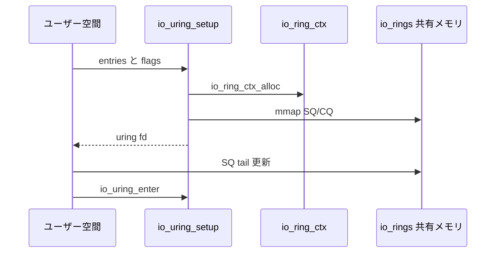

# 第11章 SQ/CQ リングと io_ring_ctx

> **本章で読むソース**
>
> - [`include/linux/io_uring_types.h` L152-L191](https://github.com/gregkh/linux/blob/v6.18.38/include/linux/io_uring_types.h#L152-L191)
> - [`include/linux/io_uring_types.h` L258-L305](https://github.com/gregkh/linux/blob/v6.18.38/include/linux/io_uring_types.h#L258-L305)
> - [`include/uapi/linux/io_uring.h` L30-L51](https://github.com/gregkh/linux/blob/v6.18.38/include/uapi/linux/io_uring.h#L30-L51)
> - [`io_uring/io_uring.c` L3843-L3918](https://github.com/gregkh/linux/blob/v6.18.38/io_uring/io_uring.c#L3843-L3918)
> - [`io_uring/io_uring.c` L4019-L4028](https://github.com/gregkh/linux/blob/v6.18.38/io_uring/io_uring.c#L4019-L4028)
> - [`io_uring/register.c` L374-L380](https://github.com/gregkh/linux/blob/v6.18.38/io_uring/register.c#L374-L380)

## この章の狙い

**io_uring** の共有メモリリング（SQ/CQ）とカーネル側文脈 **io_ring_ctx** の対応を読む。
`io_uring_setup` が何を割り当て、ユーザー空間とカーネルがどう役割分担するかを押さえる。

## 前提

- [VFS 分冊](../../vfs/README.md) で通常の `read`/`write` システムコール経路を知っていること。

## io_rings の役割分担

`io_rings` はユーザー空間と共有されるリングメタデータである。
カーネルは SQ の head と CQ の tail を、ユーザーは SQ の tail と CQ の head を更新する。

[`include/linux/io_uring_types.h` L152-L191](https://github.com/gregkh/linux/blob/v6.18.38/include/linux/io_uring_types.h#L152-L191)

```c
struct io_rings {
	/*
	 * Head and tail offsets into the ring; the offsets need to be
	 * masked to get valid indices.
	 *
	 * The kernel controls head of the sq ring and the tail of the cq ring,
	 * and the application controls tail of the sq ring and the head of the
	 * cq ring.
	 */
	struct io_uring		sq, cq;
	/*
	 * Bitmasks to apply to head and tail offsets (constant, equals
	// ... (中略) ...
	 *
	 * Written by the kernel, shouldn't be modified by the
	 * application.
	 *
	 * The application needs a full memory barrier before checking
	 * for IORING_SQ_NEED_WAKEUP after updating the sq tail.
	 */
	atomic_t		sq_flags;
```

`sq_ring_mask` はエントリ数が2の冪であることの前提でインデックスを切り詰める。
`sq_dropped` は無効インデックスで捨てられた投入数を記録する。

## SQE の固定レイアウト

各 **SQE**（Submission Queue Entry）は64バイト固定である。
`io_uring_init` の BUILD_BUG_ON でレイアウトが検証される。

[`include/uapi/linux/io_uring.h` L30-L51](https://github.com/gregkh/linux/blob/v6.18.38/include/uapi/linux/io_uring.h#L30-L51)

```c
struct io_uring_sqe {
	__u8	opcode;		/* type of operation for this sqe */
	__u8	flags;		/* IOSQE_ flags */
	__u16	ioprio;		/* ioprio for the request */
	__s32	fd;		/* file descriptor to do IO on */
	union {
		__u64	off;	/* offset into file */
		__u64	addr2;
		struct {
			__u32	cmd_op;
			__u32	__pad1;
		};
	};
	union {
		__u64	addr;	/* pointer to buffer or iovecs */
		__u64	splice_off_in;
		struct {
			__u32	level;
			__u32	optname;
		};
	};
	__u32	len;		/* buffer size or number of iovecs */
```

opcode と fd、addr、len が多くの操作で共通の意味を持つ。

## io_ring_ctx の二分割キャッシュライン

`io_ring_ctx` は読み取り多めの定数側と、投入側の hot 側に分かれる。
`uring_lock` で保護される SQ 配列と登録リソースが後者に属する。

[`include/linux/io_uring_types.h` L258-L305](https://github.com/gregkh/linux/blob/v6.18.38/include/linux/io_uring_types.h#L258-L305)

```c
struct io_ring_ctx {
	/* const or read-mostly hot data */
	struct {
		unsigned int		flags;
		unsigned int		drain_next: 1;
		unsigned int		restricted: 1;
		unsigned int		off_timeout_used: 1;
		unsigned int		drain_active: 1;
		unsigned int		has_evfd: 1;
		/* all CQEs should be posted only by the submitter task */
		unsigned int		task_complete: 1;
		unsigned int		lockless_cq: 1;
	// ... (中略) ...
		 *
		 * The kernel modifies neither the indices array nor the entries
		 * array.
		 */
		u32			*sq_array;
		struct io_uring_sqe	*sq_sqes;
		unsigned		cached_sq_head;
		unsigned		sq_entries;
```

`file_table` と `buf_table` は固定ファイルと固定バッファ登録の高速経路である（第14章）。

## io_uring_create

セットアップはパラメータ検証、ctx 割り当て、リング mmap、ファイル記述子公開までを行う。
`IORING_SETUP_IOPOLL` と `IORING_SETUP_SQPOLL` の組み合わせで通知方法が変わる。

[`io_uring/io_uring.c` L3843-L3918](https://github.com/gregkh/linux/blob/v6.18.38/io_uring/io_uring.c#L3843-L3918)

```c
static __cold int io_uring_create(unsigned entries, struct io_uring_params *p,
				  struct io_uring_params __user *params)
{
	struct io_ring_ctx *ctx;
	struct io_uring_task *tctx;
	struct file *file;
	int ret;

	ret = io_uring_sanitise_params(p);
	if (ret)
		return ret;

	// ... (中略) ...
	 * memory (locked/pinned vm). It's not used for anything else.
	 */
	mmgrab(current->mm);
	ctx->mm_account = current->mm;

	ret = io_allocate_scq_urings(ctx, p);
	if (ret)
		goto err;
```

`io_allocate_scq_urings` が SQ/CQ リングと SQE 配列を確保する。

## システムコール入口

`io_uring_setup` は権限チェック後に上記 create へ進む。

[`io_uring/io_uring.c` L4019-L4028](https://github.com/gregkh/linux/blob/v6.18.38/io_uring/io_uring.c#L4019-L4028)

```c
SYSCALL_DEFINE2(io_uring_setup, u32, entries,
		struct io_uring_params __user *, params)
{
	int ret;

	ret = io_uring_allowed();
	if (ret)
		return ret;

	return io_uring_setup(entries, params);
```

`sysctl_io_uring_disabled` により無効化やグループ制限がかかりうる。

## リング再マップ用の補助構造

`io_ring_ctx_rings` はリサイズや再 mmap 時に新旧リングを切り替えるための一時構造である。

[`io_uring/register.c` L374-L380](https://github.com/gregkh/linux/blob/v6.18.38/io_uring/register.c#L374-L380)

```c
struct io_ring_ctx_rings {
	struct io_rings *rings;
	struct io_uring_sqe *sq_sqes;

	struct io_mapped_region sq_region;
	struct io_mapped_region ring_region;
};
```

通常経路では ctx が直接 `rings` と `sq_sqes` を保持する。

## 処理の流れ



## 高速化と最適化の工夫

**ユーザー空間とカーネルで head/tail を分離**することで、投入側は SQ を、回収側は CQ をほぼ独立に更新できる。
システムコール1回で複数 SQE を処理する前提のデータ構造である。

**2の冪サイズとマスク**は剰余算をビット AND に置き換える。
ホットループでのインデックス計算を一定コストに抑える。

**cacheline 分割された io_ring_ctx** は定数フラグと uring_lock 下の mutable 状態の false sharing を減らす。
SQPOLL や IOPOLL ではこの分離がより効く。


> **v7.1.3 注記**：`io_uring/io_uring.c` は v7.1.3 で大規模リファクタされているが、本章が引用する範囲の分岐変更は限定的である。
> 行番号は v7.1.3 側でずれる（監査は [README](../README.md#v713-との差分監査)）。

## まとめ

io_uring は共有メモリリングで SQE を渡し、CQE で結果を返す。
`io_ring_ctx` がカーネル側の全状態を束ね、setup 時にリングとテーブルを構築する。
次章では SQE の消費と `io_submit_sqes` を読む。

## 関連する章

- [第12章 SQE の発行と io_submit_sqes](12-sqe-submission.md)
- [第14章 登録リソースと polling](14-fixed-buffer-poll.md)
