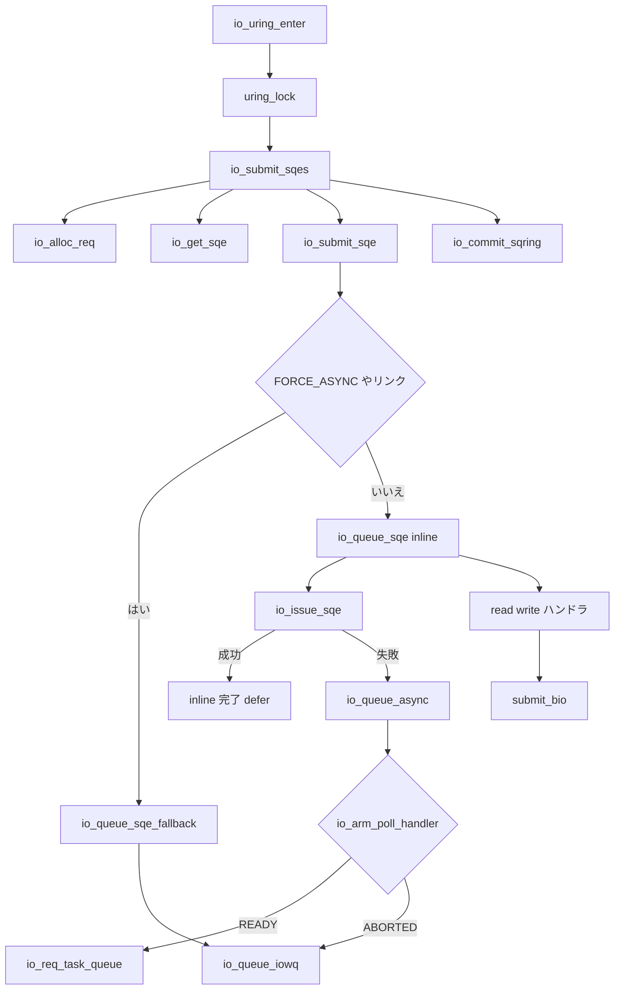

# 第12章 SQE の発行と io_submit_sqes

> **本章で読むソース**
>
> - [`io_uring/io_uring.c` L2321-L2368](https://github.com/gregkh/linux/blob/v6.18.38/io_uring/io_uring.c#L2321-L2368)
> - [`io_uring/io_uring.c` L2100-L2115](https://github.com/gregkh/linux/blob/v6.18.38/io_uring/io_uring.c#L2100-L2115)
> - [`io_uring/io_uring.c` L2075-L2098](https://github.com/gregkh/linux/blob/v6.18.38/io_uring/io_uring.c#L2075-L2098)
> - [`io_uring/io_uring.c` L2451-L2498](https://github.com/gregkh/linux/blob/v6.18.38/io_uring/io_uring.c#L2451-L2498)
> - [`io_uring/io_uring.c` L3505-L3570](https://github.com/gregkh/linux/blob/v6.18.38/io_uring/io_uring.c#L3505-L3570)
> - [`io_uring/io_uring.c` L2430-L2448](https://github.com/gregkh/linux/blob/v6.18.38/io_uring/io_uring.c#L2430-L2448)
> - [`include/uapi/linux/io_uring.h` L30-L34](https://github.com/gregkh/linux/blob/v6.18.38/include/uapi/linux/io_uring.h#L30-L34)
> - [`io_uring/io_uring.c` L4049-L4053](https://github.com/gregkh/linux/blob/v6.18.38/io_uring/io_uring.c#L4049-L4053)
> - [`block/blk-core.c` L911-L922](https://github.com/gregkh/linux/blob/v6.18.38/block/blk-core.c#L911-L922)

## この章の狙い

ユーザー空間が SQ に載せた **SQE** をカーネルがどう消費し、ブロック I/O などの操作へ変換するかを読む。
`io_uring_enter` と `io_submit_sqes` の関係を整理する。

## 前提

- [第11章](11-sq-cq-rings.md) でリング構造を読んでいること。

## io_get_sqe とリング走査

カーネルは共有 SQ リングの head/tail から SQE を取り出す。
`IORING_SETUP_SQE128` では head をシフトし、拡張 SQE に対応する。

[`io_uring/io_uring.c` L2430-L2448](https://github.com/gregkh/linux/blob/v6.18.38/io_uring/io_uring.c#L2430-L2448)

```c
			return false;
		}
		head = array_index_nospec(head, ctx->sq_entries);
	}

	/*
	 * The cached sq head (or cq tail) serves two purposes:
	 *
	 * 1) allows us to batch the cost of updating the user visible
	 *    head updates.
	 * 2) allows the kernel side to track the head on its own, even
	 *    though the application is the one updating it.
	 */

	/* double index for 128-byte SQEs, twice as long */
	if (ctx->flags & IORING_SETUP_SQE128)
		head <<= 1;
	*sqe = &ctx->sq_sqes[head];
	return true;
```

`io_sqring_entries` はユーザー tail とカーネル head の差分である。

## io_submit_sqes のループ

各 SQE に対し `io_kiocb` を確保し、`io_submit_sqe` で opcode 別ハンドラへ振る。
失敗時は `IORING_SETUP_SUBMIT_ALL` が無ければループを中断する。

[`io_uring/io_uring.c` L2451-L2498](https://github.com/gregkh/linux/blob/v6.18.38/io_uring/io_uring.c#L2451-L2498)

```c
int io_submit_sqes(struct io_ring_ctx *ctx, unsigned int nr)
	__must_hold(&ctx->uring_lock)
{
	unsigned int entries = io_sqring_entries(ctx);
	unsigned int left;
	int ret;

	if (unlikely(!entries))
		return 0;
	/* make sure SQ entry isn't read before tail */
	ret = left = min(nr, entries);
	io_get_task_refs(left);
	// ... (中略) ...
			ret = -EAGAIN;
		current->io_uring->cached_refs += left;
	}

	io_submit_state_end(ctx);
	 /* Commit SQ ring head once we've consumed and submitted all SQEs */
	io_commit_sqring(ctx);
	return ret;
```

バッチ末で `io_commit_sqring` が SQ head を一度に進める。

## io_submit_sqe の分岐

各 SQE は `io_init_req` のあと、リンク状態と `REQ_F_FORCE_ASYNC` などで経路が分かれる。
通常 req は `io_queue_sqe` へ、リンク末尾や強制非同期は `io_queue_sqe_fallback` へ進む。

[`io_uring/io_uring.c` L2321-L2368](https://github.com/gregkh/linux/blob/v6.18.38/io_uring/io_uring.c#L2321-L2368)

```c
static inline int io_submit_sqe(struct io_ring_ctx *ctx, struct io_kiocb *req,
			 const struct io_uring_sqe *sqe)
	__must_hold(&ctx->uring_lock)
{
	struct io_submit_link *link = &ctx->submit_state.link;
	int ret;

	ret = io_init_req(ctx, req, sqe);
	if (unlikely(ret))
		return io_submit_fail_init(sqe, req, ret);

	trace_io_uring_submit_req(req);

	/*
	 * If we already have a head request, queue this one for async
	 * submittal once the head completes. If we don't have a head but
	 * IOSQE_IO_LINK is set in the sqe, start a new head. This one will be
	 * submitted sync once the chain is complete. If none of those
	 * conditions are true (normal request), then just queue it.
	 */
	if (unlikely(link->head)) {
		trace_io_uring_link(req, link->last);
		io_req_sqe_copy(req, IO_URING_F_INLINE);
		link->last->link = req;
		link->last = req;

		if (req->flags & IO_REQ_LINK_FLAGS)
			return 0;
		/* last request of the link, flush it */
		req = link->head;
		link->head = NULL;
		if (req->flags & (REQ_F_FORCE_ASYNC | REQ_F_FAIL))
			goto fallback;

	} else if (unlikely(req->flags & (IO_REQ_LINK_FLAGS |
					  REQ_F_FORCE_ASYNC | REQ_F_FAIL))) {
		if (req->flags & IO_REQ_LINK_FLAGS) {
			link->head = req;
			link->last = req;
		} else {
fallback:
			io_queue_sqe_fallback(req);
		}
		return 0;
	}

	io_queue_sqe(req, IO_URING_F_INLINE);
	return 0;
}
```

## inline issue と io_queue_async

`io_queue_sqe` は `IO_URING_F_NONBLOCK | IO_URING_F_COMPLETE_DEFER | IO_URING_F_INLINE` でまず `io_issue_sqe` を試す。
非ゼロ戻り値は `io_queue_async` へ渡され、`-EAGAIN` かつ `REQ_F_NOWAIT` でなければ poll arm を試す。

[`io_uring/io_uring.c` L2100-L2115](https://github.com/gregkh/linux/blob/v6.18.38/io_uring/io_uring.c#L2100-L2115)

```c
static inline void io_queue_sqe(struct io_kiocb *req, unsigned int extra_flags)
	__must_hold(&req->ctx->uring_lock)
{
	unsigned int issue_flags = IO_URING_F_NONBLOCK |
				   IO_URING_F_COMPLETE_DEFER | extra_flags;
	int ret;

	ret = io_issue_sqe(req, issue_flags);

	/*
	 * We async punt it if the file wasn't marked NOWAIT, or if the file
	 * doesn't support non-blocking read/write attempts
	 */
	if (unlikely(ret))
		io_queue_async(req, issue_flags, ret);
}
```

[`io_uring/io_uring.c` L2075-L2098](https://github.com/gregkh/linux/blob/v6.18.38/io_uring/io_uring.c#L2075-L2098)

```c
static void io_queue_async(struct io_kiocb *req, unsigned int issue_flags, int ret)
	__must_hold(&req->ctx->uring_lock)
{
	if (ret != -EAGAIN || (req->flags & REQ_F_NOWAIT)) {
fail:
		io_req_defer_failed(req, ret);
		return;
	}

	ret = io_req_sqe_copy(req, issue_flags);
	if (unlikely(ret))
		goto fail;

	switch (io_arm_poll_handler(req, 0)) {
	case IO_APOLL_READY:
		io_req_task_queue(req);
		break;
	case IO_APOLL_ABORTED:
		io_queue_iowq(req);
		break;
	case IO_APOLL_OK:
		break;
	}
}
```

`IO_APOLL_ABORTED` のとき初めて io-wq punt へ進む。
`REQ_F_FORCE_ASYNC` や drain 中のリンクは `io_queue_sqe_fallback` から直接 `io_queue_iowq` へ行く（第13章）。

> **v7.1.3 注記**：`io_uring/io_uring.c` は v7.1.3 で約22KB削減された。
> `io_queue_sqe` は [v7.1.3 L1646-L1661](https://github.com/gregkh/linux/blob/v7.1.3/io_uring/io_uring.c#L1646-L1661) で本文と同一である。
> `io_submit_sqe` は [v7.1.3 L1886-L1939](https://github.com/gregkh/linux/blob/v7.1.3/io_uring/io_uring.c#L1886-L1939) で `io_init_req` に残り SQE 数 `left` 引数が増え、`ctx->bpf_filters` 判定と `io_uring_run_bpf_filters()` が trace/リンク処理前に追加されている。
> inline issue と io-wq punt の後段分岐は維持される。

## io_uring_enter からの呼び出し

`io_uring_enter` は `to_submit` 件数ぶん `io_submit_sqes` を呼ぶ入口である。
SQPOLL 時は専用スレッドが同様の処理を行う。

[`io_uring/io_uring.c` L3505-L3570](https://github.com/gregkh/linux/blob/v6.18.38/io_uring/io_uring.c#L3505-L3570)

```c
SYSCALL_DEFINE6(io_uring_enter, unsigned int, fd, u32, to_submit,
		u32, min_complete, u32, flags, const void __user *, argp,
		size_t, argsz)
{
	struct io_ring_ctx *ctx;
	struct file *file;
	long ret;

	if (unlikely(flags & ~IORING_ENTER_FLAGS))
		return -EINVAL;

	/*
	// ... (中略) ...
		ret = to_submit;
	} else if (to_submit) {
		ret = io_uring_add_tctx_node(ctx);
		if (unlikely(ret))
			goto out;

		mutex_lock(&ctx->uring_lock);
		ret = io_submit_sqes(ctx, to_submit);
```

`min_complete` と flags により完了待ちや IOPOLL が続く。

## opcode フィールド

SQE 先頭の opcode がディスパッチ表 `io_issue_defs` のインデックスになる。
read/write は VFS やブロック層へ、他の opcode は net、poll、timeout などへ分岐する。

[`include/uapi/linux/io_uring.h` L30-L34](https://github.com/gregkh/linux/blob/v6.18.38/include/uapi/linux/io_uring.h#L30-L34)

```c
struct io_uring_sqe {
	__u8	opcode;		/* type of operation for this sqe */
	__u8	flags;		/* IOSQE_ flags */
	__u16	ioprio;		/* ioprio for the request */
	__s32	fd;		/* file descriptor to do IO on */
```

`IOSQE_IO_LINK` など flags は同一バッチ内の連鎖動作を制御する。

## SQE サイズの固定

モジュール初期化時に SQE レイアウトがコンパイル時検証される。
ユーザー空間 ABI の破壊を防ぐ。

[`io_uring/io_uring.c` L4049-L4053](https://github.com/gregkh/linux/blob/v6.18.38/io_uring/io_uring.c#L4049-L4053)

```c
	BUILD_BUG_ON(sizeof(struct io_uring_sqe) != 64);
	BUILD_BUG_SQE_ELEM(0,  __u8,   opcode);
	BUILD_BUG_SQE_ELEM(1,  __u8,   flags);
	BUILD_BUG_SQE_ELEM(2,  __u16,  ioprio);
	BUILD_BUG_SQE_ELEM(4,  __s32,  fd);
```

## ブロック I/O への接続

read/write 系 opcode は最終的に VFS または direct I/O 経路を経て `submit_bio` に至る。
ブロックデバイスへの直接 I/O も同じ bio 入口を使う。

[`block/blk-core.c` L911-L922](https://github.com/gregkh/linux/blob/v6.18.38/block/blk-core.c#L911-L922)

```c
void submit_bio(struct bio *bio)
{
	if (bio_op(bio) == REQ_OP_READ) {
		task_io_account_read(bio->bi_iter.bi_size);
		count_vm_events(PGPGIN, bio_sectors(bio));
	} else if (bio_op(bio) == REQ_OP_WRITE) {
		count_vm_events(PGPGOUT, bio_sectors(bio));
	}

	bio_set_ioprio(bio);
	submit_bio_noacct(bio);
}
```

io_uring はシステムコール回数を減らすが、ブロック層以降の経路は従来と共有する。

## 処理の流れ



## 高速化と最適化の工夫

**バッチ commit**（`io_commit_sqring`）は SQ head 更新をまとめ、ユーザー空間との共有キャッシュラインの書き込み回数を減らす。

**req キャッシュ**（`io_alloc_req` / `io_req_add_to_cache`）は `io_kiocb` の kmem_cache 確保を平準化する。
高頻度 enter でオブジェクト割り当てコストを抑える。

**ゼロシステムコール発行**（SQPOLL）は別スレッドが SQ を監視し、enter なしで submit できる。
ブロック I/O バーストではシステムコールオーバーヘッドの削減が主目的である。

## まとめ

SQE 消費の中心は `io_submit_sqes` であり、enter または SQPOLL スレッドから呼ばれる。
`io_submit_sqe` はリンクや `REQ_F_FORCE_ASYNC` で `io_queue_sqe_fallback` へ分岐し、通常は `io_queue_sqe` が inline `io_issue_sqe` を試す。
非ブロッキング失敗時は poll arm を経て io-wq punt へ進む場合がある。
次章ではブロッキング操作のオフロード先である io-wq を読む。

## 関連する章

- [第13章 io-wq による非同期実行](13-io-wq-async.md)
- [第1章 ブロック層の全体像](../part00-overview/01-block-layer-overview.md)
