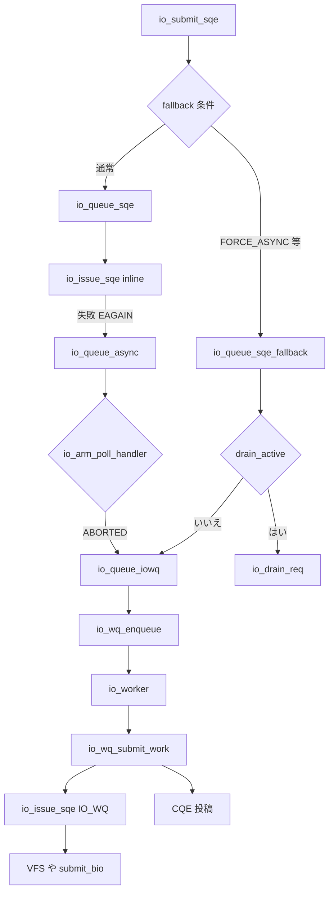

# 第13章 io-wq による非同期実行

> **本章で読むソース**
>
> - [`io_uring/io_uring.c` L2117-L2136](https://github.com/gregkh/linux/blob/v6.18.38/io_uring/io_uring.c#L2117-L2136)
> - [`io_uring/io_uring.c` L502-L528](https://github.com/gregkh/linux/blob/v6.18.38/io_uring/io_uring.c#L502-L528)
> - [`io_uring/io-wq.h` L36-L47](https://github.com/gregkh/linux/blob/v6.18.38/io_uring/io-wq.h#L36-L47)
> - [`io_uring/io-wq.c` L115-L131](https://github.com/gregkh/linux/blob/v6.18.38/io_uring/io-wq.c#L115-L131)
> - [`io_uring/io-wq.c` L1252-L1291](https://github.com/gregkh/linux/blob/v6.18.38/io_uring/io-wq.c#L1252-L1291)
> - [`io_uring/io-wq.c` L597-L651](https://github.com/gregkh/linux/blob/v6.18.38/io_uring/io-wq.c#L597-L651)
> - [`io_uring/io_uring.c` L1933-L1994](https://github.com/gregkh/linux/blob/v6.18.38/io_uring/io_uring.c#L1933-L1994)
> - [`io_uring/io_uring.c` L1920-L1930](https://github.com/gregkh/linux/blob/v6.18.38/io_uring/io_uring.c#L1920-L1930)

## この章の狙い

ブロッキングしうる I/O を投入タスクから切り離す **io-wq**（I/O worker pool）の構造と実行経路を読む。
`io_wq_submit_work` がどう `io_issue_sqe` を呼び、完了をどう戻すかを押さえる。

## 前提

- [第12章](12-sqe-submission.md) で `io_submit_sqe`、`io_queue_sqe`、`io_queue_async` まで読んでいること。

## io_queue_sqe_fallback から io-wq へ

`REQ_F_FORCE_ASYNC`、`REQ_F_FAIL`、リンク末尾の強制非同期は `io_queue_sqe_fallback` へ入る。
`drain_active` 中は `io_drain_req`、それ以外は `io_queue_iowq` で worker へ punt する。

[`io_uring/io_uring.c` L2117-L2136](https://github.com/gregkh/linux/blob/v6.18.38/io_uring/io_uring.c#L2117-L2136)

```c
static void io_queue_sqe_fallback(struct io_kiocb *req)
	__must_hold(&req->ctx->uring_lock)
{
	if (unlikely(req->flags & REQ_F_FAIL)) {
		/*
		 * We don't submit, fail them all, for that replace hardlinks
		 * with normal links. Extra REQ_F_LINK is tolerated.
		 */
		req->flags &= ~REQ_F_HARDLINK;
		req->flags |= REQ_F_LINK;
		io_req_defer_failed(req, req->cqe.res);
	} else {
		/* can't fail with IO_URING_F_INLINE */
		io_req_sqe_copy(req, IO_URING_F_INLINE);
		if (unlikely(req->ctx->drain_active))
			io_drain_req(req);
		else
			io_queue_iowq(req);
	}
}
```

## io_queue_iowq と io_wq_enqueue

`io_queue_iowq` はリンク全体の `work` を初期化し、`io_prep_async_work` が opcode 定義等に応じて `IO_WQ_WORK_UNBOUND` を立てたうえで `io_wq_enqueue` する。
`io_work_get_acct` はそのフラグで bounded/unbound のアカウントを選ぶ。
kthread 上や io_wq 未作成時は `-ECANCELED` で失敗する。

[`io_uring/io_uring.c` L502-L528](https://github.com/gregkh/linux/blob/v6.18.38/io_uring/io_uring.c#L502-L528)

```c
static void io_queue_iowq(struct io_kiocb *req)
{
	struct io_uring_task *tctx = req->tctx;

	BUG_ON(!tctx);

	if ((current->flags & PF_KTHREAD) || !tctx->io_wq) {
		io_req_task_queue_fail(req, -ECANCELED);
		return;
	}

	/* init ->work of the whole link before punting */
	io_prep_async_link(req);

	/*
	 * Not expected to happen, but if we do have a bug where this _can_
	 * happen, catch it here and ensure the request is marked as
	 * canceled. That will make io-wq go through the usual work cancel
	 * procedure rather than attempt to run this request (or create a new
	 * worker for it).
	 */
	if (WARN_ON_ONCE(!same_thread_group(tctx->task, current)))
		atomic_or(IO_WQ_WORK_CANCEL, &req->work.flags);

	trace_io_uring_queue_async_work(req, io_wq_is_hashed(&req->work));
	io_wq_enqueue(tctx->io_wq, &req->work);
}
```

第12章の `io_queue_async` でも `-EAGAIN` 後の poll が `IO_APOLL_ABORTED` なら同じ `io_queue_iowq` へ進む。

> **v7.1.3 注記**：`io_queue_iowq` 本体は [v7.1.3 L407-L433](https://github.com/gregkh/linux/blob/v7.1.3/io_uring/io_uring.c#L407-L433) で同一だが、`io_req_queue_iowq_tw` の引数型が `struct io_tw_req` に変わっている。

## io_wq の公開 API

io-wq は bounded/unbound の2系統アカウントを持ち、ハッシュでファイル単位の直列化もできる。

[`io_uring/io-wq.h` L36-L47](https://github.com/gregkh/linux/blob/v6.18.38/io_uring/io-wq.h#L36-L47)

```c
struct io_wq_data {
	struct io_wq_hash *hash;
	struct task_struct *task;
};

struct io_wq *io_wq_create(unsigned bounded, struct io_wq_data *data);
void io_wq_exit_start(struct io_wq *wq);
void io_wq_put_and_exit(struct io_wq *wq);
void io_wq_set_exit_on_idle(struct io_wq *wq, bool enable);

void io_wq_enqueue(struct io_wq *wq, struct io_wq_work *work);
void io_wq_hash_work(struct io_wq_work *work, void *val);
```

`io_wq_enqueue` は work を worker プールへ載せる入口である。

## io_wq 内部構造

各アカウントは worker リストと work_list を持つ。
ハッシュバケットは同一ファイルへの並列実行を制御する。

[`io_uring/io-wq.c` L115-L131](https://github.com/gregkh/linux/blob/v6.18.38/io_uring/io-wq.c#L115-L131)

```c
struct io_wq {
	unsigned long state;

	struct io_wq_hash *hash;

	atomic_t worker_refs;
	struct completion worker_done;

	struct hlist_node cpuhp_node;

	struct task_struct *task;

	struct io_wq_acct acct[IO_WQ_ACCT_NR];

	struct wait_queue_entry wait;

	struct io_wq_work *hash_tail[IO_WQ_NR_HASH_BUCKETS];
```

`IO_WQ_ACCT_BOUND` は CPU 制限付き worker、`UNBOUND` はより広いプールである。

## io_wq_create

作成時に CPU マスク、worker 上限、cpuhp 登録を行う。
bounded パラメータは bound アカウントの max_workers に入る。

[`io_uring/io-wq.c` L1252-L1291](https://github.com/gregkh/linux/blob/v6.18.38/io_uring/io-wq.c#L1252-L1291)

```c
struct io_wq *io_wq_create(unsigned bounded, struct io_wq_data *data)
{
	int ret, i;
	struct io_wq *wq;

	if (WARN_ON_ONCE(!bounded))
		return ERR_PTR(-EINVAL);

	wq = kzalloc(sizeof(struct io_wq), GFP_KERNEL);
	if (!wq)
		return ERR_PTR(-ENOMEM);

	// ... (中略) ...
		INIT_LIST_HEAD(&acct->all_list);

		INIT_WQ_LIST(&acct->work_list);
		raw_spin_lock_init(&acct->lock);
	}

	wq->task = get_task_struct(data->task);
	atomic_set(&wq->worker_refs, 1);
```

タスクごとに io-wq インスタンスが作られ、ctx は `io_uring_task` 経由で参照する。

## worker が work を処理

`io_worker_handle_work` は work_list から取り出し、`io_wq_submit_work` を呼ぶ。
ハッシュ衝突時は同じファイルの work を直列化する。

[`io_uring/io-wq.c` L597-L651](https://github.com/gregkh/linux/blob/v6.18.38/io_uring/io-wq.c#L597-L651)

```c
static void io_worker_handle_work(struct io_wq_acct *acct,
				  struct io_worker *worker)
	__releases(&acct->lock)
{
	struct io_wq *wq = worker->wq;

	do {
		bool do_kill = test_bit(IO_WQ_BIT_EXIT, &wq->state);
		struct io_wq_work *work;

		/*
		 * If we got some work, mark us as busy. If we didn't, but
	// ... (中略) ...
				: -1U;

			next_hashed = wq_next_work(work);

			if (do_kill &&
			    (work_flags & IO_WQ_WORK_UNBOUND))
				atomic_or(IO_WQ_WORK_CANCEL, &work->flags);
			io_wq_submit_work(work);
```

worker は必要に応じて動的に増減する。

## io_wq_submit_work

`io_kiocb` に埋め込まれた `work` から req を復元し、`io_issue_sqe` を実行する。
`REQ_F_FORCE_ASYNC` や multishot には追加制約がある。

[`io_uring/io_uring.c` L1933-L1994](https://github.com/gregkh/linux/blob/v6.18.38/io_uring/io_uring.c#L1933-L1994)

```c
void io_wq_submit_work(struct io_wq_work *work)
{
	struct io_kiocb *req = container_of(work, struct io_kiocb, work);
	const struct io_issue_def *def = &io_issue_defs[req->opcode];
	unsigned int issue_flags = IO_URING_F_UNLOCKED | IO_URING_F_IOWQ;
	bool needs_poll = false;
	int ret = 0, err = -ECANCELED;

	/* one will be dropped by io_wq_free_work() after returning to io-wq */
	if (!(req->flags & REQ_F_REFCOUNT))
		__io_req_set_refcount(req, 2);
	else
	// ... (中略) ...
			issue_flags |= IO_URING_F_NONBLOCK;
		}
	}

	do {
		ret = io_issue_sqe(req, issue_flags);
		if (ret != -EAGAIN)
			break;
```

`-EAGAIN` 時は poll  arm や再試行経路へ進む。

## work 完了後の解放

`io_wq_free_work` は参照カウントを下げ、リンクされた req があれば次 work を返す。

[`io_uring/io_uring.c` L1920-L1930](https://github.com/gregkh/linux/blob/v6.18.38/io_uring/io_uring.c#L1920-L1930)

```c
struct io_wq_work *io_wq_free_work(struct io_wq_work *work)
{
	struct io_kiocb *req = container_of(work, struct io_kiocb, work);
	struct io_kiocb *nxt = NULL;

	if (req_ref_put_and_test_atomic(req)) {
		if (req->flags & IO_REQ_LINK_FLAGS)
			nxt = io_req_find_next(req);
		io_free_req(req);
	}
	return nxt ? &nxt->work : NULL;
```

CQE 投稿は別経路（task work）で行われることが多い。

## 処理の流れ



## 高速化と最適化の工夫

**bounded worker プール**は CPU 占有を抑えつつブロッキング I/O を並列化する。
無制限スレッドよりキャッシュとスケジューラへの負荷が読みやすい。

**ハッシュによるファイル直列化**は同一 fd への競合を減らしつつ、異なる fd は並列のままにする。
正しさ（シークと読み書きの順序）と性能の折衷である。

**`IO_URING_F_IOWQ` 発行フラグ**は issue ハンドラに文脈を伝え、不要なブロックや二重アカウントを避ける。
worker 上では `DEFER_TASKRUN` 制約が緩和される場面がある。

## まとめ

io-wq は io_uring の非同期実行エンジンであり、`io_queue_sqe_fallback` や poll 失敗から `io_queue_iowq` で punt される。
`io_wq_submit_work` が worker 上で `io_issue_sqe` を再実行し、完了は task work 経由で CQE へ戻る。
次章では固定ファイル、固定バッファ、IOPOLL を読む。

## 関連する章

- [第14章 登録リソースと polling](14-fixed-buffer-poll.md)
- [第6章 完了処理と polling](../part01-blk-mq/06-blk-mq-completion-poll.md)
