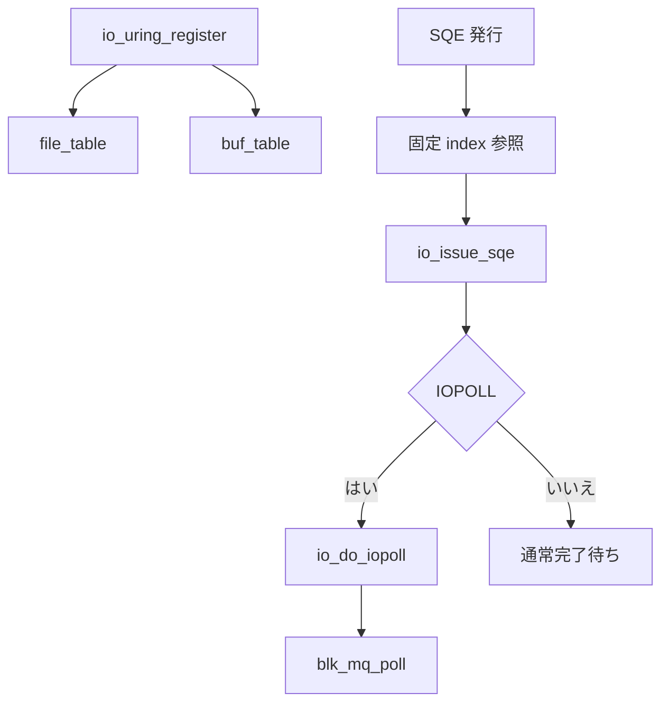

# 第14章 登録リソースと polling

> **本章で読むソース**
>
> - [`io_uring/register.c` L676-L700](https://github.com/gregkh/linux/blob/v6.18.38/io_uring/register.c#L676-L700)
> - [`io_uring/rsrc.c` L542-L560](https://github.com/gregkh/linux/blob/v6.18.38/io_uring/rsrc.c#L542-L560)
> - [`include/linux/io_uring_types.h` L322-L324](https://github.com/gregkh/linux/blob/v6.18.38/include/linux/io_uring_types.h#L322-L324)
> - [`io_uring/rw.c` L1334-L1377](https://github.com/gregkh/linux/blob/v6.18.38/io_uring/rw.c#L1334-L1377)
> - [`io_uring/io_uring.c` L3884-L3892](https://github.com/gregkh/linux/blob/v6.18.38/io_uring/io_uring.c#L3884-L3892)
> - [`block/blk-mq.c` L5221-L5227](https://github.com/gregkh/linux/blob/v6.18.38/block/blk-mq.c#L5221-L5227)

## この章の狙い

**固定ファイル**と**固定バッファ**登録が SQE 処理をどう短縮するか、**IOPOLL** がブロック層の polling とどう接続するかを読む。

## 前提

- [第11章](11-sq-cq-rings.md) と [第6章](../part01-blk-mq/06-blk-mq-completion-poll.md) を読んでいること。

## io_uring_register の分岐

`io_uring_register` は opcode ごとにファイル、バッファ、eventfd などを登録する。
登録後は SQE の fd や addr 解決が高速 path になる。

[`io_uring/register.c` L676-L700](https://github.com/gregkh/linux/blob/v6.18.38/io_uring/register.c#L676-L700)

```c
	switch (opcode) {
	case IORING_REGISTER_BUFFERS:
		ret = -EFAULT;
		if (!arg)
			break;
		ret = io_sqe_buffers_register(ctx, arg, nr_args, NULL);
		break;
	case IORING_UNREGISTER_BUFFERS:
		ret = -EINVAL;
		if (arg || nr_args)
			break;
		ret = io_sqe_buffers_unregister(ctx);
		break;
	case IORING_REGISTER_FILES:
		ret = -EFAULT;
		if (!arg)
			break;
		ret = io_sqe_files_register(ctx, arg, nr_args, NULL);
		break;
	case IORING_UNREGISTER_FILES:
		ret = -EINVAL;
		if (arg || nr_args)
			break;
		ret = io_sqe_files_unregister(ctx);
		break;
```

`IORING_REGISTER_FILES_UPDATE` 系は実行中のテーブル差し替えをサポートする。

## 固定ファイル登録

`io_sqe_files_register` は file 配列を検証し、`file_table` に格納する。
以降 SQE は `file_index` で参照できる。

[`io_uring/rsrc.c` L542-L560](https://github.com/gregkh/linux/blob/v6.18.38/io_uring/rsrc.c#L542-L560)

```c
int io_sqe_files_register(struct io_ring_ctx *ctx, void __user *arg,
			  unsigned nr_args, u64 __user *tags)
{
	__s32 __user *fds = (__s32 __user *) arg;
	struct file *file;
	int fd, ret;
	unsigned i;

	if (ctx->file_table.data.nr)
		return -EBUSY;
	if (!nr_args)
		return -EINVAL;
	if (nr_args > IORING_MAX_FIXED_FILES)
		return -EMFILE;
	if (nr_args > rlimit(RLIMIT_NOFILE))
		return -EMFILE;
	if (!io_alloc_file_tables(ctx, &ctx->file_table, nr_args))
		return -ENOMEM;

```

登録時に `fget` 相当の参照を取り、ホット path では再ルックアップを避ける。

## ctx 内のテーブル

`io_ring_ctx` は `file_table` と `buf_table` を `uring_lock` 下で保持する。

[`include/linux/io_uring_types.h` L322-L324](https://github.com/gregkh/linux/blob/v6.18.38/include/linux/io_uring_types.h#L322-L324)

```c
		struct io_file_table	file_table;
		struct io_rsrc_data	buf_table;
		struct io_alloc_cache	node_cache;
```

固定バッファはページピン留めと長期マッピングにより、I/O ごとの `get_user_pages` を省く。

## io_do_iopoll

IOPOLL モードでは完了待ちに `io_do_iopoll` を使う。
`iopoll_list` 上の req に対し `io_uring_classic_poll` または hybrid poll を呼ぶ。

[`io_uring/rw.c` L1334-L1377](https://github.com/gregkh/linux/blob/v6.18.38/io_uring/rw.c#L1334-L1377)

```c
int io_do_iopoll(struct io_ring_ctx *ctx, bool force_nonspin)
{
	struct io_wq_work_node *pos, *start, *prev;
	unsigned int poll_flags = 0;
	DEFINE_IO_COMP_BATCH(iob);
	int nr_events = 0;

	/*
	 * Only spin for completions if we don't have multiple devices hanging
	 * off our complete list.
	 */
	if (ctx->poll_multi_queue || force_nonspin)
	// ... (中略) ...
		/* iopoll may have completed current req */
		if (!rq_list_empty(&iob.req_list) ||
		    READ_ONCE(req->iopoll_completed))
			break;
	}

	if (!rq_list_empty(&iob.req_list))
		iob.complete(&iob);
```

`BLK_POLL_ONESHOT` は複数キュー混在時にスピンを抑える。

## setup 時の IOPOLL フラグ

`IORING_SETUP_IOPOLL` は enter 側での polling を有効化する。
SQPOLL と組み合わせると syscall_iopoll を省略できる場合がある。

[`io_uring/io_uring.c` L3884-L3892](https://github.com/gregkh/linux/blob/v6.18.38/io_uring/io_uring.c#L3884-L3892)

```c
	/*
	 * When SETUP_IOPOLL and SETUP_SQPOLL are both enabled, user
	 * space applications don't need to do io completion events
	 * polling again, they can rely on io_sq_thread to do polling
	 * work, which can reduce cpu usage and uring_lock contention.
	 */
	if (ctx->flags & IORING_SETUP_IOPOLL &&
	    !(ctx->flags & IORING_SETUP_SQPOLL))
		ctx->syscall_iopoll = 1;
```

`task_complete` と `lockless_cq` の組み合わせは完了投稿の同期を変える。

## blk_mq_poll への接続

ブロック I/O の classic poll は `blk_mq_poll` を呼ぶ。
`bi_cookie` が hctx インデックスを保持する（第6章）。

[`block/blk-mq.c` L5221-L5227](https://github.com/gregkh/linux/blob/v6.18.38/block/blk-mq.c#L5221-L5227)

```c
int blk_mq_poll(struct request_queue *q, blk_qc_t cookie,
		struct io_comp_batch *iob, unsigned int flags)
{
	if (!blk_mq_can_poll(q))
		return 0;
	return blk_hctx_poll(q, xa_load(&q->hctx_table, cookie), iob, flags);
}
```

NVMe poll queue など `REQ_POLLED` 対応デバイスで意味を持つ。

## 処理の流れ



## 高速化と最適化の工夫

**固定ファイル**は SQE ごとの fdtable lookup と `struct file` 参照取得を登録時に済ませ、ホット path では `file_index` 参照に置き換える。
opcode 固有の権限や LSM 検査まで登録時に集約するわけではない。

**固定バッファ**はユーザページを pin して `iov_iter` へ再利用する。
任意の user page 群であり、物理的に連続した DMA メモリを保証するものではない。

**ゼロシステムコール発行と IOPOLL の組合せ**（SQPOLL + IOPOLL）は submit と complete の両方で syscall と割り込みを避ける。
CPU を消費する代わりにレイテンシを抑えるトレードオフである。

> **v7.1.3 注記**：`io_uring/io_uring.c` は v7.1.3 で大規模リファクタされているが、本章が引用する範囲の分岐変更は限定的である。
> 行番号は v7.1.3 側でずれる（監査は [README](../README.md#v713-との差分監査)）。

## まとめ

登録 API は file と buffer の解決コストを前払いし、SQE ホット path を短くする。
IOPOLL は io_uring 側の完了ループから `blk_mq_poll` を呼び、ブロック層の polling と直結する。
ストレージ性能を押し出すワークロードでは setup フラグと登録の設計が重要になる。

## 関連する章

- [第12章 SQE の発行](12-sqe-submission.md)
- [第15章 NVMe と blk-mq](../part04-driver-stack/15-nvme-queues.md)
