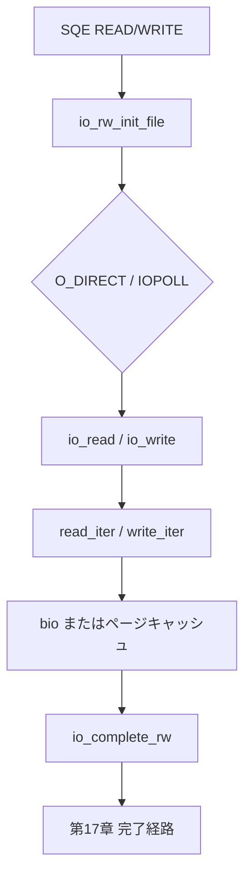

# 第16章 read/write と direct I/O 実行

> **本章で読むソース**
>
> - [`io_uring/rw.c` L857-L918](https://github.com/gregkh/linux/blob/v6.18.38/io_uring/rw.c#L857-L918)
> - [`io_uring/rw.c` L1036-L1047](https://github.com/gregkh/linux/blob/v6.18.38/io_uring/rw.c#L1036-L1047)
> - [`io_uring/rw.c` L1136-L1181](https://github.com/gregkh/linux/blob/v6.18.38/io_uring/rw.c#L1136-L1181)
> - [`io_uring/rw.c` L551-L560](https://github.com/gregkh/linux/blob/v6.18.38/io_uring/rw.c#L551-L560)
> - [`io_uring/rw.c` L597-L610](https://github.com/gregkh/linux/blob/v6.18.38/io_uring/rw.c#L597-L610)
> - [`io_uring/rw.c` L839-L848](https://github.com/gregkh/linux/blob/v6.18.38/io_uring/rw.c#L839-L848)
> - [`io_uring/rw.c` L961-L988](https://github.com/gregkh/linux/blob/v6.18.38/io_uring/rw.c#L961-L988)
> - [`io_uring/rw.c` L1183-L1221](https://github.com/gregkh/linux/blob/v6.18.38/io_uring/rw.c#L1183-L1221)

## この章の狙い

io_uring の **IORING_OP_READ/WRITE** が `rw.c` でどうファイル I/O に接続するかを読む。
ブロックデバイスや regular file への read/write、**O_DIRECT** と IOPOLL 前提の分岐を追う。

## 前提

- [第14章](14-sqe-submission.md) で SQE 発行を読んでいること。
- [第3章](../part00-overview/03-queue-limits-bio-split.md) で bio 経路を読んでいること。

## io_rw_init_file による準備

read/write 共通の入口で、ファイルモード、NOWAIT、IOPOLL、メタデータ付き I/O を検査する。
IOPOLL 時は `IOCB_DIRECT` と `f_op->iopoll` が必須である。

[`io_uring/rw.c` L857-L918](https://github.com/gregkh/linux/blob/v6.18.38/io_uring/rw.c#L857-L918)

```c
static int io_rw_init_file(struct io_kiocb *req, fmode_t mode, int rw_type)
{
	struct io_rw *rw = io_kiocb_to_cmd(req, struct io_rw);
	struct kiocb *kiocb = &rw->kiocb;
	struct io_ring_ctx *ctx = req->ctx;
	struct file *file = req->file;
	int ret;

	if (unlikely(!(file->f_mode & mode)))
		return -EBADF;

	if (!(req->flags & REQ_F_FIXED_FILE))
		req->flags |= io_file_get_flags(file);

	kiocb->ki_flags = file->f_iocb_flags;
	ret = kiocb_set_rw_flags(kiocb, rw->flags, rw_type);
	if (unlikely(ret))
		return ret;
	kiocb->ki_flags |= IOCB_ALLOC_CACHE;

	// ... (中略) ...

	if (ctx->flags & IORING_SETUP_IOPOLL) {
		if (!(kiocb->ki_flags & IOCB_DIRECT) || !file->f_op->iopoll)
			return -EOPNOTSUPP;
		kiocb->private = NULL;
		kiocb->ki_flags |= IOCB_HIPRI;
		req->iopoll_completed = 0;
		if (ctx->flags & IORING_SETUP_HYBRID_IOPOLL) {
			/* make sure every req only blocks once*/
			req->flags &= ~REQ_F_IOPOLL_STATE;
			req->iopoll_start = ktime_get_ns();
		}
	} else {
		if (kiocb->ki_flags & IOCB_HIPRI)
			return -EINVAL;
	}

	return 0;
}
```

ブロックデバイスは `need_complete_io` で regular file と同様に完了コールバック経路へ入る。

[`io_uring/rw.c` L851-L854](https://github.com/gregkh/linux/blob/v6.18.38/io_uring/rw.c#L851-L854)

```c
static bool need_complete_io(struct io_kiocb *req)
{
	return req->flags & REQ_F_ISREG ||
		S_ISBLK(file_inode(req->file)->i_mode);
```

## io_read の実行

`io_read` は `__io_read` を呼び、成功時は `kiocb_done` で完了へ進む。
固定バッファや buffer select のインポートは `__io_read` 内で処理される。

[`io_uring/rw.c` L1036-L1047](https://github.com/gregkh/linux/blob/v6.18.38/io_uring/rw.c#L1036-L1047)

```c
int io_read(struct io_kiocb *req, unsigned int issue_flags)
{
	struct io_br_sel sel = { };
	int ret;

	ret = __io_read(req, &sel, issue_flags);
	if (ret >= 0)
		return kiocb_done(req, ret, &sel, issue_flags);

	if (req->flags & REQ_F_BUFFERS_COMMIT)
		io_kbuf_recycle(req, sel.buf_list, issue_flags);
	return ret;
```

`__io_read` は `io_iter_do_read` で VFS の `read_iter` を呼び、`-EAGAIN` なら io-wq へ punt する（第15章）。
`-EIOCBQUEUED` は非同期完了へ委譲し、partial read はループで `read_iter` を再試行する。

[`io_uring/rw.c` L839-L848](https://github.com/gregkh/linux/blob/v6.18.38/io_uring/rw.c#L839-L848)

```c
static inline int io_iter_do_read(struct io_rw *rw, struct iov_iter *iter)
{
	struct file *file = rw->kiocb.ki_filp;

	if (likely(file->f_op->read_iter))
		return file->f_op->read_iter(&rw->kiocb, iter);
	else if (file->f_op->read)
		return loop_rw_iter(READ, rw, iter);
	else
		return -EINVAL;
```

[`io_uring/rw.c` L961-L988](https://github.com/gregkh/linux/blob/v6.18.38/io_uring/rw.c#L961-L988)

```c
	ret = io_iter_do_read(rw, &io->iter);

	/*
	 * Some file systems like to return -EOPNOTSUPP for an IOCB_NOWAIT
	 * issue, even though they should be returning -EAGAIN. To be safe,
	 * retry from blocking context for either.
	 */
	if (ret == -EOPNOTSUPP && force_nonblock)
		ret = -EAGAIN;

	if (ret == -EAGAIN) {
		/* If we can poll, just do that. */
		if (io_file_can_poll(req))
			return -EAGAIN;
		/* IOPOLL retry should happen for io-wq threads */
		if (!force_nonblock && !(req->ctx->flags & IORING_SETUP_IOPOLL))
			goto done;
		/* no retry on NONBLOCK nor RWF_NOWAIT */
		if (req->flags & REQ_F_NOWAIT)
			goto done;
		ret = 0;
	} else if (ret == -EIOCBQUEUED) {
		return IOU_ISSUE_SKIP_COMPLETE;
	} else if (ret == req->cqe.res || ret <= 0 || !force_nonblock ||
		   (req->flags & REQ_F_NOWAIT) || !need_complete_io(req) ||
		   (issue_flags & IO_URING_F_MULTISHOT)) {
		/* read all, failed, already did sync or don't want to retry */
		goto done;
```

write 側は `write_iter` を呼び、部分書き込みや `-EAGAIN` 時は `kiocb_done` または io-wq へ分岐する。

[`io_uring/rw.c` L1183-L1221](https://github.com/gregkh/linux/blob/v6.18.38/io_uring/rw.c#L1183-L1221)

```c
	if (likely(req->file->f_op->write_iter))
		ret2 = req->file->f_op->write_iter(kiocb, &io->iter);
	else if (req->file->f_op->write)
		ret2 = loop_rw_iter(WRITE, rw, &io->iter);
	else
		ret2 = -EINVAL;

	/*
	 * Raw bdev writes will return -EOPNOTSUPP for IOCB_NOWAIT. Just
	 * retry them without IOCB_NOWAIT.
	 */
	if (ret2 == -EOPNOTSUPP && (kiocb->ki_flags & IOCB_NOWAIT))
		ret2 = -EAGAIN;
	/* no retry on NONBLOCK nor RWF_NOWAIT */
	if (ret2 == -EAGAIN && (req->flags & REQ_F_NOWAIT))
		goto done;
	if (!force_nonblock || ret2 != -EAGAIN) {
		/* IOPOLL retry should happen for io-wq threads */
		if (ret2 == -EAGAIN && (req->ctx->flags & IORING_SETUP_IOPOLL))
			goto ret_eagain;

		if (ret2 != req->cqe.res && ret2 >= 0 && need_complete_io(req)) {
			trace_io_uring_short_write(req->ctx, kiocb->ki_pos - ret2,
						req->cqe.res, ret2);

			/* This is a partial write. The file pos has already been
			 * updated, setup the async struct to complete the request
			 * in the worker. Also update bytes_done to account for
			 * the bytes already written.
			 */
			iov_iter_save_state(&io->iter, &io->iter_state);
			io->bytes_done += ret2;

			if (kiocb->ki_flags & IOCB_WRITE)
				io_req_end_write(req);
			return -EAGAIN;
		}
done:
		return kiocb_done(req, ret2, NULL, issue_flags);
```

O_DIRECT は `io_rw_init_file` で `IOCB_DIRECT` を立て、`read_iter`/`write_iter` がブロック層へ bio を直接流す。
IOPOLL 時の `IOCB_DIRECT` 必須検査は準備段階であり、実行本体は上記 iter 呼び出しである。

## io_write と O_DIRECT 制約

write も `io_rw_init_file` で初期化する。
バッファード write で NOWAIT 非対応のファイルシステムは `-EAGAIN` で io-wq へ回す。

[`io_uring/rw.c` L1136-L1181](https://github.com/gregkh/linux/blob/v6.18.38/io_uring/rw.c#L1136-L1181)

```c
int io_write(struct io_kiocb *req, unsigned int issue_flags)
{
	bool force_nonblock = issue_flags & IO_URING_F_NONBLOCK;
	struct io_rw *rw = io_kiocb_to_cmd(req, struct io_rw);
	struct io_async_rw *io = req->async_data;
	struct kiocb *kiocb = &rw->kiocb;
	ssize_t ret, ret2;
	loff_t *ppos;

	if (req->flags & REQ_F_IMPORT_BUFFER) {
		ret = io_rw_import_reg_vec(req, io, ITER_SOURCE, issue_flags);
		if (unlikely(ret))
			return ret;
	}

	ret = io_rw_init_file(req, FMODE_WRITE, WRITE);
	if (unlikely(ret))
		return ret;
	req->cqe.res = iov_iter_count(&io->iter);

	if (force_nonblock) {
		/* If the file doesn't support async, just async punt */
		if (unlikely(!io_file_supports_nowait(req, EPOLLOUT)))
			goto ret_eagain;

		/* Check if we can support NOWAIT. */
		if (!(kiocb->ki_flags & IOCB_DIRECT) &&
		    !(req->file->f_op->fop_flags & FOP_BUFFER_WASYNC) &&
		    (req->flags & REQ_F_ISREG))
			goto ret_eagain;

		kiocb->ki_flags |= IOCB_NOWAIT;
	} else {
		/* Ensure we clear previously set non-block flag */
		kiocb->ki_flags &= ~IOCB_NOWAIT;
	}

	ppos = io_kiocb_update_pos(req);

	ret = rw_verify_area(WRITE, req->file, ppos, req->cqe.res);
	if (unlikely(ret))
		return ret;

	if (unlikely(!io_kiocb_start_write(req, kiocb)))
		return -EAGAIN;
	kiocb->ki_flags |= IOCB_WRITE;
```

O_DIRECT 指定時はページキャッシュを経由せず、ブロック層へ bio が直接流れる。

## 完了コールバックの接続

通常モードでは `ki_complete = io_complete_rw`、IOPOLL では `io_complete_rw_iopoll` を設定する。
`__io_complete_rw_common` が結果を CQE 用フィールドへ反映する。

[`io_uring/rw.c` L597-L610](https://github.com/gregkh/linux/blob/v6.18.38/io_uring/rw.c#L597-L610)

```c
static void io_complete_rw(struct kiocb *kiocb, long res)
{
	struct io_rw *rw = container_of(kiocb, struct io_rw, kiocb);
	struct io_kiocb *req = cmd_to_io_kiocb(rw);

	if (!kiocb->dio_complete || !(kiocb->ki_flags & IOCB_DIO_CALLER_COMP)) {
		__io_complete_rw_common(req, res);
		io_req_set_res(req, io_fixup_rw_res(req, res), 0);
	}
	req->io_task_work.func = io_req_rw_complete;
	__io_req_task_work_add(req, IOU_F_TWQ_LAZY_WAKE);
}

static void io_complete_rw_iopoll(struct kiocb *kiocb, long res)
{
	struct io_rw *rw = container_of(kiocb, struct io_rw, kiocb);
	struct io_kiocb *req = cmd_to_io_kiocb(rw);
```

[`io_uring/rw.c` L551-L560](https://github.com/gregkh/linux/blob/v6.18.38/io_uring/rw.c#L551-L560)

```c
static void __io_complete_rw_common(struct io_kiocb *req, long res)
{
	if (res == req->cqe.res)
		return;
	if ((res == -EOPNOTSUPP || res == -EAGAIN) && io_rw_should_reissue(req)) {
		req->flags |= REQ_F_REISSUE | REQ_F_BL_NO_RECYCLE;
	} else {
		req_set_fail(req);
		req->cqe.res = res;
	}
}
```

CQE 公開と task_work は第17章、IOPOLL ループは第19章で読む。

## 処理の流れ



## 高速化と最適化の工夫

**固定バッファと buffer select**（第18章）は `__io_read` 内の import 経路でユーザページ解決を省略する。
登録済みバッファなら `get_user_pages` を毎回踏まない。

**IOCB_NOWAIT と io-wq punt** はブロックデバイスや O_DIRECT で非ブロック実行を試み、`-EAGAIN` だけ workqueue へ逃がす。
ホット path ではインライン完了まで届く。

**IOPOLL 用 `IOCB_HIPRI`** はブロック層の `blk_mq_poll` と接続し、割り込み完了を待たずにポーリングする（第19章）。

本分冊では net 系 opcode（send/recv 等）は扱わない。
ソケット I/O はネットワーク分冊の担当である。

> **v7.1.3 注記**：`__io_read` は [v7.1.3 `io_uring/rw.c` L912-L975](https://github.com/gregkh/linux/blob/v7.1.3/io_uring/rw.c#L912-L975) にあり、`-EIOCBQUEUED` と partial read 分岐は本章と同一である。

## まとめ

read/write opcode は `rw.c` で kiocb を組み立て、VFS 経由でブロック層またはページキャッシュへ至る。
O_DIRECT と IOPOLL は `io_rw_init_file` で事前検査され、完了は `io_complete_rw` 系へ渡る。
完了側の CQE 公開は第17章で追う。

## 関連する章

- [第15章 io-wq による非同期実行](15-io-wq-async.md)
- [第17章 リクエスト完了と CQE 公開](17-req-complete-cqe.md)
- [第19章 IOPOLL と CQ 完了](19-iopoll-cq-completion.md)
