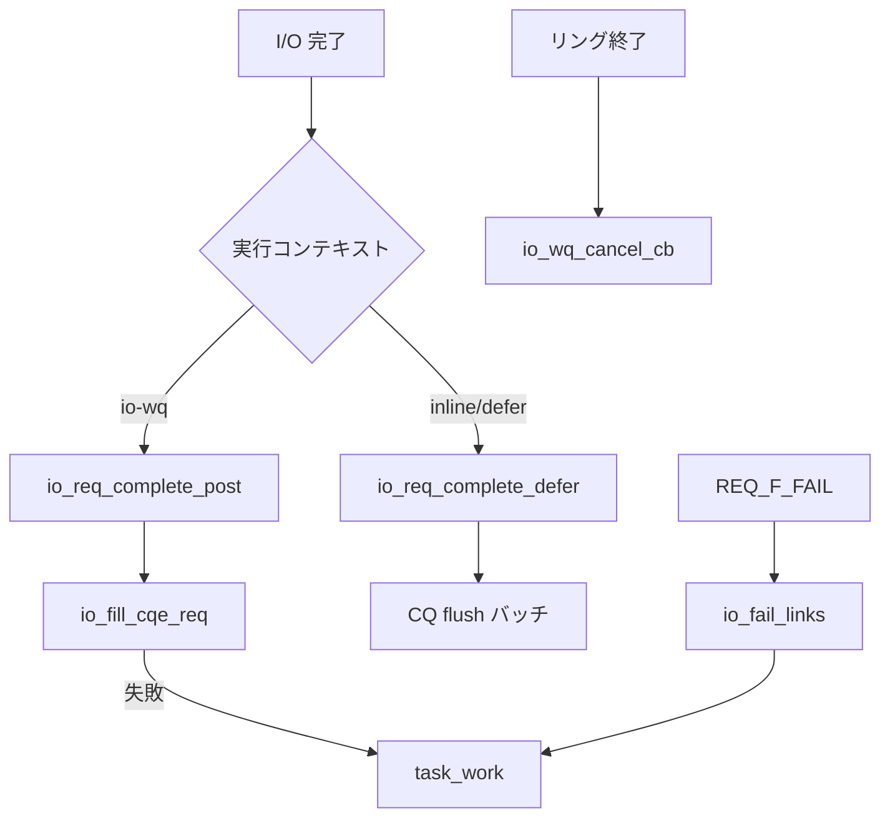

# 第17章 リクエスト完了、CQE 公開、キャンセル

> **本章で読むソース**
>
> - [`io_uring/io_uring.h` L276-L297](https://github.com/gregkh/linux/blob/v6.18.38/io_uring/io_uring.h#L276-L297)
> - [`io_uring/io_uring.h` L522-L530](https://github.com/gregkh/linux/blob/v6.18.38/io_uring/io_uring.h#L522-L530)
> - [`io_uring/io_uring.c` L996-L1031](https://github.com/gregkh/linux/blob/v6.18.38/io_uring/io_uring.c#L996-L1031)
> - [`io_uring/io_uring.c` L1726-L1728](https://github.com/gregkh/linux/blob/v6.18.38/io_uring/io_uring.c#L1726-L1728)
> - [`io_uring/timeout.c` L176-L197](https://github.com/gregkh/linux/blob/v6.18.38/io_uring/timeout.c#L176-L197)
> - [`io_uring/io_uring.c` L3212-L3234](https://github.com/gregkh/linux/blob/v6.18.38/io_uring/io_uring.c#L3212-L3234)
> - [`io_uring/io_uring.c` L3236-L3292](https://github.com/gregkh/linux/blob/v6.18.38/io_uring/io_uring.c#L3236-L3292)

## この章の狙い

io_uring の **完了側**を読む。
`io_req_complete` 系から CQE リングへの書き込み、**task_work** による遅延完了、**キャンセル**、**linked request** の失敗伝播を追う。

## 前提

- [第16章](16-rw-direct-io.md) で read/write の `io_complete_rw` を読んでいること。
- [第13章](13-sq-cq-rings.md) で CQ リング構造を読んでいること。

## CQE への書き込み

`io_fill_cqe_req` は `req->cqe` を CQ スロットへコピーする。
スロットが尽きれば `false` を返し、呼び出し側が task_work へ逃がす。

[`io_uring/io_uring.h` L276-L297](https://github.com/gregkh/linux/blob/v6.18.38/io_uring/io_uring.h#L276-L297)

```c
static __always_inline bool io_fill_cqe_req(struct io_ring_ctx *ctx,
					    struct io_kiocb *req)
{
	bool is_cqe32 = req->cqe.flags & IORING_CQE_F_32;
	struct io_uring_cqe *cqe;

	/*
	 * If we can't get a cq entry, userspace overflowed the submission
	 * (by quite a lot).
	 */
	if (unlikely(!io_get_cqe(ctx, &cqe, is_cqe32)))
		return false;

	memcpy(cqe, &req->cqe, sizeof(*cqe));
	if (ctx->flags & IORING_SETUP_CQE32 || is_cqe32) {
		memcpy(cqe->big_cqe, &req->big_cqe, sizeof(*cqe));
		memset(&req->big_cqe, 0, sizeof(req->big_cqe));
	}

	if (trace_io_uring_complete_enabled())
		trace_io_uring_complete(req->ctx, req, cqe);
	return true;
}
```

## 遅延完了リスト

`io_req_complete_defer` は完了を即座に CQ へ書かず、`submit_state.compl_reqs` へ積む。
`uring_lock` 保持下でのみ使い、バッチ flush と整合させる。

[`io_uring/io_uring.h` L522-L530](https://github.com/gregkh/linux/blob/v6.18.38/io_uring/io_uring.h#L522-L530)

```c
static inline void io_req_complete_defer(struct io_kiocb *req)
	__must_hold(&req->ctx->uring_lock)
{
	struct io_submit_state *state = &req->ctx->submit_state;

	lockdep_assert_held(&req->ctx->uring_lock);

	wq_list_add_tail(&req->comp_list, &state->compl_reqs);
}
```

`io_req_task_complete` は task_work から `io_req_complete_defer` を呼ぶ薄いラッパーである。

[`io_uring/io_uring.c` L1726-L1728](https://github.com/gregkh/linux/blob/v6.18.38/io_uring/io_uring.c#L1726-L1728)

```c
void io_req_task_complete(struct io_kiocb *req, io_tw_token_t tw)
{
	io_req_complete_defer(req);
```

## io-wq からの完了投稿

`io_req_complete_post` は io-wq 実行後に CQ へ直接書き込む経路である。
`lockless_cq` や `REQ_F_REISSUE` 時は task_work へ defer する。

[`io_uring/io_uring.c` L996-L1031](https://github.com/gregkh/linux/blob/v6.18.38/io_uring/io_uring.c#L996-L1031)

```c
static void io_req_complete_post(struct io_kiocb *req, unsigned issue_flags)
{
	struct io_ring_ctx *ctx = req->ctx;
	bool completed = true;

	/*
	 * All execution paths but io-wq use the deferred completions by
	 * passing IO_URING_F_COMPLETE_DEFER and thus should not end up here.
	 */
	if (WARN_ON_ONCE(!(issue_flags & IO_URING_F_IOWQ)))
		return;

	/*
	 * Handle special CQ sync cases via task_work. DEFER_TASKRUN requires
	 * the submitter task context, IOPOLL protects with uring_lock.
	 */
	if (ctx->lockless_cq || (req->flags & REQ_F_REISSUE)) {
defer_complete:
		req->io_task_work.func = io_req_task_complete;
		io_req_task_work_add(req);
		return;
	}

	io_cq_lock(ctx);
	if (!(req->flags & REQ_F_CQE_SKIP))
		completed = io_fill_cqe_req(ctx, req);
	io_cq_unlock_post(ctx);

	if (!completed)
		goto defer_complete;

	/*
	 * We don't free the request here because we know it's called from
	 * io-wq only, which holds a reference, so it cannot be the last put.
	 */
	req_ref_put(req);
}
```

## linked request の失敗伝播

リンクされた SQE チェーンで先頭が失敗すると、`io_fail_links` が `while (link)` で後続要素へ `REQ_F_CQE_SKIP` 等を設定する。
先頭の `link` へ task_work を1件載せ、`io_req_tw_fail_links` が submitter context で後続完了を進める。

[`io_uring/timeout.c` L176-L197](https://github.com/gregkh/linux/blob/v6.18.38/io_uring/timeout.c#L176-L197)

```c
static void io_fail_links(struct io_kiocb *req)
	__must_hold(&req->ctx->completion_lock)
{
	struct io_kiocb *link = req->link;
	bool ignore_cqes = req->flags & REQ_F_SKIP_LINK_CQES;

	if (!link)
		return;

	while (link) {
		if (ignore_cqes)
			link->flags |= REQ_F_CQE_SKIP;
		else
			link->flags &= ~REQ_F_CQE_SKIP;
		trace_io_uring_fail_link(req, link);
		link = link->link;
	}

	link = req->link;
	link->io_task_work.func = io_req_tw_fail_links;
	io_req_task_work_add(link);
	req->link = NULL;
}
```

`io_disarm_next` はリンクタイムアウトの解除と組み合わせ、`REQ_F_FAIL` 時に `io_fail_links` を呼ぶ。

## キャンセル

リング終了や exec 時には `io_uring_try_cancel_requests` が defer キュー、io-wq、IOPOLL リストなどを走査する。
io-wq 側は `io_uring_try_cancel_iowq` が `io_wq_cancel_cb` と `io_cancel_ctx_cb` で該当 work を探す。
running work が即 `-ECANCELED` になるとは限らず、キャンセルは非同期に進む。

[`io_uring/io_uring.c` L3212-L3234](https://github.com/gregkh/linux/blob/v6.18.38/io_uring/io_uring.c#L3212-L3234)

```c
static __cold bool io_uring_try_cancel_iowq(struct io_ring_ctx *ctx)
{
	struct io_tctx_node *node;
	enum io_wq_cancel cret;
	bool ret = false;

	mutex_lock(&ctx->uring_lock);
	list_for_each_entry(node, &ctx->tctx_list, ctx_node) {
		struct io_uring_task *tctx = node->task->io_uring;

		/*
		 * io_wq will stay alive while we hold uring_lock, because it's
		 * killed after ctx nodes, which requires to take the lock.
		 */
		if (!tctx || !tctx->io_wq)
			continue;
		cret = io_wq_cancel_cb(tctx->io_wq, io_cancel_ctx_cb, ctx, true);
		ret |= (cret != IO_WQ_CANCEL_NOTFOUND);
	}
	mutex_unlock(&ctx->uring_lock);

	return ret;
}
```

[`io_uring/io_uring.c` L3236-L3292](https://github.com/gregkh/linux/blob/v6.18.38/io_uring/io_uring.c#L3236-L3292)

```c
static __cold bool io_uring_try_cancel_requests(struct io_ring_ctx *ctx,
						struct io_uring_task *tctx,
						bool cancel_all,
						bool is_sqpoll_thread)
{
	struct io_task_cancel cancel = { .tctx = tctx, .all = cancel_all, };
	enum io_wq_cancel cret;
	bool ret = false;

	// ... (中略) ...

	if (!tctx) {
		ret |= io_uring_try_cancel_iowq(ctx);
	} else if (tctx->io_wq) {
		/*
		 * Cancels requests of all rings, not only @ctx, but
		 * it's fine as the task is in exit/exec.
		 */
		cret = io_wq_cancel_cb(tctx->io_wq, io_cancel_task_cb,
				       &cancel, true);
		ret |= (cret != IO_WQ_CANCEL_NOTFOUND);
	}

	// ... (中略) ...

	mutex_lock(&ctx->uring_lock);
	ret |= io_cancel_defer_files(ctx, tctx, cancel_all);
	ret |= io_poll_remove_all(ctx, tctx, cancel_all);
	ret |= io_waitid_remove_all(ctx, tctx, cancel_all);
	ret |= io_futex_remove_all(ctx, tctx, cancel_all);
	ret |= io_uring_try_cancel_uring_cmd(ctx, tctx, cancel_all);
	mutex_unlock(&ctx->uring_lock);
	ret |= io_kill_timeouts(ctx, tctx, cancel_all);
	if (tctx)
		ret |= io_run_task_work() > 0;
	else
		ret |= flush_delayed_work(&ctx->fallback_work);
	return ret;
}
```

[`io_uring/io_uring.c` L3033-L3037](https://github.com/gregkh/linux/blob/v6.18.38/io_uring/io_uring.c#L3033-L3037)

```c
static __cold bool io_cancel_ctx_cb(struct io_wq_work *work, void *data)
{
	struct io_kiocb *req = container_of(work, struct io_kiocb, work);

	return req->ctx == data;
```

`io_cancel_ctx_cb` は io-wq 走査時の predicate である。
キャンセル本体は上記 `try_cancel_requests` が defer と io-wq の両方をループする。

## 処理の流れ



## 高速化と最適化の工夫

**遅延完了バッチ**（`compl_reqs`）は複数 req の CQE を一度の lock 区間で flush し、`uring_lock` の取得回数を減らす。

**task_work への逃がし**は CQ 溢れや lockless_cq 設定時に submitter タスクへ完了を戻し、割り込みコンテキストからの重い処理を避ける。

**linked 失敗の task_work 集約**は `io_fail_links` が `while (link)` で全要素へフラグを設定したうえで、先頭へ task_work を1件載せ、後続完了を submitter context へ移す。

> **v7.1.3 注記**：`io_uring_try_cancel_requests` は v7.1.3 では [io_uring/cancel.c L515-L592](https://github.com/gregkh/linux/blob/v7.1.3/io_uring/cancel.c#L515-L592) へ分離されている。
> defer 走査と io-wq キャンセルの組み合わせは本章の説明どおり維持される。

## まとめ

完了は `io_fill_cqe_req` で CQ へ書き込むか、defer リストへ積んでバッチ flush する。
io-wq 経路は `io_req_complete_post`、linked 失敗は `io_fail_links`、キャンセルは io-wq と defer の両方を走査する。
IOPOLL 固有の完了ループは第19章で読む。

## 関連する章

- [第16章 read/write と direct I/O 実行](16-rw-direct-io.md)
- [第19章 IOPOLL と CQ 完了](19-iopoll-cq-completion.md)
- [第15章 io-wq による非同期実行](15-io-wq-async.md)
