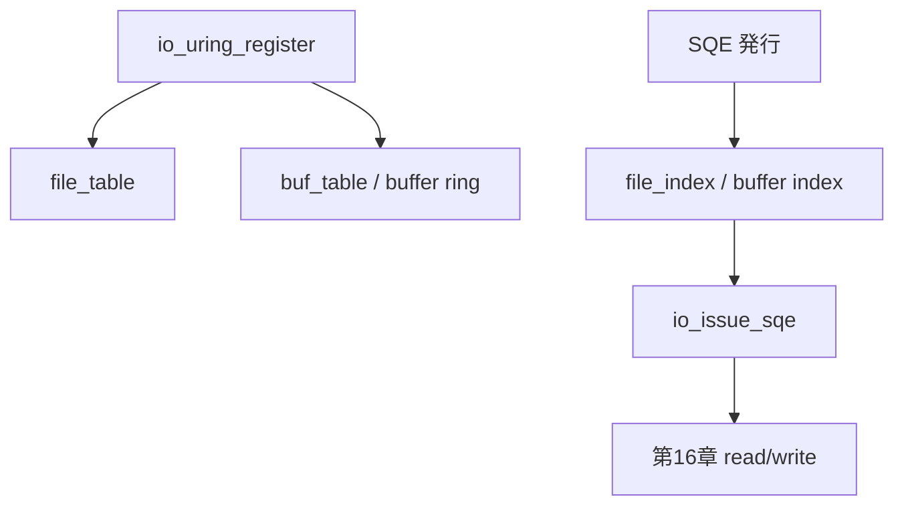

# 第18章 登録リソースと buffer ring

> **本章で読むソース**
>
> - [`io_uring/register.c` L676-L700](https://github.com/gregkh/linux/blob/v6.18.38/io_uring/register.c#L676-L700)
> - [`io_uring/rsrc.c` L542-L560](https://github.com/gregkh/linux/blob/v6.18.38/io_uring/rsrc.c#L542-L560)
> - [`include/linux/io_uring_types.h` L322-L324](https://github.com/gregkh/linux/blob/v6.18.38/include/linux/io_uring_types.h#L322-L324)
> - [`io_uring/rsrc.c` L799-L820](https://github.com/gregkh/linux/blob/v6.18.38/io_uring/rsrc.c#L799-L820)
> - [`io_uring/kbuf.c` L615-L641](https://github.com/gregkh/linux/blob/v6.18.38/io_uring/kbuf.c#L615-L641)
> - [`io_uring/kbuf.c` L226-L244](https://github.com/gregkh/linux/blob/v6.18.38/io_uring/kbuf.c#L226-L244)
> - [`io_uring/kbuf.c` L62-L76](https://github.com/gregkh/linux/blob/v6.18.38/io_uring/kbuf.c#L62-L76)

## この章の狙い

**固定ファイル**と**固定バッファ**登録が SQE 処理をどう短縮するか、**buffer ring** との関係を読む。
IOPOLL や完了ループは第19章で扱う。

## 前提

- [第13章](13-sq-cq-rings.md) で `io_ring_ctx` を読んでいること。
- [第14章](14-sqe-submission.md) で SQE 発行を読んでいること。

## io_uring_register の分岐

`io_uring_register` は opcode ごとにファイル、バッファ、eventfd などを登録する。
登録後は SQE の fd や addr 解決が高速 path になる。

[`io_uring/register.c` L676-L700](https://github.com/gregkh/linux/blob/v6.18.38/io_uring/register.c#L676-L700)

```c
	switch (opcode) {
	case IORING_REGISTER_BUFFERS:
		ret = -EFAULT;
		if (!arg)
			break;
		ret = io_sqe_buffers_register(ctx, arg, nr_args, NULL);
		break;
	case IORING_UNREGISTER_BUFFERS:
		ret = -EINVAL;
		if (arg || nr_args)
			break;
		ret = io_sqe_buffers_unregister(ctx);
		break;
	case IORING_REGISTER_FILES:
		ret = -EFAULT;
		if (!arg)
			break;
		ret = io_sqe_files_register(ctx, arg, nr_args, NULL);
		break;
	case IORING_UNREGISTER_FILES:
		ret = -EINVAL;
		if (arg || nr_args)
			break;
		ret = io_sqe_files_unregister(ctx);
		break;
```

`IORING_REGISTER_FILES_UPDATE` 系は実行中のテーブル差し替えをサポートする。

## 固定ファイル登録

`io_sqe_files_register` は file 配列を検証し、`file_table` に格納する。
以降 SQE は `file_index` で参照できる。

[`io_uring/rsrc.c` L542-L560](https://github.com/gregkh/linux/blob/v6.18.38/io_uring/rsrc.c#L542-L560)

```c
int io_sqe_files_register(struct io_ring_ctx *ctx, void __user *arg,
			  unsigned nr_args, u64 __user *tags)
{
	__s32 __user *fds = (__s32 __user *) arg;
	struct file *file;
	int fd, ret;
	unsigned i;

	if (ctx->file_table.data.nr)
		return -EBUSY;
	if (!nr_args)
		return -EINVAL;
	if (nr_args > IORING_MAX_FIXED_FILES)
		return -EMFILE;
	if (nr_args > rlimit(RLIMIT_NOFILE))
		return -EMFILE;
	if (!io_alloc_file_tables(ctx, &ctx->file_table, nr_args))
		return -ENOMEM;
```

登録時に `fget` 相当の参照を取り、ホット path では再ルックアップを避ける。

## ctx 内のテーブル

`io_ring_ctx` は `file_table` と `buf_table` を `uring_lock` 下で保持する。

[`include/linux/io_uring_types.h` L322-L324](https://github.com/gregkh/linux/blob/v6.18.38/include/linux/io_uring_types.h#L322-L324)

```c
		struct io_file_table	file_table;
		struct io_rsrc_data	buf_table;
		struct io_alloc_cache	node_cache;
```

固定バッファは `io_pin_pages` でユーザページを pin し、`io_buffer_account_pin` でテーブルへ載せる。
長期登録により I/O ごとのページ解決を省く。

## 固定バッファの pin

固定バッファ登録では `io_pin_pages` でユーザページを pin し、`io_buffer_account_pin` でテーブルへ載せる。

[`io_uring/rsrc.c` L799-L820](https://github.com/gregkh/linux/blob/v6.18.38/io_uring/rsrc.c#L799-L820)

```c
	pages = io_pin_pages((unsigned long) iov->iov_base, iov->iov_len,
				&nr_pages);
	if (IS_ERR(pages)) {
		ret = PTR_ERR(pages);
		pages = NULL;
		goto done;
	}

	/* If it's huge page(s), try to coalesce them into fewer bvec entries */
	if (nr_pages > 1 && io_check_coalesce_buffer(pages, nr_pages, &data)) {
		if (data.nr_pages_mid != 1)
			coalesced = io_coalesce_buffer(&pages, &nr_pages, &data);
	}

	imu = io_alloc_imu(ctx, nr_pages);
	if (!imu)
		goto done;

	imu->nr_bvecs = nr_pages;
	ret = io_buffer_account_pin(ctx, pages, nr_pages, imu, last_hpage);
	if (ret)
		goto done;
```

固定バッファは `io_pin_pages` でユーザページを pin し、`io_buffer_account_pin` でテーブルへ載せる。
長期登録により I/O ごとのページ解決を省く。

## provided buffer ring

`IORING_REGISTER_PBUF_RING` は固定バッファ登録とは別モデルである。
ユーザ空間が descriptor リングを提供し、カーネルは選択時に addr/len を取り込む。
payload 全体を登録時に long-term pin するわけではない。
完了後の返却はカーネルが自動で ring へ戻すのではなく、CQE の buffer ID を見てユーザが tail を進め再提供する。

[`io_uring/kbuf.c` L615-L641](https://github.com/gregkh/linux/blob/v6.18.38/io_uring/kbuf.c#L615-L641)

```c
int io_register_pbuf_ring(struct io_ring_ctx *ctx, void __user *arg)
{
	struct io_uring_buf_reg reg;
	struct io_buffer_list *bl;
	struct io_uring_region_desc rd;
	struct io_uring_buf_ring *br;
	unsigned long mmap_offset;
	unsigned long ring_size;
	int ret;

	lockdep_assert_held(&ctx->uring_lock);

	if (copy_from_user(&reg, arg, sizeof(reg)))
		return -EFAULT;
	if (!mem_is_zero(reg.resv, sizeof(reg.resv)))
		return -EINVAL;
	if (reg.flags & ~(IOU_PBUF_RING_MMAP | IOU_PBUF_RING_INC))
		return -EINVAL;
	if (!is_power_of_2(reg.ring_entries))
		return -EINVAL;
	/* cannot disambiguate full vs empty due to head/tail size */
	if (reg.ring_entries >= 65536)
		return -EINVAL;

	/* minimum left byte count is a property of incremental buffers */
	if (!(reg.flags & IOU_PBUF_RING_INC) && reg.min_left)
		return -EINVAL;
```

## buffer select と commit

`io_buffer_select` は buffer group から ring または legacy provided buffer を選ぶ。
read では `io_import_rw_buffer` が選択結果を `iov_iter` へ載せ、完了時は `io_kbuf_commit` が head を進める。

[`io_uring/kbuf.c` L226-L244](https://github.com/gregkh/linux/blob/v6.18.38/io_uring/kbuf.c#L226-L244)

```c
struct io_br_sel io_buffer_select(struct io_kiocb *req, size_t *len,
				  unsigned buf_group, unsigned int issue_flags)
{
	struct io_ring_ctx *ctx = req->ctx;
	struct io_br_sel sel = { };
	struct io_buffer_list *bl;

	io_ring_submit_lock(req->ctx, issue_flags);

	bl = io_buffer_get_list(ctx, buf_group);
	if (likely(bl)) {
		if (bl->flags & IOBL_BUF_RING)
			sel = io_ring_buffer_select(req, len, bl, issue_flags);
		else
			sel.addr = io_provided_buffer_select(req, len, bl);
	}
	io_ring_submit_unlock(req->ctx, issue_flags);
	return sel;
}
```

[`io_uring/kbuf.c` L62-L76](https://github.com/gregkh/linux/blob/v6.18.38/io_uring/kbuf.c#L62-L76)

```c
bool io_kbuf_commit(struct io_kiocb *req,
		    struct io_buffer_list *bl, int len, int nr)
{
	if (unlikely(!(req->flags & REQ_F_BUFFERS_COMMIT)))
		return true;

	req->flags &= ~REQ_F_BUFFERS_COMMIT;

	if (unlikely(len < 0))
		return true;
	if (bl->flags & IOBL_INC)
		return io_kbuf_inc_commit(bl, len);
	bl->head += nr;
	return true;
}
```

## SQE 発行時の固定バッファ参照

read では `REQ_F_IMPORT_BUFFER` が立っていれば登録済みベクタを直接 import する。

[`io_uring/rw.c` L931-L938](https://github.com/gregkh/linux/blob/v6.18.38/io_uring/rw.c#L931-L938)

```c
	if (req->flags & REQ_F_IMPORT_BUFFER) {
		ret = io_rw_import_reg_vec(req, io, ITER_DEST, issue_flags);
		if (unlikely(ret))
			return ret;
	} else if (io_do_buffer_select(req)) {
		ret = io_import_rw_buffer(ITER_DEST, req, io, sel, issue_flags);
		if (unlikely(ret < 0))
			return ret;
```

## 処理の流れ



## 高速化と最適化の工夫

**固定ファイル**は SQE ごとの fdtable lookup と `struct file` 参照取得を登録時に済ませ、ホット path では `file_index` 参照に置き換える。

**固定バッファ**は登録時に `io_pin_pages` で pin し、SQE ごとの `get_user_pages` を省略する。

**provided buffer ring**は descriptor を共有リングで供給し、選択時に addr/len だけ取り込む。
全 payload の long-term pin は行わない。

**`io_kbuf_commit` とユーザ側 tail 更新**は、カーネルが自動返却するのではなく、CQE の buffer ID を見てユーザが再提供するモデルである。

**登録時の上限検査**（`IORING_MAX_FIXED_FILES`、`RLIMIT_NOFILE`）はホット path ではなく register syscall で一度だけ行う。

> **v7.1.3 注記**：`io_register_pbuf_ring` は [v7.1.3 `io_uring/kbuf.c` L615-L641](https://github.com/gregkh/linux/blob/v7.1.3/io_uring/kbuf.c#L615-L641) で同一であり、`io_buffer_select` は [L226-L244](https://github.com/gregkh/linux/blob/v7.1.3/io_uring/kbuf.c#L226-L244) にある。

## まとめ

登録 API は file と buffer の解決コストを前払いし、SQE ホット path を短くする。
buffer ring は提供バッファリングの拡張であり、read の buffer select と組み合わせる。
IOPOLL と CQ 完了ループは第19章で読む。

## 関連する章

- [第14章 SQE の発行](14-sqe-submission.md)
- [第16章 read/write と direct I/O 実行](16-rw-direct-io.md)
- [第19章 IOPOLL と CQ 完了](19-iopoll-cq-completion.md)
