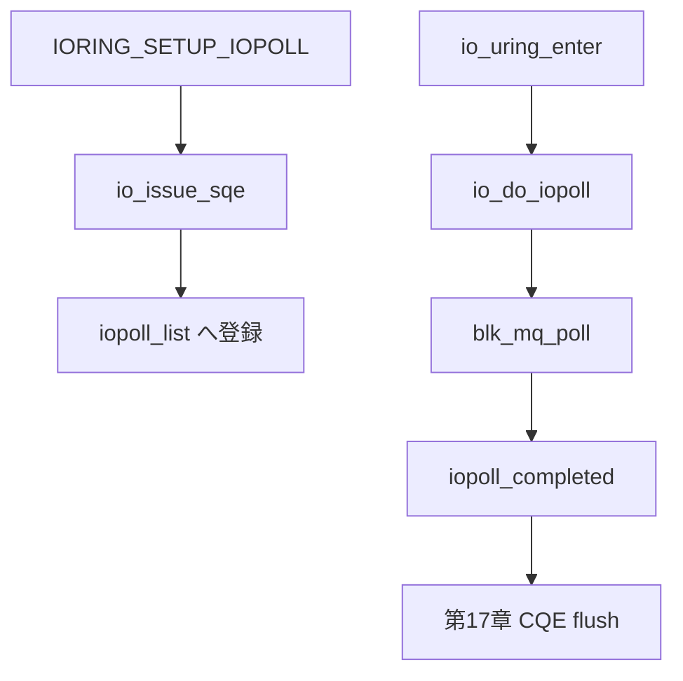

# 第19章 IOPOLL と CQ 完了

> **本章で読むソース**
>
> - [`io_uring/rw.c` L1334-L1377](https://github.com/gregkh/linux/blob/v6.18.38/io_uring/rw.c#L1334-L1377)
> - [`io_uring/io_uring.c` L3884-L3892](https://github.com/gregkh/linux/blob/v6.18.38/io_uring/io_uring.c#L3884-L3892)
> - [`io_uring/io_uring.c` L1681-L1721](https://github.com/gregkh/linux/blob/v6.18.38/io_uring/io_uring.c#L1681-L1721)
> - [`io_uring/io_uring.c` L1737-L1769](https://github.com/gregkh/linux/blob/v6.18.38/io_uring/io_uring.c#L1737-L1769)
> - [`io_uring/rw.c` L610-L626](https://github.com/gregkh/linux/blob/v6.18.38/io_uring/rw.c#L610-L626)
> - [`block/blk-mq.c` L5221-L5227](https://github.com/gregkh/linux/blob/v6.18.38/block/blk-mq.c#L5221-L5227)

## この章の狙い

**IOPOLL** モードで io_uring が完了をどう待ち、CQ リングを更新するかを読む。
ブロック層の `blk_mq_poll` との接続を追う。

## 前提

- [第8章](../part01-blk-mq/08-blk-mq-completion-poll.md) で blk-mq polling を読んでいること。
- [第16章](16-rw-direct-io.md) で `io_complete_rw_iopoll` を読んでいること。
- [第17章](17-req-complete-cqe.md) で CQE 公開の一般経路を読んでいること。

## setup 時の IOPOLL フラグ

`IORING_SETUP_IOPOLL` は enter 側での polling を有効化する。
SQPOLL と組み合わせると syscall_iopoll を省略できる場合がある。

[`io_uring/io_uring.c` L3884-L3892](https://github.com/gregkh/linux/blob/v6.18.38/io_uring/io_uring.c#L3884-L3892)

```c
	/*
	 * When SETUP_IOPOLL and SETUP_SQPOLL are both enabled, user
	 * space applications don't need to do io completion events
	 * polling again, they can rely on io_sq_thread to do polling
	 * work, which can reduce cpu usage and uring_lock contention.
	 */
	if (ctx->flags & IORING_SETUP_IOPOLL &&
	    !(ctx->flags & IORING_SETUP_SQPOLL))
		ctx->syscall_iopoll = 1;
```

## io_do_iopoll ループ

`io_do_iopoll` は `iopoll_list` 上の req に対し classic poll または hybrid poll を呼ぶ。
複数デバイスが混在する場合はスピンを抑える。

[`io_uring/rw.c` L1334-L1377](https://github.com/gregkh/linux/blob/v6.18.38/io_uring/rw.c#L1334-L1377)

```c
int io_do_iopoll(struct io_ring_ctx *ctx, bool force_nonspin)
{
	struct io_wq_work_node *pos, *start, *prev;
	unsigned int poll_flags = 0;
	DEFINE_IO_COMP_BATCH(iob);
	int nr_events = 0;

	/*
	 * Only spin for completions if we don't have multiple devices hanging
	 * off our complete list.
	 */
	if (ctx->poll_multi_queue || force_nonspin)
	// ... (中略) ...
		/* iopoll may have completed current req */
		if (!rq_list_empty(&iob.req_list) ||
		    READ_ONCE(req->iopoll_completed))
			break;
	}

	if (!rq_list_empty(&iob.req_list))
		iob.complete(&iob);
```

`BLK_POLL_ONESHOT` は複数キュー混在時にスピンを抑える。

## enter 時の iopoll 待ち

`io_uring_enter` の iopoll 待ちは `iopoll_list` を回し、必要なら task_work を処理する。
mutex を一時解放して workqueue とのデッドロックを避ける。

[`io_uring/io_uring.c` L1681-L1721](https://github.com/gregkh/linux/blob/v6.18.38/io_uring/io_uring.c#L1681-L1721)

```c
	do {
		int ret = 0;

		/*
		 * If a submit got punted to a workqueue, we can have the
		 * application entering polling for a command before it gets
		 * issued. That app will hold the uring_lock for the duration
		 * of the poll right here, so we need to take a breather every
		 * now and then to ensure that the issue has a chance to add
		 * the poll to the issued list. Otherwise we can spin here
		 * forever, while the workqueue is stuck trying to acquire the
		 * very same mutex.
		 */
		if (wq_list_empty(&ctx->iopoll_list) ||
		    io_task_work_pending(ctx)) {
			u32 tail = ctx->cached_cq_tail;

			(void) io_run_local_work_locked(ctx, min_events);

			if (task_work_pending(current) ||
			    wq_list_empty(&ctx->iopoll_list)) {
				mutex_unlock(&ctx->uring_lock);
				io_run_task_work();
				mutex_lock(&ctx->uring_lock);
			}
			/* some requests don't go through iopoll_list */
			if (tail != ctx->cached_cq_tail ||
			    wq_list_empty(&ctx->iopoll_list))
				break;
		}
		ret = io_do_iopoll(ctx, !min_events);
```

## 発行後の iopoll_list 登録

I/O 発行後に `io_iopoll_req_issued` で `iopoll_list` へ載せる。
発行前に載せると `io_do_iopoll` が未初期化の kiocb を見る競合がある。

[`io_uring/io_uring.c` L1737-L1769](https://github.com/gregkh/linux/blob/v6.18.38/io_uring/io_uring.c#L1737-L1769)

```c
static void io_iopoll_req_issued(struct io_kiocb *req, unsigned int issue_flags)
{
	struct io_ring_ctx *ctx = req->ctx;
	const bool needs_lock = issue_flags & IO_URING_F_UNLOCKED;

	/* workqueue context doesn't hold uring_lock, grab it now */
	if (unlikely(needs_lock))
		mutex_lock(&ctx->uring_lock);

	/*
	 * Track whether we have multiple files in our lists. This will impact
	 * how we do polling eventually, not spinning if we're on potentially
	 * different devices.
	 */
	if (wq_list_empty(&ctx->iopoll_list)) {
		ctx->poll_multi_queue = false;
	} else if (!ctx->poll_multi_queue) {
		struct io_kiocb *list_req;

		list_req = container_of(ctx->iopoll_list.first, struct io_kiocb,
					comp_list);
		if (list_req->file != req->file)
			ctx->poll_multi_queue = true;
	}

	/*
	 * For fast devices, IO may have already completed. If it has, add
	 * it to the front so we find it first.
	 */
	if (READ_ONCE(req->iopoll_completed))
		wq_list_add_head(&req->comp_list, &ctx->iopoll_list);
	else
		wq_list_add_tail(&req->comp_list, &ctx->iopoll_list);
```

## io_complete_rw_iopoll

IOPOLL 用完了は `iopoll_completed` を立て、バッチ完了器 `io_comp_batch` へ載せる。

[`io_uring/rw.c` L610-L626](https://github.com/gregkh/linux/blob/v6.18.38/io_uring/rw.c#L610-L626)

```c
static void io_complete_rw_iopoll(struct kiocb *kiocb, long res)
{
	struct io_rw *rw = container_of(kiocb, struct io_rw, kiocb);
	struct io_kiocb *req = cmd_to_io_kiocb(rw);

	if (kiocb->ki_flags & IOCB_WRITE)
		io_req_end_write(req);
	if (unlikely(res != req->cqe.res)) {
		if (res == -EAGAIN && io_rw_should_reissue(req))
			req->flags |= REQ_F_REISSUE | REQ_F_BL_NO_RECYCLE;
		else
			req->cqe.res = res;
	}

	/* order with io_iopoll_complete() checking ->iopoll_completed */
	smp_store_release(&req->iopoll_completed, 1);
}
```

## blk_mq_poll への接続

ブロック I/O の classic poll は `blk_mq_poll` を呼ぶ。
`bi_cookie` が hctx インデックスを保持する（第8章）。

[`block/blk-mq.c` L5221-L5227](https://github.com/gregkh/linux/blob/v6.18.38/block/blk-mq.c#L5221-L5227)

```c
int blk_mq_poll(struct request_queue *q, blk_qc_t cookie,
		struct io_comp_batch *iob, unsigned int flags)
{
	if (!blk_mq_can_poll(q))
		return 0;
	return blk_hctx_poll(q, xa_load(&q->hctx_table, cookie), iob, flags);
}
```

NVMe poll queue など `REQ_POLLED` 対応デバイスで意味を持つ。

## 処理の流れ



## 高速化と最適化の工夫

**ゼロシステムコール発行と IOPOLL の組合せ**（SQPOLL + IOPOLL）は submit と complete の両方で syscall と割り込みを避ける。
CPU を消費する代わりにレイテンシを抑えるトレードオフである。

**`io_comp_batch` によるバッチ完了**は複数 request の CQ 更新をまとめ、poll ループのロック取得を減らす。

**発行後の iopoll_list 登録順序**は未発行 req を poll しないよう同期し、空回転スピンを防ぐ。

> **v7.1.3 注記**：`io_uring/io_uring.c` は v7.1.3 で大規模リファクタされているが、本章が引用する範囲の分岐変更は限定的である。
> 行番号は v7.1.3 側でずれる（監査は [README](../README.md#v713-との差分監査)）。

## まとめ

IOPOLL は io_uring 側の完了ループから `blk_mq_poll` を呼び、ブロック層の polling と直結する。
CQ 更新は第17章の defer/task_work と組み合わさり、enter 時にまとめてユーザ空間へ見える。
ストレージ性能を押し出すワークロードでは setup フラグと登録の設計が重要になる。

## 関連する章

- [第16章 read/write と direct I/O 実行](16-rw-direct-io.md)
- [第17章 リクエスト完了と CQE 公開](17-req-complete-cqe.md)
- [第21章 NVMe の queue_rq](../part04-nvme-zoned/21-nvme-queue-rq-doorbell.md)
