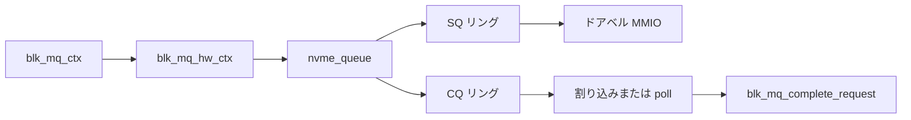

# 第15章 NVMe と blk-mq キュー対応

> **本章で読むソース**
>
> - [`drivers/nvme/host/pci.c` L221-L250](https://github.com/gregkh/linux/blob/v6.18.38/drivers/nvme/host/pci.c#L221-L250)
> - [`drivers/nvme/host/pci.c` L1193-L1219](https://github.com/gregkh/linux/blob/v6.18.38/drivers/nvme/host/pci.c#L1193-L1219)
> - [`drivers/nvme/host/pci.c` L1222-L1236](https://github.com/gregkh/linux/blob/v6.18.38/drivers/nvme/host/pci.c#L1222-L1236)
> - [`drivers/nvme/host/pci.c` L2037-L2047](https://github.com/gregkh/linux/blob/v6.18.38/drivers/nvme/host/pci.c#L2037-L2047)
> - [`include/linux/blk-mq.h` L304-L321](https://github.com/gregkh/linux/blob/v6.18.38/include/linux/blk-mq.h#L304-L321)
> - [`block/blk-mq.c` L1351-L1375](https://github.com/gregkh/linux/blob/v6.18.38/block/blk-mq.c#L1351-L1375)

## この章の狙い

**NVMe** ホストドライバが **blk-mq** の `hctx` とデバイス側 Submission/Completion キューをどう対応づけるかを概観する。
`queue_rq` からドアベルレジスタ書き込みまでの経路を読む。

## 前提

- [第4章](../part01-blk-mq/04-blk-mq-queues-hctx-ctx.md) と [第6章](../part01-blk-mq/06-blk-mq-completion-poll.md) を読んでいること。

## nvme_queue 構造

各 `nvme_queue` は admin または I/O キューに対応する。
SQ/CQ リング、ドアベルポインタ、深度、poll 用スピンロックを持つ。

[`drivers/nvme/host/pci.c` L221-L250](https://github.com/gregkh/linux/blob/v6.18.38/drivers/nvme/host/pci.c#L221-L250)

```c
struct nvme_queue {
	struct nvme_dev *dev;
	struct nvme_descriptor_pools descriptor_pools;
	spinlock_t sq_lock;
	void *sq_cmds;
	 /* only used for poll queues: */
	spinlock_t cq_poll_lock ____cacheline_aligned_in_smp;
	struct nvme_completion *cqes;
	dma_addr_t sq_dma_addr;
	dma_addr_t cq_dma_addr;
	u32 __iomem *q_db;
	u32 q_depth;
	u16 cq_vector;
	u16 sq_tail;
	u16 last_sq_tail;
	u16 cq_head;
	u16 qid;
	u8 cq_phase;
	u8 sqes;
	unsigned long flags;
#define NVMEQ_ENABLED		0
#define NVMEQ_SQ_CMB		1
#define NVMEQ_DELETE_ERROR	2
#define NVMEQ_POLLED		3
	__le32 *dbbuf_sq_db;
	__le32 *dbbuf_cq_db;
	__le32 *dbbuf_sq_ei;
	__le32 *dbbuf_cq_ei;
	struct completion delete_done;
};
```

`NVMEQ_POLLED` が立つキューは割り込みではなく polling 完了を想定する。

## blk_mq_ops 登録

NVMe は `blk_mq_ops` に `queue_rq`、`queue_rqs`、`poll`、`map_queues` を実装する。
admin キュー用と I/O キュー用で ops が分かれる。

[`drivers/nvme/host/pci.c` L2037-L2047](https://github.com/gregkh/linux/blob/v6.18.38/drivers/nvme/host/pci.c#L2037-L2047)

```c
static const struct blk_mq_ops nvme_mq_ops = {
	.queue_rq	= nvme_queue_rq,
	.queue_rqs	= nvme_queue_rqs,
	.complete	= nvme_pci_complete_rq,
	.commit_rqs	= nvme_commit_rqs,
	.init_hctx	= nvme_init_hctx,
	.init_request	= nvme_pci_init_request,
	.map_queues	= nvme_pci_map_queues,
	.timeout	= nvme_timeout,
	.poll		= nvme_poll,
};
```

`map_queues` が CPU と IRQ ベクタを hctx に割り当てる。

## queue_rq 経路

`nvme_queue_rq` は request から `nvme_iod` を取り出し、コマンドを SQ リングにコピーする。
最後にドアベルレジスタを叩いてデバイスへ通知する。

[`drivers/nvme/host/pci.c` L1193-L1219](https://github.com/gregkh/linux/blob/v6.18.38/drivers/nvme/host/pci.c#L1193-L1219)

```c
static blk_status_t nvme_queue_rq(struct blk_mq_hw_ctx *hctx,
			 const struct blk_mq_queue_data *bd)
{
	struct nvme_queue *nvmeq = hctx->driver_data;
	struct nvme_dev *dev = nvmeq->dev;
	struct request *req = bd->rq;
	struct nvme_iod *iod = blk_mq_rq_to_pdu(req);
	blk_status_t ret;

	/*
	 * We should not need to do this, but we're still using this to
	 * ensure we can drain requests on a dying queue.
	 */
	if (unlikely(!test_bit(NVMEQ_ENABLED, &nvmeq->flags)))
		return BLK_STS_IOERR;

	if (unlikely(!nvme_check_ready(&dev->ctrl, req, true)))
		return nvme_fail_nonready_command(&dev->ctrl, req);

	ret = nvme_prep_rq(req);
	if (unlikely(ret))
		return ret;
	spin_lock(&nvmeq->sq_lock);
	nvme_sq_copy_cmd(nvmeq, &iod->cmd);
	nvme_write_sq_db(nvmeq, bd->last);
	spin_unlock(&nvmeq->sq_lock);
	return BLK_STS_OK;
```

`bd->last` が真のときだけドアベルを鳴らし、バッチ投入をまとめる。

> **v7.1.3 注記**：`nvme_queue_rq` の本体は [v7.1.3 `drivers/nvme/host/pci.c` L1431-L1458](https://github.com/gregkh/linux/blob/v7.1.3/drivers/nvme/host/pci.c#L1431-L1458) でも本文と同一である（行番号のみずれる）。

## バッチ queue_rqs

`nvme_submit_cmds` は複数 request のコマンドを SQ に積んでから一度だけドアベルを書く。

[`drivers/nvme/host/pci.c` L1222-L1236](https://github.com/gregkh/linux/blob/v6.18.38/drivers/nvme/host/pci.c#L1222-L1236)

```c
static void nvme_submit_cmds(struct nvme_queue *nvmeq, struct rq_list *rqlist)
{
	struct request *req;

	if (rq_list_empty(rqlist))
		return;

	spin_lock(&nvmeq->sq_lock);
	while ((req = rq_list_pop(rqlist))) {
		struct nvme_iod *iod = blk_mq_rq_to_pdu(req);

		nvme_sq_copy_cmd(nvmeq, &iod->cmd);
	}
	nvme_write_sq_db(nvmeq, true);
	spin_unlock(&nvmeq->sq_lock);
```

blk-mq の `queue_rqs` 経路と対応する。

## hctx と driver_data

blk-mq の `hctx` は `driver_data` に `nvme_queue` を格納する。
dispatch リストはデバイス側の深度制限で溢れた request の待ち行列である。

[`include/linux/blk-mq.h` L304-L321](https://github.com/gregkh/linux/blob/v6.18.38/include/linux/blk-mq.h#L304-L321)

```c
struct blk_mq_hw_ctx {
	struct {
		/** @lock: Protects the dispatch list. */
		spinlock_t		lock;
		/**
		 * @dispatch: Used for requests that are ready to be
		 * dispatched to the hardware but for some reason (e.g. lack of
		 * resources) could not be sent to the hardware. As soon as the
		 * driver can send new requests, requests at this list will
		 * be sent first for a fairer dispatch.
		 */
		struct list_head	dispatch;
		 /**
		  * @state: BLK_MQ_S_* flags. Defines the state of the hw
		  * queue (active, scheduled to restart, stopped).
		  */
		unsigned long		state;
	} ____cacheline_aligned_in_smp;
```

## REQ_POLLED と bi_cookie

発行時に polled bio へ `bi_cookie` を書き、io_uring や `bio_poll` が hctx を特定する。

[`block/blk-mq.c` L1351-L1375](https://github.com/gregkh/linux/blob/v6.18.38/block/blk-mq.c#L1351-L1375)

```c
void blk_mq_start_request(struct request *rq)
{
	struct request_queue *q = rq->q;

	trace_block_rq_issue(rq);

	if (test_bit(QUEUE_FLAG_STATS, &q->queue_flags) &&
	    !blk_rq_is_passthrough(rq)) {
		rq->io_start_time_ns = blk_time_get_ns();
		rq->stats_sectors = blk_rq_sectors(rq);
		rq->rq_flags |= RQF_STATS;
		rq_qos_issue(q, rq);
	}

	WARN_ON_ONCE(blk_mq_rq_state(rq) != MQ_RQ_IDLE);

	blk_add_timer(rq);
	WRITE_ONCE(rq->state, MQ_RQ_IN_FLIGHT);
	rq->mq_hctx->tags->rqs[rq->tag] = rq;

	if (blk_integrity_rq(rq) && req_op(rq) == REQ_OP_WRITE)
		blk_integrity_prepare(rq);

	if (rq->bio && rq->bio->bi_opf & REQ_POLLED)
	        WRITE_ONCE(rq->bio->bi_cookie, rq->mq_hctx->queue_num);
```

NVMe poll queue はこの cookie で `nvme_poll` へ到達する。

## 対応関係



## 高速化と最適化の工夫

**ドアベルバッチング**（`bd->last` / `queue_rqs`）は MMIO 回数を減らす。
NVMe はドアベル書き込みがホット path の固定費になりやすい。

**複数 I/O キューと `map_queues`** は CPU、NUMA ノード、IRQ ベクタを揃えて配置する。
ローカルキューへの送信でロックとキャッシュミスを減らす。

**poll queue**（`NVMEQ_POLLED`）は割り込みレイテンシを避ける。
`blk_mq_poll` と io_uring IOPOLL の下支えになる。

## まとめ

NVMe ドライバは blk-mq の hctx ごとに `nvme_queue` を割り当て、request を NVMe コマンドに変換する。
`queue_rq` と `queue_rqs` は SQ 投入とドアベル通知の最適化を担う。
次章ではその下層または上層でよく使う device mapper を読む。

## 関連する章

- [第16章 device mapper と dm-table](16-device-mapper.md)
- [第14章 登録リソースと polling](../part03-io-uring/14-fixed-buffer-poll.md)
