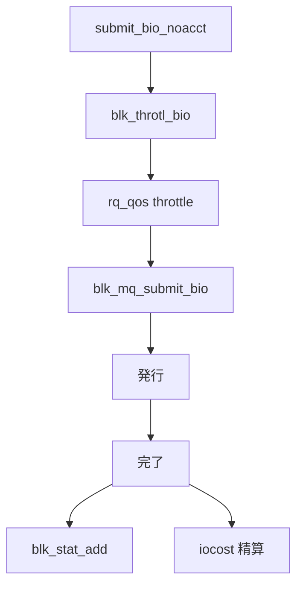

# 第17章 ブロック統計と throttling 概観

> **本章で読むソース**
>
> - [`block/blk-stat.c` L50-L75](https://github.com/gregkh/linux/blob/v6.18.38/block/blk-stat.c#L50-L75)
> - [`block/blk-stat.c` L99-L110](https://github.com/gregkh/linux/blob/v6.18.38/block/blk-stat.c#L99-L110)
> - [`block/blk-throttle.c` L1742-L1784](https://github.com/gregkh/linux/blob/v6.18.38/block/blk-throttle.c#L1742-L1784)
> - [`block/blk-throttle.h` L196-L205](https://github.com/gregkh/linux/blob/v6.18.38/block/blk-throttle.h#L196-L205)
> - [`block/blk-iocost.c` L717-L728](https://github.com/gregkh/linux/blob/v6.18.38/block/blk-iocost.c#L717-L728)
> - [`block/blk-mq.c` L1104-L1137](https://github.com/gregkh/linux/blob/v6.18.38/block/blk-mq.c#L1104-L1137)

## この章の狙い

ブロック層の **統計**（レイテンシ分布）と **throttling**（blk-throttle、iocost）が I/O 経路のどこに挿入されるかを概観する。
スケジューラや NVMe 最適化と併用される制御層として位置づける。

## 前提

- [第1章](../part00-overview/01-block-layer-overview.md) で `blk_throtl_bio` を読んでいること。

## blk_stat_add

完了時に request のサービス時間をバケットへ加算する。
コールバックは per-CPU 統計を持ち、タイマーで集約する。

[`block/blk-stat.c` L50-L75](https://github.com/gregkh/linux/blob/v6.18.38/block/blk-stat.c#L50-L75)

```c
void blk_stat_add(struct request *rq, u64 now)
{
	struct request_queue *q = rq->q;
	struct blk_stat_callback *cb;
	struct blk_rq_stat *stat;
	int bucket, cpu;
	u64 value;

	value = (now >= rq->io_start_time_ns) ? now - rq->io_start_time_ns : 0;

	rcu_read_lock();
	cpu = get_cpu();
	list_for_each_entry_rcu(cb, &q->stats->callbacks, list) {
		if (!blk_stat_is_active(cb))
			continue;

		bucket = cb->bucket_fn(rq);
		if (bucket < 0)
			continue;

		stat = &per_cpu_ptr(cb->cpu_stat, cpu)[bucket];
		blk_rq_stat_add(stat, value);
	}
	put_cpu();
	rcu_read_unlock();
}
```

wbt（write back throttling）などがコールバックとして登録される。

## コールバック登録

`blk_stat_alloc_callback` はタイマー集約関数とバケット関数を受け取る。

[`block/blk-stat.c` L99-L110](https://github.com/gregkh/linux/blob/v6.18.38/block/blk-stat.c#L99-L110)

```c
struct blk_stat_callback *
blk_stat_alloc_callback(void (*timer_fn)(struct blk_stat_callback *),
			int (*bucket_fn)(const struct request *),
			unsigned int buckets, void *data)
{
	struct blk_stat_callback *cb;

	cb = kmalloc(sizeof(*cb), GFP_KERNEL);
	if (!cb)
		return NULL;

	cb->stat = kmalloc_array(buckets, sizeof(struct blk_rq_stat),
```

マルチキュー環境では per-CPU 集計がロック競合を避ける。

## 完了経路での統計呼び出し

`__blk_mq_end_request_acct` は `RQF_STATS` が立つ request で `blk_stat_add` を呼ぶ。

[`block/blk-mq.c` L1104-L1137](https://github.com/gregkh/linux/blob/v6.18.38/block/blk-mq.c#L1104-L1137)

```c
static inline void blk_account_io_start(struct request *req)
{
	trace_block_io_start(req);

	if (!blk_queue_io_stat(req->q))
		return;
	if (blk_rq_is_passthrough(req) && !blk_rq_passthrough_stats(req))
		return;

	req->rq_flags |= RQF_IO_STAT;
	req->start_time_ns = blk_time_get_ns();

	/*
	 * All non-passthrough requests are created from a bio with one
	 * exception: when a flush command that is part of a flush sequence
	 * generated by the state machine in blk-flush.c is cloned onto the
	 * lower device by dm-multipath we can get here without a bio.
	 */
	if (req->bio)
		req->part = req->bio->bi_bdev;
	else
		req->part = req->q->disk->part0;

	part_stat_lock();
	update_io_ticks(req->part, jiffies, false);
	part_stat_local_inc(req->part, in_flight[op_is_write(req_op(req))]);
	part_stat_unlock();
}

static inline void __blk_mq_end_request_acct(struct request *rq, u64 now)
{
	if (rq->rq_flags & RQF_STATS)
		blk_stat_add(rq, now);

```

発行時に `blk_mq_start_request` が `RQF_STATS` を立てる。

## blk-throttle

`__blk_throtl_bio` は cgroup ごとの BPS/IOPS 上限を検査する。
上限内なら課金して通過、超過ならキューへ載せる。

[`block/blk-throttle.c` L1742-L1784](https://github.com/gregkh/linux/blob/v6.18.38/block/blk-throttle.c#L1742-L1784)

```c
bool __blk_throtl_bio(struct bio *bio)
{
	struct request_queue *q = bdev_get_queue(bio->bi_bdev);
	struct blkcg_gq *blkg = bio->bi_blkg;
	struct throtl_qnode *qn = NULL;
	struct throtl_grp *tg = blkg_to_tg(blkg);
	struct throtl_service_queue *sq;
	bool rw = bio_data_dir(bio);
	bool throttled = false;
	struct throtl_data *td = tg->td;

	rcu_read_lock();
	// ... (中略) ...
			 * dispatched directly, even if they're over limit.
			 *
			 * Charge and dispatch directly, and our throttle
			 * control algorithm is adaptive, and extra IO bytes
			 * will be throttled for paying the debt
			 */
			throtl_charge_bps_bio(tg, bio);
			throtl_charge_iops_bio(tg, bio);
```

`submit_bio_noacct` 入口の `blk_throtl_bio` からここへ至る。

## blk_throtl_bio インライン

`CONFIG_BLK_CGROUP` 有効時だけ throttling が動く。

[`block/blk-throttle.h` L196-L205](https://github.com/gregkh/linux/blob/v6.18.38/block/blk-throttle.h#L196-L205)

```c
static inline bool blk_throtl_bio(struct bio *bio)
{
	/*
	 * block throttling takes effect if the policy is activated
	 * in the bio's request_queue.
	 */
	if (!blk_should_throtl(bio))
		return false;

	return __blk_throtl_bio(bio);
```

二重課金を防ぐフラグが bio に付く。

## iocost による仮想時間

iocost は cgroup に仮想時間（vtime）を課し、比例公平にデバイス時間を配分する。
`iocg_commit_bio` が bio に cost を記録する。

[`block/blk-iocost.c` L717-L728](https://github.com/gregkh/linux/blob/v6.18.38/block/blk-iocost.c#L717-L728)

```c
static void iocg_commit_bio(struct ioc_gq *iocg, struct bio *bio,
			    u64 abs_cost, u64 cost)
{
	struct iocg_pcpu_stat *gcs;

	bio->bi_iocost_cost = cost;
	atomic64_add(cost, &iocg->vtime);

	gcs = get_cpu_ptr(iocg->pcpu_stat);
	local64_add(abs_cost, &gcs->abs_vusage);
	put_cpu_ptr(gcs);
}
```

blk-throttle よりモデルベースの制御である。

## 制御層の位置



統計は完了側、throttle は投入側に偏る。

## 高速化と最適化の工夫

**per-CPU blk_stat** は完了 IRQ や softirq からロック競合なくサンプルを積む。
タイマーでまとめて読むため、読み取り側のコストを下げる。

**スライスベースの blk-throttle**（`throtl_trim_slice`）はバーストを許しつつ長期平均を守る。
完全な硬い制限よりスループットとのバランスを取る。

**iocost の仮想時間モデル**はデバイス能力変動に追従しやすい。
固定 BPS より混雑時の公平性をモデル化する。

> **v7.1.3 注記**：本章が引用する範囲では v6.18.38 と v7.1.3 で読解に影響する分岐変更は確認されていない。
> 監査一覧は [README](../README.md#v713-との差分監査) を参照。

## まとめ

ブロック統計は request 完了時間を収集し、wbt などの制御にフィードバックする。
throttling は submit 入口と rq_qos で帯域を制限し、iocost は cgroup 間の比例配分を行う。
これらはスケジューラや NVMe マルチキューとは独立したレイヤである。

## 関連する章

- [第9章 BFQ 概観](../part02-iosched/09-bfq-overview.md)
- [第16章 device mapper](16-device-mapper.md)
