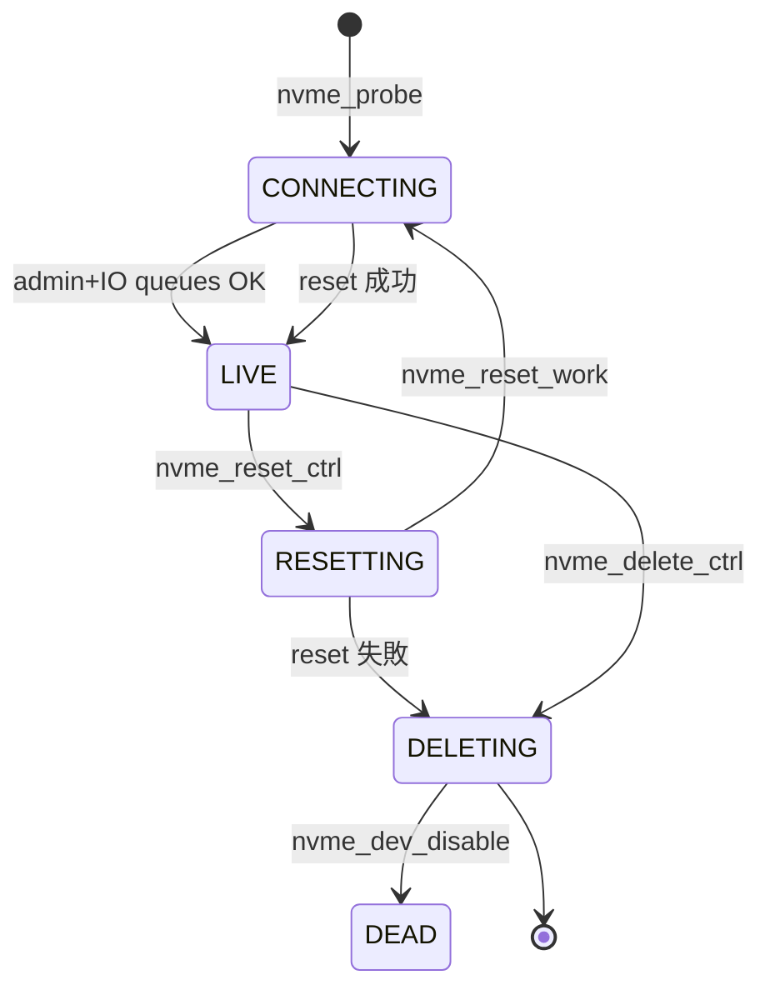

# 第20章 NVMe コントローラのライフサイクル

> **本章で読むソース**
>
> - [`drivers/nvme/host/pci.c` L3460-L3505](https://github.com/gregkh/linux/blob/v6.18.38/drivers/nvme/host/pci.c#L3460-L3505)
> - [`drivers/nvme/host/pci.c` L2136-L2163](https://github.com/gregkh/linux/blob/v6.18.38/drivers/nvme/host/pci.c#L2136-L2163)
> - [`drivers/nvme/host/pci.c` L2166-L2200](https://github.com/gregkh/linux/blob/v6.18.38/drivers/nvme/host/pci.c#L2166-L2200)
> - [`drivers/nvme/host/pci.c` L3520-L3544](https://github.com/gregkh/linux/blob/v6.18.38/drivers/nvme/host/pci.c#L3520-L3544)
> - [`drivers/nvme/host/core.c` L215-L221](https://github.com/gregkh/linux/blob/v6.18.38/drivers/nvme/host/core.c#L215-L221)
> - [`drivers/nvme/host/core.c` L239-L248](https://github.com/gregkh/linux/blob/v6.18.38/drivers/nvme/host/core.c#L239-L248)
> - [`drivers/nvme/host/pci.c` L3125-L3234](https://github.com/gregkh/linux/blob/v6.18.38/drivers/nvme/host/pci.c#L3125-L3234)

## この章の狙い

PCI 接続 NVMe コントローラの **probe から LIVE 状態**、admin/IO キュー作成、**reset** までの概観を読む。
`queue_rq` とドアベル最適化は第21章で扱う。

## 前提

- [第4章](../part00-overview/04-gendisk-request-queue.md) で tag_set と request_queue を読んでいること。

## nvme_probe の流れ

`nvme_probe` はデバイス構造体の確保、BAR マップ、admin tag_set 作成、コントローラ有効化へ進む。
Fabrics や target モードは本分冊の範囲外である。

[`drivers/nvme/host/pci.c` L3460-L3505](https://github.com/gregkh/linux/blob/v6.18.38/drivers/nvme/host/pci.c#L3460-L3505)

```c
static int nvme_probe(struct pci_dev *pdev, const struct pci_device_id *id)
{
	struct nvme_dev *dev;
	int result = -ENOMEM;

	dev = nvme_pci_alloc_dev(pdev, id);
	if (IS_ERR(dev))
		return PTR_ERR(dev);

	result = nvme_add_ctrl(&dev->ctrl);
	if (result)
		goto out_put_ctrl;

	result = nvme_dev_map(dev);
	if (result)
		goto out_uninit_ctrl;

	result = nvme_pci_alloc_iod_mempool(dev);
	if (result)
		goto out_dev_unmap;

	dev_info(dev->ctrl.device, "pci function %s\n", dev_name(&pdev->dev));

	result = nvme_pci_enable(dev);
	if (result)
		goto out_release_iod_mempool;

	result = nvme_alloc_admin_tag_set(&dev->ctrl, &dev->admin_tagset,
				&nvme_mq_admin_ops, sizeof(struct nvme_iod));
	if (result)
		goto out_disable;

	/*
	 * Mark the controller as connecting before sending admin commands to
	 * allow the timeout handler to do the right thing.
	 */
	if (!nvme_change_ctrl_state(&dev->ctrl, NVME_CTRL_CONNECTING)) {
		dev_warn(dev->ctrl.device,
			"failed to mark controller CONNECTING\n");
		result = -EBUSY;
		goto out_disable;
	}

	result = nvme_init_ctrl_finish(&dev->ctrl, false);
	if (result)
		goto out_disable;
```

## admin キューとコントローラ有効化

admin キュー（キュー ID 0）を確保し、ASQ/ACQ をレジスタへ書き込んでから `nvme_enable_ctrl` を呼ぶ。

[`drivers/nvme/host/pci.c` L2136-L2163](https://github.com/gregkh/linux/blob/v6.18.38/drivers/nvme/host/pci.c#L2136-L2163)

```c
	result = nvme_alloc_queue(dev, 0, NVME_AQ_DEPTH);
	if (result)
		return result;

	dev->ctrl.numa_node = dev_to_node(dev->dev);

	nvmeq = &dev->queues[0];
	aqa = nvmeq->q_depth - 1;
	aqa |= aqa << 16;

	writel(aqa, dev->bar + NVME_REG_AQA);
	lo_hi_writeq(nvmeq->sq_dma_addr, dev->bar + NVME_REG_ASQ);
	lo_hi_writeq(nvmeq->cq_dma_addr, dev->bar + NVME_REG_ACQ);

	result = nvme_enable_ctrl(&dev->ctrl);
	if (result)
		return result;

	nvmeq->cq_vector = 0;
	nvme_init_queue(nvmeq, 0);
	result = queue_request_irq(nvmeq);
	if (result) {
		dev->online_queues--;
		return result;
	}

	set_bit(NVMEQ_ENABLED, &nvmeq->flags);
	return result;
```

## IO キュー作成

`nvme_create_io_queues` は複数 IO キューを確保し、poll 用キューを分離する場合がある。
Create SQ/CQ 失敗は警告にとどめ、admin のみでも動作を続ける設計である。

[`drivers/nvme/host/pci.c` L2166-L2200](https://github.com/gregkh/linux/blob/v6.18.38/drivers/nvme/host/pci.c#L2166-L2200)

```c
static int nvme_create_io_queues(struct nvme_dev *dev)
{
	unsigned i, max, rw_queues;
	int ret = 0;

	for (i = dev->ctrl.queue_count; i <= dev->max_qid; i++) {
		if (nvme_alloc_queue(dev, i, dev->q_depth)) {
			ret = -ENOMEM;
			break;
		}
	}

	max = min(dev->max_qid, dev->ctrl.queue_count - 1);
	if (max != 1 && dev->io_queues[HCTX_TYPE_POLL]) {
		rw_queues = dev->io_queues[HCTX_TYPE_DEFAULT] +
				dev->io_queues[HCTX_TYPE_READ];
	} else {
		rw_queues = max;
	}

	for (i = dev->online_queues; i <= max; i++) {
		bool polled = i > rw_queues;

		ret = nvme_create_queue(&dev->queues[i], i, polled);
		if (ret)
			break;
	}

	/*
	 * Ignore failing Create SQ/CQ commands, we can continue with less
	 * than the desired amount of queues, and even a controller without
	 * I/O queues can still be used to issue admin commands.  This might
	 * be useful to upgrade a buggy firmware for example.
	 */
	return ret >= 0 ? 0 : ret;
}
```

## LIVE 遷移と blk-mq tag_set

IO キュー準備後、`nvme_alloc_io_tag_set` で blk-mq 用 tag_set を登録し、`NVME_CTRL_LIVE` へ遷移する。

[`drivers/nvme/host/pci.c` L3520-L3544](https://github.com/gregkh/linux/blob/v6.18.38/drivers/nvme/host/pci.c#L3520-L3544)

```c
	result = nvme_setup_io_queues(dev);
	if (result)
		goto out_disable;

	if (dev->online_queues > 1) {
		nvme_alloc_io_tag_set(&dev->ctrl, &dev->tagset, &nvme_mq_ops,
				nvme_pci_nr_maps(dev), sizeof(struct nvme_iod));
		nvme_dbbuf_set(dev);
	}

	if (!dev->ctrl.tagset)
		dev_warn(dev->ctrl.device, "IO queues not created\n");

	if (!nvme_change_ctrl_state(&dev->ctrl, NVME_CTRL_LIVE)) {
		dev_warn(dev->ctrl.device,
			"failed to mark controller live state\n");
		result = -ENODEV;
		goto out_disable;
	}

	pci_set_drvdata(pdev, dev);

	nvme_start_ctrl(&dev->ctrl);
	nvme_put_ctrl(&dev->ctrl);
	flush_work(&dev->ctrl.scan_work);
```

名前空間スキャンは `scan_work` で非同期に走り、gendisk が登録される。

## reset と削除

`nvme_reset_ctrl` は状態を `NVME_CTRL_RESETTING` にし、専用 workqueue で reset 処理を起動する。

[`drivers/nvme/host/core.c` L215-L221](https://github.com/gregkh/linux/blob/v6.18.38/drivers/nvme/host/core.c#L215-L221)

```c
int nvme_reset_ctrl(struct nvme_ctrl *ctrl)
{
	if (!nvme_change_ctrl_state(ctrl, NVME_CTRL_RESETTING))
		return -EBUSY;
	if (!queue_work(nvme_reset_wq, &ctrl->reset_work))
		return -EBUSY;
	return 0;
```

削除経路は `nvme_do_delete_ctrl` で namespace 除去、ドライバ `delete_ctrl`、構造体解放へ進む。

[`drivers/nvme/host/core.c` L239-L248](https://github.com/gregkh/linux/blob/v6.18.38/drivers/nvme/host/core.c#L239-L248)

```c
static void nvme_do_delete_ctrl(struct nvme_ctrl *ctrl)
{
	dev_info(ctrl->device,
		 "Removing ctrl: NQN \"%s\"\n", nvmf_ctrl_subsysnqn(ctrl));

	flush_work(&ctrl->reset_work);
	nvme_stop_ctrl(ctrl);
	nvme_remove_namespaces(ctrl);
	ctrl->ops->delete_ctrl(ctrl);
	nvme_uninit_ctrl(ctrl);
```

## nvme_reset_work の状態遷移

`nvme_reset_ctrl` は work を起動するだけで、本体は `nvme_reset_work` が担う。
RESETTING 確認後に disable/sync、PCI 再 enable、`NVME_CTRL_CONNECTING`、admin/IO キュー再構築、成功時 `NVME_CTRL_LIVE` へ遷移する。
失敗時は `NVME_CTRL_DELETING` を経て `NVME_CTRL_DEAD` になる。

[`drivers/nvme/host/pci.c` L3125-L3234](https://github.com/gregkh/linux/blob/v6.18.38/drivers/nvme/host/pci.c#L3125-L3234)

```c
static void nvme_reset_work(struct work_struct *work)
{
	struct nvme_dev *dev =
		container_of(work, struct nvme_dev, ctrl.reset_work);
	bool was_suspend = !!(dev->ctrl.ctrl_config & NVME_CC_SHN_NORMAL);
	int result;

	if (nvme_ctrl_state(&dev->ctrl) != NVME_CTRL_RESETTING) {
		dev_warn(dev->ctrl.device, "ctrl state %d is not RESETTING\n",
			 dev->ctrl.state);
		result = -ENODEV;
		goto out;
	}

	/*
	 * If we're called to reset a live controller first shut it down before
	 * moving on.
	 */
	if (dev->ctrl.ctrl_config & NVME_CC_ENABLE)
		nvme_dev_disable(dev, false);
	nvme_sync_queues(&dev->ctrl);

	mutex_lock(&dev->shutdown_lock);
	result = nvme_pci_enable(dev);
	if (result)
		goto out_unlock;
	nvme_unquiesce_admin_queue(&dev->ctrl);
	mutex_unlock(&dev->shutdown_lock);

	/*
	 * Introduce CONNECTING state from nvme-fc/rdma transports to mark the
	 * initializing procedure here.
	 */
	if (!nvme_change_ctrl_state(&dev->ctrl, NVME_CTRL_CONNECTING)) {
		dev_warn(dev->ctrl.device,
			"failed to mark controller CONNECTING\n");
		result = -EBUSY;
		goto out;
	}

	result = nvme_init_ctrl_finish(&dev->ctrl, was_suspend);
	if (result)
		goto out;

	// ... (中略) ...

	result = nvme_setup_io_queues(dev);
	if (result)
		goto out;

	// ... (中略) ...

	if (!nvme_change_ctrl_state(&dev->ctrl, NVME_CTRL_LIVE)) {
		dev_warn(dev->ctrl.device,
			"failed to mark controller live state\n");
		result = -ENODEV;
		goto out;
	}

	nvme_start_ctrl(&dev->ctrl);
	return;

 out_unlock:
	mutex_unlock(&dev->shutdown_lock);
 out:
	/*
	 * Set state to deleting now to avoid blocking nvme_wait_reset(), which
	 * may be holding this pci_dev's device lock.
	 */
	dev_warn(dev->ctrl.device, "Disabling device after reset failure: %d\n",
		 result);
	nvme_change_ctrl_state(&dev->ctrl, NVME_CTRL_DELETING);
	nvme_dev_disable(dev, true);
	nvme_sync_queues(&dev->ctrl);
	nvme_mark_namespaces_dead(&dev->ctrl);
	nvme_unquiesce_io_queues(&dev->ctrl);
	nvme_change_ctrl_state(&dev->ctrl, NVME_CTRL_DEAD);
}
```

## 処理の流れ



## 高速化と最適化の工夫

**複数 IO キューと poll キュー分離**は read/write と polled I/O で hctx 種別を分け、第5章の `HCTX_MAX_TYPES` モデルに載せる。

**admin と IO の tag_set 分離**は管理コマンドとデータ path の深度を独立させ、IO 飽和時も admin が詰まりにくい。

**部分的成功の許容**（IO キュー作成失敗時も続行）は、ファームウェア更新など admin のみ必要な場面を残す。

NVMe Fabrics と target は別分冊の担当である。
本章は `drivers/nvme/host/pci.c` と `core.c` のローカルコントローラに限定する。

> **v7.1.3 注記**：`nvme_reset_work` は [v7.1.3 `drivers/nvme/host/pci.c` L3379-L3489](https://github.com/gregkh/linux/blob/v7.1.3/drivers/nvme/host/pci.c#L3379-L3489) でも RESETTING 確認、CONNECTING 遷移、失敗時 DELETING/DEAD の分岐は同一である。

## まとめ

NVMe PCI ドライバは probe で admin キューを立ち上げ、IO キューと blk-mq tag_set を登録して LIVE になる。
reset と delete は workqueue 上の状態機械で直列化される。
I/O 投入の詳細は第21章で読む。

## 関連する章

- [第5章 ソフトウェアキューとハードウェアキュー](../part01-blk-mq/05-blk-mq-queues-hctx-ctx.md)
- [第21章 NVMe の queue_rq とドアベル](21-nvme-queue-rq-doorbell.md)
