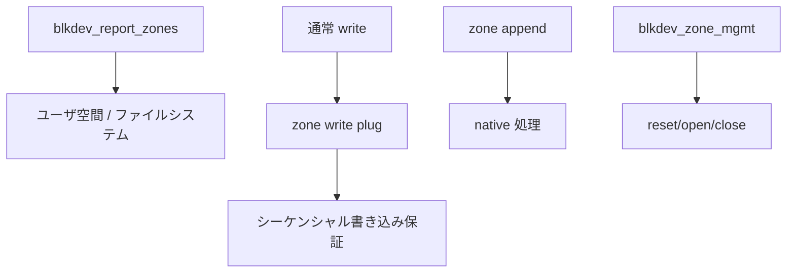

# 第22章 zoned block device

> **本章で読むソース**
>
> - [`block/blk-zoned.c` L160-L179](https://github.com/gregkh/linux/blob/v6.18.38/block/blk-zoned.c#L160-L179)
> - [`block/blk-zoned.c` L206-L233](https://github.com/gregkh/linux/blob/v6.18.38/block/blk-zoned.c#L206-L233)
> - [`block/bio.c` L1700-L1702](https://github.com/gregkh/linux/blob/v6.18.38/block/bio.c#L1700-L1702)
> - [`block/blk-zoned.c` L1097-L1135](https://github.com/gregkh/linux/blob/v6.18.38/block/blk-zoned.c#L1097-L1135)
> - [`block/blk-settings.c` L88-L108](https://github.com/gregkh/linux/blob/v6.18.38/block/blk-settings.c#L88-L108)
> - [`block/blk-zoned.c` L1240-L1252](https://github.com/gregkh/linux/blob/v6.18.38/block/blk-zoned.c#L1240-L1252)

## この章の狙い

**zoned block device** の zone report、zone management、**zone append** の意味論を読む。
通常の read/write や bio split との制約の違いを整理する。

## 前提

- [第3章](../part00-overview/03-queue-limits-bio-split.md) で bio split を読んでいること。

## zone 情報の報告

`blkdev_report_zones` はディスクの `report_zones` 操作を呼び、zone 種別と状態をユーザへ返す。

[`block/blk-zoned.c` L160-L179](https://github.com/gregkh/linux/blob/v6.18.38/block/blk-zoned.c#L160-L179)

```c
int blkdev_report_zones(struct block_device *bdev, sector_t sector,
			unsigned int nr_zones, report_zones_cb cb, void *data)
{
	struct gendisk *disk = bdev->bd_disk;
	sector_t capacity = get_capacity(disk);
	struct disk_report_zones_cb_args args = {
		.disk = disk,
		.user_cb = cb,
		.user_data = data,
	};

	if (!bdev_is_zoned(bdev) || WARN_ON_ONCE(!disk->fops->report_zones))
		return -EOPNOTSUPP;

	if (!nr_zones || sector >= capacity)
		return 0;

	return disk->fops->report_zones(disk, sector, nr_zones,
					disk_report_zones_cb, &args);
}
```

## zone management 操作

reset、open、close、finish などは `blkdev_zone_mgmt` が bio を組み立てて `submit_bio_wait` する。
セクタ範囲は zone 境界に揃っている必要がある。

[`block/blk-zoned.c` L206-L233](https://github.com/gregkh/linux/blob/v6.18.38/block/blk-zoned.c#L206-L233)

```c
int blkdev_zone_mgmt(struct block_device *bdev, enum req_op op,
		     sector_t sector, sector_t nr_sectors)
{
	sector_t zone_sectors = bdev_zone_sectors(bdev);
	sector_t capacity = bdev_nr_sectors(bdev);
	sector_t end_sector = sector + nr_sectors;
	struct bio *bio = NULL;
	int ret = 0;

	if (!bdev_is_zoned(bdev))
		return -EOPNOTSUPP;

	if (bdev_read_only(bdev))
		return -EPERM;

	if (!op_is_zone_mgmt(op))
		return -EOPNOTSUPP;

	if (end_sector <= sector || end_sector > capacity)
		/* Out of range */
		return -EINVAL;

	/* Check alignment (handle eventual smaller last zone) */
	if (!bdev_is_zone_start(bdev, sector))
		return -EINVAL;

	if (!bdev_is_zone_start(bdev, nr_sectors) && end_sector != capacity)
		return -EINVAL;
```

## queue_limits の zoned 検証

`blk_validate_zoned_limits` は `BLK_FEAT_ZONED` と open/active zone 上限の整合を検査する。

[`block/blk-settings.c` L88-L108](https://github.com/gregkh/linux/blob/v6.18.38/block/blk-settings.c#L88-L108)

```c
static int blk_validate_zoned_limits(struct queue_limits *lim)
{
	if (!(lim->features & BLK_FEAT_ZONED)) {
		if (WARN_ON_ONCE(lim->max_open_zones) ||
		    WARN_ON_ONCE(lim->max_active_zones) ||
		    WARN_ON_ONCE(lim->zone_write_granularity) ||
		    WARN_ON_ONCE(lim->max_zone_append_sectors))
			return -EINVAL;
		return 0;
	}

	if (WARN_ON_ONCE(!IS_ENABLED(CONFIG_BLK_DEV_ZONED)))
		return -EINVAL;

	/*
	 * Given that active zones include open zones, the maximum number of
	 * open zones cannot be larger than the maximum number of active zones.
	 */
	if (lim->max_active_zones &&
	    lim->max_open_zones > lim->max_active_zones)
		return -EINVAL;
```

## zone append と split 禁止

`REQ_OP_ZONE_APPEND` は in-place でセクタ位置を決めるため、`bio_split` では分割できない。

[`block/bio.c` L1700-L1702](https://github.com/gregkh/linux/blob/v6.18.38/block/bio.c#L1700-L1702)

```c
	/* Zone append commands cannot be split */
	if (WARN_ON_ONCE(bio_op(bio) == REQ_OP_ZONE_APPEND))
		return ERR_PTR(-EINVAL);
```

## native zone append と write plug

デバイスが native zone append をサポートする場合、既存の zone write plug を除去する。
通常 write と zone append の混在は警告のうえ plug 内 bio を abort する。

[`block/blk-zoned.c` L1097-L1135](https://github.com/gregkh/linux/blob/v6.18.38/block/blk-zoned.c#L1097-L1135)

```c
static void blk_zone_wplug_handle_native_zone_append(struct bio *bio)
{
	struct gendisk *disk = bio->bi_bdev->bd_disk;
	struct blk_zone_wplug *zwplug;
	unsigned long flags;

	/*
	 * We have native support for zone append operations, so we are not
	 * going to handle @bio through plugging. However, we may already have a
	 * zone write plug for the target zone if that zone was previously
	 * partially written using regular writes. In such case, we risk leaving
	 * the plug in the disk hash table if the zone is fully written using
	 * zone append operations. Avoid this by removing the zone write plug.
	 */
	zwplug = disk_get_zone_wplug(disk, bio->bi_iter.bi_sector);
	if (likely(!zwplug))
		return;

	spin_lock_irqsave(&zwplug->lock, flags);

	/*
	 * We are about to remove the zone write plug. But if the user
	 * (mistakenly) has issued regular writes together with native zone
	 * append, we must aborts the writes as otherwise the plugged BIOs would
	 * not be executed by the plug BIO work as disk_get_zone_wplug() will
	 * return NULL after the plug is removed. Aborting the plugged write
	 * BIOs is consistent with the fact that these writes will most likely
	 * fail anyway as there is no ordering guarantees between zone append
	 * operations and regular write operations.
	 */
	if (!bio_list_empty(&zwplug->bio_list)) {
		pr_warn_ratelimited("%s: zone %u: Invalid mix of zone append and regular writes\n",
				    disk->disk_name, zwplug->zone_no);
		disk_zone_wplug_abort(zwplug);
	}
	disk_mark_zone_wplug_dead(zwplug);
	spin_unlock_irqrestore(&zwplug->lock, flags);

	disk_put_zone_wplug(zwplug);
}
```

## request 完了時のセクタ更新

zone append 完了後、実際に書き込まれたセクタへ bio の位置を更新する。

[`block/blk-zoned.c` L1240-L1252](https://github.com/gregkh/linux/blob/v6.18.38/block/blk-zoned.c#L1240-L1252)

```c
void blk_zone_append_update_request_bio(struct request *rq, struct bio *bio)
{
	/*
	 * For zone append requests, the request sector indicates the location
	 * at which the BIO data was written. Return this value to the BIO
	 * issuer through the BIO iter sector.
	 * For plugged zone writes, which include emulated zone append, we need
	 * the original BIO sector so that blk_zone_write_plug_bio_endio() can
	 * lookup the zone write plug.
	 */
	bio->bi_iter.bi_sector = rq->__sector;
	trace_blk_zone_append_update_request_bio(rq);
}
```

## 処理の流れ



## 高速化と最適化の工夫

**zone write plug** は同一 zone への通常 write をまとめ、シーケンシャル書き込み規則を守りつつ merge 機会を増やす。

**native zone append** はデバイス側で書き込み位置を決め、ホストの sector 計算と再試行を省く。

**open/active zone 上限**は `blk_validate_zoned_limits` で queue_limits の整合を検査し、デバイス能力としてユーザ空間へ公開する。
実行時 admission の詳細はドライバ実装に依存するため、本章は limits 検証と report API に限定する。

> **v7.1.3 注記**：本章が引用する範囲では v6.18.38 と v7.1.3 で読解に影響する分岐変更は確認されていない。
> 監査一覧は [README](../README.md#v713-との差分監査) を参照。

## まとめ

zoned デバイスは zone 単位の状態機械と書き込み規則を持ち、report/management/append が専用 API になる。
bio split や通常 merge とは別制約が乗る。
SMR や ZNS NVMe はこの層の上にファイルシステムが載る。

## 関連する章

- [第3章 queue limits と bio split](../part00-overview/03-queue-limits-bio-split.md)
- [第20章 NVMe コントローラのライフサイクル](20-nvme-controller-lifecycle.md)
- [第12章 plug と merge](../part02-iosched/12-plug-merge.md)
