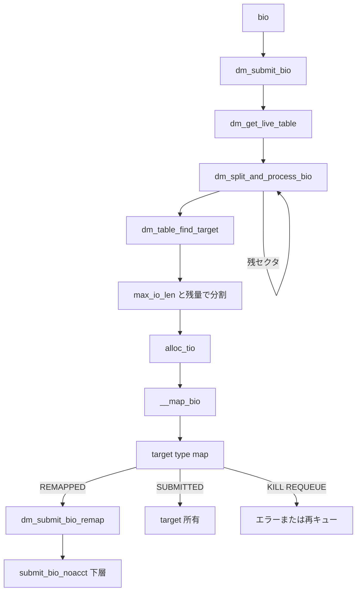

# 第23章 device mapper と dm-table

> **本章で読むソース**
>
> - [`drivers/md/dm.c` L1720-L1761](https://github.com/gregkh/linux/blob/v6.18.38/drivers/md/dm.c#L1720-L1761)
> - [`drivers/md/dm.c` L1396-L1451](https://github.com/gregkh/linux/blob/v6.18.38/drivers/md/dm.c#L1396-L1451)
> - [`drivers/md/dm-core.h` L49-L70](https://github.com/gregkh/linux/blob/v6.18.38/drivers/md/dm-core.h#L49-L70)
> - [`drivers/md/dm-table.c` L686-L724](https://github.com/gregkh/linux/blob/v6.18.38/drivers/md/dm-table.c#L686-L724)
> - [`drivers/md/dm-table.c` L1581-L1598](https://github.com/gregkh/linux/blob/v6.18.38/drivers/md/dm-table.c#L1581-L1598)
> - [`drivers/md/dm.c` L2060-L2087](https://github.com/gregkh/linux/blob/v6.18.38/drivers/md/dm.c#L2060-L2087)
> - [`drivers/md/dm.c` L1357-L1377](https://github.com/gregkh/linux/blob/v6.18.38/drivers/md/dm.c#L1357-L1377)
> - [`block/blk-core.c` L636-L647](https://github.com/gregkh/linux/blob/v6.18.38/block/blk-core.c#L636-L647)

## この章の狙い

**device mapper**（DM）が仮想ブロックデバイスをどう構成し、**dm-table** がセクタ範囲から **target** をどう解決するかを読む。
`dm_submit_bio` から下層デバイスへの再投入までを追う。

## 前提

- [第1章](../part00-overview/01-block-layer-overview.md) で `BD_HAS_SUBMIT_BIO` 経路を読んでいること。

## mapped_device の状態

`mapped_device` は live table への RCU ポインタ、request_queue、suspend 状態を保持する。
`map` は `dm_get_live_table` で読む。

[`drivers/md/dm-core.h` L49-L70](https://github.com/gregkh/linux/blob/v6.18.38/drivers/md/dm-core.h#L49-L70)

```c
struct mapped_device {
	struct mutex suspend_lock;

	struct mutex table_devices_lock;
	struct list_head table_devices;

	/*
	 * The current mapping (struct dm_table *).
	 * Use dm_get_live_table{_fast} or take suspend_lock for
	 * dereference.
	 */
	void __rcu *map;

	unsigned long flags;

	/* Protect queue and type against concurrent access. */
	struct mutex type_lock;
	enum dm_queue_mode type;

	int numa_node_id;
	struct request_queue *queue;

```

`type` は bio-based と request-based（blk-mq）のモードを区別する。

## dm_table_add_target

テーブル構築は target タイプ名、開始セクタ、長さ、パラメータ文字列で行う。
各 target は `dm_target` 配列の1スロットに載る。

[`drivers/md/dm-table.c` L686-L724](https://github.com/gregkh/linux/blob/v6.18.38/drivers/md/dm-table.c#L686-L724)

```c
int dm_table_add_target(struct dm_table *t, const char *type,
			sector_t start, sector_t len, char *params)
{
	int r = -EINVAL, argc;
	char **argv;
	struct dm_target *ti;

	if (t->singleton) {
		DMERR("%s: target type %s must appear alone in table",
		      dm_device_name(t->md), t->targets->type->name);
		return -EINVAL;
	}
	// ... (中略) ...
	}

	if (dm_target_needs_singleton(ti->type)) {
		if (t->num_targets) {
			ti->error = "singleton target type must appear alone in table";
			goto bad;
		}
		t->singleton = true;
```

linear、crypt、thin-pool などが type として登録される。

## セクタから target を引く

`dm_table_find_target` は btree 風インデックスでセクタに対応する `dm_target` を返す。
範囲外は NULL である。

[`drivers/md/dm-table.c` L1581-L1598](https://github.com/gregkh/linux/blob/v6.18.38/drivers/md/dm-table.c#L1581-L1598)

```c
struct dm_target *dm_table_find_target(struct dm_table *t, sector_t sector)
{
	unsigned int l, n = 0, k = 0;
	sector_t *node;

	if (unlikely(sector >= dm_table_get_size(t)))
		return NULL;

	for (l = 0; l < t->depth; l++) {
		n = get_child(n, k);
		node = get_node(t, l, n);

		for (k = 0; k < KEYS_PER_NODE; k++)
			if (node[k] >= sector)
				break;
	}

	return &t->targets[(KEYS_PER_NODE * n) + k];
```

lookup は I/O ホット path で呼ばれるため、木構造で対数時間を狙う。

## dm_submit_bio 入口

DM デバイスは `BD_HAS_SUBMIT_BIO` を立て、`fops->submit_bio` として `dm_submit_bio` を使う。
suspend 中は bio を deferred キューへ載せる。

[`drivers/md/dm.c` L2060-L2087](https://github.com/gregkh/linux/blob/v6.18.38/drivers/md/dm.c#L2060-L2087)

```c
static void dm_submit_bio(struct bio *bio)
{
	struct mapped_device *md = bio->bi_bdev->bd_disk->private_data;
	int srcu_idx;
	struct dm_table *map;

	map = dm_get_live_table(md, &srcu_idx);
	if (unlikely(!map)) {
		DMERR_LIMIT("%s: mapping table unavailable, erroring io",
			    dm_device_name(md));
		bio_io_error(bio);
		goto out;
	}

	/* If suspended, queue this IO for later */
	if (unlikely(test_bit(DMF_BLOCK_IO_FOR_SUSPEND, &md->flags))) {
		if (bio->bi_opf & REQ_NOWAIT)
			bio_wouldblock_error(bio);
		else if (bio->bi_opf & REQ_RAHEAD)
			bio_io_error(bio);
		else
			queue_io(md, bio);
		goto out;
	}

	dm_split_and_process_bio(md, map, bio);
out:
	dm_put_live_table(md, srcu_idx);
```

`dm_split_and_process_bio` がセクタ跨ぎを分割し target へ配送する。
本体は `__split_and_process_bio` が target 解決、分割長計算、clone 確保、`__map_bio` 呼び出しを行う。

## __split_and_process_bio による分割

`dm_table_find_target` でセクタに対応する target を引き、`max_io_len` と残量の min で分割長を決める。
`REQ_ATOMIC` で分割が必要なら拒否し、`alloc_tio` で clone を作って `__map_bio` へ渡す。

[`drivers/md/dm.c` L1720-L1761](https://github.com/gregkh/linux/blob/v6.18.38/drivers/md/dm.c#L1720-L1761)

```c
static blk_status_t __split_and_process_bio(struct clone_info *ci)
{
	struct bio *clone;
	struct dm_target *ti;
	unsigned int len;

	ti = dm_table_find_target(ci->map, ci->sector);
	if (unlikely(!ti))
		return BLK_STS_IOERR;

	if (unlikely(ci->is_abnormal_io))
		return __process_abnormal_io(ci, ti);

	/*
	 * Only support bio polling for normal IO, and the target io is
	 * exactly inside the dm_io instance (verified in dm_poll_dm_io)
	 */
	ci->submit_as_polled = !!(ci->bio->bi_opf & REQ_POLLED);

	len = min_t(sector_t, max_io_len(ti, ci->sector), ci->sector_count);
	if (ci->bio->bi_opf & REQ_ATOMIC && len != ci->sector_count)
		return BLK_STS_IOERR;

	setup_split_accounting(ci, len);

	if (unlikely(ci->bio->bi_opf & REQ_NOWAIT)) {
		if (unlikely(!dm_target_supports_nowait(ti->type)))
			return BLK_STS_NOTSUPP;

		clone = alloc_tio(ci, ti, 0, &len, GFP_NOWAIT);
		if (unlikely(!clone))
			return BLK_STS_AGAIN;
	} else {
		clone = alloc_tio(ci, ti, 0, &len, GFP_NOIO);
	}
	__map_bio(clone);

	ci->sector += len;
	ci->sector_count -= len;

	return BLK_STS_OK;
}
```

残セクタがある間、ループで `__split_and_process_bio` が繰り返される。

## __map_bio と target->map の戻り値

`__map_bio` は `target->type->map` を呼び、戻り値で所有権と再投入を分ける。
`DM_MAPIO_REMAPPED` は `dm_submit_bio_remap`、`DM_MAPIO_SUBMITTED` は target が所有権を取る。

[`drivers/md/dm.c` L1396-L1451](https://github.com/gregkh/linux/blob/v6.18.38/drivers/md/dm.c#L1396-L1451)

```c
static void __map_bio(struct bio *clone)
{
	struct dm_target_io *tio = clone_to_tio(clone);
	struct dm_target *ti = tio->ti;
	struct dm_io *io = tio->io;
	struct mapped_device *md = io->md;
	int r;

	clone->bi_end_io = clone_endio;

	/*
	 * Map the clone.
	 */
	tio->old_sector = clone->bi_iter.bi_sector;

	if (static_branch_unlikely(&swap_bios_enabled) &&
	    unlikely(swap_bios_limit(ti, clone))) {
		int latch = get_swap_bios();

		if (unlikely(latch != md->swap_bios))
			__set_swap_bios_limit(md, latch);
		down(&md->swap_bios_semaphore);
	}

	if (likely(ti->type->map == linear_map))
		r = linear_map(ti, clone);
	else if (ti->type->map == stripe_map)
		r = stripe_map(ti, clone);
	else
		r = ti->type->map(ti, clone);

	switch (r) {
	case DM_MAPIO_SUBMITTED:
		/* target has assumed ownership of this io */
		if (!ti->accounts_remapped_io)
			dm_start_io_acct(io, clone);
		break;
	case DM_MAPIO_REMAPPED:
		dm_submit_bio_remap(clone, NULL);
		break;
	case DM_MAPIO_KILL:
	case DM_MAPIO_REQUEUE:
		if (static_branch_unlikely(&swap_bios_enabled) &&
		    unlikely(swap_bios_limit(ti, clone)))
			up(&md->swap_bios_semaphore);
		free_tio(clone);
		if (r == DM_MAPIO_KILL)
			dm_io_dec_pending(io, BLK_STS_IOERR);
		else
			dm_io_dec_pending(io, BLK_STS_DM_REQUEUE);
		break;
	default:
		DMCRIT("unimplemented target map return value: %d", r);
		BUG();
	}
}
```

> **v7.1.3 注記**：`__map_bio` は [v7.1.3 L1397-L1452](https://github.com/gregkh/linux/blob/v7.1.3/drivers/md/dm.c#L1397-L1452) で本文と同一である。
> `__split_and_process_bio` は周辺で微差がある。

## 下層への再投入

target が bio の所有権を取ったあと `dm_submit_bio_remap` で下層へ `submit_bio_noacct` する。

[`drivers/md/dm.c` L1357-L1377](https://github.com/gregkh/linux/blob/v6.18.38/drivers/md/dm.c#L1357-L1377)

```c
void dm_submit_bio_remap(struct bio *clone, struct bio *tgt_clone)
{
	struct dm_target_io *tio = clone_to_tio(clone);
	struct dm_io *io = tio->io;

	/* establish bio that will get submitted */
	if (!tgt_clone)
		tgt_clone = clone;

	bio_clone_blkg_association(tgt_clone, io->orig_bio);

	/*
	 * Account io->origin_bio to DM dev on behalf of target
	 * that took ownership of IO with DM_MAPIO_SUBMITTED.
	 */
	dm_start_io_acct(io, clone);

	trace_block_bio_remap(tgt_clone, disk_devt(io->md->disk),
			      tio->old_sector);
	submit_bio_noacct(tgt_clone);
}
```

cgroup 課金は remap 前に調整される。

## ブロック層からの分岐

標準 blk-mq デバイスと DM の違いは `__submit_bio` の分岐に現れる。

[`block/blk-core.c` L636-L647](https://github.com/gregkh/linux/blob/v6.18.38/block/blk-core.c#L636-L647)

```c
	if (!bdev_test_flag(bio->bi_bdev, BD_HAS_SUBMIT_BIO)) {
		blk_mq_submit_bio(bio);
	} else if (likely(bio_queue_enter(bio) == 0)) {
		struct gendisk *disk = bio->bi_bdev->bd_disk;
	
		if ((bio->bi_opf & REQ_POLLED) &&
		    !(disk->queue->limits.features & BLK_FEAT_POLL)) {
			bio->bi_status = BLK_STS_NOTSUPP;
			bio_endio(bio);
		} else {
			disk->fops->submit_bio(bio);
		}
```

DM はスタック型ドライバの代表例である。

## 処理の流れ



## 高速化と最適化の工夫

**dm-table の木インデックス**は線形テーブル走査を避け、大容量マッピングでも lookup を一定に近づける。

**bio clone のプール**（`mapped_device` の `bio_set`）は target 変換ごとの割り当てを高速化する。
暗号やミラーで複製が頻繁になる。

**REQ_DM_POLL_LIST と dm_poll_bio** は stacked polling をサポートし、io_uring からの poll 経路を下層まで伝播する。

## まとめ

device mapper は dm-table でセクタ範囲を target に割り当て、仮想 gendisk として I/O を受ける。
`__split_and_process_bio` が分割と clone 生成を行い、`__map_bio` が target map の戻り値で再投入か所有権移譲を決める。
次章では dm-crypt と blk-cgroup QoS を読む。

## 関連する章

- [第24章 dm-crypt と target->map](24-dm-crypt.md)
- [第25章 ブロック統計](25-blk-stats.md)
- [第21章 NVMe の queue_rq](../part04-nvme-zoned/21-nvme-queue-rq-doorbell.md)
