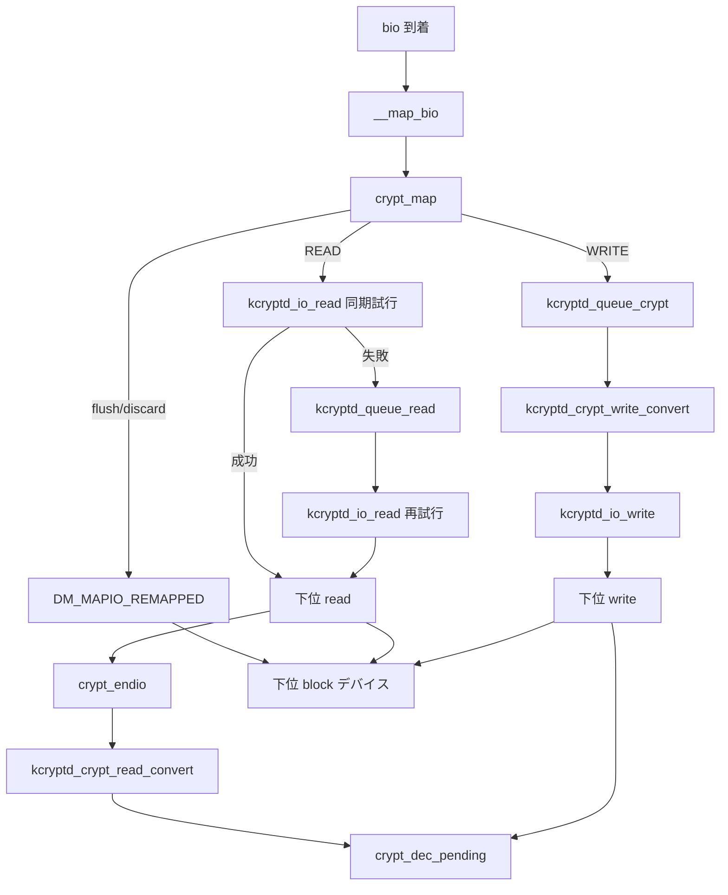

# 第24章 dm-crypt と target->map 契約

> **本章で読むソース**
>
> - [`drivers/md/dm-crypt.c` L3496-L3563](https://github.com/gregkh/linux/blob/v6.18.38/drivers/md/dm-crypt.c#L3496-L3563)
> - [`drivers/md/dm-crypt.c` L3769-L3785](https://github.com/gregkh/linux/blob/v6.18.38/drivers/md/dm-crypt.c#L3769-L3785)
> - [`drivers/md/dm.c` L1396-L1425](https://github.com/gregkh/linux/blob/v6.18.38/drivers/md/dm.c#L1396-L1425)
> - [`drivers/md/dm.c` L1315-L1345](https://github.com/gregkh/linux/blob/v6.18.38/drivers/md/dm.c#L1315-L1345)
> - [`drivers/md/dm-crypt.c` L1867-L1896](https://github.com/gregkh/linux/blob/v6.18.38/drivers/md/dm-crypt.c#L1867-L1896)
> - [`drivers/md/dm-crypt.c` L1900-L1943](https://github.com/gregkh/linux/blob/v6.18.38/drivers/md/dm-crypt.c#L1900-L1943)
> - [`drivers/md/dm-crypt.c` L2207-L2239](https://github.com/gregkh/linux/blob/v6.18.38/drivers/md/dm-crypt.c#L2207-L2239)
> - [`drivers/md/dm-crypt.c` L2116-L2172](https://github.com/gregkh/linux/blob/v6.18.38/drivers/md/dm-crypt.c#L2116-L2172)
> - [`drivers/md/dm-crypt.c` L1964-L1969](https://github.com/gregkh/linux/blob/v6.18.38/drivers/md/dm-crypt.c#L1964-L1969)

## この章の狙い

device mapper の **target->map** 契約を **dm-crypt** で具体化する。
暗号化 bio が下位デバイスへどう remap され、非同期ワーカへ渡るかを読む。

## 前提

- [第23章 device mapper と dm-table](23-device-mapper.md) で `__map_bio` を読んでいること。

## dm_target_ops の map 登録

dm-crypt は `struct dm_target` の `map` に `crypt_map` を登録する。
dm コアは bio 到着時にこの関数を呼ぶ。

[`drivers/md/dm-crypt.c` L3769-L3785](https://github.com/gregkh/linux/blob/v6.18.38/drivers/md/dm-crypt.c#L3769-L3785)

```c
static struct target_type crypt_target = {
	.name   = "crypt",
	.version = {1, 28, 0},
	.module = THIS_MODULE,
	.ctr    = crypt_ctr,
	.dtr    = crypt_dtr,
	.features = DM_TARGET_ZONED_HM,
	.report_zones = crypt_report_zones,
	.map    = crypt_map,
	.status = crypt_status,
	.postsuspend = crypt_postsuspend,
	.preresume = crypt_preresume,
	.resume = crypt_resume,
	.message = crypt_message,
	.iterate_devices = crypt_iterate_devices,
	.io_hints = crypt_io_hints,
};
```

## crypt_map の分岐

flush と discard は暗号化をバイパスし、セクタだけ下位デバイスへシフトする。
通常 I/O は `dm_crypt_io` を確保し、READ は `kcryptd_io_read` を同期試行してから必要なら kcryptd へ逃がす。

[`drivers/md/dm-crypt.c` L3496-L3563](https://github.com/gregkh/linux/blob/v6.18.38/drivers/md/dm-crypt.c#L3496-L3563)

```c
static int crypt_map(struct dm_target *ti, struct bio *bio)
{
	struct dm_crypt_io *io;
	struct crypt_config *cc = ti->private;
	unsigned max_sectors;

	/*
	 * If bio is REQ_PREFLUSH or REQ_OP_DISCARD, just bypass crypt queues.
	 * - for REQ_PREFLUSH device-mapper core ensures that no IO is in-flight
	 * - for REQ_OP_DISCARD caller must use flush if IO ordering matters
	 */
	if (unlikely(bio->bi_opf & REQ_PREFLUSH ||
	    bio_op(bio) == REQ_OP_DISCARD)) {
		bio_set_dev(bio, cc->dev->bdev);
		if (bio_sectors(bio))
			bio->bi_iter.bi_sector = cc->start +
				dm_target_offset(ti, bio->bi_iter.bi_sector);
		return DM_MAPIO_REMAPPED;
	}

	/*
	 * Check if bio is too large, split as needed.
	 */
	max_sectors = get_max_request_sectors(ti, bio);
	if (unlikely(bio_sectors(bio) > max_sectors))
		dm_accept_partial_bio(bio, max_sectors);

	/*
	 * Ensure that bio is a multiple of internal sector encryption size
	 * and is aligned to this size as defined in IO hints.
	 */
	if (unlikely((bio->bi_iter.bi_sector & ((cc->sector_size >> SECTOR_SHIFT) - 1)) != 0))
		return DM_MAPIO_KILL;

	if (unlikely(bio->bi_iter.bi_size & (cc->sector_size - 1)))
		return DM_MAPIO_KILL;

	io = dm_per_bio_data(bio, cc->per_bio_data_size);
	crypt_io_init(io, cc, bio, dm_target_offset(ti, bio->bi_iter.bi_sector));

	// ... (中略) ...

	if (bio_data_dir(io->base_bio) == READ) {
		if (kcryptd_io_read(io, CRYPT_MAP_READ_GFP))
			kcryptd_queue_read(io);
	} else
		kcryptd_queue_crypt(io);

	return DM_MAPIO_SUBMITTED;
}
```

`DM_MAPIO_REMAPPED` は dm コアが即座に下位へ再 submit する。
`DM_MAPIO_SUBMITTED` は target が完了を自分で担当する。

## dm コアの __map_bio

dm コアは clone bio に対し target の `map` を呼び、戻り値で所有権移譲か再帰処理を選ぶ。

[`drivers/md/dm.c` L1396-L1425](https://github.com/gregkh/linux/blob/v6.18.38/drivers/md/dm.c#L1396-L1425)

```c
static void __map_bio(struct bio *clone)
{
	struct dm_target_io *tio = clone_to_tio(clone);
	struct dm_target *ti = tio->ti;
	struct dm_io *io = tio->io;
	struct mapped_device *md = io->md;
	int r;

	clone->bi_end_io = clone_endio;

	/*
	 * Map the clone.
	 */
	tio->old_sector = clone->bi_iter.bi_sector;

	if (static_branch_unlikely(&swap_bios_enabled) &&
	    unlikely(swap_bios_limit(ti, clone))) {
		int latch = get_swap_bios();

		if (unlikely(latch != md->swap_bios))
			__set_swap_bios_limit(md, latch);
		down(&md->swap_bios_semaphore);
	}

	if (likely(ti->type->map == linear_map))
		r = linear_map(ti, clone);
	else if (ti->type->map == stripe_map)
		r = stripe_map(ti, clone);
	else
		r = ti->type->map(ti, clone);
```

## 部分 bio の分割

大きすぎる bio は `dm_accept_partial_bio` で刻み、第3章の split と同様に上限へ合わせる。

[`drivers/md/dm.c` L1315-L1345](https://github.com/gregkh/linux/blob/v6.18.38/drivers/md/dm.c#L1315-L1345)

```c
void dm_accept_partial_bio(struct bio *bio, unsigned int n_sectors)
{
	struct dm_target_io *tio = clone_to_tio(bio);
	struct dm_io *io = tio->io;
	unsigned int bio_sectors = bio_sectors(bio);

	BUG_ON(dm_tio_flagged(tio, DM_TIO_IS_DUPLICATE_BIO));
	BUG_ON(bio_sectors > *tio->len_ptr);
	BUG_ON(n_sectors > bio_sectors);

	if (static_branch_unlikely(&zoned_enabled) &&
	    unlikely(bdev_is_zoned(bio->bi_bdev))) {
		enum req_op op = bio_op(bio);

		BUG_ON(op_is_zone_mgmt(op));
		BUG_ON(op == REQ_OP_WRITE);
		BUG_ON(op == REQ_OP_WRITE_ZEROES);
		BUG_ON(op == REQ_OP_ZONE_APPEND);
	}

	*tio->len_ptr -= bio_sectors - n_sectors;
	bio->bi_iter.bi_size = n_sectors << SECTOR_SHIFT;

	/*
	 * __split_and_process_bio() may have already saved mapped part
	 * for accounting but it is being reduced so update accordingly.
	 */
	dm_io_set_flag(io, DM_IO_WAS_SPLIT);
	io->sectors = n_sectors;
	io->sector_offset = bio_sectors(io->orig_bio);
}
```

## READ 経路

READ はまず下位デバイスから暗号化済みデータを読み、完了後に復号する。
`crypt_map` はまず `kcryptd_io_read(io, CRYPT_MAP_READ_GFP)` を同期試行する。
clone や付随領域を NOWAIT で確保できず非 0 が返れば `kcryptd_queue_read` へ逃がし、work 上で再試行する。
成功時はそのまま下位 read へ進み、`crypt_endio` で READ 成功後に `kcryptd_crypt_read_convert` が復号する。
最後に `crypt_dec_pending` が `bio_endio` で元 bio を完了させる。

[`drivers/md/dm-crypt.c` L1900-L1943](https://github.com/gregkh/linux/blob/v6.18.38/drivers/md/dm-crypt.c#L1900-L1943)

```c
static int kcryptd_io_read(struct dm_crypt_io *io, gfp_t gfp)
{
	struct crypt_config *cc = io->cc;
	struct bio *clone;

	if (io->ctx.aead_recheck) {
		if (!(gfp & __GFP_DIRECT_RECLAIM))
			return 1;
		crypt_inc_pending(io);
		clone = crypt_alloc_buffer(io, io->base_bio->bi_iter.bi_size);
		if (unlikely(!clone)) {
			crypt_dec_pending(io);
			return 1;
		}
		crypt_convert_init(cc, &io->ctx, clone, clone, io->sector);
		io->saved_bi_iter = clone->bi_iter;
		dm_submit_bio_remap(io->base_bio, clone);
		return 0;
	}

	/*
	 * We need the original biovec array in order to decrypt the whole bio
	 * data *afterwards* -- thanks to immutable biovecs we don't need to
	 * worry about the block layer modifying the biovec array; so leverage
	 * bio_alloc_clone().
	 */
	clone = bio_alloc_clone(cc->dev->bdev, io->base_bio, gfp, &cc->bs);
	if (!clone)
		return 1;

	clone->bi_iter.bi_sector = cc->start + io->sector;
	clone->bi_private = io;
	clone->bi_end_io = crypt_endio;

	crypt_inc_pending(io);

	if (dm_crypt_integrity_io_alloc(io, clone)) {
		crypt_dec_pending(io);
		bio_put(clone);
		return 1;
	}

	dm_submit_bio_remap(io->base_bio, clone);
	return 0;
}
```

[`drivers/md/dm-crypt.c` L1867-L1896](https://github.com/gregkh/linux/blob/v6.18.38/drivers/md/dm-crypt.c#L1867-L1896)

```c
static void crypt_endio(struct bio *clone)
{
	struct dm_crypt_io *io = clone->bi_private;
	struct crypt_config *cc = io->cc;
	unsigned int rw = bio_data_dir(clone);
	blk_status_t error = clone->bi_status;

	if (io->ctx.aead_recheck && !error) {
		kcryptd_queue_crypt(io);
		return;
	}

	/*
	 * free the processed pages
	 */
	if (rw == WRITE || io->ctx.aead_recheck)
		crypt_free_buffer_pages(cc, clone);

	bio_put(clone);

	if (rw == READ && !error) {
		kcryptd_queue_crypt(io);
		return;
	}

	if (unlikely(error))
		io->error = error;

	crypt_dec_pending(io);
}
```

[`drivers/md/dm-crypt.c` L2207-L2239](https://github.com/gregkh/linux/blob/v6.18.38/drivers/md/dm-crypt.c#L2207-L2239)

```c
static void kcryptd_crypt_read_convert(struct dm_crypt_io *io)
{
	struct crypt_config *cc = io->cc;
	blk_status_t r;

	crypt_inc_pending(io);

	if (io->ctx.aead_recheck) {
		r = crypt_convert(cc, &io->ctx,
				  test_bit(DM_CRYPT_NO_READ_WORKQUEUE, &cc->flags), true);
	} else {
		crypt_convert_init(cc, &io->ctx, io->base_bio, io->base_bio,
				   io->sector);

		r = crypt_convert(cc, &io->ctx,
				  test_bit(DM_CRYPT_NO_READ_WORKQUEUE, &cc->flags), true);
	}
	/*
	 * Crypto API backlogged the request, because its queue was full
	 * and we're in softirq context, so continue from a workqueue
	 */
	if (r == BLK_STS_DEV_RESOURCE) {
		INIT_WORK(&io->work, kcryptd_crypt_read_continue);
		queue_work(cc->crypt_queue, &io->work);
		return;
	}
	if (r)
		io->error = r;

	if (atomic_dec_and_test(&io->ctx.cc_pending))
		kcryptd_crypt_read_done(io);

	crypt_dec_pending(io);
}
```

## WRITE 経路

WRITE は `kcryptd_queue_crypt` から `kcryptd_crypt_write_convert` で暗号化し、完了後に `kcryptd_io_write` で下位へ submit する。
READ とは順序が逆である。

[`drivers/md/dm-crypt.c` L2116-L2172](https://github.com/gregkh/linux/blob/v6.18.38/drivers/md/dm-crypt.c#L2116-L2172)

```c
static void kcryptd_crypt_write_convert(struct dm_crypt_io *io)
{
	struct crypt_config *cc = io->cc;
	struct convert_context *ctx = &io->ctx;
	struct bio *clone;
	int crypt_finished;
	blk_status_t r;

	/*
	 * Prevent io from disappearing until this function completes.
	 */
	crypt_inc_pending(io);
	crypt_convert_init(cc, ctx, NULL, io->base_bio, io->sector);

	clone = crypt_alloc_buffer(io, io->base_bio->bi_iter.bi_size);
	if (unlikely(!clone)) {
		io->error = BLK_STS_IOERR;
		goto dec;
	}

	io->ctx.bio_out = clone;
	io->ctx.iter_out = clone->bi_iter;

	if (crypt_integrity_aead(cc)) {
		bio_copy_data(clone, io->base_bio);
		io->ctx.bio_in = clone;
		io->ctx.iter_in = clone->bi_iter;
	}

	crypt_inc_pending(io);
	r = crypt_convert(cc, ctx,
			  test_bit(DM_CRYPT_NO_WRITE_WORKQUEUE, &cc->flags), true);
	/*
	 * Crypto API backlogged the request, because its queue was full
	 * and we're in softirq context, so continue from a workqueue
	 * (TODO: is it actually possible to be in softirq in the write path?)
	 */
	if (r == BLK_STS_DEV_RESOURCE) {
		INIT_WORK(&io->work, kcryptd_crypt_write_continue);
		queue_work(cc->crypt_queue, &io->work);
		return;
	}
	if (r)
		io->error = r;
	crypt_finished = atomic_dec_and_test(&ctx->cc_pending);
	if (!crypt_finished && kcryptd_crypt_write_inline(cc, ctx)) {
		/* Wait for completion signaled by kcryptd_async_done() */
		wait_for_completion(&ctx->restart);
		crypt_finished = 1;
	}

	/* Encryption was already finished, submit io now */
	if (crypt_finished)
		kcryptd_crypt_write_io_submit(io, 0);

dec:
	crypt_dec_pending(io);
```

[`drivers/md/dm-crypt.c` L1964-L1969](https://github.com/gregkh/linux/blob/v6.18.38/drivers/md/dm-crypt.c#L1964-L1969)

```c
static void kcryptd_io_write(struct dm_crypt_io *io)
{
	struct bio *clone = io->ctx.bio_out;

	dm_submit_bio_remap(io->base_bio, clone);
}
```

## 処理の流れ



## 高速化と最適化の工夫

**kcryptd ワーカプール**は暗号処理を submit コンテキストから切り離し、ブロック層のロック保持時間を短くする。

**per-bio の `dm_crypt_io` 埋め込み**（`dm_per_bio_data`）は追加 alloc を避け、bio サイズに応じた private 領域を再利用する。

**部分 bio 受容**（`dm_accept_partial_bio`）は暗号ブロックサイズと下位 `max_sectors` の両方を満たすよう刻む。

dm-thin など他 target も同じ `map` 契約に従うが、本章は dm-crypt を代表例とする。

> **v7.1.3 注記**：`crypt_map` は [v7.1.3 `drivers/md/dm-crypt.c` L3417-L3484](https://github.com/gregkh/linux/blob/v7.1.3/drivers/md/dm-crypt.c#L3417-L3484) でも READ/WRITE 分岐と `DM_MAPIO_*` 契約は同一である。
> zoned デバイス向けに `no_split` フラグと分割回避コメントが追加されている。
> read/write の kcryptd 経路は本章の説明どおり維持される。

## まとめ

dm-crypt の `crypt_map` は flush/discard を透過 remap し、データ I/O を kcryptd 経由で暗号化する。
戻り値 `DM_MAPIO_*` が dm コアの次動作を決める代表例である。
第23章の抽象 table 走査が、ここで暗号化スタックとして具体化される。

## 関連する章

- [第23章 device mapper と dm-table](23-device-mapper.md)
- [第3章 queue limits と bio split](../part00-overview/03-queue-limits-bio-split.md)
