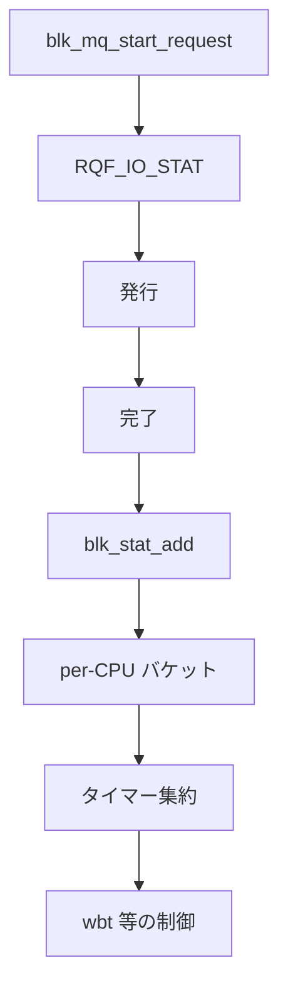

# 第25章 ブロック統計

> **本章で読むソース**
>
> - [`block/blk-stat.c` L50-L75](https://github.com/gregkh/linux/blob/v6.18.38/block/blk-stat.c#L50-L75)
> - [`block/blk-stat.c` L99-L110](https://github.com/gregkh/linux/blob/v6.18.38/block/blk-stat.c#L99-L110)
> - [`block/blk-mq.c` L1104-L1137](https://github.com/gregkh/linux/blob/v6.18.38/block/blk-mq.c#L1104-L1137)
> - [`include/linux/blk_types.h` L495-L501](https://github.com/gregkh/linux/blob/v6.18.38/include/linux/blk_types.h#L495-L501)
> - [`block/blk-stat.c` L77-L96](https://github.com/gregkh/linux/blob/v6.18.38/block/blk-stat.c#L77-L96)
> - [`block/blk-stat.c` L42-L48](https://github.com/gregkh/linux/blob/v6.18.38/block/blk-stat.c#L42-L48)
> - [`block/blk-wbt.c` L423-L448](https://github.com/gregkh/linux/blob/v6.18.38/block/blk-wbt.c#L423-L448)

## この章の狙い

ブロック層の **統計**（レイテンシ分布、パーティションカウンタ）が完了経路のどこで更新されるかを読む。
throttling や cgroup QoS は第26章で扱う。

## 前提

- [第1章](../part00-overview/01-block-layer-overview.md) で submit 入口を読んでいること。
- [第8章](../part01-blk-mq/08-blk-mq-completion-poll.md) で完了経路を読んでいること。

## blk_stat_add

完了時に request のサービス時間をバケットへ加算する。
コールバックは per-CPU 統計を持ち、タイマーで集約する。

[`block/blk-stat.c` L50-L75](https://github.com/gregkh/linux/blob/v6.18.38/block/blk-stat.c#L50-L75)

```c
void blk_stat_add(struct request *rq, u64 now)
{
	struct request_queue *q = rq->q;
	struct blk_stat_callback *cb;
	struct blk_rq_stat *stat;
	int bucket, cpu;
	u64 value;

	value = (now >= rq->io_start_time_ns) ? now - rq->io_start_time_ns : 0;

	rcu_read_lock();
	cpu = get_cpu();
	list_for_each_entry_rcu(cb, &q->stats->callbacks, list) {
		if (!blk_stat_is_active(cb))
			continue;

		bucket = cb->bucket_fn(rq);
		if (bucket < 0)
			continue;

		stat = &per_cpu_ptr(cb->cpu_stat, cpu)[bucket];
		blk_rq_stat_add(stat, value);
	}
	put_cpu();
	rcu_read_unlock();
}
```

wbt（write back throttling）などがコールバックとして登録される。

## コールバック登録

`blk_stat_alloc_callback` はタイマー集約関数とバケット関数を受け取る。

[`block/blk-stat.c` L99-L110](https://github.com/gregkh/linux/blob/v6.18.38/block/blk-stat.c#L99-L110)

```c
struct blk_stat_callback *
blk_stat_alloc_callback(void (*timer_fn)(struct blk_stat_callback *),
			int (*bucket_fn)(const struct request *),
			unsigned int buckets, void *data)
{
	struct blk_stat_callback *cb;

	cb = kmalloc(sizeof(*cb), GFP_KERNEL);
	if (!cb)
		return NULL;

	cb->stat = kmalloc_array(buckets, sizeof(struct blk_rq_stat),
```

## 完了経路での統計呼び出し

`__blk_mq_end_request_acct` は `RQF_STATS` が立つ request で `blk_stat_add` を呼ぶ。
発行時の `blk_account_io_start` が `RQF_IO_STAT` と開始時刻を記録する。

[`block/blk-mq.c` L1104-L1137](https://github.com/gregkh/linux/blob/v6.18.38/block/blk-mq.c#L1104-L1137)

```c
static inline void blk_account_io_start(struct request *req)
{
	trace_block_io_start(req);

	if (!blk_queue_io_stat(req->q))
		return;
	if (blk_rq_is_passthrough(req) && !blk_rq_passthrough_stats(req))
		return;

	req->rq_flags |= RQF_IO_STAT;
	req->start_time_ns = blk_time_get_ns();

	/*
	 * All non-passthrough requests are created from a bio with one
	 * exception: when a flush command that is part of a flush sequence
	 * generated by the state machine in blk-flush.c is cloned onto the
	 * lower device by dm-multipath we can get here without a bio.
	 */
	if (req->bio)
		req->part = req->bio->bi_bdev;
	else
		req->part = req->q->disk->part0;

	part_stat_lock();
	update_io_ticks(req->part, jiffies, false);
	part_stat_local_inc(req->part, in_flight[op_is_write(req_op(req))]);
	part_stat_unlock();
}

static inline void __blk_mq_end_request_acct(struct request *rq, u64 now)
{
	if (rq->rq_flags & RQF_STATS)
		blk_stat_add(rq, now);
```

## blk_rq_stat のバケット

各バケットは `mean`、`min`、`max`、`nr_samples`、`batch` を持つ。
`blk_rq_stat_add` が per-CPU サンプルを `batch` に加算し、`blk_rq_stat_sum` が `mean` と `nr_samples` を集約する。

[`include/linux/blk_types.h` L495-L501](https://github.com/gregkh/linux/blob/v6.18.38/include/linux/blk_types.h#L495-L501)

```c
struct blk_rq_stat {
	u64 mean;
	u64 min;
	u64 max;
	u32 nr_samples;
	u64 batch;
};
```

[`block/blk-stat.c` L42-L48](https://github.com/gregkh/linux/blob/v6.18.38/block/blk-stat.c#L42-L48)

```c
void blk_rq_stat_add(struct blk_rq_stat *stat, u64 value)
{
	stat->min = min(stat->min, value);
	stat->max = max(stat->max, value);
	stat->batch += value;
	stat->nr_samples++;
}
```

## タイマー集約

`blk_stat_timer_fn` は per-CPU サンプルをまとめ、登録済み `timer_fn` を呼ぶ。

[`block/blk-stat.c` L77-L96](https://github.com/gregkh/linux/blob/v6.18.38/block/blk-stat.c#L77-L96)

```c
static void blk_stat_timer_fn(struct timer_list *t)
{
	struct blk_stat_callback *cb = timer_container_of(cb, t, timer);
	unsigned int bucket;
	int cpu;

	for (bucket = 0; bucket < cb->buckets; bucket++)
		blk_rq_stat_init(&cb->stat[bucket]);

	for_each_online_cpu(cpu) {
		struct blk_rq_stat *cpu_stat;

		cpu_stat = per_cpu_ptr(cb->cpu_stat, cpu);
		for (bucket = 0; bucket < cb->buckets; bucket++) {
			blk_rq_stat_sum(&cb->stat[bucket], &cpu_stat[bucket]);
			blk_rq_stat_init(&cpu_stat[bucket]);
		}
	}

	cb->timer_fn(cb);
}
```

## wbt との接続例

write back throttling は blk_stat コールバックとしてレイテンシを監視する。

[`block/blk-wbt.c` L423-L448](https://github.com/gregkh/linux/blob/v6.18.38/block/blk-wbt.c#L423-L448)

```c
static void wb_timer_fn(struct blk_stat_callback *cb)
{
	struct rq_wb *rwb = cb->data;
	struct rq_depth *rqd = &rwb->rq_depth;
	unsigned int inflight = wbt_inflight(rwb);
	int status;

	if (!rwb->rqos.disk)
		return;

	status = latency_exceeded(rwb, cb->stat);

	trace_wbt_timer(rwb->rqos.disk->bdi, status, rqd->scale_step, inflight);

	/*
	 * If we exceeded the latency target, step down. If we did not,
	 * step one level up. If we don't know enough to say either exceeded
	 * or ok, then don't do anything.
	 */
	switch (status) {
	case LAT_EXCEEDED:
		scale_down(rwb, true);
		break;
	case LAT_OK:
		scale_up(rwb);
		break;
```

## 処理の流れ



## 高速化と最適化の工夫

**per-CPU blk_stat** は完了 IRQ や softirq からロック競合なくサンプルを積む。
タイマーでまとめて読むため、読み取り側のコストを下げる。

**バケット関数のプラグイン化**は wbt など用途ごとにヒストグラム粒度を変え、キュー共通の完了 path を増やさない。

**part_stat のローカルカウンタ**は `/proc/diskstats` 用の in-flight 計測を per-CPU で行い、グローバルロックを避ける。

> **v7.1.3 注記**：本章が引用する範囲では v6.18.38 と v7.1.3 で読解に影響する分岐変更は確認されていない。
> 監査一覧は [README](../README.md#v713-との差分監査) を参照。

## まとめ

ブロック統計は request 完了時間を per-CPU で収集し、タイマーで集約する。
パーティション統計は発行と完了の両方で更新される。
帯域制限や cgroup QoS は第26章で読む。

## 関連する章

- [第8章 完了処理、IRQ、polling](../part01-blk-mq/08-blk-mq-completion-poll.md)
- [第26章 blk-cgroup QoS](26-blk-cgroup-qos.md)
- [VFS 分冊 writeback](../../vfs/part05-writeback/17-writeback-bdi-kthread.md)
