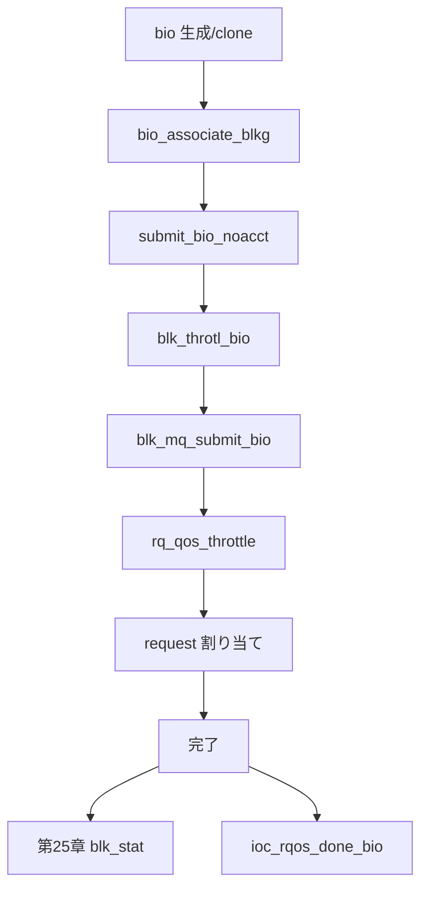

# 第26章 blk-cgroup QoS

> **本章で読むソース**
>
> - [`block/blk-throttle.h` L196-L205](https://github.com/gregkh/linux/blob/v6.18.38/block/blk-throttle.h#L196-L205)
> - [`block/blk-throttle.c` L1742-L1784](https://github.com/gregkh/linux/blob/v6.18.38/block/blk-throttle.c#L1742-L1784)
> - [`block/blk-iocost.c` L2608-L2644](https://github.com/gregkh/linux/blob/v6.18.38/block/blk-iocost.c#L2608-L2644)
> - [`block/blk-iocost.c` L1268-L1319](https://github.com/gregkh/linux/blob/v6.18.38/block/blk-iocost.c#L1268-L1319)
> - [`block/blk-iocost.c` L2721-L2739](https://github.com/gregkh/linux/blob/v6.18.38/block/blk-iocost.c#L2721-L2739)
> - [`block/blk-iocost.c` L2396-L2442](https://github.com/gregkh/linux/blob/v6.18.38/block/blk-iocost.c#L2396-L2442)
> - [`block/blk-iocost.c` L1014-L1038](https://github.com/gregkh/linux/blob/v6.18.38/block/blk-iocost.c#L1014-L1038)
> - [`block/blk-iolatency.c` L463-L486](https://github.com/gregkh/linux/blob/v6.18.38/block/blk-iolatency.c#L463-L486)
> - [`block/blk-cgroup.c` L2164-L2174](https://github.com/gregkh/linux/blob/v6.18.38/block/blk-cgroup.c#L2164-L2174)
> - [`block/blk-rq-qos.c` L62-L68](https://github.com/gregkh/linux/blob/v6.18.38/block/blk-rq-qos.c#L62-L68)
> - [`block/blk-mq.c` L3043-L3053](https://github.com/gregkh/linux/blob/v6.18.38/block/blk-mq.c#L3043-L3053)

## この章の狙い

**blk-cgroup** ポリシー（throttle、iolatency、iocost）が bio と request へどう課されるかを読む。
cgroup 階層の一般論は cgroup 分冊の担当であり、本章はブロック層の policy 実装に限定する。

## 前提

- [第1章](../part00-overview/01-block-layer-overview.md) で `blk_throtl_bio` 入口を読んでいること。
- [第25章](25-blk-stats.md) で完了統計を読んでいること。

## submit 入口の blk_throtl_bio

`blk_throtl_bio` はキューで throttling が有効なときだけ `__blk_throtl_bio` を呼ぶ。

[`block/blk-throttle.h` L196-L205](https://github.com/gregkh/linux/blob/v6.18.38/block/blk-throttle.h#L196-L205)

```c
static inline bool blk_throtl_bio(struct bio *bio)
{
	/*
	 * block throttling takes effect if the policy is activated
	 * in the bio's request_queue.
	 */
	if (!blk_should_throtl(bio))
		return false;

	return __blk_throtl_bio(bio);
```

## BPS/IOPS スライス課金

`__blk_throtl_bio` は cgroup ごとの BPS/IOPS 上限を検査する。
上限内なら課金して通過、超過なら throtl キューへ載せる。

[`block/blk-throttle.c` L1742-L1784](https://github.com/gregkh/linux/blob/v6.18.38/block/blk-throttle.c#L1742-L1784)

```c
bool __blk_throtl_bio(struct bio *bio)
{
	struct request_queue *q = bdev_get_queue(bio->bi_bdev);
	struct blkcg_gq *blkg = bio->bi_blkg;
	struct throtl_qnode *qn = NULL;
	struct throtl_grp *tg = blkg_to_tg(blkg);
	struct throtl_service_queue *sq;
	bool rw = bio_data_dir(bio);
	bool throttled = false;
	struct throtl_data *td = tg->td;

	rcu_read_lock();
	// ... (中略) ...
			 * dispatched directly, even if they're over limit.
			 *
			 * Charge and dispatch directly, and our throttle
			 * control algorithm is adaptive, and extra IO bytes
			 * will be throttled for paying the debt
			 */
			throtl_charge_bps_bio(tg, bio);
			throtl_charge_iops_bio(tg, bio);
```

## iocost の仮想時間

iocost は cgroup ごとに `vtime` と `done_vtime` を持ち、デバイス側の `vnow` と比較して予算を配分する。
`iocg_activate` で cgroup を active リストへ載せ、目標予算 `vtarget` を `vtime` へ反映する。
`ioc_rqos_throttle` は cost を計算し、`vtime + cost` が `vnow` を超えると `waitq` で待機する。
完了時は `ioc_rqos_done_bio` が `bi_iocost_cost` を `done_vtime` へ加算する。

[`block/blk-iocost.c` L1268-L1319](https://github.com/gregkh/linux/blob/v6.18.38/block/blk-iocost.c#L1268-L1319)

```c
static bool iocg_activate(struct ioc_gq *iocg, struct ioc_now *now)
{
	struct ioc *ioc = iocg->ioc;
	u64 __maybe_unused last_period, cur_period;
	u64 vtime, vtarget;
	int i;

	/*
	 * If seem to be already active, just update the stamp to tell the
	 * timer that we're still active.  We don't mind occassional races.
	 */
	if (!list_empty(&iocg->active_list)) {
		ioc_now(ioc, now);
		cur_period = atomic64_read(&ioc->cur_period);
		if (atomic64_read(&iocg->active_period) != cur_period)
			atomic64_set(&iocg->active_period, cur_period);
		return true;
	}

	/* racy check on internal node IOs, treat as root level IOs */
	if (iocg->child_active_sum)
		return false;

	spin_lock_irq(&ioc->lock);

	ioc_now(ioc, now);

	/* update period */
	cur_period = atomic64_read(&ioc->cur_period);
	last_period = atomic64_read(&iocg->active_period);
	atomic64_set(&iocg->active_period, cur_period);

	// ... (中略) ...

	/*
	 * Always start with the target budget. On deactivation, we throw away
	 * anything above it.
	 */
	vtarget = now->vnow - ioc->margins.target;
	vtime = atomic64_read(&iocg->vtime);

	atomic64_add(vtarget - vtime, &iocg->vtime);
	atomic64_add(vtarget - vtime, &iocg->done_vtime);
	vtime = vtarget;
```

[`block/blk-iocost.c` L2608-L2644](https://github.com/gregkh/linux/blob/v6.18.38/block/blk-iocost.c#L2608-L2644)

```c
static void ioc_rqos_throttle(struct rq_qos *rqos, struct bio *bio)
{
	struct blkcg_gq *blkg = bio->bi_blkg;
	struct ioc *ioc = rqos_to_ioc(rqos);
	struct ioc_gq *iocg = blkg_to_iocg(blkg);
	struct ioc_now now;
	struct iocg_wait wait;
	u64 abs_cost, cost, vtime;
	bool use_debt, ioc_locked;
	unsigned long flags;

	/* bypass IOs if disabled, still initializing, or for root cgroup */
	if (!ioc->enabled || !iocg || !iocg->level)
		return;

	/* calculate the absolute vtime cost */
	abs_cost = calc_vtime_cost(bio, iocg, false);
	if (!abs_cost)
		return;

	if (!iocg_activate(iocg, &now))
		return;

	iocg->cursor = bio_end_sector(bio);
	vtime = atomic64_read(&iocg->vtime);
	cost = adjust_inuse_and_calc_cost(iocg, vtime, abs_cost, &now);

	/*
	 * If no one's waiting and within budget, issue right away.  The
	 * tests are racy but the races aren't systemic - we only miss once
	 * in a while which is fine.
	 */
	if (!waitqueue_active(&iocg->waitq) && !iocg->abs_vdebt &&
	    time_before_eq64(vtime + cost, now.vnow)) {
		iocg_commit_bio(iocg, bio, abs_cost, cost);
		return;
	}
```

予算超過時は `iocg->waitq` へ載せ、`iocg_kick_waitq` が起床タイマーを起動する。
issuer は `TASK_UNINTERRUPTIBLE` で `io_schedule` し、`wait.committed` が立つまで待つ。

[`block/blk-iocost.c` L2721-L2739](https://github.com/gregkh/linux/blob/v6.18.38/block/blk-iocost.c#L2721-L2739)

```c
	init_wait_func(&wait.wait, iocg_wake_fn);
	wait.bio = bio;
	wait.abs_cost = abs_cost;
	wait.committed = false;	/* will be set true by waker */

	__add_wait_queue_entry_tail(&iocg->waitq, &wait.wait);
	iocg_kick_waitq(iocg, ioc_locked, &now);

	iocg_unlock(iocg, ioc_locked, &flags);

	while (true) {
		set_current_state(TASK_UNINTERRUPTIBLE);
		if (wait.committed)
			break;
		io_schedule();
	}

	/* waker already committed us, proceed */
	finish_wait(&iocg->waitq, &wait.wait);
```

period タイマー `ioc_timer_fn` はレイテンシ欠落と待ち行列混雑から `busy_level` を更新し、`ioc_adjust_base_vrate` で `vtime_base_rate` を上下する。

[`block/blk-iocost.c` L2396-L2442](https://github.com/gregkh/linux/blob/v6.18.38/block/blk-iocost.c#L2396-L2442)

```c
	/*
	 * If q is getting clogged or we're missing too much, we're issuing
	 * too much IO and should lower vtime rate.  If we're not missing
	 * and experiencing shortages but not surpluses, we're too stingy
	 * and should increase vtime rate.
	 */
	prev_busy_level = ioc->busy_level;
	if (rq_wait_pct > RQ_WAIT_BUSY_PCT ||
	    missed_ppm[READ] > ppm_rthr ||
	    missed_ppm[WRITE] > ppm_wthr) {
		/* clearly missing QoS targets, slow down vrate */
		ioc->busy_level = max(ioc->busy_level, 0);
		ioc->busy_level++;
	} else if (rq_wait_pct <= RQ_WAIT_BUSY_PCT * UNBUSY_THR_PCT / 100 &&
		   missed_ppm[READ] <= ppm_rthr * UNBUSY_THR_PCT / 100 &&
		   missed_ppm[WRITE] <= ppm_wthr * UNBUSY_THR_PCT / 100) {
		/* QoS targets are being met with >25% margin */
		if (nr_shortages) {
			/*
			 * We're throttling while the device has spare
			 * capacity.  If vrate was being slowed down, stop.
			 */
			ioc->busy_level = min(ioc->busy_level, 0);

			/*
			 * If there are IOs spanning multiple periods, wait
			 * them out before pushing the device harder.
			 */
			if (!nr_lagging)
				ioc->busy_level--;
		} else {
			/*
			 * Nobody is being throttled and the users aren't
			 * issuing enough IOs to saturate the device.  We
			 * simply don't know how close the device is to
			 * saturation.  Coast.
			 */
			ioc->busy_level = 0;
		}
	} else {
		/* inside the hysterisis margin, we're good */
		ioc->busy_level = 0;
	}

	ioc->busy_level = clamp(ioc->busy_level, -1000, 1000);

	ioc_adjust_base_vrate(ioc, rq_wait_pct, nr_lagging, nr_shortages,
			      prev_busy_level, missed_ppm);
```

[`block/blk-iocost.c` L1014-L1038](https://github.com/gregkh/linux/blob/v6.18.38/block/blk-iocost.c#L1014-L1038)

```c
	if (vrate < vrate_min) {
		vrate = div64_u64(vrate * (100 + VRATE_CLAMP_ADJ_PCT), 100);
		vrate = min(vrate, vrate_min);
	} else if (vrate > vrate_max) {
		vrate = div64_u64(vrate * (100 - VRATE_CLAMP_ADJ_PCT), 100);
		vrate = max(vrate, vrate_max);
	} else {
		int idx = min_t(int, abs(ioc->busy_level),
				ARRAY_SIZE(vrate_adj_pct) - 1);
		u32 adj_pct = vrate_adj_pct[idx];

		if (ioc->busy_level > 0)
			adj_pct = 100 - adj_pct;
		else
			adj_pct = 100 + adj_pct;

		vrate = clamp(DIV64_U64_ROUND_UP(vrate * adj_pct, 100),
			      vrate_min, vrate_max);
	}

	trace_iocost_ioc_vrate_adj(ioc, vrate, missed_ppm, rq_wait_pct,
				   nr_lagging, nr_shortages);

	ioc->vtime_base_rate = vrate;
	ioc_refresh_margins(ioc);
```

`iocg_commit_bio` は通過 bio に `bi_iocost_cost` を記録し `vtime` を進める。

[`block/blk-iocost.c` L717-L728](https://github.com/gregkh/linux/blob/v6.18.38/block/blk-iocost.c#L717-L728)

```c
static void iocg_commit_bio(struct ioc_gq *iocg, struct bio *bio,
			    u64 abs_cost, u64 cost)
{
	struct iocg_pcpu_stat *gcs;

	bio->bi_iocost_cost = cost;
	atomic64_add(cost, &iocg->vtime);

	gcs = get_cpu_ptr(iocg->pcpu_stat);
	local64_add(abs_cost, &gcs->abs_vusage);
	put_cpu_ptr(gcs);
}
```

[`block/blk-iocost.c` L2801-L2807](https://github.com/gregkh/linux/blob/v6.18.38/block/blk-iocost.c#L2801-L2807)

```c
static void ioc_rqos_done_bio(struct rq_qos *rqos, struct bio *bio)
{
	struct ioc_gq *iocg = blkg_to_iocg(bio->bi_blkg);

	if (iocg && bio->bi_iocost_cost)
		atomic64_add(bio->bi_iocost_cost, &iocg->done_vtime);
}
```

iocost は period タイマーが `vrate` を更新し、デバイス能力変動へ追従する。
固定 BPS より混雑時の比例公平を表現する。

## iolatency の throttle

iolatency は cgroup 階層を遡り、目標レイテンシ超過時に scale cookie を調整する。
`rq_qos` の `throttle` フックから呼ばれる。

[`block/blk-iolatency.c` L463-L486](https://github.com/gregkh/linux/blob/v6.18.38/block/blk-iolatency.c#L463-L486)

```c
static void blkcg_iolatency_throttle(struct rq_qos *rqos, struct bio *bio)
{
	struct blk_iolatency *blkiolat = BLKIOLATENCY(rqos);
	struct blkcg_gq *blkg = bio->bi_blkg;
	bool issue_as_root = bio_issue_as_root_blkg(bio);

	if (!blkiolat->enabled)
		return;

	while (blkg && blkg->parent) {
		struct iolatency_grp *iolat = blkg_to_lat(blkg);
		if (!iolat) {
			blkg = blkg->parent;
			continue;
		}

		check_scale_change(iolat);
		__blkcg_iolatency_throttle(rqos, iolat, issue_as_root,
				     (bio->bi_opf & REQ_SWAP) == REQ_SWAP);
		blkg = blkg->parent;
	}
	if (!timer_pending(&blkiolat->timer))
		mod_timer(&blkiolat->timer, jiffies + HZ);
}
```

## blkcg_gq と bio への blkg 付与

bio は生成または clone 時に `bio_associate_blkg` で所属 cgroup の `bi_blkg` が設定される。
`__blk_throtl_bio` は開始直後から `bio->bi_blkg` を参照するため、throttle より後に付与する順序は成立しない。

[`block/blk-cgroup.c` L2164-L2174](https://github.com/gregkh/linux/blob/v6.18.38/block/blk-cgroup.c#L2164-L2174)

```c
void bio_associate_blkg(struct bio *bio)
{
	struct cgroup_subsys_state *css;

	if (blk_op_is_passthrough(bio->bi_opf))
		return;

	rcu_read_lock();

	if (bio->bi_blkg)
		css = bio_blkcg_css(bio);
```

## rq_qos チェーン

`__rq_qos_throttle` はキューにぶら下がった policy を順に呼ぶ。
iocost と iolatency は `throttle` フックを実装する。

[`block/blk-rq-qos.c` L62-L68](https://github.com/gregkh/linux/blob/v6.18.38/block/blk-rq-qos.c#L62-L68)

```c
void __rq_qos_throttle(struct rq_qos *rqos, struct bio *bio)
{
	do {
		if (rqos->ops->throttle)
			rqos->ops->throttle(rqos, bio);
		rqos = rqos->next;
	} while (rqos);
```

request 割り当て前に `blk_mq_submit_bio` 内で `rq_qos_throttle` が呼ばれる。

[`block/blk-mq.c` L3043-L3053](https://github.com/gregkh/linux/blob/v6.18.38/block/blk-mq.c#L3043-L3053)

```c
	rq_qos_throttle(q, bio);

	if (plug) {
		data.nr_tags = plug->nr_ios;
		plug->nr_ios = 1;
		data.cached_rqs = &plug->cached_rqs;
	}

	rq = __blk_mq_alloc_requests(&data);
	if (unlikely(!rq))
		rq_qos_cleanup(q, bio);
```

## 制御層の位置



## 高速化と最適化の工夫

**スライスベースの blk-throttle**（`throtl_trim_slice`）はバーストを許しつつ長期平均を守る。
完全な硬い制限よりスループットとのバランスを取る。

**iocost の仮想時間モデル**は `vtime` と `done_vtime` の差分で未精算コストを追い、period タイマーが `vrate` を更新してデバイス能力変動へ追従する。

**iolatency の scale cookie**はレイテンシ悪化時に cgroup へ課す重みを動的に下げ、目標レイテンシへ収束させる。

> **v7.1.3 注記**：本章が引用する範囲では v6.18.38 と v7.1.3 で読解に影響する分岐変更は確認されていない。
> 監査一覧は [README](../README.md#v713-との差分監査) を参照。

## まとめ

blk-cgroup QoS は submit 入口の `blk_throtl_bio` と、`blk_mq_submit_bio` 内の `rq_qos_throttle` の両方から bio/request に介入する。
throttle は BPS/IOPS、iocost は仮想時間、iolatency はレイテンシ目標で制御する。
統計収集は第25章、スケジューラは第2部と独立したレイヤである。

## 関連する章

- [第25章 ブロック統計](25-blk-stats.md)
- [第11章 BFQ 概観](../part02-iosched/11-bfq-overview.md)
- [第1章 ブロック層の全体像](../part00-overview/01-block-layer-overview.md)
