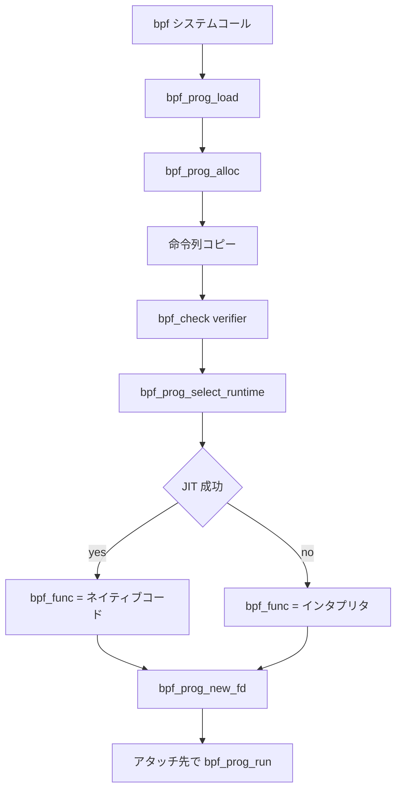

# 第1章 BPF サブシステムの全体像

> **本章で読むソース**
>
> - [`include/linux/bpf.h` L1715-L1751](https://github.com/gregkh/linux/blob/v6.18.38/include/linux/bpf.h#L1715-L1751)
> - [`include/uapi/linux/bpf.h` L1040-L1075](https://github.com/gregkh/linux/blob/v6.18.38/include/uapi/linux/bpf.h#L1040-L1075)
> - [`kernel/bpf/core.c` L99-L145](https://github.com/gregkh/linux/blob/v6.18.38/kernel/bpf/core.c#L99-L145)
> - [`kernel/bpf/core.c` L2495-L2559](https://github.com/gregkh/linux/blob/v6.18.38/kernel/bpf/core.c#L2495-L2559)
> - [`include/linux/filter.h` L728-L731](https://github.com/gregkh/linux/blob/v6.18.38/include/linux/filter.h#L728-L731)
> - [`kernel/bpf/syscall.c` L3078-L3093](https://github.com/gregkh/linux/blob/v6.18.38/kernel/bpf/syscall.c#L3078-L3093)

## この章の狙い

**BPF**（Berkeley Packet Filter の拡張である extended BPF）がカーネル内でどのディレクトリとデータ構造に分解されているかを概観する。
`bpf_prog` のロードから verifier、実行時選択、ホットパスでの `bpf_prog_run` までの主経路を地図として押さえ、後続章で各機構を深掘りする。

## 前提

- [全体像と横断基盤](../../foundation/README.md) でシステムコール入口を読んでいること。
- [同期と RCU](../../locking/part04-rcu/12-rcu-basics.md) で RCU の読み取り側契約を知っていること（map 参照で再利用する）。

## ソースツリー上の配置

BPF 関連の実装は主に次の3か所に分かれる。

- `kernel/bpf/`：システムコール、verifier、インタプリタ、map 実装、BTF、helpers
- `kernel/trace/`：ftrace、ring buffer、trace event、`bpf_trace.c` による BPF アタッチ
- `arch/x86/net/bpf_jit_comp.c`：x86-64 向け JIT（他アーキテクチャにも同名ファイルがある）

トレーシング基盤のうち kprobes は `kernel/kprobes.c`、perf との接点は `kernel/events/core.c` にある。
本分冊の第5部でこれらを個別に追う。

## bpf_prog の中心フィールド

カーネル内でロードされた BPF プログラムは `struct bpf_prog` に格納される。
型、命令列、実行関数ポインタ、補助メタデータが1つの塊として管理される。

[`include/linux/bpf.h` L1715-L1751](https://github.com/gregkh/linux/blob/v6.18.38/include/linux/bpf.h#L1715-L1751)

```c
struct bpf_prog {
	u16			pages;		/* Number of allocated pages */
	u16			jited:1,	/* Is our filter JIT'ed? */
				jit_requested:1,/* archs need to JIT the prog */
				gpl_compatible:1, /* Is filter GPL compatible? */
				cb_access:1,	/* Is control block accessed? */
				dst_needed:1,	/* Do we need dst entry? */
				blinding_requested:1, /* needs constant blinding */
				blinded:1,	/* Was blinded */
				is_func:1,	/* program is a bpf function */
				kprobe_override:1, /* Do we override a kprobe? */
				has_callchain_buf:1, /* callchain buffer allocated? */
				enforce_expected_attach_type:1, /* Enforce expected_attach_type checking at attach time */
				call_get_stack:1, /* Do we call bpf_get_stack() or bpf_get_stackid() */
				call_get_func_ip:1, /* Do we call get_func_ip() */
				tstamp_type_access:1, /* Accessed __sk_buff->tstamp_type */
				sleepable:1;	/* BPF program is sleepable */
	enum bpf_prog_type	type;		/* Type of BPF program */
	enum bpf_attach_type	expected_attach_type; /* For some prog types */
	u32			len;		/* Number of filter blocks */
	u32			jited_len;	/* Size of jited insns in bytes */
	union {
		u8 digest[SHA256_DIGEST_SIZE];
		u8 tag[BPF_TAG_SIZE];
	};
	struct bpf_prog_stats __percpu *stats;
	int __percpu		*active;
	unsigned int		(*bpf_func)(const void *ctx,
					    const struct bpf_insn *insn);
	struct bpf_prog_aux	*aux;		/* Auxiliary fields */
	struct sock_fprog_kern	*orig_prog;	/* Original BPF program */
	/* Instructions for interpreter */
	union {
		DECLARE_FLEX_ARRAY(struct sock_filter, insns);
		DECLARE_FLEX_ARRAY(struct bpf_insn, insnsi);
	};
};
```

`bpf_func` が実際の実行入口である。
JIT 成功時はネイティブコードへのポインタ、失敗時はインタプリタ用スタブが入る。
`jited` フラグと `jit_requested` で状態を区別する。

## プログラム種別

ユーザー空間が `BPF_PROG_LOAD` に渡す `prog_type` は、許可される helper とアタッチ先を決める。
トレーシング系は `BPF_PROG_TYPE_TRACING`、従来の tracepoint 用は `BPF_PROG_TYPE_TRACEPOINT` など、用途ごとに列挙が分かれる。

[`include/uapi/linux/bpf.h` L1040-L1075](https://github.com/gregkh/linux/blob/v6.18.38/include/uapi/linux/bpf.h#L1040-L1075)

```c
enum bpf_prog_type {
	BPF_PROG_TYPE_UNSPEC,
	BPF_PROG_TYPE_SOCKET_FILTER,
	BPF_PROG_TYPE_KPROBE,
	BPF_PROG_TYPE_SCHED_CLS,
	BPF_PROG_TYPE_SCHED_ACT,
	BPF_PROG_TYPE_TRACEPOINT,
	BPF_PROG_TYPE_XDP,
	BPF_PROG_TYPE_PERF_EVENT,
	BPF_PROG_TYPE_CGROUP_SKB,
	BPF_PROG_TYPE_CGROUP_SOCK,
	BPF_PROG_TYPE_LWT_IN,
	BPF_PROG_TYPE_LWT_OUT,
	BPF_PROG_TYPE_LWT_XMIT,
	BPF_PROG_TYPE_SOCK_OPS,
	BPF_PROG_TYPE_SK_SKB,
	BPF_PROG_TYPE_CGROUP_DEVICE,
	BPF_PROG_TYPE_SK_MSG,
	BPF_PROG_TYPE_RAW_TRACEPOINT,
	BPF_PROG_TYPE_CGROUP_SOCK_ADDR,
	BPF_PROG_TYPE_LWT_SEG6LOCAL,
	BPF_PROG_TYPE_LIRC_MODE2,
	BPF_PROG_TYPE_SK_REUSEPORT,
	BPF_PROG_TYPE_FLOW_DISSECTOR,
	BPF_PROG_TYPE_CGROUP_SYSCTL,
	BPF_PROG_TYPE_RAW_TRACEPOINT_WRITABLE,
	BPF_PROG_TYPE_CGROUP_SOCKOPT,
	BPF_PROG_TYPE_TRACING,
	BPF_PROG_TYPE_STRUCT_OPS,
	BPF_PROG_TYPE_EXT,
	BPF_PROG_TYPE_LSM,
	BPF_PROG_TYPE_SK_LOOKUP,
	BPF_PROG_TYPE_SYSCALL, /* a program that can execute syscalls */
	BPF_PROG_TYPE_NETFILTER,
	__MAX_BPF_PROG_TYPE
};
```

verifier は `prog_type` ごとに `bpf_verifier_ops` を切り替え、コンテキスト型と helper の可否を変える。
networking 系の詳細は network 分冊へ委譲し、本分冊では tracing 系と map 共有の機構を中心に扱う。

## ロードから実行までの処理の流れ

ユーザー空間が `bpf` システムコールで `BPF_PROG_LOAD` を発行すると、カーネルは次の順で処理する。



alloc 段階で JIT 要否の初期値が設定される。

[`kernel/bpf/core.c` L99-L145](https://github.com/gregkh/linux/blob/v6.18.38/kernel/bpf/core.c#L99-L145)

```c
struct bpf_prog *bpf_prog_alloc_no_stats(unsigned int size, gfp_t gfp_extra_flags)
{
	gfp_t gfp_flags = bpf_memcg_flags(GFP_KERNEL | __GFP_ZERO | gfp_extra_flags);
	struct bpf_prog_aux *aux;
	struct bpf_prog *fp;

	size = round_up(size, __PAGE_SIZE);
	fp = __vmalloc(size, gfp_flags);
	if (fp == NULL)
		return NULL;

	aux = kzalloc(sizeof(*aux), bpf_memcg_flags(GFP_KERNEL | gfp_extra_flags));
	if (aux == NULL) {
		vfree(fp);
		return NULL;
	}
	fp->active = alloc_percpu_gfp(int, bpf_memcg_flags(GFP_KERNEL | gfp_extra_flags));
	if (!fp->active) {
		vfree(fp);
		kfree(aux);
		return NULL;
	}

	fp->pages = size / PAGE_SIZE;
	fp->aux = aux;
	fp->aux->main_prog_aux = aux;
	fp->aux->prog = fp;
	fp->jit_requested = ebpf_jit_enabled();
	fp->blinding_requested = bpf_jit_blinding_enabled(fp);
	// ... (中略) ...
	return fp;
}
```

`jit_requested` はグローバル設定とプログラム属性から決まり、後段の `bpf_prog_select_runtime` が JIT を試みるかどうかの前提になる。

verifier 通過後のランタイム選択は次の関数が担う。

[`kernel/bpf/core.c` L2495-L2559](https://github.com/gregkh/linux/blob/v6.18.38/kernel/bpf/core.c#L2495-L2559)

```c
struct bpf_prog *bpf_prog_select_runtime(struct bpf_prog *fp, int *err)
{
	/* In case of BPF to BPF calls, verifier did all the prep
	 * work with regards to JITing, etc.
	 */
	bool jit_needed = false;

	if (fp->bpf_func)
		goto finalize;

	if (IS_ENABLED(CONFIG_BPF_JIT_ALWAYS_ON) ||
	    bpf_prog_has_kfunc_call(fp))
		jit_needed = true;

	if (!bpf_prog_select_interpreter(fp))
		jit_needed = true;

	if (!bpf_prog_is_offloaded(fp->aux)) {
		*err = bpf_prog_alloc_jited_linfo(fp);
		if (*err)
			return fp;

		fp = bpf_int_jit_compile(fp);
		bpf_prog_jit_attempt_done(fp);
		if (!fp->jited && jit_needed) {
			*err = -ENOTSUPP;
			return fp;
		}
	} else {
		*err = bpf_prog_offload_compile(fp);
		if (*err)
			return fp;
	}

finalize:
	*err = bpf_prog_lock_ro(fp);
	if (*err)
		return fp;

	*err = bpf_check_tail_call(fp);

	return fp;
}
```

`CONFIG_BPF_JIT_ALWAYS_ON` や kfunc 呼び出しがある場合、JIT 失敗はロード全体の失敗になる。
通常構成ではインタプリタへフォールバックできる。

ロード経路の中核は `bpf_prog_load` が verifier を呼ぶ箇所である。

[`kernel/bpf/syscall.c` L3078-L3093](https://github.com/gregkh/linux/blob/v6.18.38/kernel/bpf/syscall.c#L3078-L3093)

```c
	err = security_bpf_prog_load(prog, attr, token, uattr.is_kernel);
	if (err)
		goto free_prog_sec;

	/* run eBPF verifier */
	err = bpf_check(&prog, attr, uattr, uattr_size);
	if (err < 0)
		goto free_used_maps;

	prog = bpf_prog_select_runtime(prog, &err);
	if (err < 0)
		goto free_used_maps;

	err = bpf_prog_alloc_id(prog);
```

## 実行ホットパス

アタッチ先のフックから呼ばれるのはインラインの `bpf_prog_run` である。
`prog->bpf_func` を dispatcher 経由で間接呼び出しし、JIT 済みならネイティブコードがそのまま走る。

[`include/linux/filter.h` L728-L731](https://github.com/gregkh/linux/blob/v6.18.38/include/linux/filter.h#L728-L731)

```c
static __always_inline u32 bpf_prog_run(const struct bpf_prog *prog, const void *ctx)
{
	return __bpf_prog_run(prog, ctx, bpf_dispatcher_nop_func);
}
```

`cant_migrate()` により実行中の CPU 固定が保証され、per-CPU 統計の更新と整合する。
sleepable プログラムは別経路の enter/exit ヘルパを通る（第15章で扱う）。

## 高速化と最適化の工夫

BPF の実行コストを下げる第一手段は JIT である。
`bpf_prog_select_runtime` がロード時に一度だけ `bpf_int_jit_compile` を呼び、eBPF 命令列を x86-64 ネイティブ命令に変換する。
以後のホットパスは `bpf_prog_run` が `prog->bpf_func` を直接呼ぶだけになり、インタプリタの命令ディスパッチループを毎回踏まなくてよい。

インタプリタ側も `___bpf_prog_run` が 256 エントリの jump table で命令コードへ分岐するため、巨大な `switch` より分岐予測に有利である（第5章）。
JIT とインタプリタの両方で tail call や helper 呼び出しは専用命令に畳み込まれ、プログラム内の分岐密度を下げる。

## まとめ

BPF サブシステムは `kernel/bpf/` を中心に、verifier、map、実行エンジンが一体化している。
`bpf_prog` が命令列と `bpf_func` を保持し、ロード時に verifier と JIT/インタプリタ選択を経て、実行時は `bpf_prog_run` から入る。
次章では map、link、システムコールコマンドといった周辺オブジェクトを整理する。

## 関連する章

- [BPF オブジェクトと bpf コマンド](02-bpf-objects-and-commands.md)
- [bpf システムコールとコマンド配線](../part01-core/03-bpf-syscall-dispatch.md)
- [bpf_prog_load とプログラムオブジェクト](../part01-core/04-bpf-prog-load.md)
