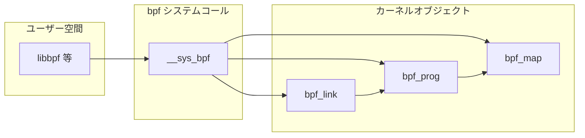

# 第2章 BPF オブジェクトと bpf コマンド

> **本章で読むソース**
>
> - [`include/uapi/linux/bpf.h` L937-L978](https://github.com/gregkh/linux/blob/v6.18.38/include/uapi/linux/bpf.h#L937-L978)
> - [`include/linux/bpf.h` L295-L338](https://github.com/gregkh/linux/blob/v6.18.38/include/linux/bpf.h#L295-L338)
> - [`include/linux/bpf.h` L1761-L1807](https://github.com/gregkh/linux/blob/v6.18.38/include/linux/bpf.h#L1761-L1807)
> - [`kernel/bpf/syscall.c` L58-L79](https://github.com/gregkh/linux/blob/v6.18.38/kernel/bpf/syscall.c#L58-L79)
> - [`kernel/bpf/syscall.c` L1370-L1417](https://github.com/gregkh/linux/blob/v6.18.38/kernel/bpf/syscall.c#L1370-L1417)
> - [`kernel/bpf/syscall.c` L3140-L3171](https://github.com/gregkh/linux/blob/v6.18.38/kernel/bpf/syscall.c#L3140-L3171)

## この章の狙い

ユーザー空間が `bpf` システムコールで操作する3種類のカーネルオブジェクト（**map**、**prog**、**link**）と、`enum bpf_cmd` の対応関係を整理する。
ファイルディスクリプタ、IDR による ID 割り当て、bpffs への pin の役割を押さえ、第3章以降の syscall 配線を読む前提を整える。

## 前提

- [BPF サブシステムの全体像](01-bpf-subsystem-overview.md) で `bpf_prog` の位置づけを知っていること。
- Unix のファイルディスクリプタと `open`/`ioctl` の基本を知っていること。

## bpf_cmd の全体

`bpf` システムコールの第1引数 `cmd` は `enum bpf_cmd` で定義される。
map 操作、プログラムロード、アタッチ、BTF ロード、link 作成などが1つの入口に集約されている。

[`include/uapi/linux/bpf.h` L937-L978](https://github.com/gregkh/linux/blob/v6.18.38/include/uapi/linux/bpf.h#L937-L978)

```c
enum bpf_cmd {
	BPF_MAP_CREATE,
	BPF_MAP_LOOKUP_ELEM,
	BPF_MAP_UPDATE_ELEM,
	BPF_MAP_DELETE_ELEM,
	BPF_MAP_GET_NEXT_KEY,
	BPF_PROG_LOAD,
	BPF_OBJ_PIN,
	BPF_OBJ_GET,
	BPF_PROG_ATTACH,
	BPF_PROG_DETACH,
	BPF_PROG_TEST_RUN,
	BPF_PROG_RUN = BPF_PROG_TEST_RUN,
	BPF_PROG_GET_NEXT_ID,
	BPF_MAP_GET_NEXT_ID,
	BPF_PROG_GET_FD_BY_ID,
	BPF_MAP_GET_FD_BY_ID,
	BPF_OBJ_GET_INFO_BY_FD,
	BPF_PROG_QUERY,
	BPF_RAW_TRACEPOINT_OPEN,
	BPF_BTF_LOAD,
	BPF_BTF_GET_FD_BY_ID,
	BPF_TASK_FD_QUERY,
	BPF_MAP_LOOKUP_AND_DELETE_ELEM,
	BPF_MAP_FREEZE,
	BPF_BTF_GET_NEXT_ID,
	BPF_MAP_LOOKUP_BATCH,
	BPF_MAP_LOOKUP_AND_DELETE_BATCH,
	BPF_MAP_UPDATE_BATCH,
	BPF_MAP_DELETE_BATCH,
	BPF_LINK_CREATE,
	BPF_LINK_UPDATE,
	BPF_LINK_GET_FD_BY_ID,
	BPF_LINK_GET_NEXT_ID,
	BPF_ENABLE_STATS,
	BPF_ITER_CREATE,
	BPF_LINK_DETACH,
	BPF_PROG_BIND_MAP,
	BPF_TOKEN_CREATE,
	BPF_PROG_STREAM_READ_BY_FD,
	__MAX_BPF_CMD,
};
```

古い API では `BPF_PROG_ATTACH` でプログラムを直接アタッチしたが、現在は `BPF_LINK_CREATE` が主流である。
link はアタッチ関係を独立したオブジェクトとして保持し、プログラム差し替えや参照カウントを整理する。

## bpf_map

map は BPF プログラムとユーザー空間が共有するキー値ストアである。
型ごとに `bpf_map_ops` が lookup/update/delete を実装し、verifier はプログラム内の map 参照を検証する。

[`include/linux/bpf.h` L295-L338](https://github.com/gregkh/linux/blob/v6.18.38/include/linux/bpf.h#L295-L338)

```c
struct bpf_map {
	u8 sha[SHA256_DIGEST_SIZE];
	const struct bpf_map_ops *ops;
	struct bpf_map *inner_map_meta;
#ifdef CONFIG_SECURITY
	void *security;
#endif
	enum bpf_map_type map_type;
	u32 key_size;
	u32 value_size;
	u32 max_entries;
	u64 map_extra; /* any per-map-type extra fields */
	u32 map_flags;
	u32 id;
	struct btf_record *record;
	int numa_node;
	u32 btf_key_type_id;
	u32 btf_value_type_id;
	u32 btf_vmlinux_value_type_id;
	struct btf *btf;
#ifdef CONFIG_MEMCG
	struct obj_cgroup *objcg;
#endif
	char name[BPF_OBJ_NAME_LEN];
	struct mutex freeze_mutex;
	atomic64_t refcnt;
	atomic64_t usercnt;
	union {
		struct work_struct work;
		struct rcu_head rcu;
	};
	atomic64_t writecnt;
	spinlock_t owner_lock;
	struct bpf_map_owner *owner;
	bool bypass_spec_v1;
	bool frozen; /* write-once; write-protected by freeze_mutex */
	bool free_after_mult_rcu_gp;
	bool free_after_rcu_gp;
	atomic64_t sleepable_refcnt;
	s64 __percpu *elem_count;
	u64 cookie; /* write-once */
	char *excl_prog_sha;
};
```

`refcnt` と `usercnt` がカーネル内参照と fd 経由の参照を分離する。
`free_after_rcu_gp` が立つ map は、実行中の BPF プログラムが RCU 読み取りを終えるまで解放を遅延する。

map 種別は `enum bpf_map_type` で列挙され、`BPF_MAP_CREATE` 時に `map_type` として渡される。
HASH、ARRAY、LPM trie などは第3部で個別に追う。

## bpf_link

link はプログラムとアタッチ先の結び付きを表す第3のオブジェクトである。
`bpf_link_ops` が release、detach、プログラム更新などのコールバックを提供する。

[`include/linux/bpf.h` L1761-L1807](https://github.com/gregkh/linux/blob/v6.18.38/include/linux/bpf.h#L1761-L1807)

```c
struct bpf_link {
	atomic64_t refcnt;
	u32 id;
	enum bpf_link_type type;
	const struct bpf_link_ops *ops;
	struct bpf_prog *prog;

	u32 flags;
	enum bpf_attach_type attach_type;

	union {
		struct rcu_head rcu;
		struct work_struct work;
	};
	bool sleepable;
};

struct bpf_link_ops {
	void (*release)(struct bpf_link *link);
	void (*dealloc)(struct bpf_link *link);
	void (*dealloc_deferred)(struct bpf_link *link);
	int (*detach)(struct bpf_link *link);
	int (*update_prog)(struct bpf_link *link, struct bpf_prog *new_prog,
			   struct bpf_prog *old_prog);
	void (*show_fdinfo)(const struct bpf_link *link, struct seq_file *seq);
	int (*fill_link_info)(const struct bpf_link *link,
			      struct bpf_link_info *info);
	int (*update_map)(struct bpf_link *link, struct bpf_map *new_map,
			  struct bpf_map *old_map);
	__poll_t (*poll)(struct file *file, struct poll_table_struct *pts);
};
```

`BPF_LINK_TYPE_TRACING` や `BPF_LINK_TYPE_PERF_EVENT` など、link 種別はアタッチ先の種類に対応する（第15章）。
sleepable link は tasks trace RCU と通常 RCU の両方の grace period を待つ場合がある。

## ID 割り当てと map 型テーブル

カーネルは prog、map、link ごとに IDR を持ち、ユーザー空間は `BPF_*_GET_FD_BY_ID` で fd を再取得できる。

[`kernel/bpf/syscall.c` L58-L79](https://github.com/gregkh/linux/blob/v6.18.38/kernel/bpf/syscall.c#L58-L79)

```c
DEFINE_PER_CPU(int, bpf_prog_active);
DEFINE_COOKIE(bpf_map_cookie);
static DEFINE_IDR(prog_idr);
static DEFINE_SPINLOCK(prog_idr_lock);
static DEFINE_IDR(map_idr);
static DEFINE_SPINLOCK(map_idr_lock);
static DEFINE_IDR(link_idr);
static DEFINE_SPINLOCK(link_idr_lock);

static const struct bpf_map_ops * const bpf_map_types[] = {
#define BPF_PROG_TYPE(_id, _name, prog_ctx_type, kern_ctx_type)
#define BPF_MAP_TYPE(_id, _ops) \
	[_id] = &_ops,
#define BPF_LINK_TYPE(_id, _name)
#include <linux/bpf_types.h>
#undef BPF_PROG_TYPE
#undef BPF_MAP_TYPE
#undef BPF_LINK_TYPE
};
```

`linux/bpf_types.h` を include して map 型から ops へのテーブルを構築する。
新しい map 型を追加するときはマクロ登録と ops 実装の両方が必要になる。

## map 作成の入口

`BPF_MAP_CREATE` は `map_create` に到達する。
型の範囲チェック、BTF 型 ID の整合、NUMA ノード指定の検証のあと、`bpf_map_types` から ops を引く。

[`kernel/bpf/syscall.c` L1370-L1417](https://github.com/gregkh/linux/blob/v6.18.38/kernel/bpf/syscall.c#L1370-L1417)

```c
static int map_create(union bpf_attr *attr, bpfptr_t uattr)
{
	const struct bpf_map_ops *ops;
	struct bpf_token *token = NULL;
	int numa_node = bpf_map_attr_numa_node(attr);
	u32 map_type = attr->map_type;
	struct bpf_map *map;
	bool token_flag;
	int f_flags;
	int err;

	err = CHECK_ATTR(BPF_MAP_CREATE);
	if (err)
		return -EINVAL;

	token_flag = attr->map_flags & BPF_F_TOKEN_FD;
	attr->map_flags &= ~BPF_F_TOKEN_FD;

	if (attr->btf_vmlinux_value_type_id) {
		if (attr->map_type != BPF_MAP_TYPE_STRUCT_OPS ||
		    attr->btf_key_type_id || attr->btf_value_type_id)
			return -EINVAL;
	} else if (attr->btf_key_type_id && !attr->btf_value_type_id) {
		return -EINVAL;
	}

	f_flags = bpf_get_file_flag(attr->map_flags);
	if (f_flags < 0)
		return f_flags;

	map_type = attr->map_type;
	if (map_type >= ARRAY_SIZE(bpf_map_types))
		return -EINVAL;
	map_type = array_index_nospec(map_type, ARRAY_SIZE(bpf_map_types));
```

`array_index_nospec` は投機実行によるテーブル外参照を抑止する。
map 作成はホットパスではないが、syscall 入口での防御が一貫している。

## bpffs への pin

`BPF_OBJ_PIN` と `BPF_OBJ_GET` は bpffs 上のパス名と fd を結びつける。
コンテナ再起動後も同じパスからオブジェクトを取り出せる。

[`kernel/bpf/syscall.c` L3140-L3171](https://github.com/gregkh/linux/blob/v6.18.38/kernel/bpf/syscall.c#L3140-L3171)

```c
static int bpf_obj_pin(const union bpf_attr *attr)
{
	int path_fd;

	if (CHECK_ATTR(BPF_OBJ) || attr->file_flags & ~BPF_F_PATH_FD)
		return -EINVAL;

	if (!(attr->file_flags & BPF_F_PATH_FD) && attr->path_fd)
		return -EINVAL;

	path_fd = attr->file_flags & BPF_F_PATH_FD ? attr->path_fd : AT_FDCWD;
	return bpf_obj_pin_user(attr->bpf_fd, path_fd,
				u64_to_user_ptr(attr->pathname));
}

static int bpf_obj_get(const union bpf_attr *attr)
{
	int path_fd;

	if (CHECK_ATTR(BPF_OBJ) || attr->bpf_fd != 0 ||
	    attr->file_flags & ~(BPF_OBJ_FLAG_MASK | BPF_F_PATH_FD))
		return -EINVAL;

	if (!(attr->file_flags & BPF_F_PATH_FD) && attr->path_fd)
		return -EINVAL;

	path_fd = attr->file_flags & BPF_F_PATH_FD ? attr->path_fd : AT_FDCWD;
	return bpf_obj_get_user(path_fd, u64_to_user_ptr(attr->pathname),
				attr->file_flags);
}
```

pin はオブジェクトの寿命をファイルシステムの dentry に委ねる。
プロセスが fd を閉じても、bpffs 上に残っていれば参照が維持される。

## オブジェクト間の関係



prog は verifier 通過時に参照する map を `used_maps` に記録する。
link は prog を保持し、アタッチ先のトレースフックや cgroup に結びつく。

## 高速化と最適化の工夫

map の lookup/update はプログラム実行のホットパスに乗るため、型ごとにロック戦略が異なる。
HASH map は RCU で読み取りをロックレスにし、ARRAY map は per-CPU スロットで更新競合を避ける（第11章、第12章）。

オブジェクト管理側では IDR による整数 ID 割り当てが、fd 再取得やデバッグ時の列挙を O(1) に近いコストで提供する。
pin による永続化は実行時コストを増やさず、オブジェクト共有の運用面だけを改善する。

## まとめ

`bpf` システムコールは `bpf_cmd` 1本で map、prog、link、BTF を操作する。
各オブジェクトは専用の構造体と refcnt 規律を持ち、link が現代的なアタッチモデルを担う。
次章から syscall 配線とロード経路を命令単位で追う。

## 関連する章

- [bpf システムコールとコマンド配線](../part01-core/03-bpf-syscall-dispatch.md)
- [HASH map と RCU 参照](../part03-maps/11-hashtab-rcu.md)
- [tracing プログラムのアタッチ](../part04-btf-attach/15-tracing-program-attach.md)
