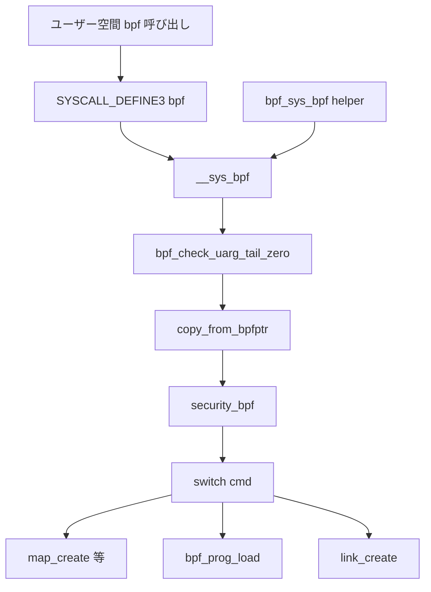

# 第3章 bpf システムコールとコマンド配線

> **本章で読むソース**
>
> - [`kernel/bpf/syscall.c` L6285-L6288](https://github.com/gregkh/linux/blob/v6.18.38/kernel/bpf/syscall.c#L6285-L6288)
> - [`kernel/bpf/syscall.c` L6138-L6178](https://github.com/gregkh/linux/blob/v6.18.38/kernel/bpf/syscall.c#L6138-L6178)
> - [`kernel/bpf/syscall.c` L6246-L6267](https://github.com/gregkh/linux/blob/v6.18.38/kernel/bpf/syscall.c#L6246-L6273)
> - [`kernel/bpf/syscall.c` L6302-L6318](https://github.com/gregkh/linux/blob/v6.18.38/kernel/bpf/syscall.c#L6302-L6318)
> - [`kernel/bpf/syscall.c` L67-L68](https://github.com/gregkh/linux/blob/v6.18.38/kernel/bpf/syscall.c#L67-L68)
> - [`include/uapi/linux/bpf.h` L937-L953](https://github.com/gregkh/linux/blob/v6.18.38/include/uapi/linux/bpf.h#L937-L956)

## この章の狙い

ユーザー空間からカーネル BPF サブシステムへ入る唯一の正規入口である `bpf` システムコールの配線を読む。
`__sys_bpf` の属性コピー、LSM フック、`switch` によるコマンド分岐、カーネル内からの再入経路までを追う。

## 前提

- [BPF オブジェクトと bpf コマンド](../part00-overview/02-bpf-objects-and-commands.md) で `enum bpf_cmd` を知っていること。
- [システムコールテーブルと SYSCALL_DEFINE](../../foundation/part02-syscall/06-syscall-table-syscall-define.md) で `SYSCALL_DEFINE` の登録を知っていること。

## システムコール入口

`bpf` システムコールは3引数で、コマンド番号、属性構造体、サイズを受け取る。
実処理は `__sys_bpf` に委譲される。

[`kernel/bpf/syscall.c` L6285-L6288](https://github.com/gregkh/linux/blob/v6.18.38/kernel/bpf/syscall.c#L6285-L6288)

```c
SYSCALL_DEFINE3(bpf, int, cmd, union bpf_attr __user *, uattr, unsigned int, size)
{
	return __sys_bpf(cmd, USER_BPFPTR(uattr), size);
}
```

`USER_BPFPTR` はユーザー空間ポインタであることを `bpfptr_t` に記録する。
同一の `__sys_bpf` がカーネル内 BPF プログラムからの呼び出しでも使われる（後述）。

## __sys_bpf の前処理

`__sys_bpf` は属性の末尾ゼロ検証、部分コピー、セキュリティフックを通してから `switch` に入る。

[`kernel/bpf/syscall.c` L6138-L6178](https://github.com/gregkh/linux/blob/v6.18.38/kernel/bpf/syscall.c#L6138-L6178)

```c
static int __sys_bpf(enum bpf_cmd cmd, bpfptr_t uattr, unsigned int size)
{
	union bpf_attr attr;
	int err;

	err = bpf_check_uarg_tail_zero(uattr, sizeof(attr), size);
	if (err)
		return err;
	size = min_t(u32, size, sizeof(attr));

	memset(&attr, 0, sizeof(attr));
	if (copy_from_bpfptr(&attr, uattr, size) != 0)
		return -EFAULT;

	err = security_bpf(cmd, &attr, size, uattr.is_kernel);
	if (err < 0)
		return err;

	switch (cmd) {
	case BPF_MAP_CREATE:
		err = map_create(&attr, uattr);
		break;
	case BPF_MAP_LOOKUP_ELEM:
		err = map_lookup_elem(&attr);
		break;
	case BPF_MAP_UPDATE_ELEM:
		err = map_update_elem(&attr, uattr);
		break;
	case BPF_MAP_DELETE_ELEM:
		err = map_delete_elem(&attr, uattr);
		break;
	case BPF_MAP_GET_NEXT_KEY:
		err = map_get_next_key(&attr);
		break;
	case BPF_MAP_FREEZE:
		err = map_freeze(&attr);
		break;
	case BPF_PROG_LOAD:
		err = bpf_prog_load(&attr, uattr, size);
		break;
```

`bpf_check_uarg_tail_zero` は、ユーザー空間が `union bpf_attr` より大きいサイズを渡したとき、未知フィールドがゼロであることを要求する。
将来のフィールド拡張と古いカーネルとの互換性を同時に守る。

`security_bpf` は LSM が BPF 操作を拒否するフックである。
セキュリティ分冊の LSM 章と接続するが、本分冊では入口での呼び出しだけを押さえる。

## link と batch 操作の分岐

`switch` の後半は link 作成、バッチ map 操作、token 作成などを扱う。

[`kernel/bpf/syscall.c` L6246-L6273](https://github.com/gregkh/linux/blob/v6.18.38/kernel/bpf/syscall.c#L6246-L6273)

```c
	case BPF_LINK_CREATE:
		err = link_create(&attr, uattr);
		break;
	case BPF_LINK_UPDATE:
		err = link_update(&attr);
		break;
	case BPF_LINK_GET_FD_BY_ID:
		err = bpf_link_get_fd_by_id(&attr);
		break;
	case BPF_LINK_GET_NEXT_ID:
		err = bpf_obj_get_next_id(&attr, uattr.user,
					  &link_idr, &link_idr_lock);
		break;
	case BPF_ENABLE_STATS:
		err = bpf_enable_stats(&attr);
		break;
	case BPF_ITER_CREATE:
		err = bpf_iter_create(&attr);
		break;
	case BPF_LINK_DETACH:
		err = link_detach(&attr);
		break;
	case BPF_PROG_BIND_MAP:
		err = bpf_prog_bind_map(&attr);
		break;
	case BPF_TOKEN_CREATE:
		err = token_create(&attr);
		break;
```

`BPF_MAP_*_BATCH` はユーザー空間との往復回数を減らすためのまとめ操作である。
トレーシングのホットパスには乗らないが、運用ツールのスループットに効く。

## 権限と sysctl

非特権ユーザーによる BPF 利用は sysctl で制御できる。

[`kernel/bpf/syscall.c` L67-L68](https://github.com/gregkh/linux/blob/v6.18.38/kernel/bpf/syscall.c#L67-L68)

```c
int sysctl_unprivileged_bpf_disabled __read_mostly =
	IS_BUILTIN(CONFIG_BPF_UNPRIV_DEFAULT_OFF) ? 2 : 0;
```

`bpf_prog_load` や `map_create` はこの値と capability を組み合わせて拒否する。
トークン fd（`BPF_F_TOKEN_FD`）経路では、トークンが許可した操作だけを capability チェックの代替にできる。

## カーネル内からの bpf システムコール

`BPF_PROG_TYPE_SYSCALL` 型のプログラムは、helper `bpf_sys_bpf` 経由で限定されたコマンドを再実行できる。
再入可能なコマンドだけを `switch` で許可し、それ以外は `-EINVAL` を返す。

[`kernel/bpf/syscall.c` L6302-L6318](https://github.com/gregkh/linux/blob/v6.18.38/kernel/bpf/syscall.c#L6302-L6318)

```c
BPF_CALL_3(bpf_sys_bpf, int, cmd, union bpf_attr *, attr, u32, attr_size)
{
	switch (cmd) {
	case BPF_MAP_CREATE:
	case BPF_MAP_DELETE_ELEM:
	case BPF_MAP_UPDATE_ELEM:
	case BPF_MAP_FREEZE:
	case BPF_MAP_GET_FD_BY_ID:
	case BPF_PROG_LOAD:
	case BPF_BTF_LOAD:
	case BPF_LINK_CREATE:
	case BPF_RAW_TRACEPOINT_OPEN:
		break;
	default:
		return -EINVAL;
	}
	return __sys_bpf(cmd, KERNEL_BPFPTR(attr), attr_size);
}
```

`KERNEL_BPFPTR` により属性はカーネルポインタとして扱われ、`copy_from_bpfptr` が不要になる。
verifier がこの helper の利用をプログラム種別ごとに制限する。

## 処理の流れ



syscall 配線は薄いラッパに留まり、実装の重さは各 `case` 先の関数が担う。
第4章以降で `bpf_prog_load` と map 実装を個別に読む。

## コマンドとオブジェクトの対応

主要コマンドとオブジェクトの対応を次に整理する。

[`include/uapi/linux/bpf.h` L937-L956](https://github.com/gregkh/linux/blob/v6.18.38/include/uapi/linux/bpf.h#L937-L956)

```c
enum bpf_cmd {
	BPF_MAP_CREATE,
	BPF_MAP_LOOKUP_ELEM,
	BPF_MAP_UPDATE_ELEM,
	BPF_MAP_DELETE_ELEM,
	BPF_MAP_GET_NEXT_KEY,
	BPF_PROG_LOAD,
	BPF_OBJ_PIN,
	BPF_OBJ_GET,
	BPF_PROG_ATTACH,
	BPF_PROG_DETACH,
	BPF_PROG_TEST_RUN,
	BPF_PROG_RUN = BPF_PROG_TEST_RUN,
	BPF_PROG_GET_NEXT_ID,
	BPF_MAP_GET_NEXT_ID,
	BPF_PROG_GET_FD_BY_ID,
	BPF_MAP_GET_FD_BY_ID,
	BPF_OBJ_GET_INFO_BY_FD,
	BPF_PROG_QUERY,
	BPF_RAW_TRACEPOINT_OPEN,
```

`BPF_PROG_TEST_RUN` はロード済みプログラムをテストコンテキストで1回実行する。
本番アタッチとは別経路だが、同じ `bpf_prog_run` に到達する。

## 高速化と最適化の工夫

syscall 入口自体はホットパスではないが、`bpf_check_uarg_tail_zero` と `min_t(size, sizeof(attr))` により不要なコピーを避けつつ安全側に倒している。
map の lookup/update は syscall を経由せず、BPF プログラム内の helper が直接 `bpf_map_ops` を呼ぶため、観測やフィルタのデータ面は syscall 配線をバイパスする。

バッチ系コマンドはユーザー空間とカーネルの境界越え回数をまとめ、大量の map 走査を ioctl 1回に畳む。
トレーシング用途では副次的だが、同じ `__sys_bpf` 配線に載せることで権限チェックと LSM フックを共通化している。

## まとめ

`bpf` システムコールは `__sys_bpf` に集約され、属性検証と LSM のあと `switch` で各実装へ分岐する。
ユーザー空間とカーネル内 helper の両方が同じ配線を共有し、コマンドごとに権限モデルが異なる。
次章では `BPF_PROG_LOAD` の本体である `bpf_prog_load` を追う。

## 関連する章

- [bpf_prog_load とプログラムオブジェクト](04-bpf-prog-load.md)
- [BPF オブジェクトと bpf コマンド](../part00-overview/02-bpf-objects-and-commands.md)
