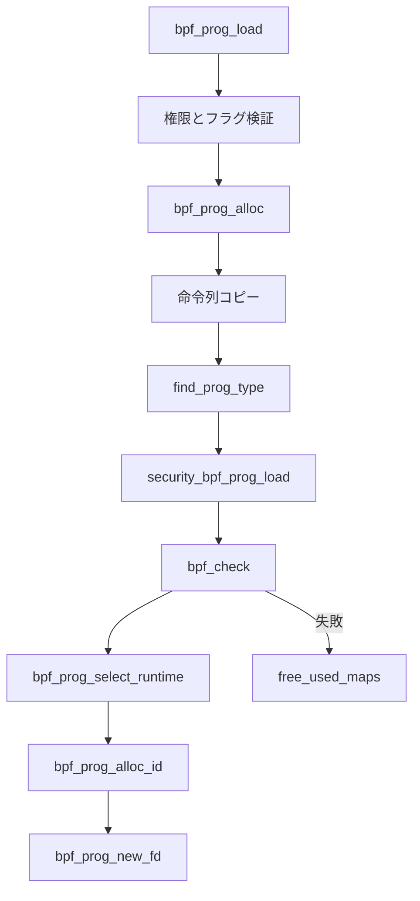

# 第4章 bpf_prog_load とプログラムオブジェクト

> **本章で読むソース**
>
> - [`kernel/bpf/syscall.c` L2865-L2938](https://github.com/gregkh/linux/blob/v6.18.38/kernel/bpf/syscall.c#L2865-L2938)
> - [`kernel/bpf/syscall.c` L2986-L3016](https://github.com/gregkh/linux/blob/v6.18.38/kernel/bpf/syscall.c#L2986-L3016)
> - [`kernel/bpf/syscall.c` L3067-L3116](https://github.com/gregkh/linux/blob/v6.18.38/kernel/bpf/syscall.c#L3067-L3116)
> - [`kernel/bpf/syscall.c` L2339-L2360](https://github.com/gregkh/linux/blob/v6.18.38/kernel/bpf/syscall.c#L2339-L2360)
> - [`kernel/bpf/core.c` L147-L165](https://github.com/gregkh/linux/blob/v6.18.38/kernel/bpf/core.c#L147-L165)
> - [`include/linux/bpf.h` L1715-L1733](https://github.com/gregkh/linux/blob/v6.18.38/include/linux/bpf.h#L1715-L1733)

## この章の狙い

`BPF_PROG_LOAD` がカーネル内で `struct bpf_prog` を組み立て、verifier とランタイム選択を経て fd を返すまでの手順を追う。
権限チェック、命令列コピー、BTF アタッチ情報の受け渡し、失敗時の解放順序を読めるようにする。

## 前提

- [bpf システムコールとコマンド配線](03-bpf-syscall-dispatch.md) で `__sys_bpf` の分岐を知っていること。
- [BPF サブシステムの全体像](../part00-overview/01-bpf-subsystem-overview.md) で `bpf_check` と `bpf_prog_select_runtime` の位置を知っていること。

## bpf_prog_load の入口チェック

`bpf_prog_load` は属性フラグ、トークン、capability、命令数上限を検証してから本体処理に入る。

[`kernel/bpf/syscall.c` L2865-L2938](https://github.com/gregkh/linux/blob/v6.18.38/kernel/bpf/syscall.c#L2865-L2938)

```c
static int bpf_prog_load(union bpf_attr *attr, bpfptr_t uattr, u32 uattr_size)
{
	enum bpf_prog_type type = attr->prog_type;
	struct bpf_prog *prog, *dst_prog = NULL;
	struct btf *attach_btf = NULL;
	struct bpf_token *token = NULL;
	bool bpf_cap;
	int err;
	char license[128];

	if (CHECK_ATTR(BPF_PROG_LOAD))
		return -EINVAL;

	if (attr->prog_flags & ~(BPF_F_STRICT_ALIGNMENT |
				 BPF_F_ANY_ALIGNMENT |
				 BPF_F_TEST_STATE_FREQ |
				 BPF_F_SLEEPABLE |
				 BPF_F_TEST_RND_HI32 |
				 BPF_F_XDP_HAS_FRAGS |
				 BPF_F_XDP_DEV_BOUND_ONLY |
				 BPF_F_TEST_REG_INVARIANTS |
				 BPF_F_TOKEN_FD))
		return -EINVAL;

	bpf_prog_load_fixup_attach_type(attr);

	if (attr->prog_flags & BPF_F_TOKEN_FD) {
		token = bpf_token_get_from_fd(attr->prog_token_fd);
		if (IS_ERR(token))
			return PTR_ERR(token);
		if (!bpf_token_allow_cmd(token, BPF_PROG_LOAD) ||
		    !bpf_token_allow_prog_type(token, attr->prog_type,
					       attr->expected_attach_type)) {
			bpf_token_put(token);
			token = NULL;
		}
	}

	bpf_cap = bpf_token_capable(token, CAP_BPF);
	err = -EPERM;

	if (!IS_ENABLED(CONFIG_HAVE_EFFICIENT_UNALIGNED_ACCESS) &&
	    (attr->prog_flags & BPF_F_ANY_ALIGNMENT) &&
	    !bpf_cap)
		goto put_token;

	if (sysctl_unprivileged_bpf_disabled && !bpf_cap)
		goto put_token;

	if (attr->insn_cnt == 0 ||
	    attr->insn_cnt > (bpf_cap ? BPF_COMPLEXITY_LIMIT_INSNS : BPF_MAXINSNS)) {
		err = -E2BIG;
		goto put_token;
	}
	if (type != BPF_PROG_TYPE_SOCKET_FILTER &&
	    type != BPF_PROG_TYPE_CGROUP_SKB &&
	    !bpf_cap)
		goto put_token;

	if (is_net_admin_prog_type(type) && !bpf_token_capable(token, CAP_NET_ADMIN))
		goto put_token;
	if (is_perfmon_prog_type(type) && !bpf_token_capable(token, CAP_PERFMON))
		goto put_token;
```

特権ユーザーは `BPF_COMPLEXITY_LIMIT_INSNS` までの長いプログラムをロードできる。
非特権ユーザーは `BPF_MAXINSNS` で上限が低く、多くの prog type はそもそも拒否される。

## プログラム本体の確保と命令コピー

検証を通過したあと、`bpf_prog_alloc` で可変長の命令列を含む領域を確保する。

[`kernel/bpf/syscall.c` L2986-L3016](https://github.com/gregkh/linux/blob/v6.18.38/kernel/bpf/syscall.c#L2986-L3016)

```c
	prog = bpf_prog_alloc(bpf_prog_size(attr->insn_cnt), GFP_USER);
	if (!prog) {
		if (dst_prog)
			bpf_prog_put(dst_prog);
		if (attach_btf)
			btf_put(attach_btf);
		err = -EINVAL;
		goto put_token;
	}

	prog->expected_attach_type = attr->expected_attach_type;
	prog->sleepable = !!(attr->prog_flags & BPF_F_SLEEPABLE);
	prog->aux->attach_btf = attach_btf;
	prog->aux->attach_btf_id = attr->attach_btf_id;
	prog->aux->dst_prog = dst_prog;
	prog->aux->dev_bound = !!attr->prog_ifindex;
	prog->aux->xdp_has_frags = attr->prog_flags & BPF_F_XDP_HAS_FRAGS;

	prog->aux->token = token;
	token = NULL;

	prog->aux->user = get_current_user();
	prog->len = attr->insn_cnt;

	err = -EFAULT;
	if (copy_from_bpfptr(prog->insns,
			     make_bpfptr(attr->insns, uattr.is_kernel),
			     bpf_prog_insn_size(prog)) != 0)
		goto free_prog;
```

`attach_btf` と `attach_btf_id` は tracing プログラムがカーネル関数へアタッチするときの型情報源になる（第15章）。
`dst_prog` は BPF-to-BPF のチェーンや拡張プログラムで使われる。

## verifier、ランタイム選択、fd 公開

型固有の ops を登録したあと、セキュリティフックと verifier を通し、JIT またはインタプリタを選択する。

[`kernel/bpf/syscall.c` L3067-L3116](https://github.com/gregkh/linux/blob/v6.18.38/kernel/bpf/syscall.c#L3067-L3116)

```c
	err = find_prog_type(type, prog);
	if (err < 0)
		goto free_prog;

	prog->aux->load_time = ktime_get_boottime_ns();
	err = bpf_obj_name_cpy(prog->aux->name, attr->prog_name,
			       sizeof(attr->prog_name));
	if (err < 0)
		goto free_prog;

	err = security_bpf_prog_load(prog, attr, token, uattr.is_kernel);
	if (err)
		goto free_prog_sec;

	/* run eBPF verifier */
	err = bpf_check(&prog, attr, uattr, uattr_size);
	if (err < 0)
		goto free_used_maps;

	prog = bpf_prog_select_runtime(prog, &err);
	if (err < 0)
		goto free_used_maps;

	err = bpf_prog_alloc_id(prog);
	if (err)
		goto free_used_maps;

	bpf_prog_kallsyms_add(prog);
	perf_event_bpf_event(prog, PERF_BPF_EVENT_PROG_LOAD, 0);
	bpf_audit_prog(prog, BPF_AUDIT_LOAD);

	err = bpf_prog_new_fd(prog);
	if (err < 0)
		bpf_prog_put(prog);
	return err;
```

`bpf_prog_alloc_id` 成功後はオブジェクトが IDR に載り、並行する `close` と競合しうる。
コメントが示すとおり、`bpf_prog_new_fd` より前に kallsyms 登録と audit を済ませる。

## ID 割り当て

整数 ID は IDR に挿入され、後から `BPF_PROG_GET_FD_BY_ID` で fd に復元できる。

[`kernel/bpf/syscall.c` L2339-L2356](https://github.com/gregkh/linux/blob/v6.18.38/kernel/bpf/syscall.c#L2339-L2356)

```c
static int bpf_prog_alloc_id(struct bpf_prog *prog)
{
	int id;

	idr_preload(GFP_KERNEL);
	spin_lock_bh(&prog_idr_lock);
	id = idr_alloc_cyclic(&prog_idr, prog, 1, INT_MAX, GFP_ATOMIC);
	if (id > 0)
		prog->aux->id = id;
	spin_unlock_bh(&prog_idr_lock);
	idr_preload_end();

	/* id is in [1, INT_MAX) */
	if (WARN_ON_ONCE(!id))
		return -ENOSPC;

	return id > 0 ? 0 : id;
}
```

`idr_alloc_cyclic` は ID 枯渇を避けるため循環割り当てする。
ホットパスではないが、長期稼働する観測エージェントの安定性に効く。

## bpf_prog_alloc と統計領域

`bpf_prog_alloc` は命令列に加え、per-CPU 統計と active カウンタを確保する。

[`kernel/bpf/core.c` L147-L172](https://github.com/gregkh/linux/blob/v6.18.38/kernel/bpf/core.c#L147-L172)

```c
struct bpf_prog *bpf_prog_alloc(unsigned int size, gfp_t gfp_extra_flags)
{
	gfp_t gfp_flags = bpf_memcg_flags(GFP_KERNEL | __GFP_ZERO | gfp_extra_flags);
	struct bpf_prog *prog;
	int cpu;

	prog = bpf_prog_alloc_no_stats(size, gfp_extra_flags);
	if (!prog)
		return NULL;

	prog->stats = alloc_percpu_gfp(struct bpf_prog_stats, gfp_flags);
	if (!prog->stats) {
		free_percpu(prog->active);
		kfree(prog->aux);
		vfree(prog);
		return NULL;
	}

	for_each_possible_cpu(cpu) {
		struct bpf_prog_stats *pstats;

		pstats = per_cpu_ptr(prog->stats, cpu);
		u64_stats_init(&pstats->syncp);
	}
	return prog;
}
```

`bpf_prog_run` は `bpf_stats_enabled_key` が有効なときだけ `sched_clock` で実行時間を集計する（第5章）。

## 処理の流れ



verifier 失敗時は `free_used_maps` で参照していた map を解放する。
JIT 済みサブプログラムがある場合は kallsyms 公開後の解放が遅延する分岐もある。

## bpf_prog の実行関連フィールド

ロード完了時点で `jited` と `bpf_func` が確定する。

[`include/linux/bpf.h` L1715-L1735](https://github.com/gregkh/linux/blob/v6.18.38/include/linux/bpf.h#L1715-L1735)

```c
struct bpf_prog {
	u16			pages;		/* Number of allocated pages */
	u16			jited:1,	/* Is our filter JIT'ed? */
				jit_requested:1,/* archs need to JIT the prog */
				gpl_compatible:1, /* Is filter GPL compatible? */
				cb_access:1,	/* Is control block accessed? */
				dst_needed:1,	/* Do we need dst entry? */
				blinding_requested:1, /* needs constant blinding */
				blinded:1,	/* Was blinded */
				is_func:1,	/* program is a bpf function */
				kprobe_override:1, /* Do we override a kprobe? */
				has_callchain_buf:1, /* callchain buffer allocated? */
				enforce_expected_attach_type:1, /* Enforce expected_attach_type checking at attach time */
				call_get_stack:1, /* Do we call bpf_get_stack() or bpf_get_stackid() */
				call_get_func_ip:1, /* Do we call get_func_ip() */
				tstamp_type_access:1, /* Accessed __sk_buff->tstamp_type */
				sleepable:1;	/* BPF program is sleepable */
	enum bpf_prog_type	type;		/* Type of BPF program */
	enum bpf_attach_type	expected_attach_type; /* For some prog types */
	u32			len;		/* Number of filter blocks */
	u32			jited_len;	/* Size of jited insns in bytes */
```

`gpl_compatible` は GPL 限定 helper を呼べるかを決める。
verifier がライセンス文字列と helper テーブルを突き合わせる。

## 高速化と最適化の工夫

ロード時のコストは verifier と JIT が支配するが、`bpf_prog_alloc` は命令数に比例した `__vmalloc` を1回にまとめ、後続の実行では追加割り当てをしない。
`bpf_prog_select_runtime` で JIT をロード時に完結させることで、実行ホットパスは `bpf_func` への間接呼び出しだけに抑える。

`BPF_F_SLEEPABLE` などのフラグはロード時に `prog->sleepable` へ焼き付けられ、実行時の分岐を定数化する。
アタッチ先が sleepable かどうかと組み合わせて、RCU と mutex のどちらで保護するかが決まる。

## まとめ

`bpf_prog_load` は権限、命令コピー、verifier、ランタイム選択、fd 公開を順に実行する。
失敗経路は map 参照と BTF の put を丁寧に処理し、成功後は IDR と kallsyms でオブジェクトを公開する。
次章では実行エンジンであるインタプリタと `bpf_prog_run` を読む。

## 関連する章

- [インタプリタと bpf_prog_run](05-interpreter-bpf-prog-run.md)
- [verifier の状態機械と命令探索](../part02-verifier/07-verifier-state-exploration.md)
