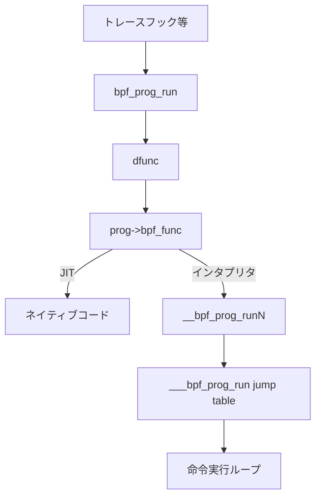

# 第5章 インタプリタと bpf_prog_run

> **本章で読むソース**
>
> - [`kernel/bpf/core.c` L1728-L1765](https://github.com/gregkh/linux/blob/v6.18.38/kernel/bpf/core.c#L1728-L1765)
> - [`kernel/bpf/core.c` L2285-L2296](https://github.com/gregkh/linux/blob/v6.18.38/kernel/bpf/core.c#L2285-L2296)
> - [`kernel/bpf/core.c` L2472-L2492](https://github.com/gregkh/linux/blob/v6.18.38/kernel/bpf/core.c#L2472-L2492)
> - [`include/linux/filter.h` L700-L731](https://github.com/gregkh/linux/blob/v6.18.38/include/linux/filter.h#L700-L731)
> - [`kernel/bpf/core.c` L2495-L2535](https://github.com/gregkh/linux/blob/v6.18.38/kernel/bpf/core.c#L2506-L2545)
> - [`include/uapi/linux/bpf.h` L948-L949](https://github.com/gregkh/linux/blob/v6.18.38/include/uapi/linux/bpf.h#L948-L949)

## この章の狙い

JIT が使えない、または選択されない場合に eBPF 命令列を解釈実行するインタプリタの構造を読む。
`___bpf_prog_run` の jump table ディスパッチ、スタック深さに応じた複数エントリポイント、`bpf_prog_run` からの呼び出し経路を追う。

## 前提

- [bpf_prog_load とプログラムオブジェクト](04-bpf-prog-load.md) で `bpf_prog_select_runtime` の位置を知っていること。
- BPF 仮想レジスタ `BPF_REG_0` から `BPF_REG_10` の役割（戻り値、引数、フレームポインタ）を知っていること。

## ___bpf_prog_run の命令ディスパッチ

インタプリタの中核は `___bpf_prog_run` である。
256 エントリの jump table が命令コードの上位ビットへ直接分岐する。

[`kernel/bpf/core.c` L1728-L1765](https://github.com/gregkh/linux/blob/v6.18.38/kernel/bpf/core.c#L1728-L1765)

```c
/**
 *	___bpf_prog_run - run eBPF program on a given context
 *	@regs: is the array of MAX_BPF_EXT_REG eBPF pseudo-registers
 *	@insn: is the array of eBPF instructions
 *
 * Decode and execute eBPF instructions.
 *
 * Return: whatever value is in %BPF_R0 at program exit
 */
static u64 ___bpf_prog_run(u64 *regs, const struct bpf_insn *insn)
{
#define BPF_INSN_2_LBL(x, y)    [BPF_##x | BPF_##y] = &&x##_##y
#define BPF_INSN_3_LBL(x, y, z) [BPF_##x | BPF_##y | BPF_##z] = &&x##_##y##_##z
	static const void * const jumptable[256] __annotate_jump_table = {
		[0 ... 255] = &&default_label,
		/* Now overwrite non-defaults ... */
		BPF_INSN_MAP(BPF_INSN_2_LBL, BPF_INSN_3_LBL),
		/* Non-UAPI available opcodes. */
		[BPF_JMP | BPF_CALL_ARGS] = &&JMP_CALL_ARGS,
		[BPF_JMP | BPF_TAIL_CALL] = &&JMP_TAIL_CALL,
		[BPF_ST  | BPF_NOSPEC] = &&ST_NOSPEC,
		[BPF_LDX | BPF_PROBE_MEM | BPF_B] = &&LDX_PROBE_MEM_B,
		[BPF_LDX | BPF_PROBE_MEM | BPF_H] = &&LDX_PROBE_MEM_H,
		[BPF_LDX | BPF_PROBE_MEM | BPF_W] = &&LDX_PROBE_MEM_W,
		[BPF_LDX | BPF_PROBE_MEM | BPF_DW] = &&LDX_PROBE_MEM_DW,
		[BPF_LDX | BPF_PROBE_MEMSX | BPF_B] = &&LDX_PROBE_MEMSX_B,
		[BPF_LDX | BPF_PROBE_MEMSX | BPF_H] = &&LDX_PROBE_MEMSX_H,
		[BPF_LDX | BPF_PROBE_MEMSX | BPF_W] = &&LDX_PROBE_MEMSX_W,
	};
#undef BPF_INSN_3_LBL
#undef BPF_INSN_2_LBL
	u32 tail_call_cnt = 0;

#define CONT	 ({ insn++; goto select_insn; })
#define CONT_JMP ({ insn++; goto select_insn; })

select_insn:
	goto *jumptable[insn->code];
```

`__annotate_jump_table` はオブジェクトツール向けの注釈であり、間接分岐の正当性検証に使われる。
`BPF_JMP | BPF_TAIL_CALL` は prog array 経由のチェーン呼び出しをインタプリタでも処理する。

## スタック深さごとのエントリポイント

verifier が計算したスタック使用量に応じて、固定サイズのスタック配列を持つラッパが生成される。

[`kernel/bpf/core.c` L2285-L2296](https://github.com/gregkh/linux/blob/v6.18.38/kernel/bpf/core.c#L2285-L2296)

```c
#define PROG_NAME(stack_size) __bpf_prog_run##stack_size
#define DEFINE_BPF_PROG_RUN(stack_size) \
static unsigned int PROG_NAME(stack_size)(const void *ctx, const struct bpf_insn *insn) \
{ \
	u64 stack[stack_size / sizeof(u64)]; \
	u64 regs[MAX_BPF_EXT_REG] = {}; \
\
	kmsan_unpoison_memory(stack, sizeof(stack)); \
	FP = (u64) (unsigned long) &stack[ARRAY_SIZE(stack)]; \
	ARG1 = (u64) (unsigned long) ctx; \
	return ___bpf_prog_run(regs, insn); \
}
```

32バイト刻みで最大512バイトまで `interpreters[]` テーブルが用意される。
スタックを VLA にせずコンパイル時定数にすることで、フレームサイズがプログラムごとに確定する。

`bpf_prog_select_interpreter` はスタック深さからインデックスを計算し、`fp->bpf_func` に該当ラッパを設定する。

[`kernel/bpf/core.c` L2472-L2492](https://github.com/gregkh/linux/blob/v6.18.38/kernel/bpf/core.c#L2472-L2492)

```c
static bool bpf_prog_select_interpreter(struct bpf_prog *fp)
{
	bool select_interpreter = false;
#ifndef CONFIG_BPF_JIT_ALWAYS_ON
	u32 stack_depth = max_t(u32, fp->aux->stack_depth, 1);
	u32 idx = (round_up(stack_depth, 32) / 32) - 1;

	if (idx < ARRAY_SIZE(interpreters)) {
		fp->bpf_func = interpreters[idx];
		select_interpreter = true;
	} else {
		fp->bpf_func = __bpf_prog_ret0_warn;
	}
#else
	fp->bpf_func = __bpf_prog_ret0_warn;
#endif
	return select_interpreter;
}
```

スタックが512バイトを超えるプログラムは JIT 必須となる。
`CONFIG_BPF_JIT_ALWAYS_ON` ではインタプリタ経路は意図的に無効化される。

## bpf_prog_run からインタプリタへ

実行時の共通入口は `bpf_prog_run` である。

[`include/linux/filter.h` L700-L731](https://github.com/gregkh/linux/blob/v6.18.38/include/linux/filter.h#L700-L731)

```c
static __always_inline u32 __bpf_prog_run(const struct bpf_prog *prog,
					  const void *ctx,
					  bpf_dispatcher_fn dfunc)
{
	u32 ret;

	cant_migrate();
	if (static_branch_unlikely(&bpf_stats_enabled_key)) {
		struct bpf_prog_stats *stats;
		u64 duration, start = sched_clock();
		unsigned long flags;

		ret = dfunc(ctx, prog->insnsi, prog->bpf_func);

		duration = sched_clock() - start;
		if (likely(prog->stats)) {
			stats = this_cpu_ptr(prog->stats);
			flags = u64_stats_update_begin_irqsave(&stats->syncp);
			u64_stats_inc(&stats->cnt);
			u64_stats_add(&stats->nsecs, duration);
			u64_stats_update_end_irqrestore(&stats->syncp, flags);
		}
	} else {
		ret = dfunc(ctx, prog->insnsi, prog->bpf_func);
	}
	return ret;
}

static __always_inline u32 bpf_prog_run(const struct bpf_prog *prog, const void *ctx)
{
	return __bpf_prog_run(prog, ctx, bpf_dispatcher_nop_func);
}
```

`dfunc` は dispatcher 用のフックだが、通常は `bpf_dispatcher_nop_func` が `prog->bpf_func` をそのまま呼ぶ。
JIT 済みの場合も同じ `bpf_prog_run` から入り、`bpf_func` がネイティブコードを指す。

## JIT との選択

`bpf_prog_select_runtime` はインタプリタ設定後に `bpf_int_jit_compile` を試みる。

[`kernel/bpf/core.c` L2506-L2545](https://github.com/gregkh/linux/blob/v6.18.38/kernel/bpf/core.c#L2506-L2545)

```c
struct bpf_prog *bpf_prog_select_runtime(struct bpf_prog *fp, int *err)
{
	/* In case of BPF to BPF calls, verifier did all the prep
	 * work with regards to JITing, etc.
	 */
	bool jit_needed = false;

	if (fp->bpf_func)
		goto finalize;

	if (IS_ENABLED(CONFIG_BPF_JIT_ALWAYS_ON) ||
	    bpf_prog_has_kfunc_call(fp))
		jit_needed = true;

	if (!bpf_prog_select_interpreter(fp))
		jit_needed = true;

	/* eBPF JITs can rewrite the program in case constant
	 * blinding is active. However, in case of error during
	 * blinding, bpf_int_jit_compile() must always return a
	 * valid program, which in this case would simply not
	 * be JITed, but falls back to the interpreter.
	 */
	if (!bpf_prog_is_offloaded(fp->aux)) {
		*err = bpf_prog_alloc_jited_linfo(fp);
		if (*err)
			return fp;

		fp = bpf_int_jit_compile(fp);
		bpf_prog_jit_attempt_done(fp);
		if (!fp->jited && jit_needed) {
			*err = -ENOTSUPP;
			return fp;
		}
	} else {
		*err = bpf_prog_offload_compile(fp);
		if (*err)
			return fp;
	}

```

JIT 成功時は `fp->jited` が立ち、`bpf_func` は x86 コードへのポインタに差し替わる。
失敗しても `jit_needed` でなければインタプリタの `bpf_func` が残る。

## BPF_PROG_RUN テスト実行

ユーザー空間の `BPF_PROG_TEST_RUN` は同じ実行エンジンをテストコンテキストで使う。
uapi では `BPF_PROG_RUN` がエイリアスとして定義されている。

[`include/uapi/linux/bpf.h` L948-L949](https://github.com/gregkh/linux/blob/v6.18.38/include/uapi/linux/bpf.h#L948-L949)

```c
	BPF_PROG_TEST_RUN,
	BPF_PROG_RUN = BPF_PROG_TEST_RUN,
```

`kern_sys_bpf` の `BPF_PROG_TEST_RUN` 分岐は `bpf_prog_run` を直接呼び、再帰検出に `__bpf_prog_enter_sleepable_recur` を使う。

## 処理の流れ



インタプリタは命令ごとに `select_insn` へ戻るループ構造である。
JIT はこのループを機械語に展開して除去する。

## 高速化と最適化の工夫

インタプリタは gcc の labels-as-values 拡張で jump table を構築し、巨大な `switch` より分岐予測に有利な間接 goto を使う。
命令デコードのオーバーヘッドは残るが、開発初期や JIT 不可環境でも同一セマンティクスを保証する。

スタック深さ別の `__bpf_prog_runNN` を事前生成することで、実行時のスタック割り当てをコンパイル時に固定し、フレームポインタ `BPF_REG_10` の設定を1命令群に畳む。
`static_branch_unlikely` による統計収集の分岐も、通常はオフでホットパスから除外される。

## まとめ

インタプリタは `___bpf_prog_run` の jump table が中心で、スタックサイズ別ラッパが `bpf_func` に載る。
`bpf_prog_run` は JIT とインタプリタを同一 API で呼び分け、統計はオプションで付く。
次章では x86 JIT がこのループをどう機械語に置き換えるかを読む。

## 関連する章

- [x86 BPF JIT](06-x86-bpf-jit.md)
- [BPF サブシステムの全体像](../part00-overview/01-bpf-subsystem-overview.md)
