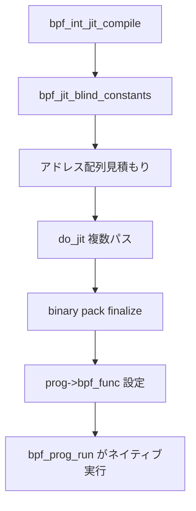

# 第6章 x86 BPF JIT

> **本章で読むソース**
>
> - [`arch/x86/net/bpf_jit_comp.c` L3645-L3677](https://github.com/gregkh/linux/blob/v6.18.38/arch/x86/net/bpf_jit_comp.c#L3645-L3677)
> - [`arch/x86/net/bpf_jit_comp.c` L3734-L3759](https://github.com/gregkh/linux/blob/v6.18.38/arch/x86/net/bpf_jit_comp.c#L3734-L3759)
> - [`arch/x86/net/bpf_jit_comp.c` L501-L546](https://github.com/gregkh/linux/blob/v6.18.38/arch/x86/net/bpf_jit_comp.c#L501-L549)
> - [`kernel/bpf/core.c` L1102-L1152](https://github.com/gregkh/linux/blob/v6.18.38/kernel/bpf/core.c#L1102-L1152)
> - [`kernel/bpf/core.c` L2520-L2535](https://github.com/gregkh/linux/blob/v6.18.38/kernel/bpf/core.c#L2520-L2535)
> - [`arch/x86/net/bpf_jit_comp.c` L470-L493](https://github.com/gregkh/linux/blob/v6.18.38/arch/x86/net/bpf_jit_comp.c#L470-L493)

## この章の狙い

x86-64 向け `bpf_int_jit_compile` が eBPF 命令列をネイティブコードに変換する手順を読む。
複数パスによるサイズ収束、tail call 用プロローグ、W^X メモリへのパック配置と constant blinding までを追う。

## 前提

- [インタプリタと bpf_prog_run](05-interpreter-bpf-prog-run.md) で `bpf_prog_select_runtime` と `bpf_func` の関係を知っていること。
- x86-64 の呼び出し規約で第1引数が `rdi` であることを知っていること。

## bpf_int_jit_compile の全体

JIT は `jit_requested` が立っているときだけ動作し、定数 blinding 用の一時コピーを挟む。

[`arch/x86/net/bpf_jit_comp.c` L3645-L3677](https://github.com/gregkh/linux/blob/v6.18.38/arch/x86/net/bpf_jit_comp.c#L3645-L3677)

```c
struct bpf_prog *bpf_int_jit_compile(struct bpf_prog *prog)
{
	struct bpf_binary_header *rw_header = NULL;
	struct bpf_binary_header *header = NULL;
	struct bpf_prog *tmp, *orig_prog = prog;
	void __percpu *priv_stack_ptr = NULL;
	struct x64_jit_data *jit_data;
	int priv_stack_alloc_sz;
	int proglen, oldproglen = 0;
	struct jit_context ctx = {};
	bool tmp_blinded = false;
	bool extra_pass = false;
	bool padding = false;
	u8 *rw_image = NULL;
	u8 *image = NULL;
	int *addrs;
	int pass;
	int i;

	if (!prog->jit_requested)
		return orig_prog;

	tmp = bpf_jit_blind_constants(prog);
	if (IS_ERR(tmp))
		return orig_prog;
	if (tmp != prog) {
		tmp_blinded = true;
		prog = tmp;
	}
```

blinding 失敗時は元のプログラムへフォールバックし、インタプリタ実行を維持する。
`jit_data` はパス間でアドレス配列と生成済みイメージを保持する。

## 複数パスによるコード生成

JIT は最大 `MAX_PASSES` 回まで生成とサイズ見積もりを繰り返し、収束したイメージを確定する。

[`arch/x86/net/bpf_jit_comp.c` L3734-L3759](https://github.com/gregkh/linux/blob/v6.18.38/arch/x86/net/bpf_jit_comp.c#L3734-L3759)

```c
	for (pass = 0; pass < MAX_PASSES || image; pass++) {
		if (!padding && pass >= PADDING_PASSES)
			padding = true;
		proglen = do_jit(prog, addrs, image, rw_image, oldproglen, &ctx, padding);
		if (proglen <= 0) {
out_image:
			image = NULL;
			if (header) {
				bpf_arch_text_copy(&header->size, &rw_header->size,
						   sizeof(rw_header->size));
				bpf_jit_binary_pack_free(header, rw_header);
			}
			prog = orig_prog;
			if (extra_pass) {
				prog->bpf_func = NULL;
				prog->jited = 0;
				prog->jited_len = 0;
			}
			goto out_addrs;
		}
```

1パス目は各 eBPF 命令を最大64バイトとして粗く見積もり、アドレス配列 `addrs[]` を埋める。
以降のパスで実際の機械語長に合わせて縮み、最終パスで `image` バッファへ書き込む。

## プロローグと tail call オフセット

x86 プロローグは固定レイアウトを持ち、tail call helper が先頭から一定オフセットへジャンプする。

[`arch/x86/net/bpf_jit_comp.c` L501-L549](https://github.com/gregkh/linux/blob/v6.18.38/arch/x86/net/bpf_jit_comp.c#L501-L549)

```c
/*
 * Emit x86-64 prologue code for BPF program.
 * bpf_tail_call helper will skip the first X86_TAIL_CALL_OFFSET bytes
 * while jumping to another program
 */
static void emit_prologue(u8 **pprog, u8 *ip, u32 stack_depth, bool ebpf_from_cbpf,
			  bool tail_call_reachable, bool is_subprog,
			  bool is_exception_cb)
{
	u8 *prog = *pprog;

	if (is_subprog) {
		emit_cfi(&prog, ip, cfi_bpf_subprog_hash, 5);
	} else {
		emit_cfi(&prog, ip, cfi_bpf_hash, 1);
	}
	// ... (中略) ...
	} else {
		EMIT1(0x55);             /* push rbp */
		EMIT3(0x48, 0x89, 0xE5); /* mov rbp, rsp */
	}

	/* X86_TAIL_CALL_OFFSET is here */
	EMIT_ENDBR();
```

`X86_TAIL_CALL_OFFSET` 位置からスタックフレーム構築が始まる。
prog array 経由の tail call はこのオフセットをスキップして次プログラムの本体へ入る。

tail call カウンタはレジスタ `rax` で管理される。

[`arch/x86/net/bpf_jit_comp.c` L470-L496](https://github.com/gregkh/linux/blob/v6.18.38/arch/x86/net/bpf_jit_comp.c#L470-L496)

```c
static void emit_prologue_tail_call(u8 **pprog, bool is_subprog)
{
	u8 *prog = *pprog;

	if (!is_subprog) {
		/* cmp rax, MAX_TAIL_CALL_CNT */
		EMIT4(0x48, 0x83, 0xF8, MAX_TAIL_CALL_CNT);
		EMIT2(X86_JA, 6);        /* ja 6 */
		/* rax is tail_call_cnt if <= MAX_TAIL_CALL_CNT.
		 * case1: entry of main prog.
		 * case2: tail callee of main prog.
		 */
		EMIT1(0x50);             /* push rax */
		/* Make rax as tail_call_cnt_ptr. */
		EMIT3(0x48, 0x89, 0xE0); /* mov rax, rsp */
		EMIT2(0xEB, 1);          /* jmp 1 */
		/* rax is tail_call_cnt_ptr if > MAX_TAIL_CALL_CNT.
		 * case: tail callee of subprog.
		 */
		EMIT1(0x50);             /* push rax */
		/* push tail_call_cnt_ptr */
		EMIT1(0x50);             /* push rax */
	} else { /* is_subprog */
		/* rax is tail_call_cnt_ptr. */
		EMIT1(0x50);             /* push rax */
		EMIT1(0x50);             /* push rax */
	}
```

verifier が tail call の深さ上限を保証し、JIT はカウンタ更新を機械語に埋め込む。

## W^X と binary pack

JIT テキストは実行専用メモリに置き、生成中は RW バッファへ書き込む。

[`kernel/bpf/core.c` L1102-L1152](https://github.com/gregkh/linux/blob/v6.18.38/kernel/bpf/core.c#L1102-L1152)

```c
/* Allocate jit binary from bpf_prog_pack allocator.
 * Since the allocated memory is RO+X, the JIT engine cannot write directly
 * to the memory. To solve this problem, a RW buffer is also allocated at
 * as the same time. The JIT engine should calculate offsets based on the
 * RO memory address, but write JITed program to the RW buffer. Once the
 * JIT engine finishes, it calls bpf_jit_binary_pack_finalize, which copies
 * the JITed program to the RO memory.
 */
struct bpf_binary_header *
bpf_jit_binary_pack_alloc(unsigned int proglen, u8 **image_ptr,
			  unsigned int alignment,
			  struct bpf_binary_header **rw_header,
			  u8 **rw_image,
			  bpf_jit_fill_hole_t bpf_fill_ill_insns)
{
	// ... (中略) ...
	hole = min_t(unsigned int, size - (proglen + sizeof(*ro_header)),
		     BPF_PROG_CHUNK_SIZE - sizeof(*ro_header));
	start = get_random_u32_below(hole) & ~(alignment - 1);

	*image_ptr = &ro_header->image[start];
	*rw_image = &(*rw_header)->image[start];

	return ro_header;
}
```

ランダムオフセットと illegal 命令による穴埋めは、JIT spray 的な攻撃で実行可能領域の先頭が予測しやすくなることを抑える。
`bpf_jit_binary_pack_finalize` で RW から RO へコピーし、書き込み可能ページを手放す。

## bpf_prog_select_runtime からの呼び出し

アーキテクチャ共通のランタイム選択は `bpf_int_jit_compile` を間接呼び出しする。

[`kernel/bpf/core.c` L2529-L2544](https://github.com/gregkh/linux/blob/v6.18.38/kernel/bpf/core.c#L2529-L2544)

```c
	if (!bpf_prog_is_offloaded(fp->aux)) {
		*err = bpf_prog_alloc_jited_linfo(fp);
		if (*err)
			return fp;

		fp = bpf_int_jit_compile(fp);
		bpf_prog_jit_attempt_done(fp);
		if (!fp->jited && jit_needed) {
			*err = -ENOTSUPP;
			return fp;
		}
	} else {
		*err = bpf_prog_offload_compile(fp);
		if (*err)
			return fp;
	}
```

成功時は `fp->jited` が立ち、`bpf_func` が JIT テキスト先頭を指す。
以後の `bpf_prog_run` はネイティブコードを直接実行する。

## 処理の流れ



失敗時は `orig_prog` へ戻り、インタプリタの `bpf_func` を維持する。

## 高速化と最適化の工夫

JIT の本質的な高速化は、インタプリタの命令ディスパッチループを除去し、ALU や load/store を直接 x86 命令にマッピングすることにある。
helper 呼び出しは `CALL` 命令に固定し、tail call はプロローグの固定オフセットを利用してチェーン全体のフレーム構築を省略する。

`bpf_jit_blind_constants` は即値をランダム化して再ロードする blinding を行い、定数に依存したガジェット構築を難しくする。
実行速度よりセキュリティ寄りの工夫だが、blinding 後も再 JIT するため生成パスの構造が速度にも影響する。

private stack（`priv_stack_ptr`）は verifier が計算した深さに合わせた per-CPU スタックを使い、メインスタックの深さを抑える。
深い BPF スタックを持つプログラムでもキャッシュ局所性を保ちやすい。

## まとめ

x86 BPF JIT は複数パスで機械語を生成し、tail call 用レイアウトと W^X メモリ管理を組み込む。
成功すれば `bpf_func` がネイティブコードになり、観測フィルタのホットパスからインタプリタを排除できる。
次部では verifier がなぜこの JIT 前提の制約を保証できるかを読む。

## 関連する章

- [verifier の状態機械と命令探索](../part02-verifier/07-verifier-state-exploration.md)
- [インタプリタと bpf_prog_run](05-interpreter-bpf-prog-run.md)

> v7.1.3 では [`bpf_int_jit_compile` のシグネチャが `struct bpf_verifier_env *env` を受け取る形へ変更](https://github.com/gregkh/linux/blob/v7.1.3/arch/x86/net/bpf_jit_comp.c#L3718-L3720)された。
> 間接ジャンプ生成も [`emit_indirect_jump` L668-L687](https://github.com/gregkh/linux/blob/v7.1.3/arch/x86/net/bpf_jit_comp.c#L668-L687) で BPF レジスタ番号を直接扱う実装に整理されている。
