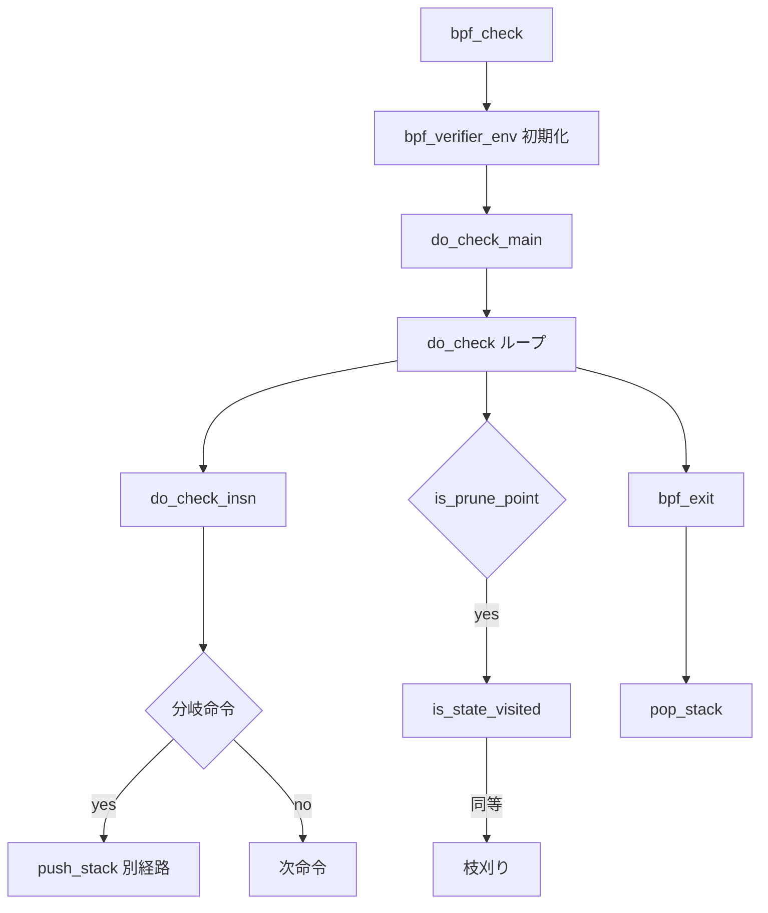

# 第7章 verifier の状態機械と命令探索

> **本章で読むソース**
>
> - [`kernel/bpf/verifier.c` L181-L193](https://github.com/gregkh/linux/blob/v6.18.38/kernel/bpf/verifier.c#L181-L193)
> - [`include/linux/bpf_verifier.h` L362-L414](https://github.com/gregkh/linux/blob/v6.18.38/include/linux/bpf_verifier.h#L362-L414)
> - [`kernel/bpf/verifier.c` L20295-L20348](https://github.com/gregkh/linux/blob/v6.18.38/kernel/bpf/verifier.c#L20295-L20348)
> - [`kernel/bpf/verifier.c` L19634-L19658](https://github.com/gregkh/linux/blob/v6.18.38/kernel/bpf/verifier.c#L19634-L19658)
> - [`kernel/bpf/verifier.c` L24847-L24879](https://github.com/gregkh/linux/blob/v6.18.38/kernel/bpf/verifier.c#L24847-L24879)
> - [`kernel/bpf/verifier.c` L20136-L20155](https://github.com/gregkh/linux/blob/v6.18.38/kernel/bpf/verifier.c#L20136-L20155)

## この章の狙い

**verifier** が eBPF プログラムを静的解析する中心ループ `do_check` と、分岐をスタックに積む状態機械を読む。
命令インデックスごとの `bpf_verifier_state`、訪問済み状態の枝刈り `is_state_visited`、入口 `bpf_check` までを追う。

## 前提

- [bpf_prog_load とプログラムオブジェクト](../part01-core/04-bpf-prog-load.md) で `bpf_check` がロード経路に挟まることを知っていること。
- 有向グラフ上のシンボリック実行の基本（分岐で状態を複製し、合流点で同等性を判定する）を知っていること。

## スタック要素と複雑度上限

分岐に遭遇すると、現在の verifier 状態と命令インデックスがスタックへ push される。

[`kernel/bpf/verifier.c` L181-L193](https://github.com/gregkh/linux/blob/v6.18.38/kernel/bpf/verifier.c#L181-L193)

```c
/* verifier_state + insn_idx are pushed to stack when branch is encountered */
struct bpf_verifier_stack_elem {
	/* verifier state is 'st'
	 * before processing instruction 'insn_idx'
	 * and after processing instruction 'prev_insn_idx'
	 */
	struct bpf_verifier_state st;
	int insn_idx;
	int prev_insn_idx;
	struct bpf_verifier_stack_elem *next;
	/* length of verifier log at the time this state was pushed on stack */
	u32 log_pos;
};
```

`BPF_COMPLEXITY_LIMIT_INSNS` と `BPF_COMPLEXITY_LIMIT_STATES` が探索空間の上限を決める。
超過時はロードを拒否し、カーネル内での解析コスト爆発を防ぐ。

## bpf_verifier_state と分岐カウンタ

`bpf_verifier_state` は呼び出しフレーム配列、親ポインタ、残り分岐数 `branches` を持つ。

[`include/linux/bpf_verifier.h` L362-L368](https://github.com/gregkh/linux/blob/v6.18.38/include/linux/bpf_verifier.h#L362-L368)

```c
struct bpf_verifier_state {
	/* call stack tracking */
	struct bpf_func_state *frame[MAX_CALL_FRAMES];
	struct bpf_verifier_state *parent;
	/* Acquired reference states */
	struct bpf_reference_state *refs;
```

[`include/linux/bpf_verifier.h` L413-L419](https://github.com/gregkh/linux/blob/v6.18.38/include/linux/bpf_verifier.h#L413-L419)

```c
	u32 branches;
	u32 insn_idx;
	u32 curframe;

	u32 acquired_refs;
	u32 active_locks;
	u32 active_preempt_locks;
```

コメントが示す木構造では、`branches==2` の状態が2つの子経路を表し、一方はスタックへ push され、もう一方は fallthrough として続行する。
`bpf_exit` 到達時に `update_branch_counts` が親へ戻り、スタックから pop して未探索分岐を再開する。

## do_check のメインループ

`do_check` は命令を1つずつ処理し、prune 点では `is_state_visited` を呼ぶ。

[`kernel/bpf/verifier.c` L20295-L20348](https://github.com/gregkh/linux/blob/v6.18.38/kernel/bpf/verifier.c#L20295-L20348)

```c
static int do_check(struct bpf_verifier_env *env)
{
	bool pop_log = !(env->log.level & BPF_LOG_LEVEL2);
	struct bpf_verifier_state *state = env->cur_state;
	struct bpf_insn *insns = env->prog->insnsi;
	int insn_cnt = env->prog->len;
	bool do_print_state = false;
	int prev_insn_idx = -1;

	for (;;) {
		struct bpf_insn *insn;
		struct bpf_insn_aux_data *insn_aux;
		int err, marks_err;

		env->cur_hist_ent = NULL;

		env->prev_insn_idx = prev_insn_idx;
		if (env->insn_idx >= insn_cnt) {
			verbose(env, "invalid insn idx %d insn_cnt %d\n",
				env->insn_idx, insn_cnt);
			return -EFAULT;
		}

		insn = &insns[env->insn_idx];
		insn_aux = &env->insn_aux_data[env->insn_idx];

		if (++env->insn_processed > BPF_COMPLEXITY_LIMIT_INSNS) {
			verbose(env,
				"BPF program is too large. Processed %d insn\n",
				env->insn_processed);
			return -E2BIG;
		}

		state->last_insn_idx = env->prev_insn_idx;
		state->insn_idx = env->insn_idx;

		if (is_prune_point(env, env->insn_idx)) {
			err = is_state_visited(env, env->insn_idx);
			if (err < 0)
				return err;
			if (err == 1) {
				goto process_bpf_exit;
			}
		}
```

`insn_processed` は分岐を何度辿っても累積するため、ループのあるプログラムでも全体の作業量に上限がある。
`is_prune_point` が真の命令では、過去に同等状態があれば探索を打ち切る。

## is_state_visited と枝刈りヒューリスティクス

訪問済み状態の照合は、メモリ消費と verifier 時間の主要ボトルネックである。

[`kernel/bpf/verifier.c` L19634-L19658](https://github.com/gregkh/linux/blob/v6.18.38/kernel/bpf/verifier.c#L19634-L19658)

```c
static int is_state_visited(struct bpf_verifier_env *env, int insn_idx)
{
	struct bpf_verifier_state_list *new_sl;
	struct bpf_verifier_state_list *sl;
	struct bpf_verifier_state *cur = env->cur_state, *new;
	bool force_new_state, add_new_state, loop;
	int n, err, states_cnt = 0;
	struct list_head *pos, *tmp, *head;

	force_new_state = env->test_state_freq || is_force_checkpoint(env, insn_idx) ||
			  cur->jmp_history_cnt > 40;

	/* bpf progs typically have pruning point every 4 instructions
	 * Do not add new state for future pruning if the verifier hasn't seen
	 * at least 2 jumps and at least 8 instructions.
	 * This heuristics helps decrease 'total_states' and 'peak_states' metric.
	 * In tests that amounts to up to 50% reduction into total verifier
	 * memory consumption and 20% verifier time speedup.
	 */
	add_new_state = force_new_state;
	if (env->jmps_processed - env->prev_jmps_processed >= 2 &&
	    env->insn_processed - env->prev_insn_processed >= 8)
		add_new_state = true;
```

コメントにあるとおり、ジャンプ2回と命令8個未満の区間では新状態を記録しないことがある。
精度と速度のトレードオフであり、テストでは verifier メモリと時間が大幅に削減される。

## bpf_check 入口

ロード経路から呼ばれる `bpf_check` は `bpf_verifier_env` を確保し、プログラム型に応じた ops を選ぶ。

[`kernel/bpf/verifier.c` L24847-L24879](https://github.com/gregkh/linux/blob/v6.18.38/kernel/bpf/verifier.c#L24847-L24879)

```c
int bpf_check(struct bpf_prog **prog, union bpf_attr *attr, bpfptr_t uattr, __u32 uattr_size)
{
	u64 start_time = ktime_get_ns();
	struct bpf_verifier_env *env;
	int i, len, ret = -EINVAL, err;
	u32 log_true_size;
	bool is_priv;

	if (ARRAY_SIZE(bpf_verifier_ops) == 0)
		return -EINVAL;

	env = kvzalloc(sizeof(struct bpf_verifier_env), GFP_KERNEL_ACCOUNT);
	if (!env)
		return -ENOMEM;

	env->bt.env = env;

	len = (*prog)->len;
	env->insn_aux_data =
		vzalloc(array_size(sizeof(struct bpf_insn_aux_data), len));
	ret = -ENOMEM;
	if (!env->insn_aux_data)
		goto err_free_env;
	for (i = 0; i < len; i++)
		env->insn_aux_data[i].orig_idx = i;
	env->prog = *prog;
	env->ops = bpf_verifier_ops[env->prog->type];
```

`insn_aux_data` は命令ごとのメタデータ（到達フラグ、map ポインタ状態など）を保持し、後段の dead code 除去でも使われる。

## 命令ごとの検査

各命令の意味論的更新は `do_check_insn` が担う。

[`kernel/bpf/verifier.c` L20136-L20155](https://github.com/gregkh/linux/blob/v6.18.38/kernel/bpf/verifier.c#L20136-L20155)

```c
static int do_check_insn(struct bpf_verifier_env *env, bool *do_print_state)
{
	int err;
	struct bpf_insn *insn = &env->prog->insnsi[env->insn_idx];
	u8 class = BPF_CLASS(insn->code);

	if (class == BPF_ALU || class == BPF_ALU64) {
		err = check_alu_op(env, insn);
		if (err)
			return err;

	} else if (class == BPF_LDX) {
		bool is_ldsx = BPF_MODE(insn->code) == BPF_MEMSX;

		/* Check for reserved fields is already done in
		 * resolve_pseudo_ldimm64().
		 */
		err = check_load_mem(env, insn, false, is_ldsx, true, "ldx");
		if (err)
			return err;
```

helper 呼び出し、サブプログラム call、tail call は `do_check_insn` の後半で専用チェック関数へ分岐する。
ALU と LDX はレジスタ状態を更新する共通経路に入る（第8章、第9章）。

## 処理の流れ



全体は深さ優先に近い探索で、スタックに積んだ分岐を後から処理する。

## 高速化と最適化の工夫

verifier は正しさのための全経路探索であり、実行時の高速化が目的ではない。
それでも `is_state_visited` のヒューリスティクスと prune 点の設計は、状態リストの爆発を抑え、ロードレイテンシを実用範囲に収める。

`BPF_COMPLEXITY_LIMIT_INSNS` による早期打ち切りは、悪意ある巨大プログラムによる CPU 占有を防ぐ。
カーネル全体のスループット保護として、単一プログラムの検証コストに上限を設けている。

## まとめ

verifier は `do_check` ループで命令列を symbolic に実行し、分岐をスタックで管理する。
`is_state_visited` が同等状態を見つけると探索を枝刈りし、複雑度上限が暴走を防ぐ。
次章では各命令が更新する `bpf_reg_state` の型と値追跡を読む。

## 関連する章

- [レジスタ型と値追跡](08-verifier-register-types.md)
- [bpf_prog_load とプログラムオブジェクト](../part01-core/04-bpf-prog-load.md)
