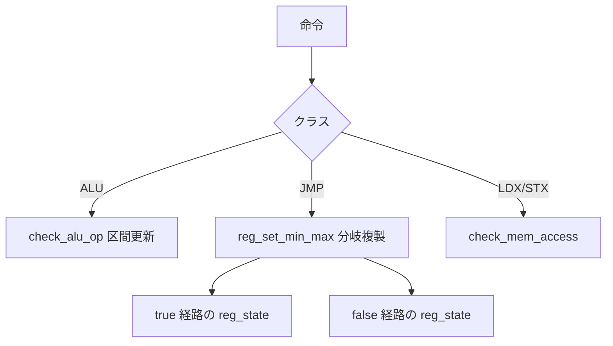

# 第8章 レジスタ型と値追跡

> **本章で読むソース**
>
> - [`include/linux/bpf.h` L959-L972](https://github.com/gregkh/linux/blob/v6.18.38/include/linux/bpf.h#L959-L973)
> - [`include/linux/bpf_verifier.h` L37-L57](https://github.com/gregkh/linux/blob/v6.18.38/include/linux/bpf_verifier.h#L37-L80)
> - [`include/linux/bpf_verifier.h` L112-L131](https://github.com/gregkh/linux/blob/v6.18.38/include/linux/bpf_verifier.h#L112-L131)
> - [`kernel/bpf/verifier.c` L16637-L16667](https://github.com/gregkh/linux/blob/v6.18.38/kernel/bpf/verifier.c#L16637-L16668)
> - [`kernel/bpf/verifier.c` L16670-L16685](https://github.com/gregkh/linux/blob/v6.18.38/kernel/bpf/verifier.c#L16670-L16685)
> - [`kernel/bpf/verifier.c` L20136-L20155](https://github.com/gregkh/linux/blob/v6.18.38/kernel/bpf/verifier.c#L20136-L20155)
> - [`kernel/bpf/verifier.c` L22567-L22608](https://github.com/gregkh/linux/blob/v6.18.38/kernel/bpf/verifier.c#L22567-L22608)

## この章の狙い

verifier が各 eBPF レジスタに付与する **型**（`enum bpf_reg_type`）と、スカラー値の区間表現（`smin_value` から `umax_value`）を読む。
条件分岐でレジスタ状態を複製する `reg_set_min_max` と、NULL チェック後の型更新を追う。

## 前提

- [verifier の状態機械と命令探索](07-verifier-state-exploration.md) で `bpf_verifier_state` と `do_check_insn` の位置を知っていること。
- tnum（tracking number）がビット単位の抽象値を表すことを知っていること（詳細は `kernel/bpf/tnum.c`）。

## bpf_reg_type の分類

レジスタはスカラーか、コンテキスト、map、パケット、ソケットなどのポインタ種別かを区別する。

[`include/linux/bpf.h` L959-L973](https://github.com/gregkh/linux/blob/v6.18.38/include/linux/bpf.h#L959-L973)

```c
enum bpf_reg_type {
	NOT_INIT = 0,		 /* nothing was written into register */
	SCALAR_VALUE,		 /* reg doesn't contain a valid pointer */
	PTR_TO_CTX,		 /* reg points to bpf_context */
	CONST_PTR_TO_MAP,	 /* reg points to struct bpf_map */
	PTR_TO_MAP_VALUE,	 /* reg points to map element value */
	PTR_TO_MAP_KEY,		 /* reg points to a map element key */
	PTR_TO_STACK,		 /* reg == frame_pointer + offset */
	PTR_TO_PACKET_META,	 /* skb->data - meta_len */
	PTR_TO_PACKET,		 /* reg points to skb->data */
	PTR_TO_PACKET_END,	 /* skb->data + headlen */
	PTR_TO_FLOW_KEYS,	 /* reg points to bpf_flow_keys */
	PTR_TO_SOCKET,		 /* reg points to struct bpf_sock */
	PTR_TO_SOCK_COMMON,	 /* reg points to sock_common */
	PTR_TO_TCP_SOCK,	 /* reg points to struct tcp_sock */
```

`PTR_MAYBE_NULL` フラグを付けた拡張型（`PTR_TO_MAP_VALUE_OR_NULL` など）は、明示的な NULL チェック前後で型が遷移する。
helper の戻り値型もこの列挙に写像される。

## bpf_reg_state の構造

型に応じた共用体フィールドと、スカラー区間が同居する。

[`include/linux/bpf_verifier.h` L37-L80](https://github.com/gregkh/linux/blob/v6.18.38/include/linux/bpf_verifier.h#L37-L80)

```c
struct bpf_reg_state {
	/* Ordering of fields matters.  See states_equal() */
	enum bpf_reg_type type;
	/*
	 * Fixed part of pointer offset, pointer types only.
	 * Or constant delta between "linked" scalars with the same ID.
	 */
	s32 off;
	union {
		/* valid when type == PTR_TO_PACKET */
		int range;

		/* valid when type == CONST_PTR_TO_MAP | PTR_TO_MAP_VALUE |
		 *   PTR_TO_MAP_VALUE_OR_NULL
		 */
		struct {
			struct bpf_map *map_ptr;
			/* To distinguish map lookups from outer map
			 * the map_uid is non-zero for registers
			 * pointing to inner maps.
			 */
			u32 map_uid;
		};

		/* for PTR_TO_BTF_ID */
		struct {
			struct btf *btf;
			u32 btf_id;
		};

		struct { /* for PTR_TO_MEM | PTR_TO_MEM_OR_NULL */
			u32 mem_size;
			u32 dynptr_id; /* for dynptr slices */
		};

		/* For dynptr stack slots */
		struct {
			enum bpf_dynptr_type type;
			/* A dynptr is 16 bytes so it takes up 2 stack slots.
			 * We need to track which slot is the first slot
			 * to protect against cases where the user may try to
			 * pass in an address starting at the second slot of the
			 * dynptr.
			 */
```

`map_ptr` は map lookup 後の値ポインタ検証に使われる。
`range` はパケット終端までの残りバイト数の抽象表現である。

スカラー値の追跡フィールドは次の通りである。

[`include/linux/bpf_verifier.h` L112-L131](https://github.com/gregkh/linux/blob/v6.18.38/include/linux/bpf_verifier.h#L112-L131)

```c
	struct tnum var_off;
	s64 smin_value; /* minimum possible (s64)value */
	s64 smax_value; /* maximum possible (s64)value */
	u64 umin_value; /* minimum possible (u64)value */
	u64 umax_value; /* maximum possible (u64)value */
	s32 s32_min_value; /* minimum possible (s32)value */
	s32 s32_max_value; /* maximum possible (s32)value */
	u32 u32_min_value; /* minimum possible (u32)value */
	u32 u32_max_value; /* maximum possible (u32)value */
```

ALU 命令はこれらの区間を更新し、比較命令は分岐ごとに異なるレジスタコピーへ反映する。
32ビット演算と64ビット演算で別レンジを持つのは、JIT が32ビット部分だけを使う命令に対応するためである。

## 条件分岐での区間絞り込み

`reg_set_min_max` はジャンプの true/false 両経路に対して `regs_refine_cond_op` を適用する。

[`kernel/bpf/verifier.c` L16637-L16668](https://github.com/gregkh/linux/blob/v6.18.38/kernel/bpf/verifier.c#L16637-L16668)

```c
static int reg_set_min_max(struct bpf_verifier_env *env,
			   struct bpf_reg_state *true_reg1,
			   struct bpf_reg_state *true_reg2,
			   struct bpf_reg_state *false_reg1,
			   struct bpf_reg_state *false_reg2,
			   u8 opcode, bool is_jmp32)
{
	int err;

	/* If either register is a pointer, we can't learn anything about its
	 * variable offset from the compare (unless they were a pointer into
	 * the same object, but we don't bother with that).
	 */
	if (false_reg1->type != SCALAR_VALUE || false_reg2->type != SCALAR_VALUE)
		return 0;

	/* fallthrough (FALSE) branch */
	regs_refine_cond_op(false_reg1, false_reg2, rev_opcode(opcode), is_jmp32);
	reg_bounds_sync(false_reg1);
	reg_bounds_sync(false_reg2);

	/* jump (TRUE) branch */
	regs_refine_cond_op(true_reg1, true_reg2, opcode, is_jmp32);
	reg_bounds_sync(true_reg1);
	reg_bounds_sync(true_reg2);

	err = reg_bounds_sanity_check(env, true_reg1, "true_reg1");
	err = err ?: reg_bounds_sanity_check(env, true_reg2, "true_reg2");
	err = err ?: reg_bounds_sanity_check(env, false_reg1, "false_reg1");
	err = err ?: reg_bounds_sanity_check(env, false_reg2, "false_reg2");
	return err;
}
```

ポインタ同士の比較では区間更新をスキップする。
スカラー比較だけが値追跡の恩恵を受け、配列インデックスの範囲証明に使われる。

## NULL チェック後の型遷移

map 値ポインタやソケットポインタは、NULL テスト後に非 NULL 型へ昇格する。

[`kernel/bpf/verifier.c` L16670-L16685](https://github.com/gregkh/linux/blob/v6.18.38/kernel/bpf/verifier.c#L16670-L16685)

```c
static void mark_ptr_or_null_reg(struct bpf_func_state *state,
				 struct bpf_reg_state *reg, u32 id,
				 bool is_null)
{
	if (type_may_be_null(reg->type) && reg->id == id &&
	    (is_rcu_reg(reg) || !WARN_ON_ONCE(!reg->id))) {
		/* Old offset (both fixed and variable parts) should have been
		 * known-zero, because we don't allow pointer arithmetic on
		 * pointers that might be NULL. If we see this happening, don't
		 * convert the register.
		 *
		 * But in some cases, some helpers that return local kptrs
		 * advance offset for the returned pointer. In those cases, it
		 * is fine to expect to see reg->off.
		 */
```

同一 `id` を持つレジスタはリンクされ、一方で NULL 判定が行われると他方も更新される。
これにより `if (ptr)` の後だけ dereference を許可できる。

## 命令クラスごとの更新

`do_check_insn` は命令クラスで処理を分岐する。

[`kernel/bpf/verifier.c` L20136-L20155](https://github.com/gregkh/linux/blob/v6.18.38/kernel/bpf/verifier.c#L20136-L20155)

```c
static int do_check_insn(struct bpf_verifier_env *env, bool *do_print_state)
{
	int err;
	struct bpf_insn *insn = &env->prog->insnsi[env->insn_idx];
	u8 class = BPF_CLASS(insn->code);

	if (class == BPF_ALU || class == BPF_ALU64) {
		err = check_alu_op(env, insn);
		if (err)
			return err;

	} else if (class == BPF_LDX) {
		bool is_ldsx = BPF_MODE(insn->code) == BPF_MEMSX;

		err = check_load_mem(env, insn, false, is_ldsx, true, "ldx");
		if (err)
			return err;
```

ALU はレジスタ型を維持したまま区間演算を行う。
LDX はソースポインタの型に応じた `check_mem_access` へ委譲する（第9章）。

## 処理の流れ



分岐後は `bpf_verifier_state` が複製され、スタックに積まれた経路それぞれが独立したレジスタ集合を持つ。

## 高速化と最適化の工夫

値追跡は検証時のみ動作するが、その結果が検証後の命令書き換えに直結する。
例えばポインタ加算は `sanitize_ptr_alu` でオフセットの危険域を記録し、`do_misc_fixups` が投機実行対策用のマスク命令列へ展開する。
通常の `array_map_lookup_elem` helper は helper 内で index を検査するため、verifier のスカラー区間証明だけではその検査が JIT から除去されるわけではない。

[`kernel/bpf/verifier.c` L22567-L22608](https://github.com/gregkh/linux/blob/v6.18.38/kernel/bpf/verifier.c#L22567-L22608)

```c
		/* Rewrite pointer arithmetic to mitigate speculation attacks. */
		if (insn->code == (BPF_ALU64 | BPF_ADD | BPF_X) ||
		    insn->code == (BPF_ALU64 | BPF_SUB | BPF_X)) {
			const u8 code_add = BPF_ALU64 | BPF_ADD | BPF_X;
			const u8 code_sub = BPF_ALU64 | BPF_SUB | BPF_X;
			struct bpf_insn *patch = insn_buf;
			bool issrc, isneg, isimm;
			u32 off_reg;

			aux = &env->insn_aux_data[i + delta];
			if (!aux->alu_state ||
			    aux->alu_state == BPF_ALU_NON_POINTER)
				goto next_insn;

			isneg = aux->alu_state & BPF_ALU_NEG_VALUE;
			issrc = (aux->alu_state & BPF_ALU_SANITIZE) ==
				BPF_ALU_SANITIZE_SRC;
			isimm = aux->alu_state & BPF_ALU_IMMEDIATE;

			off_reg = issrc ? insn->src_reg : insn->dst_reg;
			if (isimm) {
				*patch++ = BPF_MOV32_IMM(BPF_REG_AX, aux->alu_limit);
			} else {
				if (isneg)
					*patch++ = BPF_ALU64_IMM(BPF_MUL, off_reg, -1);
				*patch++ = BPF_MOV32_IMM(BPF_REG_AX, aux->alu_limit);
				*patch++ = BPF_ALU64_REG(BPF_SUB, BPF_REG_AX, off_reg);
				*patch++ = BPF_ALU64_REG(BPF_OR, BPF_REG_AX, off_reg);
				*patch++ = BPF_ALU64_IMM(BPF_NEG, BPF_REG_AX, 0);
				*patch++ = BPF_ALU64_IMM(BPF_ARSH, BPF_REG_AX, 63);
				*patch++ = BPF_ALU64_REG(BPF_AND, BPF_REG_AX, off_reg);
			}
			if (!issrc)
				*patch++ = BPF_MOV64_REG(insn->dst_reg, insn->src_reg);
			insn->src_reg = BPF_REG_AX;
			if (isneg)
				insn->code = insn->code == code_add ?
					     code_sub : code_add;
			*patch++ = *insn;
			if (issrc && isneg && !isimm)
				*patch++ = BPF_ALU64_IMM(BPF_MUL, off_reg, -1);
			cnt = patch - insn_buf;
```

`is_state_visited` の状態比較は `states_equal` がレジスタ型と区間の一致を見る。
区間が粗すぎると枝刈りが効きにくく verifier が遅くなり、細かすぎると状態数が増える。
`reg_bounds_sync` による区間の正規化は、このバランスを保つ内部工夫である。

## まとめ

verifier は各レジスタに型と値区間を付け、分岐で経路ごとに状態を更新する。
スカラー追跡は配列アクセスの安全性証明に、型追跡はポインタ dereference の許可に使われる。
次章ではメモリアクセス検査とポインタ種別ごとの境界ルールを読む。

## 関連する章

- [境界検査とポインタ種別](09-verifier-bounds-pointers.md)
- [liveness と到達不能除去](10-verifier-liveness-dead-code.md)
