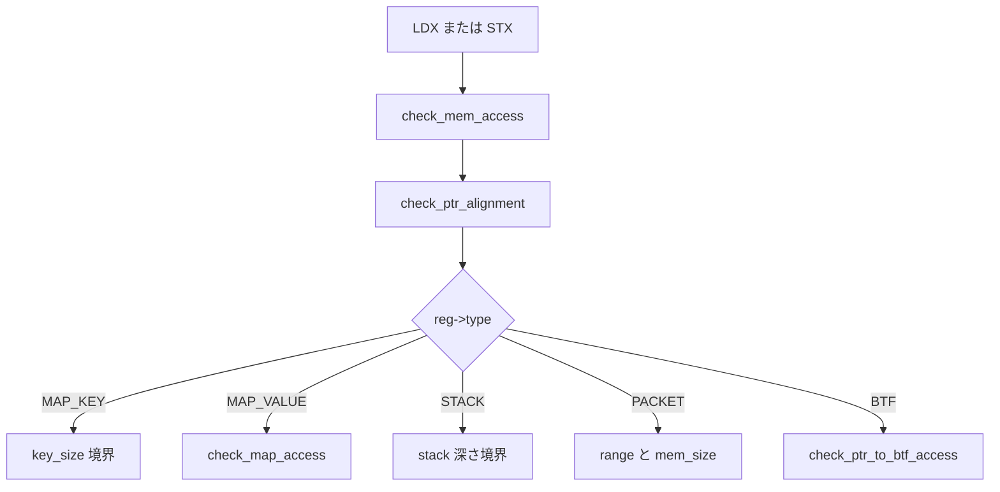

# 第9章 境界検査とポインタ種別

> **本章で読むソース**
>
> - [`kernel/bpf/verifier.c` L102-L108](https://github.com/gregkh/linux/blob/v6.18.38/kernel/bpf/verifier.c#L102-L108)
> - [`kernel/bpf/verifier.c` L7540-L7585](https://github.com/gregkh/linux/blob/v6.18.38/kernel/bpf/verifier.c#L7540-L7585)
> - [`kernel/bpf/verifier.c` L7216-L7240](https://github.com/gregkh/linux/blob/v6.18.38/kernel/bpf/verifier.c#L7216-L7240)
> - [`kernel/bpf/verifier.c` L5709-L5730](https://github.com/gregkh/linux/blob/v6.18.38/kernel/bpf/verifier.c#L5709-L5730)
> - [`include/linux/bpf_verifier.h` L978-L983](https://github.com/gregkh/linux/blob/v6.18.38/include/linux/bpf_verifier.h#L978-L983)
> - [`kernel/bpf/verifier.c` L226-L234](https://github.com/gregkh/linux/blob/v6.18.38/kernel/bpf/verifier.c#L226-L234)

## この章の狙い

verifier が load/store を許可する前に行う **境界検査** と、ポインタ種別ごとのルールを読む。
`check_mem_access` の分岐、`PTR_TO_BTF_ID` 経由の構造体アクセス、map ポインタの汚染マークまでを追う。

## 前提

- [レジスタ型と値追跡](08-verifier-register-types.md) で `bpf_reg_type` と `bpf_reg_state` を知っていること。
- map の key/value サイズがロード時に固定されることを知っていること。

## check_mem_access が扱うポインタ種別

ファイル先頭のコメントは、メモリアクセス検査が認識する主要ポインタ型を列挙する。

[`kernel/bpf/verifier.c` L100-L102](https://github.com/gregkh/linux/blob/v6.18.38/kernel/bpf/verifier.c#L100-L102)

```c
 * When verifier sees load or store instructions the type of base register
 * can be: PTR_TO_MAP_VALUE, PTR_TO_CTX, PTR_TO_STACK, PTR_TO_SOCKET. These are
 * four pointer types recognized by check_mem_access() function.
```

パケット、map、スタックはトレーシングと map プログラムで頻出する。
その他の型（`PTR_TO_CTX`、`PTR_TO_BTF_ID` など）は専用チェック関数へ分岐する。

## check_mem_access の入口

アラインメント検査のあと、オフセットに `reg->off` を加算し、型別ハンドラへ進む。

[`kernel/bpf/verifier.c` L7540-L7585](https://github.com/gregkh/linux/blob/v6.18.38/kernel/bpf/verifier.c#L7540-L7585)

```c
static int check_mem_access(struct bpf_verifier_env *env, int insn_idx, u32 regno,
			    int off, int bpf_size, enum bpf_access_type t,
			    int value_regno, bool strict_alignment_once, bool is_ldsx)
{
	struct bpf_reg_state *regs = cur_regs(env);
	struct bpf_reg_state *reg = regs + regno;
	int size, err = 0;

	size = bpf_size_to_bytes(bpf_size);
	if (size < 0)
		return size;

	err = check_ptr_alignment(env, reg, off, size, strict_alignment_once);
	if (err)
		return err;

	off += reg->off;

	if (reg->type == PTR_TO_MAP_KEY) {
		if (t == BPF_WRITE) {
			verbose(env, "write to change key R%d not allowed\n", regno);
			return -EACCES;
		}

		err = check_mem_region_access(env, regno, off, size,
					      reg->map_ptr->key_size, false);
		if (err)
			return err;
		if (value_regno >= 0)
			mark_reg_unknown(env, regs, value_regno);
	} else if (reg->type == PTR_TO_MAP_VALUE) {
		struct btf_field *kptr_field = NULL;

		if (t == BPF_WRITE && value_regno >= 0 &&
		    is_pointer_value(env, value_regno)) {
			verbose(env, "R%d leaks addr into map\n", value_regno);
			return -EACCES;
		}
		err = check_map_access_type(env, regno, off, size, t);
		if (err)
			return err;
		err = check_map_access(env, regno, off, size, false, ACCESS_DIRECT);
		if (err)
			return err;
```

map key への書き込みは禁止され、value へのポインタ書き込みはアドレス漏えいとして拒否される。
読み取り成功時は値レジスタを unknown に戻し、以降の追跡をリセットする。

## BTF 型付きポインタアクセス

カーネル構造体フィールドへのアクセスは BTF オフセット表で検証する。

[`kernel/bpf/verifier.c` L7216-L7241](https://github.com/gregkh/linux/blob/v6.18.38/kernel/bpf/verifier.c#L7216-L7241)

```c
static int check_ptr_to_btf_access(struct bpf_verifier_env *env,
				   struct bpf_reg_state *regs,
				   int regno, int off, int size,
				   enum bpf_access_type atype,
				   int value_regno)
{
	struct bpf_reg_state *reg = regs + regno;
	const struct btf_type *t = btf_type_by_id(reg->btf, reg->btf_id);
	const char *tname = btf_name_by_offset(reg->btf, t->name_off);
	const char *field_name = NULL;
	enum bpf_type_flag flag = 0;
	u32 btf_id = 0;
	int ret;

	if (!env->allow_ptr_leaks) {
		verbose(env,
			"'struct %s' access is allowed only to CAP_PERFMON and CAP_SYS_ADMIN\n",
			tname);
		return -EPERM;
	}
	if (!env->prog->gpl_compatible && btf_is_kernel(reg->btf)) {
		verbose(env,
			"Cannot access kernel 'struct %s' from non-GPL compatible program\n",
			tname);
		return -EINVAL;
	}
```

tracing プログラムが `bpf_probe_read_kernel` の代わりに直接フィールドを読む場合、この経路が安全性を担保する。
許可されないオフセットやサイズはロード前に拒否される。

## パケット境界の min/max 検査

パケットポインタでは、固定オフセットと可変オフセットの両方について境界を確認する。

[`kernel/bpf/verifier.c` L5709-L5733](https://github.com/gregkh/linux/blob/v6.18.38/kernel/bpf/verifier.c#L5709-L5733)

```c
static int __check_mem_access(struct bpf_verifier_env *env, int regno,
			      int off, int size, u32 mem_size,
			      bool zero_size_allowed)
{
	bool size_ok = size > 0 || (size == 0 && zero_size_allowed);
	struct bpf_reg_state *reg;

	if (off >= 0 && size_ok && (u64)off + size <= mem_size)
		return 0;

	reg = &cur_regs(env)[regno];
	switch (reg->type) {
	case PTR_TO_MAP_KEY:
		verbose(env, "invalid access to map key, key_size=%d off=%d size=%d\n",
			mem_size, off, size);
		break;
	case PTR_TO_MAP_VALUE:
		verbose(env, "invalid access to map value, value_size=%d off=%d size=%d\n",
			mem_size, off, size);
		break;
	case PTR_TO_PACKET:
	case PTR_TO_PACKET_META:
	case PTR_TO_PACKET_END:
		verbose(env, "invalid access to packet, off=%d size=%d, R%d(id=%d,off=%d,r=%d)\n",
			off, size, regno, reg->id, off, mem_size);
		break;
```

`smin_value` と `umax_value` の両方で region を検査することで、可変インデックスでも out-of-bounds を排除する。
network 分冊で扱う XDP/tc でも同じ機構が使われる。

## パケットポインタ判定

型がパケット関連かどうかはインライン関数で判定する。

[`include/linux/bpf_verifier.h` L978-L983](https://github.com/gregkh/linux/blob/v6.18.38/include/linux/bpf_verifier.h#L978-L983)

```c
static inline bool type_is_pkt_pointer(enum bpf_reg_type type)
{
	type = base_type(type);
	return type == PTR_TO_PACKET ||
	       type == PTR_TO_PACKET_META;
}
```

`PTR_TO_PACKET_END` は別途 `check_mem_access` 内で扱われ、パケット終端との距離計算に使われる。

## map ポインタの汚染マーク

非特権プログラムから得た map ポインタは、特権操作と組み合わせないよう poison される。

[`kernel/bpf/verifier.c` L226-L234](https://github.com/gregkh/linux/blob/v6.18.38/kernel/bpf/verifier.c#L226-L234)

```c
static void bpf_map_ptr_store(struct bpf_insn_aux_data *aux,
			      struct bpf_map *map,
			      bool unpriv, bool poison)
{
	unpriv |= bpf_map_ptr_unpriv(aux);
	aux->map_ptr_state.unpriv = unpriv;
	aux->map_ptr_state.poison = poison;
	aux->map_ptr_state.map_ptr = map;
}
```

命令ごとの `insn_aux_data` に map 状態を記録し、後続命令で再利用する。
これにより map フェッチと helper 引数の整合を静的に検証できる。

## 処理の流れ



いずれの経路でも失敗すればロードは拒否され、JIT には到達しない。

## 高速化と最適化の工夫

境界検査は verifier 内で完結するが、その結果が実行コードのチェック削減につながる。
証明済みの固定オフセットアクセスは、JIT が runtime 境界チェックを省略できる。

`check_ptr_alignment` と `BPF_F_STRICT_ALIGNMENT` の組み合わせは、非アラインアクセスを拒否してアーキテクチャごとの高速 load/store 命令を使えるようにする。
アンパックされたバイト列アクセスより、検証コストは増えるが実行時のメモリ帯域が改善される。

## まとめ

`check_mem_access` はポインタ種別ごとに異なる境界規則を適用し、map 汚染や BTF オフセット整合もここで処理する。
スカラー区間と組み合わせることで、可変インデックスでも out-of-bounds を静的に排除する。
次章では到達不能命令の除去と liveness 解析を読む。

## 関連する章

- [liveness と到達不能除去](10-verifier-liveness-dead-code.md)
- [BTF と型情報](../part04-btf-attach/14-btf-type-info.md)
