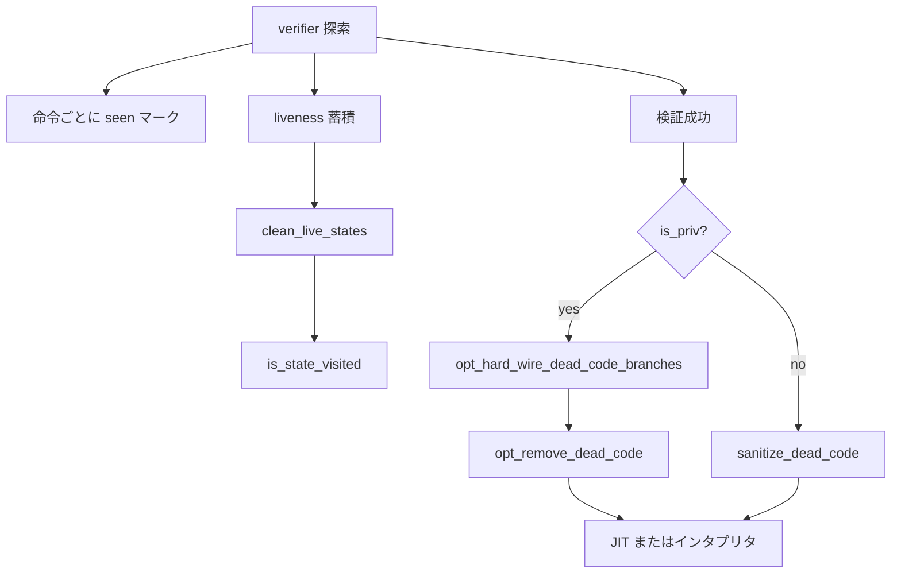

# 第10章 liveness と到達不能除去

> **本章で読むソース**
>
> - [`kernel/bpf/liveness.c` L9-L31](https://github.com/gregkh/linux/blob/v6.18.38/kernel/bpf/liveness.c#L9-L31)
> - [`kernel/bpf/liveness.c` L689-L704](https://github.com/gregkh/linux/blob/v6.18.38/kernel/bpf/liveness.c#L689-L704)
> - [`kernel/bpf/liveness.c` L707-L714](https://github.com/gregkh/linux/blob/v6.18.38/kernel/bpf/liveness.c#L707-L714)
> - [`kernel/bpf/verifier.c` L21307-L21331](https://github.com/gregkh/linux/blob/v6.18.38/kernel/bpf/verifier.c#L21307-L21331)
> - [`kernel/bpf/verifier.c` L21348-L21371](https://github.com/gregkh/linux/blob/v6.18.38/kernel/bpf/verifier.c#L21348-L21371)
> - [`kernel/bpf/verifier.c` L25012-L25022](https://github.com/gregkh/linux/blob/v6.18.38/kernel/bpf/verifier.c#L25012-L25022)
> - [`kernel/bpf/verifier.c` L19660](https://github.com/gregkh/linux/blob/v6.18.38/kernel/bpf/verifier.c#L19660)

## この章の狙い

verifier が検証中に記録する命令の **到達フラグ** と、スタックスロットの **liveness** 解析を読む。
到達不能命令の trap 化 `sanitize_dead_code`、条件分岐の硬い配線 `opt_hard_wire_dead_code_branches` が JIT とインタプリタの両方に与える影響を押さえる。

## 前提

- [verifier の状態機械と命令探索](07-verifier-state-exploration.md) で `insn_aux_data` と `is_state_visited` を知っていること。
- データフロー解析の live variable 概念（定義から使用まで生存する変数）を知っていること。

## liveness 解析の目的

`liveness.c` はスタックスロットの生存解析を実装し、状態キャッシュの精度を上げる。

[`kernel/bpf/liveness.c` L9-L31](https://github.com/gregkh/linux/blob/v6.18.38/kernel/bpf/liveness.c#L9-L31)

```c
/*
 * This file implements live stack slots analysis. After accumulating
 * stack usage data, the analysis answers queries about whether a
 * particular stack slot may be read by an instruction or any of it's
 * successors.  This data is consumed by the verifier states caching
 * mechanism to decide which stack slots are important when looking for a
 * visited state corresponding to the current state.
 *
 * The analysis is call chain sensitive, meaning that data is collected
 * and queried for tuples (call chain, subprogram instruction index).
 * Such sensitivity allows identifying if some subprogram call always
 * leads to writes in the caller's stack.
 *
 * The basic idea is as follows:
 * - As the verifier accumulates a set of visited states, the analysis instance
 *   accumulates a conservative estimate of stack slots that can be read
 *   or must be written for each visited tuple (call chain, instruction index).
 * - If several states happen to visit the same instruction with the same
 *   call chain, stack usage information for the corresponding tuple is joined:
 *   - "may_read" set represents a union of all possibly read slots
 *     (any slot in "may_read" set might be read at or after the instruction);
 *   - "must_write" set represents an intersection of all possibly written slots
 *     (any slot in "must_write" set is guaranteed to be written by the instruction).
```

コールチェーンごとにスタック使用を追跡するため、サブプログラム呼び出しが呼び出し元スタックを汚染するかどうかを区別できる。
`is_state_visited` が状態を比較するとき、死んでいるスタックスロットを無視できれば誤った枝刈りを減らせる。

## クエリ API

検証中に現在状態へ対応する liveness クエリを初期化する。

[`kernel/bpf/liveness.c` L689-L704](https://github.com/gregkh/linux/blob/v6.18.38/kernel/bpf/liveness.c#L689-L704)

```c
int bpf_live_stack_query_init(struct bpf_verifier_env *env, struct bpf_verifier_state *st)
{
	struct live_stack_query *q = &env->liveness->live_stack_query;
	struct func_instance *instance;
	u32 frame;

	memset(q, 0, sizeof(*q));
	for (frame = 0; frame <= st->curframe; frame++) {
		instance = lookup_instance(env, st, frame);
		if (IS_ERR(instance))
			return PTR_ERR(instance);
		q->instances[frame] = instance;
	}
	q->curframe = st->curframe;
	q->insn_idx = st->insn_idx;
	return 0;
}
```

スロットが生存しているかは、後続命令や外側フレームのコールサイトを見て判定する。

[`kernel/bpf/liveness.c` L707-L714](https://github.com/gregkh/linux/blob/v6.18.38/kernel/bpf/liveness.c#L707-L714)

```c
bool bpf_stack_slot_alive(struct bpf_verifier_env *env, u32 frameno, u32 spi)
{
	/*
	 * Slot is alive if it is read before q->st->insn_idx in current func instance,
	 * or if for some outer func instance:
	 * - alive before callsite if callsite calls callback, otherwise
	 * - alive after callsite
	 */
```

未初期化スタック読み取りの検出と、状態等価判定の両方にこの情報が効く。

## 到達不能命令の trap 化

検証完了後、一度も `seen` にならなかった命令は無限ループへ飛ばす trap に置き換える。
コメントが示すとおり、単なる nop ではなく誤ジャンプ時にプログラム外へ抜けないよう防御する。

[`kernel/bpf/verifier.c` L21307-L21331](https://github.com/gregkh/linux/blob/v6.18.38/kernel/bpf/verifier.c#L21307-L21331)

```c
/* The verifier does more data flow analysis than llvm and will not
 * explore branches that are dead at run time. Malicious programs can
 * have dead code too. Therefore replace all dead at-run-time code
 * with 'ja -1'.
 *
 * Just nops are not optimal, e.g. if they would sit at the end of the
 * program and through another bug we would manage to jump there, then
 * we'd execute beyond program memory otherwise. Returning exception
 * code also wouldn't work since we can have subprogs where the dead
 * code could be located.
 */
static void sanitize_dead_code(struct bpf_verifier_env *env)
{
	struct bpf_insn_aux_data *aux_data = env->insn_aux_data;
	struct bpf_insn trap = BPF_JMP_IMM(BPF_JA, 0, 0, -1);
	struct bpf_insn *insn = env->prog->insnsi;
	const int insn_cnt = env->prog->len;
	int i;

	for (i = 0; i < insn_cnt; i++) {
		if (aux_data[i].seen)
			continue;
		memcpy(insn + i, &trap, sizeof(trap));
		aux_data[i].zext_dst = false;
	}
}
```

`BPF_JA` のオフセット `-1` は自己ループであり、誤って到達した場合にプログラムを停止させる。
命令スロット数は減らないが、未検証バイト列の実行を防ぐ。

## 条件分岐の硬い配線

一方通行と証明された分岐は、到達不能側へ飛ぶ無条件 `BPF_JA` へ書き換える。
条件ジャンプの命令スロットは残るが、実行時の分岐予測ミスを減らす。

[`kernel/bpf/verifier.c` L21348-L21371](https://github.com/gregkh/linux/blob/v6.18.38/kernel/bpf/verifier.c#L21348-L21371)

```c
static void opt_hard_wire_dead_code_branches(struct bpf_verifier_env *env)
{
	struct bpf_insn_aux_data *aux_data = env->insn_aux_data;
	struct bpf_insn ja = BPF_JMP_IMM(BPF_JA, 0, 0, 0);
	struct bpf_insn *insn = env->prog->insnsi;
	const int insn_cnt = env->prog->len;
	int i;

	for (i = 0; i < insn_cnt; i++, insn++) {
		if (!insn_is_cond_jump(insn->code))
			continue;

		if (!aux_data[i + 1].seen)
			ja.off = insn->off;
		else if (!aux_data[i + 1 + insn->off].seen)
			ja.off = 0;
		else
			continue;

		if (bpf_prog_is_offloaded(env->prog->aux))
			bpf_prog_offload_replace_insn(env, i, &ja);

		memcpy(insn, &ja, sizeof(ja));
	}
}
```

値追跡の結果、条件が常真または常偽と分かったジャンプは、実行時の分岐予測ミスを減らす。
JIT もこの書き換え後の命令列を入力にする。

## 特権プログラムと非特権プログラムの分岐

`sanitize_dead_code` と `opt_hard_wire_dead_code_branches` は同時には走らない。
特権プログラムは硬い配線のあと `opt_remove_dead_code` で未到達スロットを物理削除できる。
非特権プログラムは trap 化のみで、命令列長は維持される。

[`kernel/bpf/verifier.c` L25012-L25022](https://github.com/gregkh/linux/blob/v6.18.38/kernel/bpf/verifier.c#L25012-L25022)

```c
	if (is_priv) {
		if (ret == 0)
			opt_hard_wire_dead_code_branches(env);
		if (ret == 0)
			ret = opt_remove_dead_code(env);
		if (ret == 0)
			ret = opt_remove_nops(env);
	} else {
		if (ret == 0)
			sanitize_dead_code(env);
	}
```

## is_state_visited との連携

枝刈り前に live 状態を掃除する呼び出しが入る。

[`kernel/bpf/verifier.c` L19660](https://github.com/gregkh/linux/blob/v6.18.38/kernel/bpf/verifier.c#L19660)

```c
	clean_live_states(env, insn_idx, cur);
```

同等状態判定から不要なスタック情報を落とし、キャッシュヒット率を上げる。
liveness 解析は verifier 時間の20%削減に寄与する枝刈り精度向上の一部を担う。

## 処理の流れ



検証後の命令列は、特権なら分岐単純化と物理削除、非特権なら trap 化が適用される。

## 高速化と最適化の工夫

liveness 解析自体はロード時コストを増やすが、`is_state_visited` の精度向上により全体の verifier 時間とメモリを削減する。
スタックスロットのうち将来読まれないものを状態比較から除外できるため、状態リストの爆発を抑える。

`sanitize_dead_code` は未到達命令を trap 化する防御処理であり、命令数は減らない。
`opt_hard_wire_dead_code_branches` は条件分岐を無条件ジャンプへ変えるが、スロット自体は残る。
特権プログラムだけが `opt_remove_dead_code` でスロット削除と I-cache フットプリント削減まで進める。

## まとめ

liveness 解析はスタックスロットの生存情報を提供し、状態キャッシュと未初期化読み取り検出を支える。
到達不能命令は trap 化され、証明済み分岐は硬く配線される。
次部では verifier を通過したプログラムが共有する map 実装を読む。

## 関連する章

- [HASH map と RCU 参照](../part03-maps/11-hashtab-rcu.md)
- [verifier の状態機械と命令探索](07-verifier-state-exploration.md)

> v7.1.3 では `opt_hard_wire_dead_code_branches` が [`kernel/bpf/fixups.c` の `bpf_opt_hard_wire_dead_code_branches` L507-L530](https://github.com/gregkh/linux/blob/v7.1.3/kernel/bpf/fixups.c#L507-L530) へ移され、
> verifier 本体は [`bpf_opt_hard_wire_dead_code_branches(env)` L20097](https://github.com/gregkh/linux/blob/v7.1.3/kernel/bpf/verifier.c#L20097) から呼ぶ。
