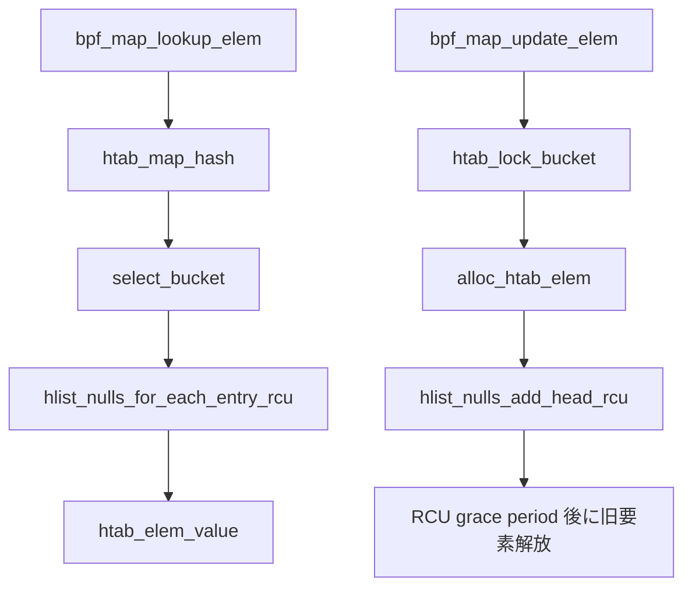

# 第11章 HASH map と RCU 参照

> **本章で読むソース**
>
> - [`kernel/bpf/hashtab.c` L88-L108](https://github.com/gregkh/linux/blob/v6.18.38/kernel/bpf/hashtab.c#L88-L108)
> - [`kernel/bpf/hashtab.c` L110-L128](https://github.com/gregkh/linux/blob/v6.18.38/kernel/bpf/hashtab.c#L110-L128)
> - [`kernel/bpf/hashtab.c` L614-L657](https://github.com/gregkh/linux/blob/v6.18.38/kernel/bpf/hashtab.c#L614-L657)
> - [`kernel/bpf/hashtab.c` L665-L694](https://github.com/gregkh/linux/blob/v6.18.38/kernel/bpf/hashtab.c#L665-L694)
> - [`kernel/bpf/hashtab.c` L1092-L1115](https://github.com/gregkh/linux/blob/v6.18.38/kernel/bpf/hashtab.c#L1092-L1115)
> - [`kernel/bpf/hashtab.c` L1139-L1187](https://github.com/gregkh/linux/blob/v6.18.38/kernel/bpf/hashtab.c#L1139-L1187)
> - [`kernel/bpf/hashtab.c` L707-L719](https://github.com/gregkh/linux/blob/v6.18.38/kernel/bpf/hashtab.c#L707-L720)

## この章の狙い

`BPF_MAP_TYPE_HASH` の実装である `hashtab.c` が、キーから値への lookup をどう高速化し、更新と並行参照をどう両立するかを読む。
`hlist_nulls` と RCU 読み取り、バケットロック付き更新、`map_gen_lookup` によるインライン化までを追う。

## 前提

- [BPF オブジェクトと bpf コマンド](../part00-overview/02-bpf-objects-and-commands.md) で `bpf_map_ops` を知っていること。
- [同期と RCU](../../locking/part04-rcu/12-rcu-basics.md) で RCU 読み取り側クリティカルセクションを知っていること。

## bpf_htab と htab_elem

HASH map のカーネル表現は `struct bpf_htab` である。
バケット配列、要素プール、要素数カウンタを1つにまとめる。

[`kernel/bpf/hashtab.c` L88-L108](https://github.com/gregkh/linux/blob/v6.18.38/kernel/bpf/hashtab.c#L88-L108)

```c
struct bpf_htab {
	struct bpf_map map;
	struct bpf_mem_alloc ma;
	struct bpf_mem_alloc pcpu_ma;
	struct bucket *buckets;
	void *elems;
	union {
		struct pcpu_freelist freelist;
		struct bpf_lru lru;
	};
	struct htab_elem *__percpu *extra_elems;
	/* number of elements in non-preallocated hashtable are kept
	 * in either pcount or count
	 */
	struct percpu_counter pcount;
	atomic_t count;
	bool use_percpu_counter;
	u32 n_buckets;	/* number of hash buckets */
	u32 elem_size;	/* size of each element in bytes */
	u32 hashrnd;
};
```

各エントリは `struct htab_elem` にキーと値が連結配置される。

[`kernel/bpf/hashtab.c` L110-L128](https://github.com/gregkh/linux/blob/v6.18.38/kernel/bpf/hashtab.c#L110-L128)

```c
struct htab_elem {
	union {
		struct hlist_nulls_node hash_node;
		struct {
			void *padding;
			union {
				struct pcpu_freelist_node fnode;
				struct htab_elem *batch_flink;
			};
		};
	};
	union {
		/* pointer to per-cpu pointer */
		void *ptr_to_pptr;
		struct bpf_lru_node lru_node;
	};
	u32 hash;
	char key[] __aligned(8);
};
```

`BPF_F_NO_PREALLOC` が無い場合は起動時に要素を確保し、更新は freelist から再利用する。
LRU 変種では `bpf_lru` が eviction を担う（本章では HASH 本体に焦点を当て、LRU は同ファイル内の別 ops として存在する）。

## バケット選択と RCU 走査

ハッシュ値の下位ビットでバケットを選び、連鎖リストを RCU で走査する。

[`kernel/bpf/hashtab.c` L614-L657](https://github.com/gregkh/linux/blob/v6.18.38/kernel/bpf/hashtab.c#L614-L657)

```c
static inline struct bucket *__select_bucket(struct bpf_htab *htab, u32 hash)
{
	return &htab->buckets[hash & (htab->n_buckets - 1)];
}

static inline struct hlist_nulls_head *select_bucket(struct bpf_htab *htab, u32 hash)
{
	return &__select_bucket(htab, hash)->head;
}

static struct htab_elem *lookup_nulls_elem_raw(struct hlist_nulls_head *head,
					       u32 hash, void *key,
					       u32 key_size, u32 n_buckets)
{
	struct hlist_nulls_node *n;
	struct htab_elem *l;

again:
	hlist_nulls_for_each_entry_rcu(l, n, head, hash_node)
		if (l->hash == hash && !memcmp(&l->key, key, key_size))
			return l;

	if (unlikely(get_nulls_value(n) != (hash & (n_buckets - 1))))
		goto again;

	return NULL;
}
```

`hlist_nulls` はリスト走査中にバケットが変わったことを `get_nulls_value` で検出する。
ロックを取らない lookup が、並行 update でリストを組み替えても再試行で整合する。

## lookup 経路

BPF プログラムと syscall の両方から `__htab_map_lookup_elem` が呼ばれる。

[`kernel/bpf/hashtab.c` L665-L694](https://github.com/gregkh/linux/blob/v6.18.38/kernel/bpf/hashtab.c#L665-L694)

```c
static void *__htab_map_lookup_elem(struct bpf_map *map, void *key)
{
	struct bpf_htab *htab = container_of(map, struct bpf_htab, map);
	struct hlist_nulls_head *head;
	struct htab_elem *l;
	u32 hash, key_size;

	WARN_ON_ONCE(!rcu_read_lock_held() && !rcu_read_lock_trace_held() &&
		     !rcu_read_lock_bh_held());

	key_size = map->key_size;

	hash = htab_map_hash(key, key_size, htab->hashrnd);

	head = select_bucket(htab, hash);

	l = lookup_nulls_elem_raw(head, hash, key, key_size, htab->n_buckets);

	return l;
}

static void *htab_map_lookup_elem(struct bpf_map *map, void *key)
{
	struct htab_elem *l = __htab_map_lookup_elem(map, key);

	if (l)
		return htab_elem_value(l, map->key_size);

	return NULL;
}
```

`htab_map_lookup_elem` は要素ポインタから値領域へオフセットするだけである。
ホットパスはハッシュ計算と RCU リスト走査が支配する。

## update とバケットロック

更新は `htab_lock_bucket` でバケットをロックし、ロック下で再 lookup して `BPF_NOEXIST` / `BPF_EXIST` を検査する。
新要素を確保したうえでリスト先頭へ挿入し、同一キーがあれば `hlist_nulls_del_rcu` で旧ノードを外す。

[`kernel/bpf/hashtab.c` L1139-L1187](https://github.com/gregkh/linux/blob/v6.18.38/kernel/bpf/hashtab.c#L1139-L1187)

```c
	ret = htab_lock_bucket(b, &flags);
	if (ret)
		return ret;

	l_old = lookup_elem_raw(head, hash, key, key_size);

	ret = check_flags(htab, l_old, map_flags);
	if (ret)
		goto err;

	if (unlikely(l_old && (map_flags & BPF_F_LOCK))) {
		/* first lookup without the bucket lock didn't find the element,
		 * but second lookup with the bucket lock found it.
		 * This case is highly unlikely, but has to be dealt with:
		 * grab the element lock in addition to the bucket lock
		 * and update element in place
		 */
		copy_map_value_locked(map,
				      htab_elem_value(l_old, key_size),
				      value, false);
		ret = 0;
		goto err;
	}

	l_new = alloc_htab_elem(htab, key, value, key_size, hash, false, false,
				l_old);
	if (IS_ERR(l_new)) {
		/* all pre-allocated elements are in use or memory exhausted */
		ret = PTR_ERR(l_new);
		goto err;
	}

	/* add new element to the head of the list, so that
	 * concurrent search will find it before old elem
	 */
	hlist_nulls_add_head_rcu(&l_new->hash_node, head);
	if (l_old) {
		hlist_nulls_del_rcu(&l_old->hash_node);

		/* l_old has already been stashed in htab->extra_elems, free
		 * its special fields before it is available for reuse.
		 */
		if (htab_is_prealloc(htab))
			check_and_free_fields(htab, l_old);
	}
	htab_unlock_bucket(b, flags);
	if (l_old && !htab_is_prealloc(htab))
		free_htab_elem(htab, l_old);
	return 0;
```

prealloc map では `l_old` は `extra_elems` へ退避され、`check_and_free_fields` で可変長フィールドだけ解放したうえで freelist 再利用される。
`BPF_F_NO_PREALLOC` では `free_htab_elem` が `bpf_mem_alloc` 経由で要素本体を解放する。
いずれも lookup 側は RCU で旧ノードを読み続けられるが、解放タイミングは prealloc 再利用と非 prealloc 解放で分かれる。

[`kernel/bpf/hashtab.c` L1092-L1115](https://github.com/gregkh/linux/blob/v6.18.38/kernel/bpf/hashtab.c#L1092-L1115)

```c
static long htab_map_update_elem(struct bpf_map *map, void *key, void *value,
				 u64 map_flags)
{
	struct bpf_htab *htab = container_of(map, struct bpf_htab, map);
	struct htab_elem *l_new, *l_old;
	struct hlist_nulls_head *head;
	unsigned long flags;
	struct bucket *b;
	u32 key_size, hash;
	int ret;

	if (unlikely((map_flags & ~BPF_F_LOCK) > BPF_EXIST))
		/* unknown flags */
		return -EINVAL;

	WARN_ON_ONCE(!rcu_read_lock_held() && !rcu_read_lock_trace_held() &&
		     !rcu_read_lock_bh_held());

	key_size = map->key_size;

	hash = htab_map_hash(key, key_size, htab->hashrnd);

	b = __select_bucket(htab, hash);
	head = &b->head;
```

`check_flags` は `BPF_NOEXIST` で既存キーを拒否し、`BPF_EXIST` で未存在キーを拒否する。
`BPF_F_LOCK` 付き update は別経路で要素ロックのみ更新するが、本章の通常 update は上記の先頭挿入と旧ノード削除が核心である。

## map_gen_lookup によるインライン化

verifier が map 参照を helper 呼び出しに畳み込めるとき、JIT は `__htab_map_lookup_elem` への直接 call を埋め込む。

[`kernel/bpf/hashtab.c` L707-L720](https://github.com/gregkh/linux/blob/v6.18.38/kernel/bpf/hashtab.c#L707-L720)

```c
static int htab_map_gen_lookup(struct bpf_map *map, struct bpf_insn *insn_buf)
{
	struct bpf_insn *insn = insn_buf;
	const int ret = BPF_REG_0;

	BUILD_BUG_ON(!__same_type(&__htab_map_lookup_elem,
		     (void *(*)(struct bpf_map *map, void *key))NULL));
	*insn++ = BPF_EMIT_CALL(__htab_map_lookup_elem);
	*insn++ = BPF_JMP_IMM(BPF_JEQ, ret, 0, 1);
	*insn++ = BPF_ALU64_IMM(BPF_ADD, ret,
				offsetof(struct htab_elem, key) +
				round_up(map->key_size, 8));
	return insn - insn_buf;
}
```

値ポインタへの加算まで BPF 命令列に展開されるため、汎用 helper 経由より分岐とレジスタ移動が減る。

## 処理の流れ



読み取りは RCU のみ、書き込みはバケットロックで直列化する。

## 高速化と最適化の工夫

HASH map の読み取りホットパスは、バケット数を2の冪にそろえ `hash & (n_buckets - 1)` をビットマスクにしている点が効く。
グローバルロックではなくバケット単位ロックにすることで、異なるハッシュ桶への update は並行できる。

`lookup_nulls_elem_raw` の再試行は、ロックレス lookup の正しさを保ちつつ、走査中のリスト移動に対応する。
LRU 変種では lookup 時に `bpf_lru_node_set_ref` で参照を記録し、容量超過時の eviction 精度を上げる（`htab_lru_map_lookup_elem`）。

`map_gen_lookup` は map 種別ごとに専用の短い BPF 命令列を生成し、JIT がインライン展開や tail call 最適化をかけやすくする。

## まとめ

`hashtab.c` は `hlist_nulls` と RCU でロックレス lookup を実現し、update はバケットロックと先頭挿入で整合を取る。
`__htab_map_lookup_elem` が BPF プログラムから直接呼べるよう JIT 連携されている。
次章では固定インデックスの ARRAY map と per-CPU スロットを読む。

## 関連する章

- [ARRAY map と per-CPU](12-arraymap-percpu.md)
- [BPF オブジェクトと bpf コマンド](../part00-overview/02-bpf-objects-and-commands.md)
