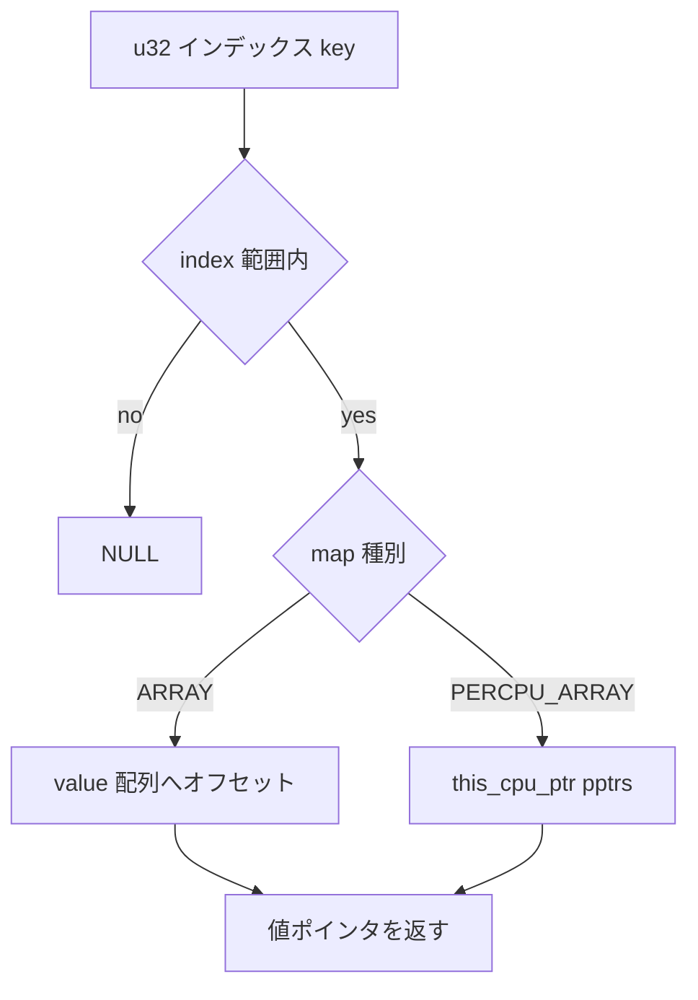

# 第12章 ARRAY map と per-CPU

> **本章で読むソース**
>
> - [`include/linux/bpf.h` L2090-L2100](https://github.com/gregkh/linux/blob/v6.18.38/include/linux/bpf.h#L2090-L2100)
> - [`kernel/bpf/arraymap.c` L33-L49](https://github.com/gregkh/linux/blob/v6.18.38/kernel/bpf/arraymap.c#L33-L49)
> - [`kernel/bpf/arraymap.c` L101-L114](https://github.com/gregkh/linux/blob/v6.18.38/kernel/bpf/arraymap.c#L101-L114)
> - [`kernel/bpf/arraymap.c` L167-L176](https://github.com/gregkh/linux/blob/v6.18.38/kernel/bpf/arraymap.c#L167-L176)
> - [`kernel/bpf/arraymap.c` L219-L248](https://github.com/gregkh/linux/blob/v6.18.38/kernel/bpf/arraymap.c#L219-L250)
> - [`kernel/bpf/arraymap.c` L253-L262](https://github.com/gregkh/linux/blob/v6.18.38/kernel/bpf/arraymap.c#L253-L262)
> - [`kernel/bpf/arraymap.c` L357-L393](https://github.com/gregkh/linux/blob/v6.18.38/kernel/bpf/arraymap.c#L357-L393)

## この章の狙い

`BPF_MAP_TYPE_ARRAY` と `BPF_MAP_TYPE_PERCPU_ARRAY` の実装を読み、固定インデックスによる O(1) アクセスと per-CPU 値スロットによる更新競合回避を押さえる。
`index_mask` による投機実行対策と `map_gen_lookup` による境界チェック省略まで追う。

## 前提

- [HASH map と RCU 参照](11-hashtab-rcu.md) で map の lookup/update 契約を知っていること。
- [同期と RCU](../../locking/part00-foundation/02-percpu.md) で per-CPU 変数の基本を知っていること。

## bpf_array のレイアウト

ARRAY map は連続した値領域か、per-CPU ポインタ配列を持つ。

[`include/linux/bpf.h` L2090-L2100](https://github.com/gregkh/linux/blob/v6.18.38/include/linux/bpf.h#L2090-L2100)

```c
struct bpf_array {
	struct bpf_map map;
	u32 elem_size;
	u32 index_mask;
	struct bpf_array_aux *aux;
	union {
		DECLARE_FLEX_ARRAY(char, value) __aligned(8);
		DECLARE_FLEX_ARRAY(void *, ptrs) __aligned(8);
		DECLARE_FLEX_ARRAY(void __percpu *, pptrs) __aligned(8);
	};
};
```

キーは常に 4 バイトのインデックスである。
`max_entries` はロード時に固定され、ARRAY では要素の insert/delete はできない。

## per-CPU スロットの確保

`BPF_MAP_TYPE_PERCPU_ARRAY` では各インデックスごとに per-CPU 領域を割り当てる。

[`kernel/bpf/arraymap.c` L33-L49](https://github.com/gregkh/linux/blob/v6.18.38/kernel/bpf/arraymap.c#L33-L49)

```c
static int bpf_array_alloc_percpu(struct bpf_array *array)
{
	void __percpu *ptr;
	int i;

	for (i = 0; i < array->map.max_entries; i++) {
		ptr = bpf_map_alloc_percpu(&array->map, array->elem_size, 8,
					   GFP_USER | __GFP_NOWARN);
		if (!ptr) {
			bpf_array_free_percpu(array);
			return -ENOMEM;
		}
		array->pptrs[i] = ptr;
		cond_resched();
	}

	return 0;
}
```

各 CPU が自分のスロットだけを更新すれば、他 CPU とのキャッシュライン競合を避けられる。
ユーザー空間から全 CPU 分を読むには `bpf_map_lookup_elem` の syscall 経路がまとめてコピーする。

## index_mask と投機実行対策

配列長を2の冪に切り上げ、`index_mask` でインデックスをマスクする。

[`kernel/bpf/arraymap.c` L101-L114](https://github.com/gregkh/linux/blob/v6.18.38/kernel/bpf/arraymap.c#L101-L114)

```c
	mask64 = fls_long(max_entries - 1);
	mask64 = 1ULL << mask64;
	mask64 -= 1;

	index_mask = mask64;
	if (!bypass_spec_v1) {
		/* round up array size to nearest power of 2,
		 * since cpu will speculate within index_mask limits
		 */
		max_entries = index_mask + 1;
		/* Check for overflows. */
		if (max_entries < attr->max_entries)
			return ERR_PTR(-E2BIG);
	}
```

CPU が境界チェック前に投機的にアクセスしても、実アクセスはパディング領域に収まる。
`bypass_spec_v1` が立つ map では従来の厳密な `max_entries` チェックを維持する。

## 通常 ARRAY の lookup

lookup は加算とマスクだけで値ポインタを得る。

[`kernel/bpf/arraymap.c` L167-L176](https://github.com/gregkh/linux/blob/v6.18.38/kernel/bpf/arraymap.c#L167-L176)

```c
static void *array_map_lookup_elem(struct bpf_map *map, void *key)
{
	struct bpf_array *array = container_of(map, struct bpf_array, map);
	u32 index = *(u32 *)key;

	if (unlikely(index >= array->map.max_entries))
		return NULL;

	return array->value + (u64)array->elem_size * (index & array->index_mask);
}
```

ハッシュ計算もリスト走査もないため、map 操作の中で最も軽い経路のひとつである。

## map_gen_lookup によるインライン化

verifier が許可すれば、lookup 相当の BPF 命令列をプログラムに埋め込む。

[`kernel/bpf/arraymap.c` L219-L250](https://github.com/gregkh/linux/blob/v6.18.38/kernel/bpf/arraymap.c#L219-L250)

```c
/* emit BPF instructions equivalent to C code of array_map_lookup_elem() */
static int array_map_gen_lookup(struct bpf_map *map, struct bpf_insn *insn_buf)
{
	struct bpf_array *array = container_of(map, struct bpf_array, map);
	struct bpf_insn *insn = insn_buf;
	u32 elem_size = array->elem_size;
	const int ret = BPF_REG_0;
	const int map_ptr = BPF_REG_1;
	const int index = BPF_REG_2;

	if (map->map_flags & BPF_F_INNER_MAP)
		return -EOPNOTSUPP;

	*insn++ = BPF_ALU64_IMM(BPF_ADD, map_ptr, offsetof(struct bpf_array, value));
	*insn++ = BPF_LDX_MEM(BPF_W, ret, index, 0);
	if (!map->bypass_spec_v1) {
		*insn++ = BPF_JMP_IMM(BPF_JGE, ret, map->max_entries, 4);
		*insn++ = BPF_ALU32_IMM(BPF_AND, ret, array->index_mask);
	} else {
		*insn++ = BPF_JMP_IMM(BPF_JGE, ret, map->max_entries, 3);
	}

	if (is_power_of_2(elem_size)) {
		*insn++ = BPF_ALU64_IMM(BPF_LSH, ret, ilog2(elem_size));
	} else {
		*insn++ = BPF_ALU64_IMM(BPF_MUL, ret, elem_size);
	}
	*insn++ = BPF_ALU64_REG(BPF_ADD, ret, map_ptr);
	*insn++ = BPF_JMP_IMM(BPF_JA, 0, 0, 1);
	*insn++ = BPF_MOV64_IMM(ret, 0);
	return insn - insn_buf;
}
```

`elem_size` が2の冪なら乗算を左シフトに置き換える。
範囲外インデックスは 0 を返す命令列が末尾に付く。

## per-CPU ARRAY の lookup

実行 CPU のスロットへ `this_cpu_ptr` で入る。

[`kernel/bpf/arraymap.c` L253-L262](https://github.com/gregkh/linux/blob/v6.18.38/kernel/bpf/arraymap.c#L253-L262)

```c
static void *percpu_array_map_lookup_elem(struct bpf_map *map, void *key)
{
	struct bpf_array *array = container_of(map, struct bpf_array, map);
	u32 index = *(u32 *)key;

	if (unlikely(index >= array->map.max_entries))
		return NULL;

	return this_cpu_ptr(array->pptrs[index & array->index_mask]);
}
```

カウンタや統計の集計に使われることが多い。
全 CPU 合算が必要ならユーザー空間が syscall で読み出す。

## update 経路

update もインデックス境界を検査したあと、通常配列は連続領域へ、per-CPU は現在 CPU のスロットへコピーする。

[`kernel/bpf/arraymap.c` L357-L393](https://github.com/gregkh/linux/blob/v6.18.38/kernel/bpf/arraymap.c#L357-L393)

```c
static long array_map_update_elem(struct bpf_map *map, void *key, void *value,
				  u64 map_flags)
{
	struct bpf_array *array = container_of(map, struct bpf_array, map);
	u32 index = *(u32 *)key;
	char *val;

	if (unlikely((map_flags & ~BPF_F_LOCK) > BPF_EXIST))
		/* unknown flags */
		return -EINVAL;

	if (unlikely(index >= array->map.max_entries))
		/* all elements were pre-allocated, cannot insert a new one */
		return -E2BIG;

	if (unlikely(map_flags & BPF_NOEXIST))
		/* all elements already exist */
		return -EEXIST;

	if (unlikely((map_flags & BPF_F_LOCK) &&
		     !btf_record_has_field(map->record, BPF_SPIN_LOCK)))
		return -EINVAL;

	if (array->map.map_type == BPF_MAP_TYPE_PERCPU_ARRAY) {
		val = this_cpu_ptr(array->pptrs[index & array->index_mask]);
		copy_map_value(map, val, value);
		bpf_obj_free_fields(array->map.record, val);
	} else {
		val = array->value +
			(u64)array->elem_size * (index & array->index_mask);
		if (map_flags & BPF_F_LOCK)
			copy_map_value_locked(map, val, value, false);
		else
			copy_map_value(map, val, value);
		bpf_obj_free_fields(array->map.record, val);
	}
	return 0;
}
```

`BPF_F_LOCK` がある場合は map 値内の spinlock フィールドで直列化する（BTF レコード依存）。

## 処理の流れ



HASH と違い、衝突解決や RCU リスト走査がない。

## 高速化と最適化の工夫

ARRAY map はインデックス算術だけでアドレスを決めるため、HASH より予測可能で I-cache フットプリントも小さい。
`index_mask` によるパディングは、投機実行が境界外インデックスを一瞬試みてもセグフォルトにならないようにするトレードオフである。

per-CPU 変種は更新を CPU ローカルに閉じ、マルチコアで同じインデックスを叩くカウンタでもロックを避けられる。
`percpu_array_map_gen_lookup` は `BPF_MOV64_PERCPU_REG` を埋め込み、JIT が per-CPU ベースレジスタを使った短い経路を生成する。

`BPF_F_MMAPABLE` な ARRAY は値領域をページ境界に揃え、ユーザー空間が `mmap` でゼロコピー参照できる（`array_map_mmap`）。

## まとめ

ARRAY map は固定インデックスと連続（または per-CPU）ストレージで O(1) アクセスを提供する。
`index_mask` と `map_gen_lookup` が投機実行と JIT 最適化の両面を支える。
次章ではプレフィックスマッチ用の LPM trie と、その他 map 種別の概観を読む。

## 関連する章

- [LPM trie と map 種別の概観](13-lpm-trie-maps-overview.md)
- [HASH map と RCU 参照](11-hashtab-rcu.md)
