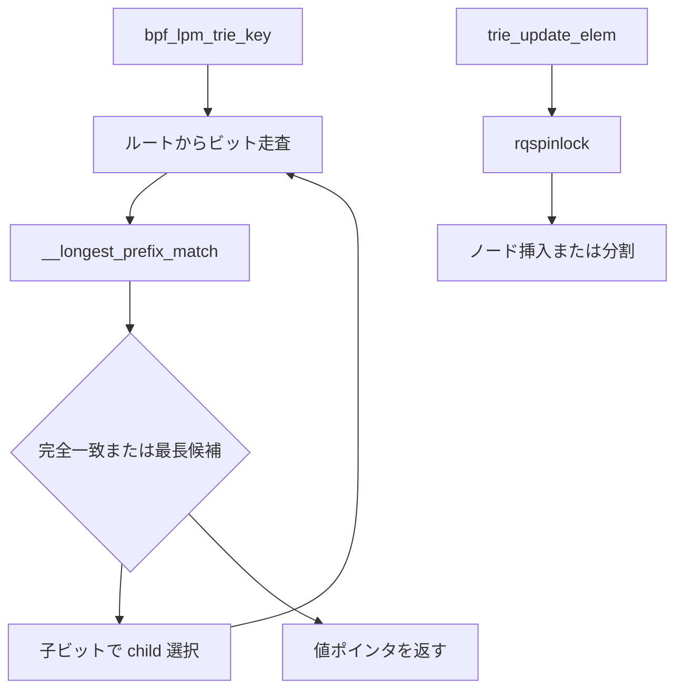

# 第13章 LPM trie と map 種別の概観

> **本章で読むソース**
>
> - [`include/uapi/linux/bpf.h` L102-L109](https://github.com/gregkh/linux/blob/v6.18.38/include/uapi/linux/bpf.h#L102-L109)
> - [`kernel/bpf/lpm_trie.c` L26-L41](https://github.com/gregkh/linux/blob/v6.18.38/kernel/bpf/lpm_trie.c#L26-L41)
> - [`kernel/bpf/lpm_trie.c` L238-L289](https://github.com/gregkh/linux/blob/v6.18.38/kernel/bpf/lpm_trie.c#L238-L289)
> - [`kernel/bpf/lpm_trie.c` L322-L371](https://github.com/gregkh/linux/blob/v6.18.38/kernel/bpf/lpm_trie.c#L322-L371)
> - [`kernel/bpf/lpm_trie.c` L775-L789](https://github.com/gregkh/linux/blob/v6.18.38/kernel/bpf/lpm_trie.c#L775-L789)
> - [`kernel/bpf/syscall.c` L70-L79](https://github.com/gregkh/linux/blob/v6.18.38/kernel/bpf/syscall.c#L70-L79)

## この章の狙い

`BPF_MAP_TYPE_LPM_TRIE` が最長プレフィックス一致をどう実装するかを読み、ルーティング系プログラムでの使い方を押さえる。
あわせて `bpf_map_types` テーブルから見える、その他の map 種別の役割分担を概観する。

## 前提

- [HASH map と RCU 参照](11-hashtab-rcu.md) と [ARRAY map と per-CPU](12-arraymap-percpu.md) で lookup/update の基本を知っていること。
- IP アドレスのプレフィックス表記（CIDR）を知っていること。

## LPM trie のキー形式

キーはプレフィックス長と可変長データ配列からなる。

[`include/uapi/linux/bpf.h` L102-L109](https://github.com/gregkh/linux/blob/v6.18.38/include/uapi/linux/bpf.h#L102-L109)

```c
/* Key of an a BPF_MAP_TYPE_LPM_TRIE entry, with trailing byte array. */
struct bpf_lpm_trie_key_u8 {
	union {
		struct bpf_lpm_trie_key_hdr	hdr;
		__u32				prefixlen;
	};
	__u8	data[];		/* Arbitrary size */
};
```

IPv4 なら `data` は4バイト、IPv6 なら16バイトが典型である。
`prefixlen` はビット単位の長さで、トライの分岐深度と対応する。

## ノードと trie 構造

内部は二分木に近いトライノードの連結である。

[`kernel/bpf/lpm_trie.c` L26-L41](https://github.com/gregkh/linux/blob/v6.18.38/kernel/bpf/lpm_trie.c#L26-L41)

```c
struct lpm_trie_node {
	struct lpm_trie_node __rcu	*child[2];
	u32				prefixlen;
	u32				flags;
	u8				data[];
};

struct lpm_trie {
	struct bpf_map			map;
	struct lpm_trie_node __rcu	*root;
	struct bpf_mem_alloc		ma;
	size_t				n_entries;
	size_t				max_prefixlen;
	size_t				data_size;
	rqspinlock_t			lock;
};
```

`LPM_TREE_NODE_FLAG_IM` が立つノードは中間ノードで、lookup 結果には返らない。
値はノード末尾の `data` 領域の直後に配置される。

## lookup の走査

lookup はルートからビット単位で子を辿り、一致した最長プレフィックスを持つノードを選ぶ。

[`kernel/bpf/lpm_trie.c` L238-L289](https://github.com/gregkh/linux/blob/v6.18.38/kernel/bpf/lpm_trie.c#L238-L289)

```c
static void *trie_lookup_elem(struct bpf_map *map, void *_key)
{
	struct lpm_trie *trie = container_of(map, struct lpm_trie, map);
	struct lpm_trie_node *node, *found = NULL;
	struct bpf_lpm_trie_key_u8 *key = _key;

	if (key->prefixlen > trie->max_prefixlen)
		return NULL;

	for (node = rcu_dereference_check(trie->root, rcu_read_lock_bh_held());
	     node;) {
		unsigned int next_bit;
		size_t matchlen;

		matchlen = __longest_prefix_match(trie, node, key);
		if (matchlen == trie->max_prefixlen) {
			found = node;
			break;
		}

		if (matchlen < node->prefixlen)
			break;

		if (!(node->flags & LPM_TREE_NODE_FLAG_IM))
			found = node;

		next_bit = extract_bit(key->data, node->prefixlen);
		node = rcu_dereference_check(node->child[next_bit],
					     rcu_read_lock_bh_held());
	}

	if (!found)
		return NULL;

	return found->data + trie->data_size;
}
```

途中でプレフィックスが食い違えば、直前に記録した `found` が最長一致となる。
HASH map のようにキー全体の一致は要求しない。

## update と rqspinlock

更新は `rqspinlock` で直列化し、ノード挿入や中間ノード生成を行う。

[`kernel/bpf/lpm_trie.c` L322-L371](https://github.com/gregkh/linux/blob/v6.18.38/kernel/bpf/lpm_trie.c#L322-L371)

```c
static long trie_update_elem(struct bpf_map *map,
			     void *_key, void *value, u64 flags)
{
	struct lpm_trie *trie = container_of(map, struct lpm_trie, map);
	struct lpm_trie_node *node, *im_node, *new_node;
	struct lpm_trie_node *free_node = NULL;
	struct lpm_trie_node __rcu **slot;
	struct bpf_lpm_trie_key_u8 *key = _key;
	unsigned long irq_flags;
	unsigned int next_bit;
	size_t matchlen = 0;
	int ret = 0;

	if (unlikely(flags > BPF_EXIST))
		return -EINVAL;

	if (key->prefixlen > trie->max_prefixlen)
		return -EINVAL;

	new_node = lpm_trie_node_alloc(trie, value);
	if (!new_node)
		return -ENOMEM;

	ret = raw_res_spin_lock_irqsave(&trie->lock, irq_flags);
	if (ret)
		goto out_free;

	new_node->prefixlen = key->prefixlen;
	RCU_INIT_POINTER(new_node->child[0], NULL);
	RCU_INIT_POINTER(new_node->child[1], NULL);
	memcpy(new_node->data, key->data, trie->data_size);

	slot = &trie->root;

	while ((node = rcu_dereference(*slot))) {
		matchlen = longest_prefix_match(trie, node, key);

		if (node->prefixlen != matchlen ||
		    node->prefixlen == key->prefixlen)
			break;

		next_bit = extract_bit(key->data, node->prefixlen);
		slot = &node->child[next_bit];
	}
```

既存プレフィックスと衝突するときは中間ノードを挿入し、ツリーを再分割する。
ファイル先頭のコメントが挙動を図示している。

## trie_map_ops

LPM trie は専用の `bpf_map_ops` に登録される。

[`kernel/bpf/lpm_trie.c` L775-L789](https://github.com/gregkh/linux/blob/v6.18.38/kernel/bpf/lpm_trie.c#L775-L789)

```c
const struct bpf_map_ops trie_map_ops = {
	.map_meta_equal = bpf_map_meta_equal,
	.map_alloc = trie_alloc,
	.map_free = trie_free,
	.map_get_next_key = trie_get_next_key,
	.map_lookup_elem = trie_lookup_elem,
	.map_update_elem = trie_update_elem,
	.map_delete_elem = trie_delete_elem,
	.map_lookup_batch = generic_map_lookup_batch,
	.map_update_batch = generic_map_update_batch,
	.map_delete_batch = generic_map_delete_batch,
	.map_check_btf = trie_check_btf,
	.map_mem_usage = trie_mem_usage,
	.map_btf_id = &trie_map_btf_ids[0],
};
```

`map_gen_lookup` は無く、lookup は常に `trie_lookup_elem` 関数呼び出し経由である。

## その他の map 種別

`map_create` は `bpf_map_types` テーブルで型から ops を引く。

[`kernel/bpf/syscall.c` L70-L79](https://github.com/gregkh/linux/blob/v6.18.38/kernel/bpf/syscall.c#L70-L79)

```c
static const struct bpf_map_ops * const bpf_map_types[] = {
#define BPF_PROG_TYPE(_id, _name, prog_ctx_type, kern_ctx_type)
#define BPF_MAP_TYPE(_id, _ops) \
	[_id] = &_ops,
#define BPF_LINK_TYPE(_id, _name)
#include <linux/bpf_types.h>
#undef BPF_PROG_TYPE
#undef BPF_MAP_TYPE
#undef BPF_LINK_TYPE
};
```

本分冊で深く扱わない代表例を次に整理する。

| 種別 | 主ファイル | 用途の要点 |
|---|---|---|
| `BPF_MAP_TYPE_PROG_ARRAY` | `arraymap.c` | tail call 先プログラムの格納 |
| `BPF_MAP_TYPE_RINGBUF` | `ringbuf.c` | ユーザー空間と共有するリングバッファ（第18章） |
| `BPF_MAP_TYPE_STACK_TRACE` | `stackmap.c` | スタックトレース ID の保存 |
| `BPF_MAP_TYPE_QUEUE` / `STACK` | `queue_stack_maps.c` | BPF プログラム内 FIFO/LIFO |
| `BPF_MAP_TYPE_DEVMAP` / `CPUMAP` | `devmap.c`, `cpumap.c` | XDP 転送先（network 分冊で詳述） |
| `BPF_MAP_TYPE_HASH_OF_MAPS` | `hashtab.c`, `map_in_map.c` | 入れ子 map |

いずれも `bpf_map_ops` の関数ポインタ集合として syscall と BPF helper から同じ契約で呼ばれる。

## 処理の流れ



読み取りは RCU、書き込みは trie 全体ロックが基本である。

## 高速化と最適化の工夫

LPM trie はルーティングテーブル向けに、最長一致を1回の木走査で返す。
HASH で CIDR をキーにするとプレフィックス長の違いを表現しづらいが、トライはビット列に沿って自然に最長一致を得られる。

lookup はロックレス RCU 走査のため、更新が少ないルーティング表では読み取りスループットが高い。
更新側は `rqspinlock` で全体を直列化するため、書き込み頻度が高い用途には向かない。

ARRAY や HASH が `map_gen_lookup` で JIT インライン化するのに対し、LPM trie は木の形状が動的で専用インライン化が難しい。
その代わりアルゴリズムがドメイン要件に直結する。

## まとめ

`BPF_MAP_TYPE_LPM_TRIE` はビットトライで最長プレフィックス一致を実装し、RCU 読み取りとロック付き更新を組み合わせる。
その他の map 種別は `linux/bpf_types.h` 経由で `bpf_map_types` に登録され、用途ごとに ops が分かれる。
次部では BTF とプログラムのアタッチ機構を読む。

## 関連する章

- [BTF と型情報](../part04-btf-attach/14-btf-type-info.md)
- [ring buffer](../part05-tracing/18-ring-buffer.md)
- [HASH map と RCU 参照](11-hashtab-rcu.md)
