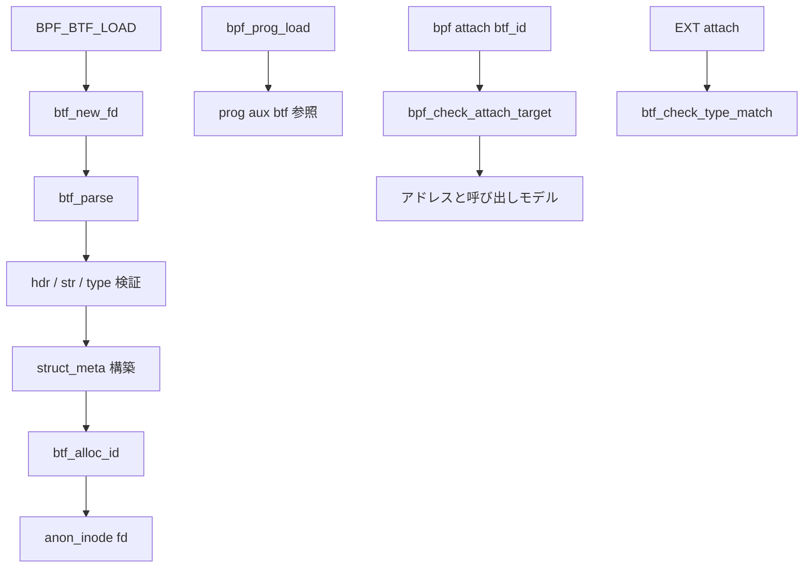

# 第14章 BTF と型情報

> **本章で読むソース**
>
> - [`include/linux/btf.h` L17-L24](https://github.com/gregkh/linux/blob/v6.18.38/include/linux/btf.h#L17-L25)
> - [`kernel/bpf/btf.c` L848-L857](https://github.com/gregkh/linux/blob/v6.18.38/kernel/bpf/btf.c#L848-L857)
> - [`kernel/bpf/btf.c` L5384-L5404](https://github.com/gregkh/linux/blob/v6.18.38/kernel/bpf/btf.c#L5384-L5404)
> - [`kernel/bpf/btf.c` L5772-L5830](https://github.com/gregkh/linux/blob/v6.18.38/kernel/bpf/btf.c#L5772-L5832)
> - [`kernel/bpf/btf.c` L7542-L7562](https://github.com/gregkh/linux/blob/v6.18.38/kernel/bpf/btf.c#L7542-L7562)
> - [`kernel/bpf/btf.c` L8029-L8054](https://github.com/gregkh/linux/blob/v6.18.38/kernel/bpf/btf.c#L8029-L8054)
> - [`kernel/bpf/verifier.c` L23863-L23896](https://github.com/gregkh/linux/blob/v6.18.38/kernel/bpf/verifier.c#L23863-L23900)

## この章の狙い

**BTF**（BPF Type Format）は、カーネルと BPF プログラムが共有する型辞書である。
ユーザー空間が `BPF_BTF_LOAD` で渡したバイナリは `btf_parse` で検証され、fd と BTF ID としてカーネルに登録される。
登録済み BTF は verifier のポインタ型検査、tracing プログラムの引数レイアウト、map の key/value 型、プログラム拡張時のシグネチャ照合に使われる。
本章はロード経路、型 ID 解決、アタッチ先検証までを読む。

## 前提

- [bpf システムコールとコマンド配線](../part01-core/03-bpf-syscall-dispatch.md) で `BPF_BTF_LOAD` を知っていること。
- [境界検査とポインタ種別](../part02-verifier/09-verifier-bounds-pointers.md) で `PTR_TO_BTF_ID` を触れていること。

## BTF が解決する問題

BPF バイトコードだけでは、カーネル構造体のフィールドオフセットや関数引数型は分からない。
BTF は型 ID、名前、メンバ配置を自己記述形式で持ち、verifier が「このポインタは `struct sk_buff` の何番目のフィールドへアクセス可能か」を静的に判定できる。
tracing では BTF 付きプログラムがカーネル関数のシグネチャと突き合わされ、実行時に `pt_regs` から引数を復元する。

kfunc 向けには、引数ポインタを信頼できるかどうかを BTF フラグで表現する。

[`include/linux/btf.h` L17-L25](https://github.com/gregkh/linux/blob/v6.18.38/include/linux/btf.h#L17-L25)

```c
/* These need to be macros, as the expressions are used in assembler input */
#define KF_ACQUIRE	(1 << 0) /* kfunc is an acquire function */
#define KF_RELEASE	(1 << 1) /* kfunc is a release function */
#define KF_RET_NULL	(1 << 2) /* kfunc returns a pointer that may be NULL */
/* Trusted arguments are those which are guaranteed to be valid when passed to
 * the kfunc. It is used to enforce that pointers obtained from either acquire
 * kfuncs, or from the main kernel on a tracepoint or struct_ops callback
 * invocation, remain unmodified when being passed to helpers taking trusted
 * args.
```

`KF_TRUSTED_ARGS` は tracepoint 引数のようにカーネルが生存期間を保証するポインタを、後続 helper へ渡す際の改変禁止に使われる。

## btf_parse の段階的検証

`BPF_BTF_LOAD` の入口 `btf_new_fd` は `btf_parse` を呼ぶ。
まずユーザー BTF バイナリをカーネルメモリへコピーし、verbose ログ用バッファを初期化する。

[`kernel/bpf/btf.c` L5772-L5832](https://github.com/gregkh/linux/blob/v6.18.38/kernel/bpf/btf.c#L5772-L5832)

```c
static struct btf *btf_parse(const union bpf_attr *attr, bpfptr_t uattr, u32 uattr_size)
{
	bpfptr_t btf_data = make_bpfptr(attr->btf, uattr.is_kernel);
	char __user *log_ubuf = u64_to_user_ptr(attr->btf_log_buf);
	struct btf_struct_metas *struct_meta_tab;
	struct btf_verifier_env *env = NULL;
	struct btf *btf = NULL;
	u8 *data;
	int err, ret;

	if (attr->btf_size > BTF_MAX_SIZE)
		return ERR_PTR(-E2BIG);

	env = kzalloc(sizeof(*env), GFP_KERNEL | __GFP_NOWARN);
	if (!env)
		return ERR_PTR(-ENOMEM);

	/* user could have requested verbose verifier output
	 * and supplied buffer to store the verification trace
	 */
	err = bpf_vlog_init(&env->log, attr->btf_log_level,
			    log_ubuf, attr->btf_log_size);
	if (err)
		goto errout_free;

	btf = kzalloc(sizeof(*btf), GFP_KERNEL | __GFP_NOWARN);
	if (!btf) {
		err = -ENOMEM;
		goto errout;
	}
	env->btf = btf;

	data = kvmalloc(attr->btf_size, GFP_KERNEL | __GFP_NOWARN);
	if (!data) {
		err = -ENOMEM;
		goto errout;
	}

	btf->data = data;
	btf->data_size = attr->btf_size;

	if (copy_from_bpfptr(data, btf_data, attr->btf_size)) {
		err = -EFAULT;
		goto errout;
	}

	err = btf_parse_hdr(env);
	if (err)
		goto errout;

	btf->nohdr_data = btf->data + btf->hdr.hdr_len;

	err = btf_parse_str_sec(env);
	if (err)
		goto errout;

	err = btf_parse_type_sec(env);
	if (err)
		goto errout;

	err = btf_check_type_tags(env, btf, 1);
```

ヘッダ、文字列セクション、型セクションの順で検証する。
いずれかが失敗すると `btf_verifier_log` へ理由が書かれ、ユーザーは `btf_log_buf` で確認できる。

## 型セクションの完全走査

`btf_parse_type_sec` は型オフセットの整列と、型の存在を確認したうえで全メタデータと全型を検査する。
空の型セクションはベース BTF が無い限り拒否される。

[`kernel/bpf/btf.c` L5384-L5404](https://github.com/gregkh/linux/blob/v6.18.38/kernel/bpf/btf.c#L5384-L5404)

```c
static int btf_parse_type_sec(struct btf_verifier_env *env)
{
	const struct btf_header *hdr = &env->btf->hdr;
	int err;

	/* Type section must align to 4 bytes */
	if (hdr->type_off & (sizeof(u32) - 1)) {
		btf_verifier_log(env, "Unaligned type_off");
		return -EINVAL;
	}

	if (!env->btf->base_btf && !hdr->type_len) {
		btf_verifier_log(env, "No type found");
		return -EINVAL;
	}

	err = btf_check_all_metas(env);
	if (err)
		return err;

	return btf_check_all_types(env);
}
```

構造体メタがある場合は `btf_parse_struct_metas` でフィールド記録を構築し、`btf_check_and_fixup_fields` でオフセットを確定する。
この処理はロード時に一度だけ走り、verifier の実行時コストを下げる。

## 実行時の型 ID 解決

検証済み BTF は `types[]` 配列に型ポインタを保持する。
`btf_type_by_id` はベース BTF へのチェーンを辿り、ローカル ID をインデックスに引く。

[`kernel/bpf/btf.c` L848-L857](https://github.com/gregkh/linux/blob/v6.18.38/kernel/bpf/btf.c#L848-L857)

```c
const struct btf_type *btf_type_by_id(const struct btf *btf, u32 type_id)
{
	while (type_id < btf->start_id)
		btf = btf->base_btf;

	type_id -= btf->start_id;
	if (type_id >= btf->nr_types)
		return NULL;
	return btf->types[type_id];
}
```

モジュール BTF は vmlinux BTF を `base_btf` として参照し、型 ID 空間を連結する。
ホットパスでは文字列比較ではなく整数インデックス参照が支配的である。

## fd 公開とライフサイクル

検証成功後、`btf_alloc_id` でグローバル ID が付与される。
コメントが示すとおり、ID 公開後の解放は `btf_put` 経由の `call_rcu` が必須になる。

[`kernel/bpf/btf.c` L8029-L8054](https://github.com/gregkh/linux/blob/v6.18.38/kernel/bpf/btf.c#L8029-L8054)

```c
int btf_new_fd(const union bpf_attr *attr, bpfptr_t uattr, u32 uattr_size)
{
	struct btf *btf;
	int ret;

	btf = btf_parse(attr, uattr, uattr_size);
	if (IS_ERR(btf))
		return PTR_ERR(btf);

	ret = btf_alloc_id(btf);
	if (ret) {
		btf_free(btf);
		return ret;
	}

	/*
	 * The BTF ID is published to the userspace.
	 * All BTF free must go through call_rcu() from
	 * now on (i.e. free by calling btf_put()).
	 */

	ret = __btf_new_fd(btf);
	if (ret < 0)
		btf_put(btf);

	return ret;
}
```

`bpf_prog_load` は別途 BTF fd を参照し `prog->aux->btf` に保持する。
map 作成時の `btf_key_type_id` / `btf_value_type_id` も同じ BTF オブジェクトを指す。

## アタッチ先の BTF ID 検証

fentry/fexit は attach 時に `btf_id` でカーネル関数を指定する。
`bpf_check_attach_target` は tracing プログラムに BTF が無い場合を拒否し、ID から型と名前を引く。

[`kernel/bpf/verifier.c` L23863-L23900](https://github.com/gregkh/linux/blob/v6.18.38/kernel/bpf/verifier.c#L23863-L23900)

```c
int bpf_check_attach_target(struct bpf_verifier_log *log,
			    const struct bpf_prog *prog,
			    const struct bpf_prog *tgt_prog,
			    u32 btf_id,
			    struct bpf_attach_target_info *tgt_info)
{
	bool prog_extension = prog->type == BPF_PROG_TYPE_EXT;
	bool prog_tracing = prog->type == BPF_PROG_TYPE_TRACING;
	char trace_symbol[KSYM_SYMBOL_LEN];
	const char prefix[] = "btf_trace_";
	struct bpf_raw_event_map *btp;
	int ret = 0, subprog = -1, i;
	const struct btf_type *t;
	bool conservative = true;
	const char *tname, *fname;
	struct btf *btf;
	long addr = 0;
	struct module *mod = NULL;

	if (!btf_id) {
		bpf_log(log, "Tracing programs must provide btf_id\n");
		return -EINVAL;
	}
	btf = tgt_prog ? tgt_prog->aux->btf : prog->aux->attach_btf;
	if (!btf) {
		bpf_log(log,
			"FENTRY/FEXIT program can only be attached to another program annotated with BTF\n");
		return -EINVAL;
	}
	t = btf_type_by_id(btf, btf_id);
	if (!t) {
		bpf_log(log, "attach_btf_id %u is invalid\n", btf_id);
		return -EINVAL;
	}
	tname = btf_name_by_offset(btf, t->name_off);
	if (!tname) {
		bpf_log(log, "attach_btf_id %u doesn't have a name\n", btf_id);
		return -EINVAL;
```

この後、関数名からカーネルアドレスと呼び出しモデルを解決し、`bpf_attach_target_info` を埋める（同関数の続き）。
ロード時とアタッチ時の二段検証で、実行時の引数解釈ずれを防ぐ。

## プログラム拡張時の型一致

`BPF_PROG_TYPE_EXT` は既存プログラムの本体を差し替える。
`btf_check_type_match` は拡張側 `func_info[0].type_id` の関数型と、ターゲット関数型を比較する。

[`kernel/bpf/btf.c` L7542-L7562](https://github.com/gregkh/linux/blob/v6.18.38/kernel/bpf/btf.c#L7542-L7562)

```c
int btf_check_type_match(struct bpf_verifier_log *log, const struct bpf_prog *prog,
			 struct btf *btf2, const struct btf_type *t2)
{
	struct btf *btf1 = prog->aux->btf;
	const struct btf_type *t1;
	u32 btf_id = 0;

	if (!prog->aux->func_info) {
		bpf_log(log, "Program extension requires BTF\n");
		return -EINVAL;
	}

	btf_id = prog->aux->func_info[0].type_id;
	if (!btf_id)
		return -EFAULT;

	t1 = btf_type_by_id(btf1, btf_id);
	if (!t1 || !btf_type_is_func(t1))
		return -EFAULT;

	return btf_check_func_type_match(log, btf1, t1, btf2, t2);
}
```

引数個数、型、const/volatile 修飾の不一致はここでログ付きで失敗する。

## 処理の流れ



BTF はロード時検証と実行時参照の境界を分離し、型安全性をロード時に固定する。

## 高速化と最適化の工夫

型参照は `btf_type_by_id` の配列インデックスで O(1) である。
フィールドオフセットは `btf_check_and_fixup_fields` でロード時に確定し、verifier は実行時に再計算しない。
ベース BTF チェーンはモジュール型を vmlinux 型へ委譲し、重複定義を避ける。
verbose ログは `bpf_vlog_init` でユーザー提供バッファへ直接追記し、再コピーを減らす。

## まとめ

BTF は BPF の静的型システムであり、`btf_parse` が信頼境界の入口である。
verifier、アタッチ検査、実行時 helper が同じ型辞書を共有することで、カーネルと BPF のデータ表現が一致する。

## 関連する章

- [bpf_prog_load とプログラムオブジェクト](../part01-core/04-bpf-prog-load.md)
- [境界検査とポインタ種別](../part02-verifier/09-verifier-bounds-pointers.md)
- [tracing プログラムのアタッチ](15-tracing-program-attach.md)
