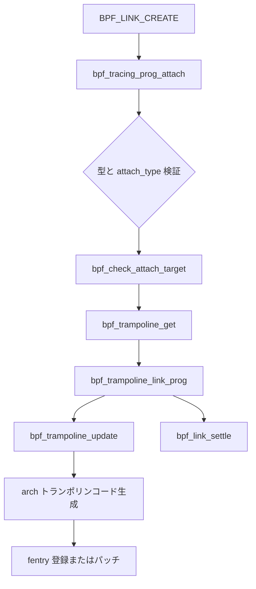

# 第15章 tracing プログラムのアタッチ

> **本章で読むソース**
>
> - [`kernel/bpf/syscall.c` L3556-L3593](https://github.com/gregkh/linux/blob/v6.18.38/kernel/bpf/syscall.c#L3556-L3593)
> - [`kernel/bpf/syscall.c` L3677-L3710](https://github.com/gregkh/linux/blob/v6.18.38/kernel/bpf/syscall.c#L3677-L3710)
> - [`kernel/bpf/syscall.c` L3729-L3759](https://github.com/gregkh/linux/blob/v6.18.38/kernel/bpf/syscall.c#L3729-L3759)
> - [`kernel/bpf/trampoline.c` L269-L356](https://github.com/gregkh/linux/blob/v6.18.38/kernel/bpf/trampoline.c#L269-L356)
> - [`kernel/bpf/trampoline.c` L400-L430](https://github.com/gregkh/linux/blob/v6.18.38/kernel/bpf/trampoline.c#L400-L430)
> - [`kernel/bpf/trampoline.c` L470-L493](https://github.com/gregkh/linux/blob/v6.18.38/kernel/bpf/trampoline.c#L470-L493)
> - [`kernel/bpf/trampoline.c` L598-L607](https://github.com/gregkh/linux/blob/v6.18.38/kernel/bpf/trampoline.c#L598-L608)
> - [`kernel/bpf/trampoline.c` L546-L595](https://github.com/gregkh/linux/blob/v6.18.38/kernel/bpf/trampoline.c#L546-L595)
> - [`kernel/bpf/verifier.c` L23863-L23896](https://github.com/gregkh/linux/blob/v6.18.38/kernel/bpf/verifier.c#L23863-L23900)

## この章の狙い

`BPF_PROG_TYPE_TRACING` の fentry/fexit や `BPF_PROG_TYPE_EXT` は、カーネル関数先頭に挿入する **トランポリン** へリンクする。
`bpf_tracing_prog_attach` が syscall 入口であり、`bpf_trampoline` が複数プログラムの合成コードを管理する。
本章は link 作成からトランポリン更新までを追う。

## 前提

- [BTF と型情報](14-btf-type-info.md) で BTF 型一致を知っていること。
- [bpf_prog_load とプログラムオブジェクト](../part01-core/04-bpf-prog-load.md) で `expected_attach_type` を知っていること。

## bpf_tracing_prog_attach の入口

`BPF_LINK_CREATE` または従来 API から呼ばれる。
プログラム種別と `expected_attach_type` の組み合わせを検証し、`tgt_prog_fd` と `btf_id` は両方指定か両方省略でなければならない。

[`kernel/bpf/syscall.c` L3556-L3593](https://github.com/gregkh/linux/blob/v6.18.38/kernel/bpf/syscall.c#L3556-L3593)

```c
static int bpf_tracing_prog_attach(struct bpf_prog *prog,
				   int tgt_prog_fd,
				   u32 btf_id,
				   u64 bpf_cookie,
				   enum bpf_attach_type attach_type)
{
	struct bpf_link_primer link_primer;
	struct bpf_prog *tgt_prog = NULL;
	struct bpf_trampoline *tr = NULL;
	struct bpf_tracing_link *link;
	u64 key = 0;
	int err;

	switch (prog->type) {
	case BPF_PROG_TYPE_TRACING:
		if (prog->expected_attach_type != BPF_TRACE_FENTRY &&
		    prog->expected_attach_type != BPF_TRACE_FEXIT &&
		    prog->expected_attach_type != BPF_MODIFY_RETURN) {
			err = -EINVAL;
			goto out_put_prog;
		}
		break;
	case BPF_PROG_TYPE_EXT:
		if (prog->expected_attach_type != 0) {
			err = -EINVAL;
			goto out_put_prog;
		}
		break;
	case BPF_PROG_TYPE_LSM:
		if (prog->expected_attach_type != BPF_LSM_MAC) {
			err = -EINVAL;
			goto out_put_prog;
		}
		break;
	default:
		err = -EINVAL;
		goto out_put_prog;
	}
```

`BPF_PROG_TYPE_TRACING` は fentry/fexit/modify_return に限定される。
`EXT` は別プログラムへの差し替え用である。

## トランポリンの取得と再利用

アタッチ先がロード時と異なる場合、`bpf_check_attach_target` で互換性を確認し、新しい `bpf_trampoline` を確保する。
ロード時に保存した `dst_trampoline` がそのまま使える場合は再確保を避ける。

[`kernel/bpf/syscall.c` L3677-L3710](https://github.com/gregkh/linux/blob/v6.18.38/kernel/bpf/syscall.c#L3677-L3710)

```c
	if (!prog->aux->dst_trampoline ||
	    (key && key != prog->aux->dst_trampoline->key)) {
		/* If there is no saved target, or the specified target is
		 * different from the destination specified at load time, we
		 * need a new trampoline and a check for compatibility
		 */
		struct bpf_attach_target_info tgt_info = {};

		err = bpf_check_attach_target(NULL, prog, tgt_prog, btf_id,
					      &tgt_info);
		if (err)
			goto out_unlock;

		if (tgt_info.tgt_mod) {
			module_put(prog->aux->mod);
			prog->aux->mod = tgt_info.tgt_mod;
		}

		tr = bpf_trampoline_get(key, &tgt_info);
		if (!tr) {
			err = -ENOMEM;
			goto out_unlock;
		}
	} else {
		/* The caller didn't specify a target, or the target was the
		 * same as the destination supplied during program load. This
		 * means we can reuse the trampoline and reference from program
		 * load time, and there is no need to allocate a new one. This
		 * can only happen once for any program, as the saved values in
		 * prog->aux are cleared below.
		 */
		tr = prog->aux->dst_trampoline;
		tgt_prog = prog->aux->dst_prog;
	}
```

`bpf_trampoline_get` はキーで既存インスタンスを引き、初回のみ関数アドレスと呼び出しモデルをコピーする。

[`kernel/bpf/trampoline.c` L817-L835](https://github.com/gregkh/linux/blob/v6.18.38/kernel/bpf/trampoline.c#L817-L835)

```c
struct bpf_trampoline *bpf_trampoline_get(u64 key,
					  struct bpf_attach_target_info *tgt_info)
{
	struct bpf_trampoline *tr;

	tr = bpf_trampoline_lookup(key);
	if (!tr)
		return NULL;

	mutex_lock(&tr->mutex);
	if (tr->func.addr)
		goto out;

	memcpy(&tr->func.model, &tgt_info->fmodel, sizeof(tgt_info->fmodel));
	tr->func.addr = (void *)tgt_info->tgt_addr;
out:
	mutex_unlock(&tr->mutex);
	return tr;
}
```

## リンク確定と prog aux のクリア

`bpf_trampoline_link_prog` がトランポリンへプログラムを登録する。
成功後は `prog->aux` に残っていた一時的な dst 情報を必ずクリアし、再アタッチ時の誤参照を防ぐ。

[`kernel/bpf/syscall.c` L3729-L3759](https://github.com/gregkh/linux/blob/v6.18.38/kernel/bpf/syscall.c#L3729-L3759)

```c
	err = bpf_link_prime(&link->link.link, &link_primer);
	if (err)
		goto out_unlock;

	err = bpf_trampoline_link_prog(&link->link, tr, tgt_prog);
	if (err) {
		bpf_link_cleanup(&link_primer);
		link = NULL;
		goto out_unlock;
	}

	link->tgt_prog = tgt_prog;
	link->trampoline = tr;

	/* Always clear the trampoline and target prog from prog->aux to make
	 * sure the original attach destination is not kept alive after a
	 * program is (re-)attached to another target.
	 */
	if (prog->aux->dst_prog &&
	    (tgt_prog_fd || tr != prog->aux->dst_trampoline))
		/* got extra prog ref from syscall, or attaching to different prog */
		bpf_prog_put(prog->aux->dst_prog);
	if (prog->aux->dst_trampoline && tr != prog->aux->dst_trampoline)
		/* we allocated a new trampoline, so free the old one */
		bpf_trampoline_put(prog->aux->dst_trampoline);

	prog->aux->dst_prog = NULL;
	prog->aux->dst_trampoline = NULL;
	mutex_unlock(&prog->aux->dst_mutex);

	return bpf_link_settle(&link_primer);
```

## bpf_trampoline_update によるコード再生成

リンク追加のたびに、登録済み fentry/fexit/modify_return を集約し、トランポリン用機械語を組み立て直す。
fexit がある場合は元関数呼び出し用フラグが立ち、サイズが `PAGE_SIZE` を超えると `-E2BIG` になる。

[`kernel/bpf/trampoline.c` L400-L430](https://github.com/gregkh/linux/blob/v6.18.38/kernel/bpf/trampoline.c#L400-L430)

```c
static int bpf_trampoline_update(struct bpf_trampoline *tr, bool lock_direct_mutex)
{
	struct bpf_tramp_image *im;
	struct bpf_tramp_links *tlinks;
	u32 orig_flags = tr->flags;
	bool ip_arg = false;
	int err, total, size;

	tlinks = bpf_trampoline_get_progs(tr, &total, &ip_arg);
	if (IS_ERR(tlinks))
		return PTR_ERR(tlinks);

	if (total == 0) {
		err = unregister_fentry(tr, tr->cur_image->image);
		bpf_tramp_image_put(tr->cur_image);
		tr->cur_image = NULL;
		goto out;
	}

	/* clear all bits except SHARE_IPMODIFY and TAIL_CALL_CTX */
	tr->flags &= (BPF_TRAMP_F_SHARE_IPMODIFY | BPF_TRAMP_F_TAIL_CALL_CTX);

	if (tlinks[BPF_TRAMP_FEXIT].nr_links ||
	    tlinks[BPF_TRAMP_MODIFY_RETURN].nr_links) {
		/* NOTE: BPF_TRAMP_F_RESTORE_REGS and BPF_TRAMP_F_SKIP_FRAME
		 * should not be set together.
		 */
		tr->flags |= BPF_TRAMP_F_CALL_ORIG | BPF_TRAMP_F_SKIP_FRAME;
	} else {
		tr->flags |= BPF_TRAMP_F_RESTORE_REGS;
	}
```

公開 API は mutex で直列化する。

[`kernel/bpf/trampoline.c` L598-L608](https://github.com/gregkh/linux/blob/v6.18.38/kernel/bpf/trampoline.c#L598-L608)

```c
int bpf_trampoline_link_prog(struct bpf_tramp_link *link,
			     struct bpf_trampoline *tr,
			     struct bpf_prog *tgt_prog)
{
	int err;

	mutex_lock(&tr->mutex);
	err = __bpf_trampoline_link_prog(link, tr, tgt_prog);
	mutex_unlock(&tr->mutex);
	return err;
}
```

## __bpf_trampoline_link_prog の制約

内部実装は freplace と fentry/fexit の共存を禁止する。
拡張プログラムは `bpf_arch_text_poke` でターゲット関数先頭を直接ジャンプ差し替えする。

[`kernel/bpf/trampoline.c` L546-L595](https://github.com/gregkh/linux/blob/v6.18.38/kernel/bpf/trampoline.c#L546-L595)

```c
static int __bpf_trampoline_link_prog(struct bpf_tramp_link *link,
				      struct bpf_trampoline *tr,
				      struct bpf_prog *tgt_prog)
{
	enum bpf_tramp_prog_type kind;
	struct bpf_tramp_link *link_exiting;
	int err = 0;
	int cnt = 0, i;

	kind = bpf_attach_type_to_tramp(link->link.prog);
	if (tr->extension_prog)
		/* cannot attach fentry/fexit if extension prog is attached.
		 * cannot overwrite extension prog either.
		 */
		return -EBUSY;

	for (i = 0; i < BPF_TRAMP_MAX; i++)
		cnt += tr->progs_cnt[i];

	if (kind == BPF_TRAMP_REPLACE) {
		/* Cannot attach extension if fentry/fexit are in use. */
		if (cnt)
			return -EBUSY;
		err = bpf_freplace_check_tgt_prog(tgt_prog);
		if (err)
			return err;
		tr->extension_prog = link->link.prog;
		return bpf_arch_text_poke(tr->func.addr, BPF_MOD_JUMP, NULL,
					  link->link.prog->bpf_func);
	}
	if (cnt >= BPF_MAX_TRAMP_LINKS)
		return -E2BIG;
	if (!hlist_unhashed(&link->tramp_hlist))
		/* prog already linked */
		return -EBUSY;
	hlist_for_each_entry(link_exiting, &tr->progs_hlist[kind], tramp_hlist) {
		if (link_exiting->link.prog != link->link.prog)
			continue;
		/* prog already linked */
		return -EBUSY;
	}

	hlist_add_head(&link->tramp_hlist, &tr->progs_hlist[kind]);
	tr->progs_cnt[kind]++;
	err = bpf_trampoline_update(tr, true /* lock_direct_mutex */);
	if (err) {
		hlist_del_init(&link->tramp_hlist);
		tr->progs_cnt[kind]--;
	}
	return err;
}
```

リンク数上限 `BPF_MAX_TRAMP_LINKS` を超えると `-E2BIG` になる。
更新失敗時は hlist からロールバックする。

## トランポリン画像の切り替えと旧画像の寿命

`bpf_trampoline_update` は新しい `bpf_tramp_image` を生成し、`modify_fentry` で実行中の画像から差し替える。
成功後は `cur_image` を新画像へ更新し、旧画像へ `bpf_tramp_image_put` を呼ぶ。

[`kernel/bpf/trampoline.c` L470-L493](https://github.com/gregkh/linux/blob/v6.18.38/kernel/bpf/trampoline.c#L470-L493)

```c
	WARN_ON(tr->cur_image && total == 0);
	if (tr->cur_image)
		/* progs already running at this address */
		err = modify_fentry(tr, tr->cur_image->image, im->image, lock_direct_mutex);
	else
		/* first time registering */
		err = register_fentry(tr, im->image);

#ifdef CONFIG_DYNAMIC_FTRACE_WITH_DIRECT_CALLS
	if (err == -EAGAIN) {
		/* -EAGAIN from bpf_tramp_ftrace_ops_func. Now
		 * BPF_TRAMP_F_SHARE_IPMODIFY is set, we can generate the
		 * trampoline again, and retry register.
		 */
		bpf_tramp_image_free(im);
		goto again;
	}
#endif
	if (err)
		goto out_free;

	if (tr->cur_image)
		bpf_tramp_image_put(tr->cur_image);
	tr->cur_image = im;
```

リンクが0本になった detach でも、登録解除のあと `bpf_tramp_image_put` が走る。

[`kernel/bpf/trampoline.c` L412-L416](https://github.com/gregkh/linux/blob/v6.18.38/kernel/bpf/trampoline.c#L412-L416)

```c
	if (total == 0) {
		err = unregister_fentry(tr, tr->cur_image->image);
		bpf_tramp_image_put(tr->cur_image);
		tr->cur_image = NULL;
		goto out;
```

`bpf_tramp_image_put` は RCU だけでなく、画像の種類に応じて `call_rcu_tasks_trace`、`call_rcu_tasks`、`percpu_ref_kill` を組み合わせる。
fexit / fmod_ret では元関数呼び出し完了も待つ。

[`kernel/bpf/trampoline.c` L310-L356](https://github.com/gregkh/linux/blob/v6.18.38/kernel/bpf/trampoline.c#L310-L356)

```c
static void bpf_tramp_image_put(struct bpf_tramp_image *im)
{
	/* The trampoline image that calls original function is using:
	 * rcu_read_lock_trace to protect sleepable bpf progs
	 * rcu_read_lock to protect normal bpf progs
	 * percpu_ref to protect trampoline itself
	 * rcu tasks to protect trampoline asm not covered by percpu_ref
	 * (which are few asm insns before __bpf_tramp_enter and
	 *  after __bpf_tramp_exit)
	 *
	 * The trampoline is unreachable before bpf_tramp_image_put().
	 *
	 * First, patch the trampoline to avoid calling into fexit progs.
	 * The progs will be freed even if the original function is still
	 * executing or sleeping.
	 * In case of CONFIG_PREEMPT=y use call_rcu_tasks() to wait on
	 * first few asm instructions to execute and call into
	 * __bpf_tramp_enter->percpu_ref_get.
	 * Then use percpu_ref_kill to wait for the trampoline and the original
	 * function to finish.
	 * Then use call_rcu_tasks() to make sure few asm insns in
	 * the trampoline epilogue are done as well.
	 *
	 * In !PREEMPT case the task that got interrupted in the first asm
	 * insns won't go through an RCU quiescent state which the
	 * percpu_ref_kill will be waiting for. Hence the first
	 * call_rcu_tasks() is not necessary.
	 */
	if (im->ip_after_call) {
		int err = bpf_arch_text_poke(im->ip_after_call, BPF_MOD_JUMP,
					     NULL, im->ip_epilogue);
		WARN_ON(err);
		if (IS_ENABLED(CONFIG_TASKS_RCU))
			call_rcu_tasks(&im->rcu, __bpf_tramp_image_put_rcu_tasks);
		else
			percpu_ref_kill(&im->pcref);
		return;
	}

	/* The trampoline without fexit and fmod_ret progs doesn't call original
	 * function and doesn't use percpu_ref.
	 * Use call_rcu_tasks_trace() to wait for sleepable progs to finish.
	 * Then use call_rcu_tasks() to wait for the rest of trampoline asm
	 * and normal progs.
	 */
	call_rcu_tasks_trace(&im->rcu, __bpf_tramp_image_put_rcu_tasks);
}
```

fentry のみの画像は `call_rcu_tasks_trace` から `call_rcu_tasks` へ段階的に解放する。
fexit 併用時は fexit 呼び出しをパッチで迂回したうえで `percpu_ref_kill` がトランポリン本体と元関数の完了を待つ。

## bpf_check_attach_target との接続

アタッチ先がロード時と異なる場合、syscall 層は verifier の `bpf_check_attach_target` で BTF ID から関数を解決する（第14章）。
ここで無効 ID や BTF 欠如は拒否される。

[`kernel/bpf/verifier.c` L23863-L23900](https://github.com/gregkh/linux/blob/v6.18.38/kernel/bpf/verifier.c#L23863-L23900)

```c
int bpf_check_attach_target(struct bpf_verifier_log *log,
			    const struct bpf_prog *prog,
			    const struct bpf_prog *tgt_prog,
			    u32 btf_id,
			    struct bpf_attach_target_info *tgt_info)
{
	bool prog_extension = prog->type == BPF_PROG_TYPE_EXT;
	bool prog_tracing = prog->type == BPF_PROG_TYPE_TRACING;
	char trace_symbol[KSYM_SYMBOL_LEN];
	const char prefix[] = "btf_trace_";
	struct bpf_raw_event_map *btp;
	int ret = 0, subprog = -1, i;
	const struct btf_type *t;
	bool conservative = true;
	const char *tname, *fname;
	struct btf *btf;
	long addr = 0;
	struct module *mod = NULL;

	if (!btf_id) {
		bpf_log(log, "Tracing programs must provide btf_id\n");
		return -EINVAL;
	}
	btf = tgt_prog ? tgt_prog->aux->btf : prog->aux->attach_btf;
	if (!btf) {
		bpf_log(log,
			"FENTRY/FEXIT program can only be attached to another program annotated with BTF\n");
		return -EINVAL;
	}
	t = btf_type_by_id(btf, btf_id);
	if (!t) {
		bpf_log(log, "attach_btf_id %u is invalid\n", btf_id);
		return -EINVAL;
	}
	tname = btf_name_by_offset(btf, t->name_off);
	if (!tname) {
		bpf_log(log, "attach_btf_id %u doesn't have a name\n", btf_id);
		return -EINVAL;
```

解決結果は `bpf_trampoline_get` へ渡され、トランポリンの `func.addr` と呼び出しモデルが初期化される。

[`kernel/bpf/trampoline.c` L817-L835](https://github.com/gregkh/linux/blob/v6.18.38/kernel/bpf/trampoline.c#L817-L835)

```c
struct bpf_trampoline *bpf_trampoline_get(u64 key,
					  struct bpf_attach_target_info *tgt_info)
{
	struct bpf_trampoline *tr;

	tr = bpf_trampoline_lookup(key);
	if (!tr)
		return NULL;

	mutex_lock(&tr->mutex);
	if (tr->func.addr)
		goto out;

	memcpy(&tr->func.model, &tgt_info->fmodel, sizeof(tgt_info->fmodel));
	tr->func.addr = (void *)tgt_info->tgt_addr;
out:
	mutex_unlock(&tr->mutex);
	return tr;
}
```

同一キーのトランポリンは複数 link で共有され、初回だけアドレスとモデルが設定される。

## 処理の流れ



fentry のみの場合はレジスタ復元フラグが選ばれ、fexit 併用時は元関数呼び出し経路が合成される。

## 高速化と最適化の工夫

複数の tracing プログラムを1本のトランポリンにまとめることで、対象関数へのパッチ回数を増やさない。
`CONFIG_DYNAMIC_FTRACE_WITH_DIRECT_CALLS` では ftrace の direct call と IP modify を共有し、二重パッチを避ける（`BPF_TRAMP_F_SHARE_IPMODIFY`）。
トランポリン画像は `modify_fentry` で差し替え、旧画像は `bpf_tramp_image_put` が複数段の RCU と `percpu_ref` で安全に解放する。

## まとめ

tracing アタッチは link、トランポリン、合成機械語の3層で構成される。
syscall 層が型と権限を検証し、`bpf_trampoline_update` が実行時の呼び出し順序を決定する。

## 関連する章

- [BTF と型情報](14-btf-type-info.md)
- [cgroup と networking プログラムの境界](16-cgroup-networking-boundary.md)
- [ftrace と動的トレース](../part05-tracing/19-ftrace-dynamic-trace.md)

> v7.1.3 ではトランポリン検索が [`trampoline_key_table` と `trampoline_ip_table` L27-L28](https://github.com/gregkh/linux/blob/v7.1.3/kernel/bpf/trampoline.c#L27-L28) の二重ハッシュに分かれた。
> `BPF_TRACE_FSESSION` が tracing 種別として追加され（[`L143-L146`](https://github.com/gregkh/linux/blob/v7.1.3/kernel/bpf/trampoline.c#L143-L146)）、detach 時の `unregister_fentry` は `orig_flags` を受け取る（[`L389-L390`](https://github.com/gregkh/linux/blob/v7.1.3/kernel/bpf/trampoline.c#L389-L390)）。
