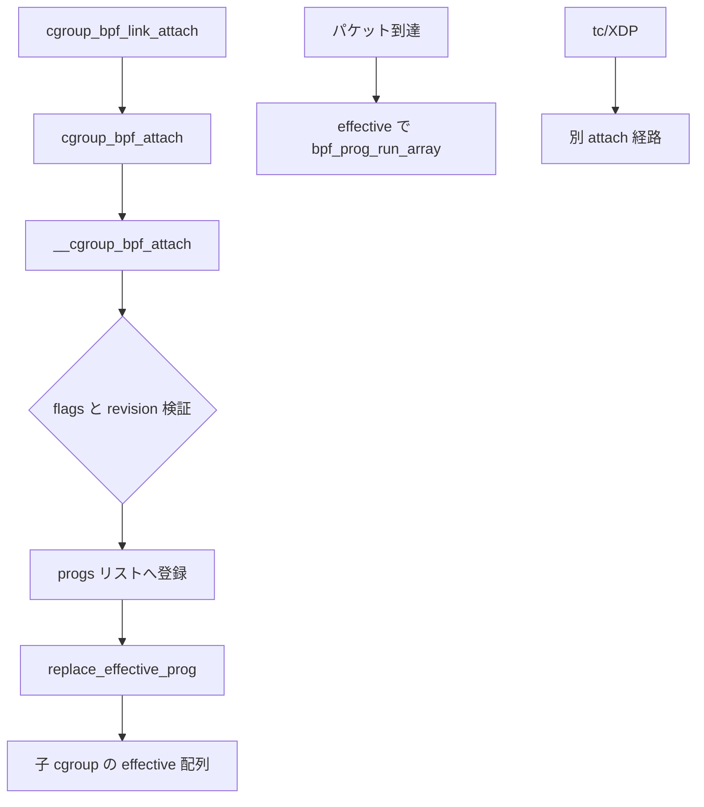

# 第16章 cgroup と networking プログラムの境界

> **本章で読むソース**
>
> - [`kernel/bpf/cgroup.c` L785-L834](https://github.com/gregkh/linux/blob/v6.18.38/kernel/bpf/cgroup.c#L785-L834)
> - [`kernel/bpf/cgroup.c` L924-L949](https://github.com/gregkh/linux/blob/v6.18.38/kernel/bpf/cgroup.c#L924-L949)
> - [`kernel/bpf/cgroup.c` L1477-L1509](https://github.com/gregkh/linux/blob/v6.18.38/kernel/bpf/cgroup.c#L1477-L1509)
> - [`kernel/bpf/cgroup.c` L2720-L2738](https://github.com/gregkh/linux/blob/v6.18.38/kernel/bpf/cgroup.c#L2720-L2739)
> - [`kernel/bpf/cgroup.c` L906-L918](https://github.com/gregkh/linux/blob/v6.18.38/kernel/bpf/cgroup.c#L906-L919)
> - [`kernel/bpf/syscall.c` L4488-L4525](https://github.com/gregkh/linux/blob/v6.18.38/kernel/bpf/syscall.c#L4488-L4525)
> - [`kernel/bpf/syscall.c` L2770-L2798](https://github.com/gregkh/linux/blob/v6.18.38/kernel/bpf/syscall.c#L2770-L2798)

## この章の狙い

cgroup へアタッチする BPF は、ソケットやデバイス、ingress/egress などネットワーク境界にまたがる。
一方で tc/XDP の `SCHED_CLS` や `XDP` は別の attach 経路を持つ。
本章は `cgroup_bpf_attach` の階層モデルと、syscall 層のプログラム種別分類、helper の attach 種別ごとの制限を読む。

## 前提

- [BPF オブジェクトと bpf コマンド](../part00-overview/02-bpf-objects-and-commands.md) で attach type を知っていること。
- [tracing プログラムのアタッチ](15-tracing-program-attach.md) で link モデルを知っていること。

## cgroup への link アタッチ

`BPF_LINK_TYPE_CGROUP` は cgroup fd をターゲットに取り、`cgroup_bpf_attach` へ委譲する。
revision チェックにより、ユーザーが古い cgroup 状態を前提にしたアタッチを拒否できる。

[`kernel/bpf/cgroup.c` L1477-L1509](https://github.com/gregkh/linux/blob/v6.18.38/kernel/bpf/cgroup.c#L1477-L1509)

```c
int cgroup_bpf_link_attach(const union bpf_attr *attr, struct bpf_prog *prog)
{
	struct bpf_link_primer link_primer;
	struct bpf_cgroup_link *link;
	struct cgroup *cgrp;
	int err;

	if (attr->link_create.flags & (~BPF_F_LINK_ATTACH_MASK))
		return -EINVAL;

	cgrp = cgroup_get_from_fd(attr->link_create.target_fd);
	if (IS_ERR(cgrp))
		return PTR_ERR(cgrp);

	link = kzalloc(sizeof(*link), GFP_USER);
	if (!link) {
		err = -ENOMEM;
		goto out_put_cgroup;
	}
	bpf_link_init(&link->link, BPF_LINK_TYPE_CGROUP, &bpf_cgroup_link_lops,
		      prog, attr->link_create.attach_type);
	link->cgroup = cgrp;

	err = bpf_link_prime(&link->link, &link_primer);
	if (err) {
		kfree(link);
		goto out_put_cgroup;
	}

	err = cgroup_bpf_attach(cgrp, NULL, NULL, link,
				link->link.attach_type, BPF_F_ALLOW_MULTI | attr->link_create.flags,
				attr->link_create.cgroup.relative_fd,
				attr->link_create.cgroup.expected_revision);
```

## __cgroup_bpf_attach の検証

実際の登録は `cgroup_mutex` 下の `__cgroup_bpf_attach` が担う。
`BPF_F_ALLOW_OVERRIDE` と `BPF_F_ALLOW_MULTI` の矛盾、`BPF_F_REPLACE` と挿入フラグの矛盾を先に弾く。

[`kernel/bpf/cgroup.c` L785-L834](https://github.com/gregkh/linux/blob/v6.18.38/kernel/bpf/cgroup.c#L785-L834)

```c
static int __cgroup_bpf_attach(struct cgroup *cgrp,
			       struct bpf_prog *prog, struct bpf_prog *replace_prog,
			       struct bpf_cgroup_link *link,
			       enum bpf_attach_type type, u32 flags, u32 id_or_fd,
			       u64 revision)
{
	u32 saved_flags = (flags & (BPF_F_ALLOW_OVERRIDE | BPF_F_ALLOW_MULTI));
	struct bpf_prog *old_prog = NULL;
	struct bpf_cgroup_storage *storage[MAX_BPF_CGROUP_STORAGE_TYPE] = {};
	struct bpf_cgroup_storage *new_storage[MAX_BPF_CGROUP_STORAGE_TYPE] = {};
	struct bpf_prog *new_prog = prog ? : link->link.prog;
	enum cgroup_bpf_attach_type atype;
	struct bpf_prog_list *pl;
	struct hlist_head *progs;
	int err;

	if (((flags & BPF_F_ALLOW_OVERRIDE) && (flags & BPF_F_ALLOW_MULTI)) ||
	    ((flags & BPF_F_REPLACE) && !(flags & BPF_F_ALLOW_MULTI)))
		/* invalid combination */
		return -EINVAL;
	if ((flags & BPF_F_REPLACE) && (flags & (BPF_F_BEFORE | BPF_F_AFTER)))
		/* only either replace or insertion with before/after */
		return -EINVAL;
	if (link && (prog || replace_prog))
		/* only either link or prog/replace_prog can be specified */
		return -EINVAL;
	if (!!replace_prog != !!(flags & BPF_F_REPLACE))
		/* replace_prog implies BPF_F_REPLACE, and vice versa */
		return -EINVAL;

	atype = bpf_cgroup_atype_find(type, new_prog->aux->attach_btf_id);
	if (atype < 0)
		return -EINVAL;
	if (revision && revision != cgrp->bpf.revisions[atype])
		return -ESTALE;

	progs = &cgrp->bpf.progs[atype];

	if (!hlist_empty(progs) && cgrp->bpf.flags[atype] != saved_flags)
		/* Disallow attaching non-overridable on top
		 * of existing overridable in this cgroup.
		 * Disallow attaching multi-prog if overridable or none
		 */
		return -EPERM;

	if (prog_list_length(progs, NULL) >= BPF_CGROUP_MAX_PROGS)
		return -E2BIG;
```

attach type は内部の `cgroup_bpf_attach_type` に正規化され、同一 cgroup でのフラグ一貫性が保たれる。

公開 API は cgroup ロックで直列化する。

[`kernel/bpf/cgroup.c` L906-L919](https://github.com/gregkh/linux/blob/v6.18.38/kernel/bpf/cgroup.c#L906-L919)

```c
static int cgroup_bpf_attach(struct cgroup *cgrp,
			     struct bpf_prog *prog, struct bpf_prog *replace_prog,
			     struct bpf_cgroup_link *link,
			     enum bpf_attach_type type,
			     u32 flags, u32 id_or_fd, u64 revision)
{
	int ret;

	cgroup_lock();
	ret = __cgroup_bpf_attach(cgrp, prog, replace_prog, link, type, flags,
				  id_or_fd, revision);
	cgroup_unlock();
	return ret;
}
```

## 子 cgroup への effective 配布

親 cgroup に付いたプログラムは、子 cgroup の effective 配列へ伝播する。
`replace_effective_prog` は子孫を走査し、リンク位置を特定して差し替える。

[`kernel/bpf/cgroup.c` L924-L949](https://github.com/gregkh/linux/blob/v6.18.38/kernel/bpf/cgroup.c#L924-L949)

```c
static void replace_effective_prog(struct cgroup *cgrp,
				   enum cgroup_bpf_attach_type atype,
				   struct bpf_cgroup_link *link)
{
	struct bpf_prog_array_item *item;
	struct cgroup_subsys_state *css;
	struct bpf_prog_array *progs;
	struct bpf_prog_list *pl;
	struct hlist_head *head;
	struct cgroup *cg;
	int pos;

	css_for_each_descendant_pre(css, &cgrp->self) {
		struct cgroup *desc = container_of(css, struct cgroup, self);

		if (percpu_ref_is_zero(&desc->bpf.refcnt))
			continue;

		/* find position of link in effective progs array */
		for (pos = 0, cg = desc; cg; cg = cgroup_parent(cg)) {
			if (pos && !(cg->bpf.flags[atype] & BPF_F_ALLOW_MULTI))
				continue;

			head = &cg->bpf.progs[atype];
			hlist_for_each_entry(pl, head, node) {
				if (!prog_list_prog(pl))
```

実行時はこの effective 配列を `bpf_prog_run_array` で走査する（network 分冊でパケット経路と接続する）。

## syscall 層の種別分類

`bpf_prog_load` ではプログラム種別ごとに必要なケーパビリティが異なる。
`is_net_admin_prog_type` は cgroup ソケット系と tc/XDP 系をまとめて `CAP_NET_ADMIN` 相当の検査対象にする。

[`kernel/bpf/syscall.c` L2770-L2798](https://github.com/gregkh/linux/blob/v6.18.38/kernel/bpf/syscall.c#L2770-L2798)

```c
static bool is_net_admin_prog_type(enum bpf_prog_type prog_type)
{
	switch (prog_type) {
	case BPF_PROG_TYPE_SCHED_CLS:
	case BPF_PROG_TYPE_SCHED_ACT:
	case BPF_PROG_TYPE_XDP:
	case BPF_PROG_TYPE_LWT_IN:
	case BPF_PROG_TYPE_LWT_OUT:
	case BPF_PROG_TYPE_LWT_XMIT:
	case BPF_PROG_TYPE_LWT_SEG6LOCAL:
	case BPF_PROG_TYPE_SK_SKB:
	case BPF_PROG_TYPE_SK_MSG:
	case BPF_PROG_TYPE_FLOW_DISSECTOR:
	case BPF_PROG_TYPE_CGROUP_DEVICE:
	case BPF_PROG_TYPE_CGROUP_SOCK:
	case BPF_PROG_TYPE_CGROUP_SOCK_ADDR:
	case BPF_PROG_TYPE_CGROUP_SOCKOPT:
	case BPF_PROG_TYPE_CGROUP_SYSCTL:
	case BPF_PROG_TYPE_SOCK_OPS:
	case BPF_PROG_TYPE_EXT: /* extends any prog */
	case BPF_PROG_TYPE_NETFILTER:
		return true;
	case BPF_PROG_TYPE_CGROUP_SKB:
		/* always unpriv */
	case BPF_PROG_TYPE_SK_REUSEPORT:
		/* equivalent to SOCKET_FILTER. need CAP_BPF only */
	default:
		return false;
	}
}
```

`SCHED_CLS` と `BPF_CGROUP_INET_INGRESS` は別 attach 経路だが、いずれもネットワーク管理者権限の対象である。
詳細な tc/tcx/XDP パイプラインは network 分冊へ委譲する。

## attach 種別ごとの helper 制限

cgroup の inet 系 attach では、戻り値を書き換える `bpf_set_retval` が禁止される。
ingress/egress ではカーネルが既にパケット処理の文脈を持つため、helper 側で二重の戻り値操作を閉じる。

[`kernel/bpf/cgroup.c` L2720-L2739](https://github.com/gregkh/linux/blob/v6.18.38/kernel/bpf/cgroup.c#L2720-L2739)

```c
	case BPF_FUNC_get_local_storage:
		return &bpf_get_local_storage_proto;
	case BPF_FUNC_get_retval:
		switch (prog->expected_attach_type) {
		case BPF_CGROUP_INET_INGRESS:
		case BPF_CGROUP_INET_EGRESS:
		case BPF_CGROUP_SOCK_OPS:
		case BPF_CGROUP_UDP4_RECVMSG:
		case BPF_CGROUP_UDP6_RECVMSG:
		case BPF_CGROUP_UNIX_RECVMSG:
		case BPF_CGROUP_INET4_GETPEERNAME:
		case BPF_CGROUP_INET6_GETPEERNAME:
		case BPF_CGROUP_UNIX_GETPEERNAME:
		case BPF_CGROUP_INET4_GETSOCKNAME:
		case BPF_CGROUP_INET6_GETSOCKNAME:
		case BPF_CGROUP_UNIX_GETSOCKNAME:
			return NULL;
		default:
			return &bpf_get_retval_proto;
		}
```

verifier は `NULL` を返す helper をプログラムから呼べないよう拒否する。

## bpf_prog_attach からの cgroup 分岐

従来の `BPF_PROG_ATTACH` も cgroup プログラム種別を検出すると `cgroup_bpf_prog_attach` へ委譲する。
attach flags のマスク検証は種別ごとに異なる。

[`kernel/bpf/syscall.c` L4488-L4525](https://github.com/gregkh/linux/blob/v6.18.38/kernel/bpf/syscall.c#L4488-L4525)

```c
static int bpf_prog_attach(const union bpf_attr *attr)
{
	enum bpf_prog_type ptype;
	struct bpf_prog *prog;
	int ret;

	if (CHECK_ATTR(BPF_PROG_ATTACH))
		return -EINVAL;

	ptype = attach_type_to_prog_type(attr->attach_type);
	if (ptype == BPF_PROG_TYPE_UNSPEC)
		return -EINVAL;
	if (bpf_mprog_supported(ptype)) {
		if (attr->attach_flags & ~BPF_F_ATTACH_MASK_MPROG)
			return -EINVAL;
	} else if (is_cgroup_prog_type(ptype, 0, false)) {
		if (attr->attach_flags & ~(BPF_F_ATTACH_MASK_BASE | BPF_F_ATTACH_MASK_MPROG))
			return -EINVAL;
	} else {
		if (attr->attach_flags & ~BPF_F_ATTACH_MASK_BASE)
			return -EINVAL;
		if (attr->relative_fd ||
		    attr->expected_revision)
			return -EINVAL;
	}

	prog = bpf_prog_get_type(attr->attach_bpf_fd, ptype);
	if (IS_ERR(prog))
		return PTR_ERR(prog);

	if (bpf_prog_attach_check_attach_type(prog, attr->attach_type)) {
		bpf_prog_put(prog);
		return -EINVAL;
	}

	if (is_cgroup_prog_type(ptype, prog->expected_attach_type, true)) {
		ret = cgroup_bpf_prog_attach(attr, ptype, prog);
		goto out;
	}
```

link API と legacy attach は最終的に同じ `__cgroup_bpf_attach` に合流する。

## 処理の流れ



cgroup SKB と tc はデータプレーンが交差するが、プログラム種別と attach API は分離されている。

## 高速化と最適化の工夫

effective 配列は attach 時に子孫へ一括更新し、パケット処理のホットパスでは配列走査だけに留める。
`BPF_F_ALLOW_MULTI` 時はリンク順序を事前に確定し、実行時のソートを避ける。
revision による `-ESTALE` はロック競合より安価に整合性を検出できる。

## まとめ

cgroup BPF は階層とフラグの組み合わせでプログラム集合を管理する。
syscall 層の種別分類と helper 制限が、ネットワーク境界ごとの安全な API 面を切り分ける。

## 関連する章

- [tracing プログラムのアタッチ](15-tracing-program-attach.md)
- [tracepoint と静的パッチ](../part05-tracing/17-tracepoint-static-patch.md)
