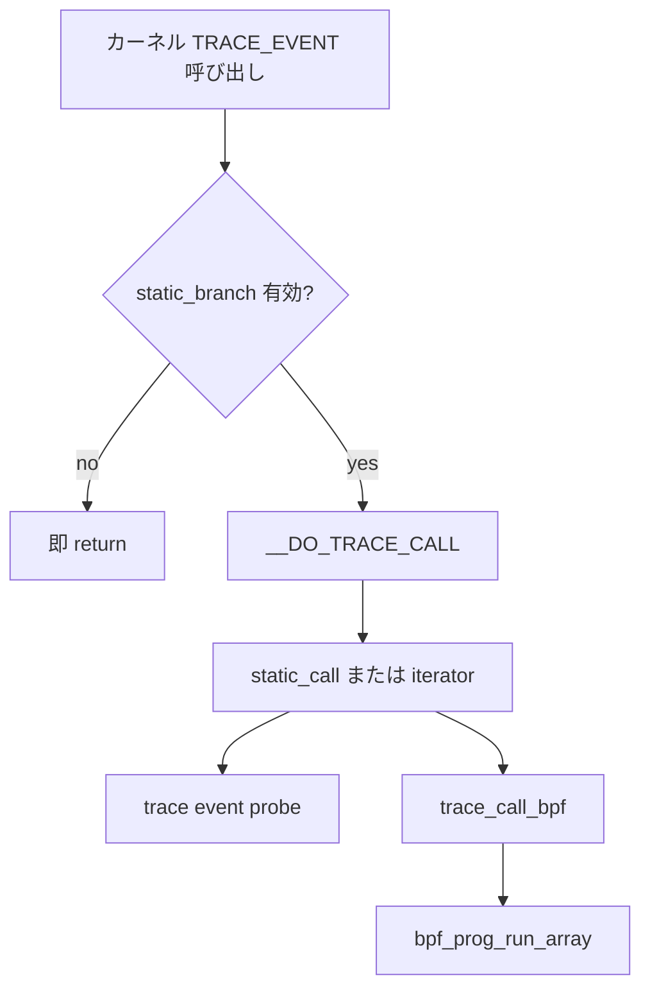

# 第17章 tracepoint と静的パッチ

> **本章で読むソース**
>
> - [`include/linux/tracepoint.h` L198-L208](https://github.com/gregkh/linux/blob/v6.18.38/include/linux/tracepoint.h#L198-L208)
> - [`include/linux/tracepoint.h` L236-L246](https://github.com/gregkh/linux/blob/v6.18.38/include/linux/tracepoint.h#L236-L246)
> - [`kernel/tracepoint.c` L277-L318](https://github.com/gregkh/linux/blob/v6.18.38/kernel/tracepoint.c#L277-L318)
> - [`kernel/tracepoint.c` L484-L487](https://github.com/gregkh/linux/blob/v6.18.38/kernel/tracepoint.c#L484-L487)
> - [`kernel/trace/trace_events.c` L684-L707](https://github.com/gregkh/linux/blob/v6.18.38/kernel/trace/trace_events.c#L684-L707)
> - [`kernel/tracepoint.c` L319-L336](https://github.com/gregkh/linux/blob/v6.18.38/kernel/tracepoint.c#L319-L344)

## この章の狙い

**tracepoint** はカーネルに静的に埋め込まれた観測点である。
プローブ未登録時は `static_branch` で呼び出し自体を省略し、登録後は `static_call` で直接ジャンプする。
BPF の tracepoint プログラムは `trace_call_bpf` 経由で `prog_array` を実行する。
本章はマクロ展開からプローブ登録、BPF 実行までを読む。

## 前提

- [BPF サブシステムの全体像](../part00-overview/01-bpf-subsystem-overview.md) で tracepoint プログラム種別を知っていること。
- [同期と RCU](../../locking/part04-rcu/12-rcu-basics.md) で RCU 読み取りを知っていること。

## ホットパスでの static_call

`CONFIG_HAVE_STATIC_CALL` が有効なとき、tracepoint 呼び出しは関数ポインタ配列を RCU で読み、`static_call` で1本目のハンドラへ飛ぶ。

[`include/linux/tracepoint.h` L198-L208](https://github.com/gregkh/linux/blob/v6.18.38/include/linux/tracepoint.h#L198-L208)

```c
#define __DO_TRACE_CALL(name, args)					\
	do {								\
		struct tracepoint_func *it_func_ptr;			\
		void *__data;						\
		it_func_ptr =						\
			rcu_dereference_raw((&__tracepoint_##name)->funcs); \
		if (it_func_ptr) {					\
			__data = (it_func_ptr)->data;			\
			static_call(tp_func_##name)(__data, args);	\
		}							\
	} while (0)
```

プローブが無いときは `it_func_ptr` が NULL で本体は実行されない。
有効化は `static_branch_enable(&tp->key)` が担う（後述）。

## マクロが生成する登録 API

各 tracepoint は `register_trace_##name` インライン関数を持ち、内部で `tracepoint_probe_register` を呼ぶ。

[`include/linux/tracepoint.h` L236-L246](https://github.com/gregkh/linux/blob/v6.18.38/include/linux/tracepoint.h#L236-L246)

```c
#define __DECLARE_TRACE_COMMON(name, proto, args, data_proto)		\
	extern int __traceiter_##name(data_proto);			\
	DECLARE_STATIC_CALL(tp_func_##name, __traceiter_##name);	\
	extern struct tracepoint __tracepoint_##name;			\
	extern void rust_do_trace_##name(proto);			\
	static inline int						\
	register_trace_##name(void (*probe)(data_proto), void *data)	\
	{								\
		return tracepoint_probe_register(&__tracepoint_##name,	\
						(void *)probe, data);	\
	}								\
```

`__traceiter_##name` がイテレータ本体であり、複数プローブ時はここからチェーンする。

## tracepoint_probe_register

登録は `tracepoints_mutex` で直列化される。
優先度付き登録のデフォルトは `TRACEPOINT_DEFAULT_PRIO` である。

[`kernel/tracepoint.c` L484-L487](https://github.com/gregkh/linux/blob/v6.18.38/kernel/tracepoint.c#L484-L487)

```c
int tracepoint_probe_register(struct tracepoint *tp, void *probe, void *data)
{
	return tracepoint_probe_register_prio(tp, probe, data, TRACEPOINT_DEFAULT_PRIO);
}
```

## 0 から 1 への遷移と static_call 更新

最初のプローブ登録時は `static_branch_enable` で tracepoint 呼び出し自体を有効化し、`tracepoint_update_call` で static_call 先を更新する。

[`kernel/tracepoint.c` L277-L318](https://github.com/gregkh/linux/blob/v6.18.38/kernel/tracepoint.c#L277-L318)

```c
static int tracepoint_add_func(struct tracepoint *tp,
			       struct tracepoint_func *func, int prio,
			       bool warn)
{
	struct tracepoint_func *old, *tp_funcs;
	int ret;

	if (tp->ext && tp->ext->regfunc && !static_key_enabled(&tp->key)) {
		ret = tp->ext->regfunc();
		if (ret < 0)
			return ret;
	}

	tp_funcs = rcu_dereference_protected(tp->funcs,
			lockdep_is_held(&tracepoints_mutex));
	old = func_add(&tp_funcs, func, prio);
	if (IS_ERR(old)) {
		if (tp->ext && tp->ext->unregfunc && !static_key_enabled(&tp->key))
			tp->ext->unregfunc();
		WARN_ON_ONCE(warn && PTR_ERR(old) != -ENOMEM);
		return PTR_ERR(old);
	}

	/*
	 * rcu_assign_pointer has as smp_store_release() which makes sure
	 * that the new probe callbacks array is consistent before setting
	 * a pointer to it.  This array is referenced by __DO_TRACE from
	 * include/linux/tracepoint.h using rcu_dereference_sched().
	 */
	switch (nr_func_state(tp_funcs)) {
	case TP_FUNC_1:		/* 0->1 */
		/*
		 * Make sure new static func never uses old data after a
		 * 1->0->1 transition sequence.
		 */
		tp_rcu_cond_sync(TP_TRANSITION_SYNC_1_0_1);
		/* Set static call to first function */
		tracepoint_update_call(tp, tp_funcs);
		/* Both iterator and static call handle NULL tp->funcs */
		rcu_assign_pointer(tp->funcs, tp_funcs);
		static_branch_enable(&tp->key);
		break;
```

コメントが示すとおり、`rcu_assign_pointer` と `rcu_dereference_sched` の順序が読み取り側の整合性を保つ。

## 複数プローブ時の iterator 切り替え

2本目以降の登録では `TP_FUNC_2` または `TP_FUNC_N` 経路に入る。
iterator 用 static_call を先に更新し、その後 `tp->funcs` を RCU で差し替える順序がコメントで固定されている。

[`kernel/tracepoint.c` L319-L344](https://github.com/gregkh/linux/blob/v6.18.38/kernel/tracepoint.c#L319-L344)

```c
	case TP_FUNC_2:		/* 1->2 */
		/* Set iterator static call */
		tracepoint_update_call(tp, tp_funcs);
		/*
		 * Iterator callback installed before updating tp->funcs.
		 * Requires ordering between RCU assign/dereference and
		 * static call update/call.
		 */
		fallthrough;
	case TP_FUNC_N:		/* N->N+1 (N>1) */
		rcu_assign_pointer(tp->funcs, tp_funcs);
		/*
		 * Make sure static func never uses incorrect data after a
		 * N->...->2->1 (N>1) transition sequence.
		 */
		if (tp_funcs[0].data != old[0].data)
			tp_rcu_get_state(TP_TRANSITION_SYNC_N_2_1);
		break;
	default:
		WARN_ON_ONCE(1);
		break;
	}

	release_probes(tp, old);
	return 0;
}
```

`tp_rcu_get_state` は遷移後に古い probe 配列を参照しないための同期である。

## trace event からの登録

`trace_events` サブシステムは tracepoint へ class 固有の probe を登録する。
perf 用 probe も同じ tracepoint に別ハンドラとして載る。

[`kernel/trace/trace_events.c` L684-L707](https://github.com/gregkh/linux/blob/v6.18.38/kernel/trace/trace_events.c#L684-L707)

```c
int trace_event_reg(struct trace_event_call *call,
		    enum trace_reg type, void *data)
{
	struct trace_event_file *file = data;

	WARN_ON(!(call->flags & TRACE_EVENT_FL_TRACEPOINT));
	switch (type) {
	case TRACE_REG_REGISTER:
		return tracepoint_probe_register(call->tp,
						 call->class->probe,
						 file);
	case TRACE_REG_UNREGISTER:
		tracepoint_probe_unregister(call->tp,
					    call->class->probe,
					    file);
		return 0;

#ifdef CONFIG_PERF_EVENTS
	case TRACE_REG_PERF_REGISTER:
		if (!call->class->perf_probe)
			return -ENODEV;
		return tracepoint_probe_register(call->tp,
						 call->class->perf_probe,
						 call);
```

## BPF プログラムの実行

kprobe や tracepoint イベントは `trace_call_bpf` で `prog_array` を走査する。
再入を `bpf_prog_active` で検出し、ネスト時はイベントを捨てる。

[`kernel/trace/bpf_trace.c` L109-L147](https://github.com/gregkh/linux/blob/v6.18.38/kernel/trace/bpf_trace.c#L109-L147)

```c
unsigned int trace_call_bpf(struct trace_event_call *call, void *ctx)
{
	unsigned int ret;

	cant_sleep();

	if (unlikely(__this_cpu_inc_return(bpf_prog_active) != 1)) {
		/*
		 * since some bpf program is already running on this cpu,
		 * don't call into another bpf program (same or different)
		 * and don't send kprobe event into ring-buffer,
		 * so return zero here
		 */
		rcu_read_lock();
		bpf_prog_inc_misses_counters(rcu_dereference(call->prog_array));
		rcu_read_unlock();
		ret = 0;
		goto out;
	}

	/*
	 * Instead of moving rcu_read_lock/rcu_dereference/rcu_read_unlock
	 * to all call sites, we did a bpf_prog_array_valid() there to check
	 * whether call->prog_array is empty or not, which is
	 * a heuristic to speed up execution.
	 *
	 * If bpf_prog_array_valid() fetched prog_array was
	 * non-NULL, we go into trace_call_bpf() and do the actual
	 * proper rcu_dereference() under RCU lock.
	 * If it turns out that prog_array is NULL then, we bail out.
	 * For the opposite, if the bpf_prog_array_valid() fetched pointer
	 * was NULL, you'll skip the prog_array with the risk of missing
	 * out of events when it was updated in between this and the
	 * rcu_dereference() which is accepted risk.
	 */
	rcu_read_lock();
	ret = bpf_prog_run_array(rcu_dereference(call->prog_array),
				 ctx, bpf_prog_run);
	rcu_read_unlock();
```

## 処理の流れ



tracepoint 自体のコストは static_branch で抑え、BPF は別経路で配列実行する。

## 高速化と最適化の工夫

`static_branch` によりプローブ未使用時は tracepoint サイトの分岐コストを最小化する。
1 本目のプローブには `static_call` で間接呼び出しを避け、複数本時のみ iterator へ切り替える。
`bpf_prog_array_valid` は空配列の RCU ロックを省略するヒューリスティックである（コメントがトレードオフを明記する）。

## まとめ

tracepoint は静的埋め込みと動的登録の二段構えである。
登録数に応じて static_call と iterator を切り替え、BPF は `trace_call_bpf` で既存の配列実行モデルに乗る。

## 関連する章

- [ring buffer](18-ring-buffer.md)
- [trace event と trace コア](20-trace-events-core.md)
- [perf events と BPF の接点](22-perf-events-bpf.md)
