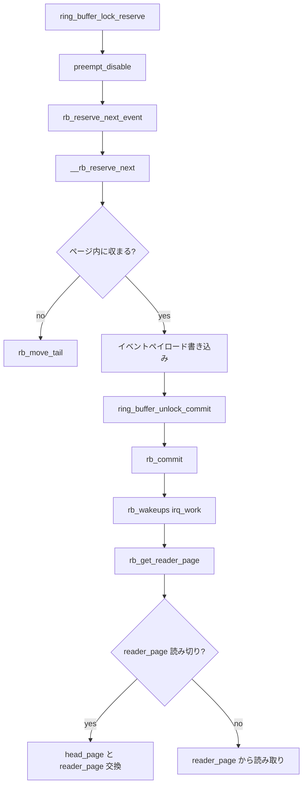

# 第18章 tracing ring buffer

> **本章で読むソース**
>
> - [`kernel/trace/ring_buffer.c` L479-L509](https://github.com/gregkh/linux/blob/v6.18.38/kernel/trace/ring_buffer.c#L479-L516)
> - [`kernel/trace/ring_buffer.c` L1371-L1407](https://github.com/gregkh/linux/blob/v6.18.38/kernel/trace/ring_buffer.c#L1371-L1407)
> - [`kernel/trace/ring_buffer.c` L4022-L4026](https://github.com/gregkh/linux/blob/v6.18.38/kernel/trace/ring_buffer.c#L4022-L4026)
> - [`kernel/trace/ring_buffer.c` L4028-L4060](https://github.com/gregkh/linux/blob/v6.18.38/kernel/trace/ring_buffer.c#L4028-L4060)
> - [`kernel/trace/ring_buffer.c` L4451-L4523](https://github.com/gregkh/linux/blob/v6.18.38/kernel/trace/ring_buffer.c#L4451-L4526)
> - [`kernel/trace/ring_buffer.c` L4594-L4627](https://github.com/gregkh/linux/blob/v6.18.38/kernel/trace/ring_buffer.c#L4594-L4627)
> - [`kernel/trace/ring_buffer.c` L4690-L4730](https://github.com/gregkh/linux/blob/v6.18.38/kernel/trace/ring_buffer.c#L4690-L4730)
> - [`kernel/trace/ring_buffer.c` L5420-L5490](https://github.com/gregkh/linux/blob/v6.18.38/kernel/trace/ring_buffer.c#L5420-L5490)
> - [`kernel/trace/ring_buffer.c` L5515-L5544](https://github.com/gregkh/linux/blob/v6.18.38/kernel/trace/ring_buffer.c#L5515-L5544)
> - [`kernel/trace/ring_buffer.c` L4215-L4239](https://github.com/gregkh/linux/blob/v6.18.38/kernel/trace/ring_buffer.c#L4215-L4239)

## この章の狙い

カーネル trace、ftrace、perf の多くは **`kernel/trace/ring_buffer.c` の tracing ring buffer** にイベントを追記する。
設計の中心は CPU ごとの独立バッファと、プロデューサ側の reserve/commit ペアである。
コンシューマは `reader_page` を回転しながら読み取り、プロデューサは `tail_page` へ書き込む。
本章は per-CPU 状態、書き込み位置確保、コミット、reader ページ交換までを読む。

## 本章が扱わない ring buffer

BPF の `BPF_MAP_TYPE_RINGBUF`（`bpf_ringbuf_reserve` / `bpf_ringbuf_submit`）は `kernel/bpf/ringbuf.c` の別実装である。
perf の mmap ring buffer もユーザー空間と共有する別レイアウトを持つ。
本章の `ring_buffer_per_cpu` は ftrace / trace コア専用であり、BPF ringbuf map や perf mmap の API とは直接対応しない。

## 前提

- [割り込みと時間](../../irq-time/README.md) でプリエンプト無効化と NMI の文脈を知っていること。
- [tracepoint と静的パッチ](17-tracepoint-static-patch.md) でイベント発火点を知っていること。

## ring_buffer_per_cpu の役割分担

`struct ring_buffer_per_cpu` は1 CPU 分のページリストと読み書きカーソルを保持する。
`head_page` はページリスト上の次の読み取り候補であり、`reader_page` はリスト外に置かれた実際の読み取りバッファである。
`tail_page` は書き込み側、`commit_page` はコミット済み境界である。

[`kernel/trace/ring_buffer.c` L479-L516](https://github.com/gregkh/linux/blob/v6.18.38/kernel/trace/ring_buffer.c#L479-L516)

```c
struct ring_buffer_per_cpu {
	int				cpu;
	atomic_t			record_disabled;
	atomic_t			resize_disabled;
	struct trace_buffer	*buffer;
	raw_spinlock_t			reader_lock;	/* serialize readers */
	arch_spinlock_t			lock;
	struct lock_class_key		lock_key;
	struct buffer_data_page		*free_page;
	unsigned long			nr_pages;
	unsigned int			current_context;
	struct list_head		*pages;
	/* pages generation counter, incremented when the list changes */
	unsigned long			cnt;
	struct buffer_page		*head_page;	/* read from head */
	struct buffer_page		*tail_page;	/* write to tail */
	struct buffer_page		*commit_page;	/* committed pages */
	struct buffer_page		*reader_page;
	unsigned long			lost_events;
	unsigned long			last_overrun;
	unsigned long			nest;
	local_t				entries_bytes;
	local_t				entries;
	local_t				overrun;
	local_t				commit_overrun;
	local_t				dropped_events;
	local_t				committing;
	local_t				commits;
	local_t				pages_touched;
	local_t				pages_lost;
	local_t				pages_read;
	long				last_pages_touch;
	size_t				shortest_full;
	unsigned long			read;
	unsigned long			read_bytes;
	rb_time_t			write_stamp;
	rb_time_t			before_stamp;
	u64				event_stamp[MAX_NEST];
```

`record_disabled` はトレース全体の停止、`pages_touched` と `shortest_full` はバッファ満杯検出に使われる。
`cnt` はページリスト変更の世代番号で、リサイズや swap との競合検出に寄与する。

## ring_buffer_lock_reserve のゲート

公開 API `ring_buffer_lock_reserve` は preempt を止め、自 CPU がバッファ対象か、再帰トレースでないかを確認する。
スケジューラ trace では自分自身を再帰的にトレースしないよう `trace_recursive_lock` が入る。

[`kernel/trace/ring_buffer.c` L4690-L4730](https://github.com/gregkh/linux/blob/v6.18.38/kernel/trace/ring_buffer.c#L4690-L4730)

```c
struct ring_buffer_event *
ring_buffer_lock_reserve(struct trace_buffer *buffer, unsigned long length)
{
	struct ring_buffer_per_cpu *cpu_buffer;
	struct ring_buffer_event *event;
	int cpu;

	/* If we are tracing schedule, we don't want to recurse */
	preempt_disable_notrace();

	if (unlikely(atomic_read(&buffer->record_disabled)))
		goto out;

	cpu = raw_smp_processor_id();

	if (unlikely(!cpumask_test_cpu(cpu, buffer->cpumask)))
		goto out;

	cpu_buffer = buffer->buffers[cpu];

	if (unlikely(atomic_read(&cpu_buffer->record_disabled)))
		goto out;

	if (unlikely(length > buffer->max_data_size))
		goto out;

	if (unlikely(trace_recursive_lock(cpu_buffer)))
		goto out;

	event = rb_reserve_next_event(buffer, cpu_buffer, length);
	if (!event)
		goto out_unlock;

	return event;

 out_unlock:
	trace_recursive_unlock(cpu_buffer);
 out:
	preempt_enable_notrace();
	return NULL;
}
```

失敗時は preempt を戻して NULL を返す。
成功時は呼び出し元がイベントペイロードを書き、`ring_buffer_unlock_commit` で確定する。

## rb_reserve_next_event と NMI 制約

内部実装 `rb_reserve_next_event` は commit 開始後に tail ページを固定する。
NMI 文脈では `cmpxchg` や `atomic64` が安全でない構成では書き込みを拒否する。

[`kernel/trace/ring_buffer.c` L4594-L4627](https://github.com/gregkh/linux/blob/v6.18.38/kernel/trace/ring_buffer.c#L4594-L4627)

```c
static __always_inline struct ring_buffer_event *
rb_reserve_next_event(struct trace_buffer *buffer,
		      struct ring_buffer_per_cpu *cpu_buffer,
		      unsigned long length)
{
	struct ring_buffer_event *event;
	struct rb_event_info info;
	int nr_loops = 0;
	int add_ts_default;

	/*
	 * ring buffer does cmpxchg as well as atomic64 operations
	 * (which some archs use locking for atomic64), make sure this
	 * is safe in NMI context
	 */
	if ((!IS_ENABLED(CONFIG_ARCH_HAVE_NMI_SAFE_CMPXCHG) ||
	     IS_ENABLED(CONFIG_GENERIC_ATOMIC64)) &&
	    (unlikely(in_nmi()))) {
		return NULL;
	}

	rb_start_commit(cpu_buffer);
	/* The commit page can not change after this */

#ifdef CONFIG_RING_BUFFER_ALLOW_SWAP
	/*
	 * Due to the ability to swap a cpu buffer from a buffer
	 * it is possible it was swapped before we committed.
	 * (committing stops a swap). We check for it here and
	 * if it happened, we have to fail the write.
	 */
	barrier();
	if (unlikely(READ_ONCE(cpu_buffer->buffer) != buffer)) {
		local_dec(&cpu_buffer->committing);
```

`CONFIG_RING_BUFFER_ALLOW_SWAP` 時は、commit 中に CPU バッファが別 `trace_buffer` へ付け替わっていないかを確認する。

## __rb_reserve_next の fast path と slow path

tail ページの `write` カウンタへ `local_add_return` する前後でタイムスタンプを読み、イベント長に差分または extend レコードを付加する。
`/*A*/` から `/*C*/` までが割り込み無しの fast path で、`tail == w` なら `/*D*/` で `write_stamp` を更新する。

[`kernel/trace/ring_buffer.c` L4451-L4526](https://github.com/gregkh/linux/blob/v6.18.38/kernel/trace/ring_buffer.c#L4451-L4526)

```c
static struct ring_buffer_event *
__rb_reserve_next(struct ring_buffer_per_cpu *cpu_buffer,
		  struct rb_event_info *info)
{
	struct ring_buffer_event *event;
	struct buffer_page *tail_page;
	unsigned long tail, write, w;

	/* Don't let the compiler play games with cpu_buffer->tail_page */
	tail_page = info->tail_page = READ_ONCE(cpu_buffer->tail_page);

 /*A*/	w = local_read(&tail_page->write) & RB_WRITE_MASK;
	barrier();
	rb_time_read(&cpu_buffer->before_stamp, &info->before);
	rb_time_read(&cpu_buffer->write_stamp, &info->after);
	barrier();
	info->ts = rb_time_stamp(cpu_buffer->buffer);

	if ((info->add_timestamp & RB_ADD_STAMP_ABSOLUTE)) {
		info->delta = info->ts;
	} else {
		/*
		 * If interrupting an event time update, we may need an
		 * absolute timestamp.
		 * Don't bother if this is the start of a new page (w == 0).
		 */
		if (!w) {
			/* Use the sub-buffer timestamp */
			info->delta = 0;
		} else if (unlikely(info->before != info->after)) {
			info->add_timestamp |= RB_ADD_STAMP_FORCE | RB_ADD_STAMP_EXTEND;
			info->length += RB_LEN_TIME_EXTEND;
		} else {
			info->delta = info->ts - info->after;
			if (unlikely(test_time_stamp(info->delta))) {
				info->add_timestamp |= RB_ADD_STAMP_EXTEND;
				info->length += RB_LEN_TIME_EXTEND;
			}
		}
	}

 /*B*/	rb_time_set(&cpu_buffer->before_stamp, info->ts);

 /*C*/	write = local_add_return(info->length, &tail_page->write);

	/* set write to only the index of the write */
	write &= RB_WRITE_MASK;

	tail = write - info->length;

	/* See if we shot pass the end of this buffer page */
	if (unlikely(write > cpu_buffer->buffer->subbuf_size)) {
		check_buffer(cpu_buffer, info, CHECK_FULL_PAGE);
		return rb_move_tail(cpu_buffer, tail, info);
	}

	if (likely(tail == w)) {
		/* Nothing interrupted us between A and C */
 /*D*/		rb_time_set(&cpu_buffer->write_stamp, info->ts);
		/*
		 * If something came in between C and D, the write stamp
		 * may now not be in sync. But that's fine as the before_stamp
		 * will be different and then next event will just be forced
		 * to use an absolute timestamp.
		 */
		if (likely(!(info->add_timestamp &
			     (RB_ADD_STAMP_FORCE | RB_ADD_STAMP_ABSOLUTE))))
			/* This did not interrupt any time update */
			info->delta = info->ts - info->after;
		else
			/* Just use full timestamp for interrupting event */
			info->delta = info->ts;
		check_buffer(cpu_buffer, info, tail);
	} else {
		u64 ts;
		/* SLOW PATH - Interrupted between A and C */
```

ページ境界を超える書き込みは `rb_move_tail` で次ページへ回す。
slow path は `before_stamp` と `write_stamp` の不整合を絶対タイムスタンプで回復する。

## rb_commit と reader 起床

`ring_buffer_unlock_commit` は `rb_commit` でエントリカウンタを増やし、`rb_wakeups` で待機中の reader に irq_work を投げる。

[`kernel/trace/ring_buffer.c` L4022-L4026](https://github.com/gregkh/linux/blob/v6.18.38/kernel/trace/ring_buffer.c#L4022-L4026)

```c
static void rb_commit(struct ring_buffer_per_cpu *cpu_buffer)
{
	local_inc(&cpu_buffer->entries);
	rb_end_commit(cpu_buffer);
}
```

[`kernel/trace/ring_buffer.c` L4028-L4060](https://github.com/gregkh/linux/blob/v6.18.38/kernel/trace/ring_buffer.c#L4028-L4060)

```c
static __always_inline void
rb_wakeups(struct trace_buffer *buffer, struct ring_buffer_per_cpu *cpu_buffer)
{
	if (buffer->irq_work.waiters_pending) {
		buffer->irq_work.waiters_pending = false;
		/* irq_work_queue() supplies it's own memory barriers */
		irq_work_queue(&buffer->irq_work.work);
	}

	if (cpu_buffer->irq_work.waiters_pending) {
		cpu_buffer->irq_work.waiters_pending = false;
		/* irq_work_queue() supplies it's own memory barriers */
		irq_work_queue(&cpu_buffer->irq_work.work);
	}

	if (cpu_buffer->last_pages_touch == local_read(&cpu_buffer->pages_touched))
		return;

	if (cpu_buffer->reader_page == cpu_buffer->commit_page)
		return;

	if (!cpu_buffer->irq_work.full_waiters_pending)
		return;

	cpu_buffer->last_pages_touch = local_read(&cpu_buffer->pages_touched);

	if (!full_hit(buffer, cpu_buffer->cpu, cpu_buffer->shortest_full))
		return;

	cpu_buffer->irq_work.wakeup_full = true;
	cpu_buffer->irq_work.full_waiters_pending = false;
	/* irq_work_queue() supplies it's own memory barriers */
	irq_work_queue(&cpu_buffer->irq_work.work);
}
```

バッファ満杯時は `wakeup_full` を立て、ユーザー空間の blocking reader を起こす。

公開 commit API は preempt を戻すまでを担う。

[`kernel/trace/ring_buffer.c` L4215-L4239](https://github.com/gregkh/linux/blob/v6.18.38/kernel/trace/ring_buffer.c#L4215-L4239)

```c
int ring_buffer_unlock_commit(struct trace_buffer *buffer)
{
	struct ring_buffer_per_cpu *cpu_buffer;
	int cpu = raw_smp_processor_id();

	cpu_buffer = buffer->buffers[cpu];

	rb_commit(cpu_buffer);

	rb_wakeups(buffer, cpu_buffer);

	trace_recursive_unlock(cpu_buffer);

	preempt_enable_notrace();

  return 0;
}
```

## reader ページ交換と consumer 側

コンシューマは `rb_get_reader_page` で `reader_page` を取得する。
現ページを読み切ったら、空にした `reader_page` を `rb_set_head_page` で得た `head_page` とリスト上で交換し、新しいデータページを `reader_page` として受け取る。

[`kernel/trace/ring_buffer.c` L5420-L5490](https://github.com/gregkh/linux/blob/v6.18.38/kernel/trace/ring_buffer.c#L5420-L5490)

```c
static struct buffer_page *
rb_get_reader_page(struct ring_buffer_per_cpu *cpu_buffer)
{
	struct buffer_page *reader = NULL;
	unsigned long bsize = READ_ONCE(cpu_buffer->buffer->subbuf_size);
	unsigned long overwrite;
	unsigned long flags;
	int nr_loops = 0;
	bool ret;

	local_irq_save(flags);
	arch_spin_lock(&cpu_buffer->lock);

 again:
	// ... (中略) ...
	reader = cpu_buffer->reader_page;

	/* If there's more to read, return this page */
	if (cpu_buffer->reader_page->read < rb_page_size(reader))
		goto out;

	// ... (中略) ...
	/* check if we caught up to the tail */
	reader = NULL;
	if (cpu_buffer->commit_page == cpu_buffer->reader_page)
		goto out;

	/* Don't bother swapping if the ring buffer is empty */
	if (rb_num_of_entries(cpu_buffer) == 0)
		goto out;

	/*
	 * Reset the reader page to size zero.
	 */
	local_set(&cpu_buffer->reader_page->write, 0);
	local_set(&cpu_buffer->reader_page->entries, 0);
	cpu_buffer->reader_page->real_end = 0;

 spin:
	/*
	 * Splice the empty reader page into the list around the head.
	 */
	reader = rb_set_head_page(cpu_buffer);
	if (!reader)
		goto out;
	cpu_buffer->reader_page->list.next = rb_list_head(reader->list.next);
	cpu_buffer->reader_page->list.prev = reader->list.prev;

	// ... (中略) ...
	cpu_buffer->pages = reader->list.prev;

	/* The reader page will be pointing to the new head */
	rb_set_list_to_head(&cpu_buffer->reader_page->list);
```

`rb_set_head_page` はリスト上で head フラグが立ったページを辿り、次に読むべき `head_page` を確定する。

[`kernel/trace/ring_buffer.c` L1371-L1407](https://github.com/gregkh/linux/blob/v6.18.38/kernel/trace/ring_buffer.c#L1371-L1407)

```c
static struct buffer_page *
rb_set_head_page(struct ring_buffer_per_cpu *cpu_buffer)
{
	struct buffer_page *head;
	struct buffer_page *page;
	struct list_head *list;
	int i;

	if (RB_WARN_ON(cpu_buffer, !cpu_buffer->head_page))
		return NULL;

	/* sanity check */
	list = cpu_buffer->pages;
	if (RB_WARN_ON(cpu_buffer, rb_list_head(list->prev->next) != list))
		return NULL;

	page = head = cpu_buffer->head_page;
	/*
	 * It is possible that the writer moves the header behind
	 * where we started, and we miss in one loop.
	 * A second loop should grab the header, but we'll do
	 * three loops just because I'm paranoid.
	 */
	for (i = 0; i < 3; i++) {
		do {
			if (rb_is_head_page(page, page->list.prev)) {
				cpu_buffer->head_page = page;
				return page;
			}
			rb_inc_page(&page);
		} while (page != head);
	}

	RB_WARN_ON(cpu_buffer, 1);

	return NULL;
}
```

交換の完了処理では `rb_head_page_replace` が writer と競合し、成功時に `head_page` を進めて `reader_page` を新 head に差し替える。
overwrite 時は `overrun` カウンタを読み、`lost_events` を更新する。

[`kernel/trace/ring_buffer.c` L5515-L5544](https://github.com/gregkh/linux/blob/v6.18.38/kernel/trace/ring_buffer.c#L5515-L5544)

```c
	ret = rb_head_page_replace(reader, cpu_buffer->reader_page);

	/*
	 * If we did not convert it, then we must try again.
	 */
	if (!ret)
		goto spin;

	if (cpu_buffer->ring_meta)
		rb_update_meta_reader(cpu_buffer, reader);

	/*
	 * Yay! We succeeded in replacing the page.
	 *
	 * Now make the new head point back to the reader page.
	 */
	rb_list_head(reader->list.next)->prev = &cpu_buffer->reader_page->list;
	rb_inc_page(&cpu_buffer->head_page);

	cpu_buffer->cnt++;
	local_inc(&cpu_buffer->pages_read);

	/* Finally update the reader page to the new head */
	cpu_buffer->reader_page = reader;
	cpu_buffer->reader_page->read = 0;

	if (overwrite != cpu_buffer->last_overrun) {
		cpu_buffer->lost_events = overwrite - cpu_buffer->last_overrun;
		cpu_buffer->last_overrun = overwrite;
	}
```

`commit_page == reader_page` のときはコンシューマがプロデューサに追いついたとみなし、交換は行わない。

## 処理の流れ



プロデューサとコンシューマは通常別 CPU であるが、同一 CPU バッファ内では writer が lock を取らずに追記できる。
reader 交換は `arch_spin_lock` の下で行われ、writer の `rb_move_tail` と `rb_head_page_replace` が競合する。

## 高速化と最適化の工夫

per-CPU バッファにより writer 間のロック競合を排除する。
`local_add_return` による tail 更新は、reader が commit 境界を見るまでの間も並行可能である。
タイムスタンプは差分エンコードが主で、異常時だけ extend レコードを追加し、平均イベントサイズを抑える。
フィルタ有効時は trace コアが per-CPU 一時バッファへ書き、一致時だけ ring buffer へコピーする（第20章）。
discard 用の複数アトミック操作を避ける設計である。

## まとめ

tracing ring buffer は ftrace / trace コアの共有追記基盤である。
reserve/commit の対、per-CPU 分離、`head_page` と `reader_page` の交換、タイムスタンプの fast/slow path が高頻度記録のスケーラビリティを支える。

## 関連する章

- [tracepoint と静的パッチ](17-tracepoint-static-patch.md)
- [trace event と trace コア](20-trace-events-core.md)
- [perf events と BPF の接点](22-perf-events-bpf.md)

> v7.1.3 ではリモート CPU からの読み取り用に [`__rb_get_reader_page_from_remote` L5579-L5635](https://github.com/gregkh/linux/blob/v7.1.3/kernel/trace/ring_buffer.c#L5579-L5635) が追加され、
> [`rb_get_reader_page` L5808-L5811](https://github.com/gregkh/linux/blob/v7.1.3/kernel/trace/ring_buffer.c#L5808-L5811) が `cpu_buffer->remote` で経路を分岐する。
