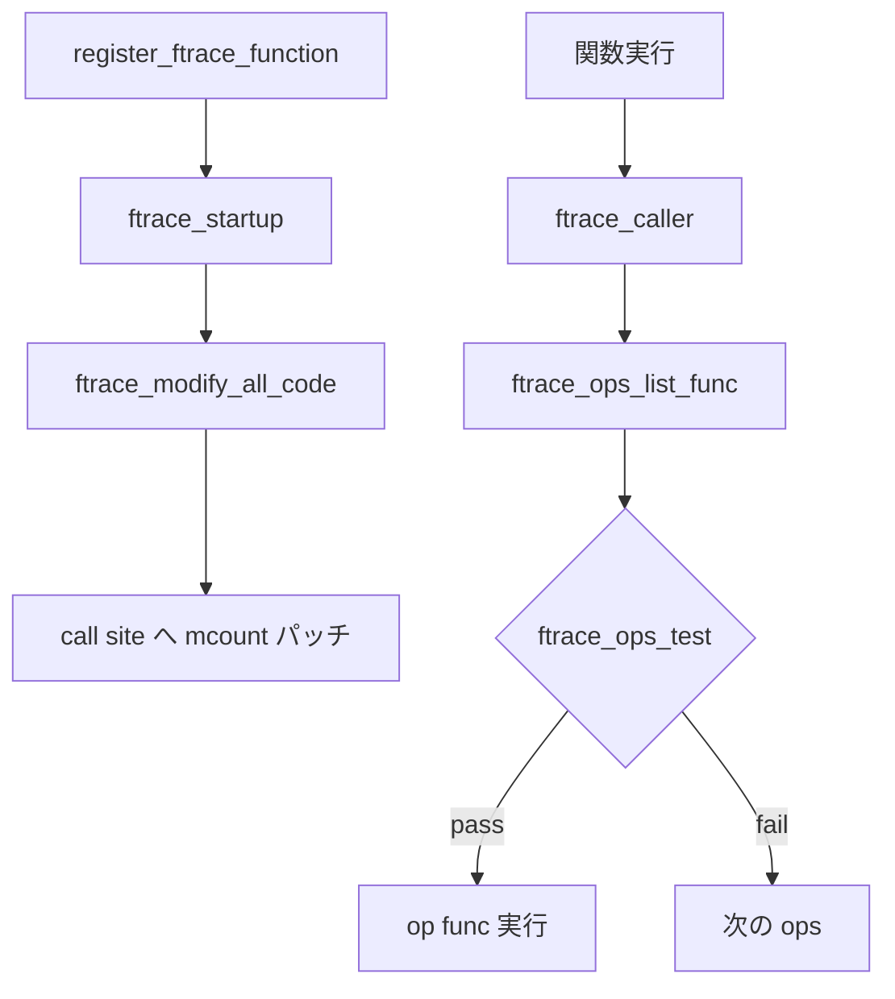

# 第19章 ftrace と動的トレース

> **本章で読むソース**
>
> - [`kernel/trace/ftrace.c` L1534-L1558](https://github.com/gregkh/linux/blob/v6.18.38/kernel/trace/ftrace.c#L1534-L1559)
> - [`kernel/trace/ftrace.c` L2873-L2912](https://github.com/gregkh/linux/blob/v6.18.38/kernel/trace/ftrace.c#L2873-L2912)
> - [`kernel/trace/ftrace.c` L8064-L8103](https://github.com/gregkh/linux/blob/v6.18.38/kernel/trace/ftrace.c#L8064-L8103)
> - [`kernel/trace/ftrace.c` L8746-L8758](https://github.com/gregkh/linux/blob/v6.18.38/kernel/trace/ftrace.c#L8746-L8759)
> - [`kernel/trace/ftrace.c` L3053-L3090](https://github.com/gregkh/linux/blob/v6.18.38/kernel/trace/ftrace.c#L3053-L3090)

## この章の狙い

**ftrace** は関数入口にパッチを当て、トレースハンドラを呼び出す動的トレース基盤である。
複数の `ftrace_ops` は `ftrace_ops_list_func` で連鎖実行される。
BPF の fentry/fexit も ftrace の direct call 経路と接続する（第15章）。
本章は ops 登録、コードパッチ、リストディスパッチを読む。

## 前提

- [tracing プログラムのアタッチ](../part04-btf-attach/15-tracing-program-attach.md) で fentry と ftrace の関係を知っていること。
- [x86 BPF JIT](../part01-core/06-x86-bpf-jit.md) でテキストパッチの文脈を知っていること。

## ftrace_ops_test によるフィルタ

各 ops は IP ハッシュで対象関数を絞る。
`FTRACE_OPS_FL_SAVE_REGS` が立っている ops は `regs` が NULL の呼び出しを拒否する。

[`kernel/trace/ftrace.c` L1534-L1559](https://github.com/gregkh/linux/blob/v6.18.38/kernel/trace/ftrace.c#L1534-L1559)

```c
int
ftrace_ops_test(struct ftrace_ops *ops, unsigned long ip, void *regs)
{
	struct ftrace_ops_hash hash;
	int ret;

#ifdef CONFIG_DYNAMIC_FTRACE_WITH_REGS
	/*
	 * There's a small race when adding ops that the ftrace handler
	 * that wants regs, may be called without them. We can not
	 * allow that handler to be called if regs is NULL.
	 */
	if (regs == NULL && (ops->flags & FTRACE_OPS_FL_SAVE_REGS))
		return 0;
#endif

	rcu_assign_pointer(hash.filter_hash, ops->func_hash->filter_hash);
	rcu_assign_pointer(hash.notrace_hash, ops->func_hash->notrace_hash);

	if (hash_contains_ip(ip, &hash))
		ret = 1;
	else
		ret = 0;

	return ret;
}
```

ハッシュ参照は RCU で読み、更新と並行しても安全である。

## ftrace_ops_list_func

全関数トレース時のデフォルトディスパッチャは、登録済み ops を順に試し、テストを通ったものだけ `op->func` を呼ぶ。
再帰は `trace_test_and_set_recursion` で抑止する。

[`kernel/trace/ftrace.c` L8064-L8103](https://github.com/gregkh/linux/blob/v6.18.38/kernel/trace/ftrace.c#L8064-L8103)

```c
static nokprobe_inline void
__ftrace_ops_list_func(unsigned long ip, unsigned long parent_ip,
		       struct ftrace_ops *ignored, struct ftrace_regs *fregs)
{
	struct pt_regs *regs = ftrace_get_regs(fregs);
	struct ftrace_ops *op;
	int bit;

	/*
	 * The ftrace_test_and_set_recursion() will disable preemption,
	 * which is required since some of the ops may be dynamically
	 * allocated, they must be freed after a synchronize_rcu().
	 */
	bit = trace_test_and_set_recursion(ip, parent_ip, TRACE_LIST_START);
	if (bit < 0)
		return;

	do_for_each_ftrace_op(op, ftrace_ops_list) {
		/* Stub functions don't need to be called nor tested */
		if (op->flags & FTRACE_OPS_FL_STUB)
			continue;
		/*
		 * Check the following for each ops before calling their func:
		 *  if RCU flag is set, then rcu_is_watching() must be true
		 *  Otherwise test if the ip matches the ops filter
		 *
		 * If any of the above fails then the op->func() is not executed.
		 */
		if ((!(op->flags & FTRACE_OPS_FL_RCU) || rcu_is_watching()) &&
		    ftrace_ops_test(op, ip, regs)) {
			if (FTRACE_WARN_ON(!op->func)) {
				pr_warn("op=%p %pS\n", op, op);
				goto out;
			}
			op->func(ip, parent_ip, op, fregs);
		}
	} while_for_each_ftrace_op(op);
out:
	trace_clear_recursion(bit);
}
```

## ftrace_modify_all_code

トレース関数の切り替え時は、まず `ftrace_ops_list_func` へ更新してから各 call site のパッチを置き換える。
コメントが、ハッシュ不一致による誤呼び出しを防ぐ順序を説明する。

[`kernel/trace/ftrace.c` L2873-L2912](https://github.com/gregkh/linux/blob/v6.18.38/kernel/trace/ftrace.c#L2873-L2912)

```c
void ftrace_modify_all_code(int command)
{
	int update = command & FTRACE_UPDATE_TRACE_FUNC;
	int mod_flags = 0;
	int err = 0;

	if (command & FTRACE_MAY_SLEEP)
		mod_flags = FTRACE_MODIFY_MAY_SLEEP_FL;

	/*
	 * If the ftrace_caller calls a ftrace_ops func directly,
	 * we need to make sure that it only traces functions it
	 * expects to trace. When doing the switch of functions,
	 * we need to update to the ftrace_ops_list_func first
	 * before the transition between old and new calls are set,
	 * as the ftrace_ops_list_func will check the ops hashes
	 * to make sure the ops are having the right functions
	 * traced.
	 */
	if (update) {
		err = update_ftrace_func(ftrace_ops_list_func);
		if (FTRACE_WARN_ON(err))
			return;
	}

	if (command & FTRACE_UPDATE_CALLS)
		ftrace_replace_code(mod_flags | FTRACE_MODIFY_ENABLE_FL);
	else if (command & FTRACE_DISABLE_CALLS)
		ftrace_replace_code(mod_flags);

	if (update && ftrace_trace_function != ftrace_ops_list_func) {
		function_trace_op = set_function_trace_op;
		smp_wmb();
		/* If irqs are disabled, we are in stop machine */
		if (!irqs_disabled())
			smp_call_function(ftrace_sync_ipi, NULL, 1);
		err = update_ftrace_func(ftrace_trace_function);
		if (FTRACE_WARN_ON(err))
			return;
	}
```

`FTRACE_MAY_SLEEP` 時は stop machine 以外でもパッチ可能なフラグが付く。

## register_ftrace_function

モジュールや BPF から ops を登録する公開 API である。
`direct_mutex` と `ftrace_lock` の二段階で、IP modify 準備とリスト登録を行う。

[`kernel/trace/ftrace.c` L8772-L8786](https://github.com/gregkh/linux/blob/v6.18.38/kernel/trace/ftrace.c#L8772-L8786)

```c
int register_ftrace_function(struct ftrace_ops *ops)
{
	int ret;

	lock_direct_mutex();
	ret = prepare_direct_functions_for_ipmodify(ops);
	if (ret < 0)
		goto out_unlock;

	ret = register_ftrace_function_nolock(ops);

out_unlock:
	unlock_direct_mutex();
	return ret;
}
```

内部実装は `ftrace_startup` でパッチを有効化する。

[`kernel/trace/ftrace.c` L8746-L8759](https://github.com/gregkh/linux/blob/v6.18.38/kernel/trace/ftrace.c#L8746-L8759)

```c
static int register_ftrace_function_nolock(struct ftrace_ops *ops)
{
	int ret;

	ftrace_ops_init(ops);

	mutex_lock(&ftrace_lock);

	ret = ftrace_startup(ops, 0);

	mutex_unlock(&ftrace_lock);

	return ret;
}
```

## ftrace_startup によるパッチ有効化

`register_ftrace_function_nolock` は `ftrace_startup` を呼び、ops をリストへ載せたうえで call site パッチを更新する。
`FTRACE_OPS_FL_ADDING` は登録直後の状態を表し、ハッシュ有効化と `ftrace_startup_enable` へ続く。

[`kernel/trace/ftrace.c` L3053-L3090](https://github.com/gregkh/linux/blob/v6.18.38/kernel/trace/ftrace.c#L3053-L3090)

```c
int ftrace_startup(struct ftrace_ops *ops, int command)
{
	int ret;

	if (unlikely(ftrace_disabled))
		return -ENODEV;

	ret = __register_ftrace_function(ops);
	if (ret)
		return ret;

	ftrace_start_up++;

	/*
	 * Note that ftrace probes uses this to start up
	 * and modify functions it will probe. But we still
	 * set the ADDING flag for modification, as probes
	 * do not have trampolines. If they add them in the
	 * future, then the probes will need to distinguish
	 * between adding and updating probes.
	 */
	ops->flags |= FTRACE_OPS_FL_ENABLED | FTRACE_OPS_FL_ADDING;

	ret = ftrace_hash_ipmodify_enable(ops);
	if (ret < 0) {
		/* Rollback registration process */
		__unregister_ftrace_function(ops);
		ftrace_start_up--;
		ops->flags &= ~FTRACE_OPS_FL_ENABLED;
		if (ops->flags & FTRACE_OPS_FL_DYNAMIC)
			ftrace_trampoline_free(ops);
		return ret;
	}

	if (ftrace_hash_rec_enable(ops))
		command |= FTRACE_UPDATE_CALLS;

	ftrace_startup_enable(command);
```

ハッシュ登録に失敗した場合は ops 登録までロールバックする。
成功時は `FTRACE_UPDATE_CALLS` が付与され、`ftrace_modify_all_code` 系のパッチ更新が走る。

## 処理の流れ



BPF トランポリンは direct call 経路で `ftrace_ops_list_func` を迂回できる（第15章の `BPF_TRAMP_F_SHARE_IPMODIFY`）。

## 高速化と最適化の工夫

動的 ftrace は call site に NOP か call を埋め込み、無効時はパッチコストを最小化する。
IP ハッシュフィルタは全 ops 実行を避け、関心関数だけハンドラへ入れる。
`FTRACE_OPS_FL_STUB` の ops はリスト走査から除外される。

## まとめ

ftrace はカーネル全体の関数トレースを可能にするパッチ基盤である。
リストディスパッチとハッシュフィルタが、複数サブシステムの共存を可能にする。

## 関連する章

- [tracing プログラムのアタッチ](../part04-btf-attach/15-tracing-program-attach.md)
- [kprobes と optimized kprobe](21-kprobes-optimized.md)
