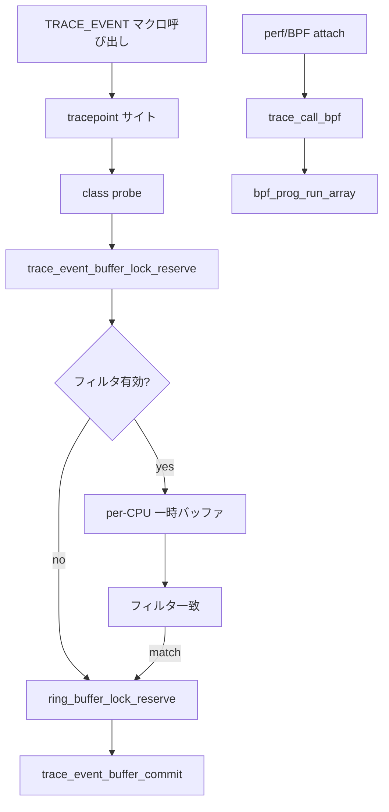

# 第20章 trace event と trace コア

> **本章で読むソース**
>
> - [`kernel/trace/trace.c` L2732-L2763](https://github.com/gregkh/linux/blob/v6.18.38/kernel/trace/trace.c#L2732-L2767)
> - [`kernel/trace/trace.c` L2883-L2905](https://github.com/gregkh/linux/blob/v6.18.38/kernel/trace/trace.c#L2883-L2905)
> - [`kernel/trace/trace_events.c` L684-L707](https://github.com/gregkh/linux/blob/v6.18.38/kernel/trace/trace_events.c#L684-L707)
> - [`kernel/trace/bpf_trace.c` L95-L108](https://github.com/gregkh/linux/blob/v6.18.38/kernel/trace/bpf_trace.c#L95-L108)
> - [`kernel/trace/trace.c` L2786-L2811](https://github.com/gregkh/linux/blob/v6.18.38/kernel/trace/trace.c#L2786-L2811)

## この章の狙い

**trace event** は tracepoint 上に構造化されたイベント形式を載せる層である。
`trace_event_buffer_lock_reserve` が ring buffer への書き込みを開始し、`trace_event_buffer_commit` がフィルタとトリガを処理する。
BPF は同じ `trace_event_call` の `prog_array` を共有する。
本章は予約からコミット、BPF 実行までを読む。

## 前提

- [ring buffer](18-ring-buffer.md) で reserve/commit を知っていること。
- [tracepoint と静的パッチ](17-tracepoint-static-patch.md) で tracepoint 登録を知っていること。

## trace_event_buffer_lock_reserve

イベント書き込みの入口である。
ソフト無効やフィルタ済みファイルでは、per-CPU 一時バッファへ書き、一致時だけ ring buffer へコピーする（コメントが理由を説明する）。

[`kernel/trace/trace.c` L2732-L2767](https://github.com/gregkh/linux/blob/v6.18.38/kernel/trace/trace.c#L2732-L2767)

```c
struct ring_buffer_event *
trace_event_buffer_lock_reserve(struct trace_buffer **current_rb,
			  struct trace_event_file *trace_file,
			  int type, unsigned long len,
			  unsigned int trace_ctx)
{
	struct ring_buffer_event *entry;
	struct trace_array *tr = trace_file->tr;
	int val;

	*current_rb = tr->array_buffer.buffer;

	if (!tr->no_filter_buffering_ref &&
	    (trace_file->flags & (EVENT_FILE_FL_SOFT_DISABLED | EVENT_FILE_FL_FILTERED))) {
		preempt_disable_notrace();
		/*
		 * Filtering is on, so try to use the per cpu buffer first.
		 * This buffer will simulate a ring_buffer_event,
		 * where the type_len is zero and the array[0] will
		 * hold the full length.
		 * (see include/linux/ring-buffer.h for details on
		 *  how the ring_buffer_event is structured).
		 *
		 * Using a temp buffer during filtering and copying it
		 * on a matched filter is quicker than writing directly
		 * into the ring buffer and then discarding it when
		 * it doesn't match. That is because the discard
		 * requires several atomic operations to get right.
		 * Copying on match and doing nothing on a failed match
		 * is still quicker than no copy on match, but having
		 * to discard out of the ring buffer on a failed match.
		 */
		if ((entry = __this_cpu_read(trace_buffered_event))) {
			int max_len = PAGE_SIZE - struct_size(entry, array, 1);

			val = this_cpu_inc_return(trace_buffered_event_cnt);
```

一時バッファが使える場合は `trace_event_setup` で疑似 `ring_buffer_event` を構築し、プリエンプト無効のまま呼び出し元へ返す。
長さが `PAGE_SIZE` 制限を超える場合は通常の ring buffer reserve へフォールバックする。

[`kernel/trace/trace.c` L2786-L2811](https://github.com/gregkh/linux/blob/v6.18.38/kernel/trace/trace.c#L2786-L2811)

```c
			if (val == 1 && likely(len <= max_len)) {
				trace_event_setup(entry, type, trace_ctx);
				entry->array[0] = len;
				/* Return with preemption disabled */
				return entry;
			}
			this_cpu_dec(trace_buffered_event_cnt);
		}
		/* __trace_buffer_lock_reserve() disables preemption */
		preempt_enable_notrace();
	}

	entry = __trace_buffer_lock_reserve(*current_rb, type, len,
					    trace_ctx);
	/*
	 * If tracing is off, but we have triggers enabled
	 * we still need to look at the event data. Use the temp_buffer
	 * to store the trace event for the trigger to use. It's recursive
	 * safe and will not be recorded anywhere.
	 */
	if (!entry && trace_file->flags & EVENT_FILE_FL_TRIGGER_COND) {
		*current_rb = temp_buffer;
		entry = __trace_buffer_lock_reserve(*current_rb, type, len,
						    trace_ctx);
	}
	return entry;
}
```

トレース記録は無効でもトリガ条件評価が必要なら `temp_buffer` へ書き、再帰安全にイベント内容だけを評価する。

## trace_event_buffer_commit

予約済みバッファを確定する。
discard トリガが立っていれば ring buffer へ書かず、そうでなければ `trace_buffer_unlock_commit_regs` でコミットする。

[`kernel/trace/trace.c` L2883-L2905](https://github.com/gregkh/linux/blob/v6.18.38/kernel/trace/trace.c#L2883-L2905)

```c
void trace_event_buffer_commit(struct trace_event_buffer *fbuffer)
{
	enum event_trigger_type tt = ETT_NONE;
	struct trace_event_file *file = fbuffer->trace_file;

	if (__event_trigger_test_discard(file, fbuffer->buffer, fbuffer->event,
			fbuffer->entry, &tt))
		goto discard;

	if (static_key_false(&tracepoint_printk_key.key))
		output_printk(fbuffer);

	if (static_branch_unlikely(&trace_event_exports_enabled))
		ftrace_exports(fbuffer->event, TRACE_EXPORT_EVENT);

	trace_buffer_unlock_commit_regs(file->tr, fbuffer->buffer,
			fbuffer->event, fbuffer->trace_ctx, fbuffer->regs);

discard:
	if (tt)
		event_triggers_post_call(file, tt);

}
```

## trace event と tracepoint の接続

`trace_event_reg` は tracepoint プローブとして class の `probe` 関数を登録する。
perf 用には別の `perf_probe` も同じ tracepoint に載る。

[`kernel/trace/trace_events.c` L684-L707](https://github.com/gregkh/linux/blob/v6.18.38/kernel/trace/trace_events.c#L684-L707)

```c
int trace_event_reg(struct trace_event_call *call,
		    enum trace_reg type, void *data)
{
	struct trace_event_file *file = data;

	WARN_ON(!(call->flags & TRACE_EVENT_FL_TRACEPOINT));
	switch (type) {
	case TRACE_REG_REGISTER:
		return tracepoint_probe_register(call->tp,
						 call->class->probe,
						 file);
	case TRACE_REG_UNREGISTER:
		tracepoint_probe_unregister(call->tp,
					    call->class->probe,
					    file);
		return 0;

#ifdef CONFIG_PERF_EVENTS
	case TRACE_REG_PERF_REGISTER:
		if (!call->class->perf_probe)
			return -ENODEV;
		return tracepoint_probe_register(call->tp,
						 call->class->perf_probe,
						 call);
```

一つの tracepoint サイトから、trace 記録、perf、BPF が並行してフックされる。

## trace_call_bpf の契約

`trace_call_bpf` は kprobe や将来の static tracepoint から BPF を起動するヘルパである。
戻り値は kprobe 側でフィルタ判定に使われる（0 はイベント破棄、1 は記録）。

[`kernel/trace/bpf_trace.c` L95-L108](https://github.com/gregkh/linux/blob/v6.18.38/kernel/trace/bpf_trace.c#L95-L108)

```c
/**
 * trace_call_bpf - invoke BPF program
 * @call: tracepoint event
 * @ctx: opaque context pointer
 *
 * kprobe handlers execute BPF programs via this helper.
 * Can be used from static tracepoints in the future.
 *
 * Return: BPF programs always return an integer which is interpreted by
 * kprobe handler as:
 * 0 - return from kprobe (event is filtered out)
 * 1 - store kprobe event into ring buffer
 * Other values are reserved and currently alias to 1
 */
```

実行本体は `bpf_prog_run_array` で、再入時は miss カウンタだけ更新する。

[`kernel/trace/bpf_trace.c` L109-L147](https://github.com/gregkh/linux/blob/v6.18.38/kernel/trace/bpf_trace.c#L109-L147)

```c
unsigned int trace_call_bpf(struct trace_event_call *call, void *ctx)
{
	unsigned int ret;

	cant_sleep();

	if (unlikely(__this_cpu_inc_return(bpf_prog_active) != 1)) {
		/*
		 * since some bpf program is already running on this cpu,
		 * don't call into another bpf program (same or different)
		 * and don't send kprobe event into ring-buffer,
		 * so return zero here
		 */
		rcu_read_lock();
		bpf_prog_inc_misses_counters(rcu_dereference(call->prog_array));
		rcu_read_unlock();
		ret = 0;
		goto out;
	}

	rcu_read_lock();
	ret = bpf_prog_run_array(rcu_dereference(call->prog_array),
				 ctx, bpf_prog_run);
	rcu_read_unlock();
```

## 処理の流れ



trace 記録と BPF は同じ `trace_event_call` を共有するが、書き込み経路は独立している。

## 高速化と最適化の工夫

フィルタ有効時の一時バッファは、ring buffer 上の discard を避け、アトミック操作回数を減らす。
`tracepoint_printk` と export は `static_key` / `static_branch` で無効時コストを抑える。
BPF 側は `bpf_prog_array_valid` による早期判定（第17章）で空配列の RCU ロックを省略する。

## まとめ

trace コアは tracepoint の上にイベント形式とフィルタを載せ、ring buffer へ橋渡しする。
BPF は `prog_array` で同じイベントオブジェクトにぶら下がる。

## 関連する章

- [tracepoint と静的パッチ](17-tracepoint-static-patch.md)
- [ring buffer](18-ring-buffer.md)
- [perf events と BPF の接点](22-perf-events-bpf.md)
