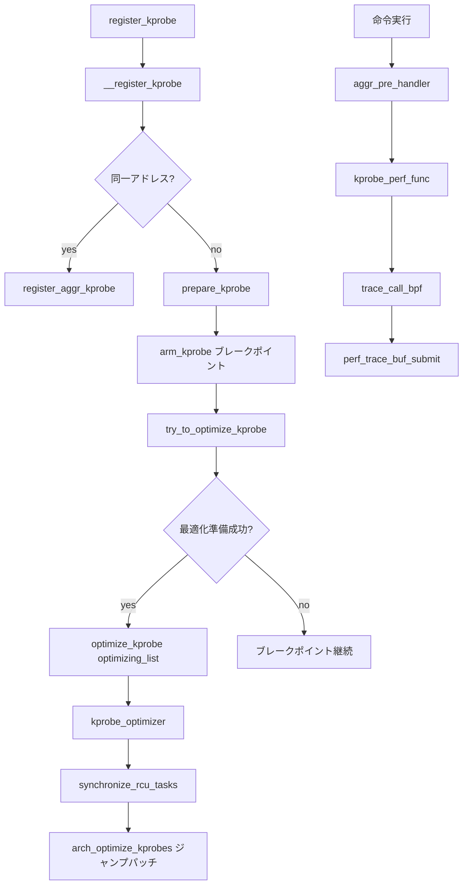

# 第21章 kprobes と optimized kprobe

> **本章で読むソース**
>
> - [`kernel/kprobes.c` L832-L844](https://github.com/gregkh/linux/blob/v6.18.38/kernel/kprobes.c#L832-L845)
> - [`kernel/kprobes.c` L525-L546](https://github.com/gregkh/linux/blob/v6.18.38/kernel/kprobes.c#L525-L546)
> - [`kernel/kprobes.c` L607-L641](https://github.com/gregkh/linux/blob/v6.18.38/kernel/kprobes.c#L607-L641)
> - [`kernel/kprobes.c` L680-L718](https://github.com/gregkh/linux/blob/v6.18.38/kernel/kprobes.c#L680-L718)
> - [`kernel/kprobes.c` L853-L880](https://github.com/gregkh/linux/blob/v6.18.38/kernel/kprobes.c#L853-L880)
> - [`arch/x86/kernel/kprobes/opt.c` L473-L495](https://github.com/gregkh/linux/blob/v6.18.38/arch/x86/kernel/kprobes/opt.c#L473-L495)
> - [`kernel/kprobes.c` L1186-L1199](https://github.com/gregkh/linux/blob/v6.18.38/kernel/kprobes.c#L1186-L1199)
> - [`kernel/kprobes.c` L1290-L1342](https://github.com/gregkh/linux/blob/v6.18.38/kernel/kprobes.c#L1290-L1342)
> - [`kernel/kprobes.c` L1597-L1631](https://github.com/gregkh/linux/blob/v6.18.38/kernel/kprobes.c#L1597-L1631)
> - [`kernel/kprobes.c` L1634-L1668](https://github.com/gregkh/linux/blob/v6.18.38/kernel/kprobes.c#L1634-L1668)
> - [`kernel/trace/trace_kprobe.c` L1681-L1716](https://github.com/gregkh/linux/blob/v6.18.38/kernel/trace/trace_kprobe.c#L1681-L1716)

## この章の狙い

**kprobe** はカーネルテキストの任意位置にブレークポイントを挿入し、`pre_handler` / `post_handler` を実行する動的インストルメンテーション機構である。
同一アドレスへの複数登録は **aggr_kprobe** に集約され、条件が揃えば **optimized kprobe** がブレークポイントの代わりにジャンプ命令を使う。
BPF の `BPF_PROG_TYPE_KPROBE` は trace_kprobe 層を経由して `trace_call_bpf` に接続する（第22章）。
本章は登録、集約、最適化、BPF 接続までを読む。

## 前提

- [trace_call_bpf](20-trace-events-core.md) で BPF 戻り値の意味を知っていること。
- [ftrace と動的トレース](19-ftrace-dynamic-trace.md) で ftrace ベース kprobe の存在を知っていること。
- [x86 BPF JIT](../part01-core/06-x86-bpf-jit.md) でテキストパッチの前提を知っていること。

## register_kprobe の前処理

公開 API `register_kprobe` はシンボル名またはアドレスを正規化し、再登録やモジュール境界の安全性を検査してから内部登録へ進む。
ユーザーが渡せるフラグは `KPROBE_FLAG_DISABLED` のみで、それ以外はここでマスクされる。

[`kernel/kprobes.c` L1634-L1668](https://github.com/gregkh/linux/blob/v6.18.38/kernel/kprobes.c#L1634-L1668)

```c
int register_kprobe(struct kprobe *p)
{
	int ret;
	struct module *probed_mod;
	kprobe_opcode_t *addr;
	bool on_func_entry;

	/* Canonicalize probe address from symbol */
	addr = _kprobe_addr(p->addr, p->symbol_name, p->offset, &on_func_entry);
	if (IS_ERR(addr))
		return PTR_ERR(addr);
	p->addr = addr;

	ret = warn_kprobe_rereg(p);
	if (ret)
		return ret;

	/* User can pass only KPROBE_FLAG_DISABLED to register_kprobe */
	p->flags &= KPROBE_FLAG_DISABLED;
	if (on_func_entry)
		p->flags |= KPROBE_FLAG_ON_FUNC_ENTRY;
	p->nmissed = 0;
	INIT_LIST_HEAD(&p->list);

	ret = check_kprobe_address_safe(p, &probed_mod);
	if (ret)
		return ret;

	ret = __register_kprobe(p);

	if (probed_mod)
		module_put(probed_mod);

	return ret;
}
```

`on_func_entry` は関数先頭付近への配置を示し、後段の ftrace 連携や BPF override 可否に影響する。

## __register_kprobe とハッシュテーブル

内部登録は `kprobe_mutex` の下で行われる。
同一アドレスに既存エントリがあれば `register_aggr_kprobe` へ合流し、なければ `prepare_kprobe` の後ハッシュテーブルへ RCU で挿入する。

[`kernel/kprobes.c` L1597-L1631](https://github.com/gregkh/linux/blob/v6.18.38/kernel/kprobes.c#L1597-L1631)

```c
static int __register_kprobe(struct kprobe *p)
{
	int ret;
	struct kprobe *old_p;

	guard(mutex)(&kprobe_mutex);

	old_p = get_kprobe(p->addr);
	if (old_p)
		/* Since this may unoptimize 'old_p', locking 'text_mutex'. */
		return register_aggr_kprobe(old_p, p);

	scoped_guard(cpus_read_lock) {
		/* Prevent text modification */
		guard(mutex)(&text_mutex);
		ret = prepare_kprobe(p);
		if (ret)
			return ret;
	}

	INIT_HLIST_NODE(&p->hlist);
	hlist_add_head_rcu(&p->hlist,
		       &kprobe_table[hash_ptr(p->addr, KPROBE_HASH_BITS)]);

	if (!kprobes_all_disarmed && !kprobe_disabled(p)) {
		ret = arm_kprobe(p);
		if (ret) {
			hlist_del_rcu(&p->hlist);
			synchronize_rcu();
		}
	}

	/* Try to optimize kprobe */
	try_to_optimize_kprobe(p);
	return 0;
}
```

`cpus_read_lock` は CPU ホットプラグと `stop_machine` の組み合わせによるデッドロックを避けるため、`prepare_kprobe` の命令スロット確保前に取られる。
`text_mutex` はカーネルテキスト書き換え全体を直列化し、`arm_kprobe` によるブレークポイント挿入もこの下で行われる。
`register_aggr_kprobe` ではさらに `jump_label_lock` が加わり、ジャンプラベル予約と aggr 化を同一クリティカルセクションで行う。
`arm_kprobe` 失敗時はハッシュから削除し `synchronize_rcu` で読み取り側の参照を切る。

## register_aggr_kprobe による集約

2本目以降の kprobe は新しいブレークポイントを増やさず、既存の aggr ノードの `list` にぶら下がる。
初回の aggr 化では `alloc_aggr_kprobe` で optimized 用構造体を確保する。

[`kernel/kprobes.c` L1290-L1342](https://github.com/gregkh/linux/blob/v6.18.38/kernel/kprobes.c#L1290-L1342)

```c
static int register_aggr_kprobe(struct kprobe *orig_p, struct kprobe *p)
{
	int ret = 0;
	struct kprobe *ap = orig_p;

	scoped_guard(cpus_read_lock) {
		/* For preparing optimization, jump_label_text_reserved() is called */
		guard(jump_label_lock)();
		guard(mutex)(&text_mutex);

		if (!kprobe_aggrprobe(orig_p)) {
			/* If 'orig_p' is not an 'aggr_kprobe', create new one. */
			ap = alloc_aggr_kprobe(orig_p);
			if (!ap)
				return -ENOMEM;
			init_aggr_kprobe(ap, orig_p);
		} else if (kprobe_unused(ap)) {
			/* This probe is going to die. Rescue it */
			ret = reuse_unused_kprobe(ap);
			if (ret)
				return ret;
		}

		if (kprobe_gone(ap)) {
			/*
			 * Attempting to insert new probe at the same location that
			 * had a probe in the module vaddr area which already
			 * freed. So, the instruction slot has already been
			 * released. We need a new slot for the new probe.
			 */
			ret = arch_prepare_kprobe(ap);
			if (ret)
				/*
				 * Even if fail to allocate new slot, don't need to
				 * free the 'ap'. It will be used next time, or
				 * freed by unregister_kprobe().
				 */
				return ret;

			/* Prepare optimized instructions if possible. */
			prepare_optimized_kprobe(ap);

			/*
			 * Clear gone flag to prevent allocating new slot again, and
			 * set disabled flag because it is not armed yet.
			 */
			ap->flags = (ap->flags & ~KPROBE_FLAG_GONE)
					| KPROBE_FLAG_DISABLED;
		}

		/* Copy the insn slot of 'p' to 'ap'. */
		copy_kprobe(ap, p);
		ret = add_new_kprobe(ap, p);
```

モジュール unload 後に同じアドレスへ再登録する場合、`KPROBE_FLAG_GONE` 処理で命令スロットを再確保する。
集約後もテキスト上のパッチ箇所は1つに保たれる。

## optimized kprobe の構築

`try_to_optimize_kprobe` は ftrace ベース kprobe を除外したうえで、ジャンプラベル予約と `text_mutex` の下で最適化命令列を準備する。
アーキテクチャが最適化命令を組み立てられなければ、通常のブレークポイントにフォールバックする。

[`kernel/kprobes.c` L853-L880](https://github.com/gregkh/linux/blob/v6.18.38/kernel/kprobes.c#L853-L880)

```c
static void try_to_optimize_kprobe(struct kprobe *p)
{
	struct kprobe *ap;
	struct optimized_kprobe *op;

	/* Impossible to optimize ftrace-based kprobe. */
	if (kprobe_ftrace(p))
		return;

	/* For preparing optimization, jump_label_text_reserved() is called. */
	guard(cpus_read_lock)();
	guard(jump_label_lock)();
	guard(mutex)(&text_mutex);

	ap = alloc_aggr_kprobe(p);
	if (!ap)
		return;

	op = container_of(ap, struct optimized_kprobe, kp);
	if (!arch_prepared_optinsn(&op->optinsn)) {
		/* If failed to setup optimizing, fallback to kprobe. */
		arch_remove_optimized_kprobe(op);
		kfree(op);
		return;
	}

	init_aggr_kprobe(ap, p);
	optimize_kprobe(ap);	/* This just kicks optimizer thread. */
}
```

`alloc_aggr_kprobe` は `optimized_kprobe` を確保し、アドレスをコピーした直後に `__prepare_optimized_kprobe` を呼ぶ。

[`kernel/kprobes.c` L832-L845](https://github.com/gregkh/linux/blob/v6.18.38/kernel/kprobes.c#L832-L845)

```c
static struct kprobe *alloc_aggr_kprobe(struct kprobe *p)
{
	struct optimized_kprobe *op;

	op = kzalloc(sizeof(struct optimized_kprobe), GFP_KERNEL);
	if (!op)
		return NULL;

	INIT_LIST_HEAD(&op->list);
	op->kp.addr = p->addr;
	__prepare_optimized_kprobe(op, p);

	return &op->kp;
}
```

`optimize_kprobe` は `optimizing_list` へ積み、遅延ワーカを起動するだけである。
ブレークポイントからジャンプへの置換は optimizer スレッドが後段で行う。

## optimizer スレッドとテキストパッチ

`optimize_kprobe` は対象が最適化可能かを検査し、フラグを立てて `optimizing_list` へ入れる。

[`kernel/kprobes.c` L680-L718](https://github.com/gregkh/linux/blob/v6.18.38/kernel/kprobes.c#L680-L718)

```c
static void optimize_kprobe(struct kprobe *p)
{
	struct optimized_kprobe *op;

	/* Check if the kprobe is disabled or not ready for optimization. */
	if (!kprobe_optready(p) || !kprobes_allow_optimization ||
	    (kprobe_disabled(p) || kprobes_all_disarmed))
		return;

	/* kprobes with 'post_handler' can not be optimized */
	if (p->post_handler)
		return;

	op = container_of(p, struct optimized_kprobe, kp);

	/* Check there is no other kprobes at the optimized instructions */
	if (arch_check_optimized_kprobe(op) < 0)
		return;

	/* Check if it is already optimized. */
	if (op->kp.flags & KPROBE_FLAG_OPTIMIZED) {
		if (optprobe_queued_unopt(op)) {
			/* This is under unoptimizing. Just dequeue the probe */
			list_del_init(&op->list);
		}
		return;
	}
	op->kp.flags |= KPROBE_FLAG_OPTIMIZED;

	/*
	 * On the 'unoptimizing_list' and 'optimizing_list',
	 * 'op' must have OPTIMIZED flag
	 */
	if (WARN_ON_ONCE(!list_empty(&op->list)))
		return;

	list_add(&op->list, &optimizing_list);
	kick_kprobe_optimizer();
}
```

`kprobe_optimizer` は `cpus_read_lock` と `text_mutex` の下で、まず unoptimize と `synchronize_rcu_tasks`、続けて optimize を実行する。
quiescence 待ちは、ジャンプ命令の途中でプリエンプトされたタスクが誤ったバイト列へ戻るのを防ぐ。

[`kernel/kprobes.c` L607-L641](https://github.com/gregkh/linux/blob/v6.18.38/kernel/kprobes.c#L607-L641)

```c
static void kprobe_optimizer(struct work_struct *work)
{
	guard(mutex)(&kprobe_mutex);

	scoped_guard(cpus_read_lock) {
		guard(mutex)(&text_mutex);

		/*
		 * Step 1: Unoptimize kprobes and collect cleaned (unused and disarmed)
		 * kprobes before waiting for quiesence period.
		 */
		do_unoptimize_kprobes();

		/*
		 * Step 2: Wait for quiesence period to ensure all potentially
		 * preempted tasks to have normally scheduled. Because optprobe
		 * may modify multiple instructions, there is a chance that Nth
		 * instruction is preempted. In that case, such tasks can return
		 * to 2nd-Nth byte of jump instruction. This wait is for avoiding it.
		 * Note that on non-preemptive kernel, this is transparently converted
		 * to synchronoze_sched() to wait for all interrupts to have completed.
		 */
		synchronize_rcu_tasks();

		/* Step 3: Optimize kprobes after quiesence period */
		do_optimize_kprobes();

		/* Step 4: Free cleaned kprobes after quiesence period */
		do_free_cleaned_kprobes();
	}

	/* Step 5: Kick optimizer again if needed */
	if (!list_empty(&optimizing_list) || !list_empty(&unoptimizing_list))
		kick_kprobe_optimizer();
}
```

`do_optimize_kprobes` は `optimizing_list` をアーキテクチャ依存の `arch_optimize_kprobes` へ渡す。

[`kernel/kprobes.c` L525-L546](https://github.com/gregkh/linux/blob/v6.18.38/kernel/kprobes.c#L525-L546)

```c
static void do_optimize_kprobes(void)
{
	lockdep_assert_held(&text_mutex);
	/*
	 * The optimization/unoptimization refers 'online_cpus' via
	 * stop_machine() and cpu-hotplug modifies the 'online_cpus'.
	 * And same time, 'text_mutex' will be held in cpu-hotplug and here.
	 * This combination can cause a deadlock (cpu-hotplug tries to lock
	 * 'text_mutex' but stop_machine() can not be done because
	 * the 'online_cpus' has been changed)
	 * To avoid this deadlock, caller must have locked cpu-hotplug
	 * for preventing cpu-hotplug outside of 'text_mutex' locking.
	 */
	lockdep_assert_cpus_held();

	/* Optimization never be done when disarmed */
	if (kprobes_all_disarmed || !kprobes_allow_optimization ||
	    list_empty(&optimizing_list))
		return;

	arch_optimize_kprobes(&optimizing_list);
}
```

x86 では `arch_optimize_kprobes` が probe アドレス `kp.addr` を先頭とする5バイト全体を、1バイトの JMP rel32 opcode と4バイトの displacement に置き換える。
最適化前のテキストは通常、先頭1バイトの INT3 と続く4バイトの元命令断片で構成される。
書き換え前に `kp.addr + INT3_INSN_SIZE` から4バイトは `copied_insn` へ退避され、unoptimize 時の復元に使われる。
`optinsn.insn` へ飛ぶ detour buffer は `arch_prepare_optimized_kprobe` で事前に組み立てられている。

[`arch/x86/kernel/kprobes/opt.c` L473-L495](https://github.com/gregkh/linux/blob/v6.18.38/arch/x86/kernel/kprobes/opt.c#L473-L495)

```c
void arch_optimize_kprobes(struct list_head *oplist)
{
	struct optimized_kprobe *op, *tmp;
	u8 insn_buff[JMP32_INSN_SIZE];

	list_for_each_entry_safe(op, tmp, oplist, list) {
		s32 rel = (s32)((long)op->optinsn.insn -
			((long)op->kp.addr + JMP32_INSN_SIZE));

		WARN_ON(kprobe_disabled(&op->kp));

		/* Backup instructions which will be replaced by jump address */
		memcpy(op->optinsn.copied_insn, op->kp.addr + INT3_INSN_SIZE,
		       DISP32_SIZE);

		insn_buff[0] = JMP32_INSN_OPCODE;
		*(s32 *)(&insn_buff[1]) = rel;

		smp_text_poke_single(op->kp.addr, insn_buff, JMP32_INSN_SIZE, NULL);

		list_del_init(&op->list);
	}
}
```

`smp_text_poke_single` の直後に `list_del_init(&op->list)` が無条件で実行され、`optimizing_list` から外れる。
unoptimize 経路では `arch_unoptimize_kprobe` が JMP を INT3 に戻し、`copied_insn` で退避した4バイトを復元する。

## aggr_pre_handler によるディスパッチ

ブレークポイント例外は aggr ノードの `aggr_pre_handler` に入る。
個々の kprobe は RCU リストを走査し、`pre_handler` が 1 を返せば残りをスキップする。

[`kernel/kprobes.c` L1186-L1199](https://github.com/gregkh/linux/blob/v6.18.38/kernel/kprobes.c#L1186-L1199)

```c
static int aggr_pre_handler(struct kprobe *p, struct pt_regs *regs)
{
	struct kprobe *kp;

	list_for_each_entry_rcu(kp, &p->list, list) {
		if (kp->pre_handler && likely(!kprobe_disabled(kp))) {
			set_kprobe_instance(kp);
			if (kp->pre_handler(kp, regs))
				return 1;
		}
		reset_kprobe_instance();
	}
	return 0;
}
```

`set_kprobe_instance` は再入時にどの kprobe が動いているかを識別するための per-CPU 状態である。
戻り値 1 は「カーネル本体へ戻らない」ことを意味し、フィルタや override に使われる。

## trace_kprobe から BPF へ

perf 向け kprobe ハンドラ `kprobe_perf_func` は、BPF を先に実行してから ring buffer へ書くか決める。
`bpf_prog_array_valid` が真のときだけ `trace_call_bpf` を呼び、戻り値と `pt_regs` の PC 変化を検査する。

[`kernel/trace/trace_kprobe.c` L1681-L1716](https://github.com/gregkh/linux/blob/v6.18.38/kernel/trace/trace_kprobe.c#L1681-L1716)

```c
	if (bpf_prog_array_valid(call)) {
		unsigned long orig_ip = instruction_pointer(regs);
		int ret;

		ret = trace_call_bpf(call, regs);

		/*
		 * We need to check and see if we modified the pc of the
		 * pt_regs, and if so return 1 so that we don't do the
		 * single stepping.
		 */
		if (orig_ip != instruction_pointer(regs))
			return 1;
		if (!ret)
			return 0;
	}

	head = this_cpu_ptr(call->perf_events);
	if (hlist_empty(head))
		return 0;

	dsize = __get_data_size(&tk->tp, regs, NULL);
	__size = sizeof(*entry) + tk->tp.size + dsize;
	size = ALIGN(__size + sizeof(u32), sizeof(u64));
	size -= sizeof(u32);

	entry = perf_trace_buf_alloc(size, NULL, &rctx);
	if (!entry)
		return 0;

	entry->ip = (unsigned long)tk->rp.kp.addr;
	memset(&entry[1], 0, dsize);
	store_trace_args(&entry[1], &tk->tp, regs, NULL, sizeof(*entry), dsize);
	perf_trace_buf_submit(entry, size, rctx, call->event.type, 1, regs,
			      head, NULL);
	return 0;
```

BPF が 0 を返すと `perf_trace_buf_alloc` まで到達せず、トレース記録全体が省略される。

## 処理の流れ



テキストパッチは aggr 単位で1箇所に集約され、ハンドラだけがリスト走査で増える。

## 高速化と最適化の工夫

optimized kprobe は例外ベクトル経由ではなくジャンプでハンドラへ入るため、パイプライン flush と単ステップのコストを削る。
同一アドレス集約により、N 本の probe でもテキスト変更は1回で済む。
ftrace ベース kprobe は別経路で、関数入口に ftrace の仕組みを再利用する（`kprobe_ftrace` 判定）。
BPF 側は `bpf_prog_array_valid` で空配列を先に判定し、未アタッチ時の RCU ロックを省略する。

## まとめ

kprobe は動的ブレークポイントの古典実装であり、aggr と optimized の二段階で複数 probe と性能を両立する。
trace_kprobe 層が perf 記録と BPF を同一イベントオブジェクト上で接続する。

## 関連する章

- [perf events と BPF の接点](22-perf-events-bpf.md)
- [trace event と trace コア](20-trace-events-core.md)
- [ftrace と動的トレース](19-ftrace-dynamic-trace.md)

> v7.1.3 では optimizer が `delayed_work` ではなく専用カーネルスレッド [`kprobe_optimizer_thread` L665-L690](https://github.com/gregkh/linux/blob/v7.1.3/kernel/kprobes.c#L665-L690) で動く。
> 起動は [`kthread_run` L1083-L1084](https://github.com/gregkh/linux/blob/v7.1.3/kernel/kprobes.c#L1083-L1084) から行われる。
