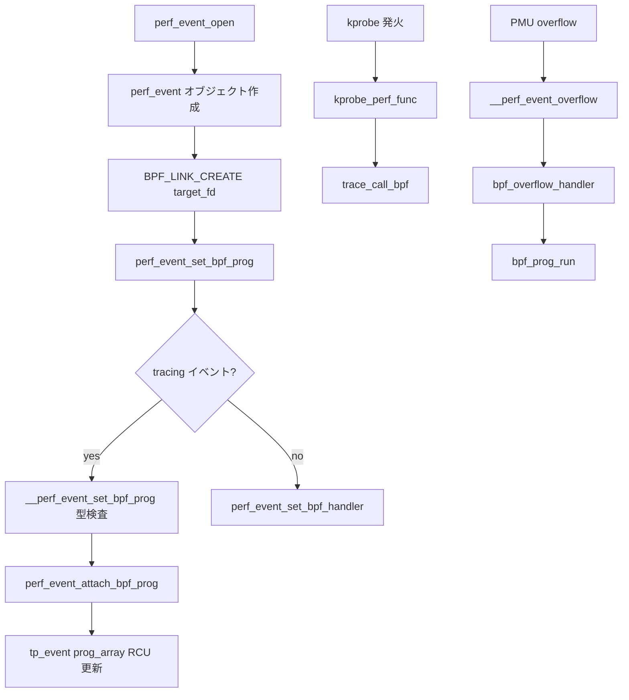

# 第22章 perf events と BPF の接点

> **本章で読むソース**
>
> - [`kernel/events/core.c` L13451-L13486](https://github.com/gregkh/linux/blob/v6.18.38/kernel/events/core.c#L13451-L13486)
> - [`kernel/events/core.c` L11268-L11312](https://github.com/gregkh/linux/blob/v6.18.38/kernel/events/core.c#L11268-L11312)
> - [`kernel/events/core.c` L10331-L10352](https://github.com/gregkh/linux/blob/v6.18.38/kernel/events/core.c#L10331-L10352)
> - [`kernel/events/core.c` L10234-L10258](https://github.com/gregkh/linux/blob/v6.18.38/kernel/events/core.c#L10234-L10258)
> - [`kernel/trace/bpf_trace.c` L1906-L1942](https://github.com/gregkh/linux/blob/v6.18.38/kernel/trace/bpf_trace.c#L1906-L1943)
> - [`kernel/bpf/syscall.c` L4165-L4202](https://github.com/gregkh/linux/blob/v6.18.38/kernel/bpf/syscall.c#L4165-L4202)
> - [`kernel/trace/trace_kprobe.c` L1681-L1696](https://github.com/gregkh/linux/blob/v6.18.38/kernel/trace/trace_kprobe.c#L1681-L1696)

## この章の狙い

**perf events** はハードウェアカウンタ、ソフトウェアイベント、tracepoint、kprobe など多様な計測対象を fd で表現する。
BPF は2つの経路で接続する。
1つは kprobe/tracepoint 等の **tracing イベント** へ `prog_array` を載せる経路である。
もう1つはサンプリング overflow 時に `BPF_PROG_TYPE_PERF_EVENT` を直接呼ぶ経路である。
本章は `perf_event_open` からアタッチ、overflow、link API までを読む。

## 前提

- [trace_call_bpf](20-trace-events-core.md) で `prog_array` 実行を知っていること。
- [kprobes と optimized kprobe](21-kprobes-optimized.md) で kprobe 登録を知っていること。
- [bpf システムコールとコマンド配線](../part01-core/03-bpf-syscall-dispatch.md) で link API を知っていること。

## perf_event_open の入口

ユーザーは `perf_event_open` システムコールで計測対象を指定する。
カーネルは属性をコピーし、権限とサンプリング設定を検証してから fd を割り当てる。

[`kernel/events/core.c` L13451-L13486](https://github.com/gregkh/linux/blob/v6.18.38/kernel/events/core.c#L13451-L13486)

```c
SYSCALL_DEFINE5(perf_event_open,
		struct perf_event_attr __user *, attr_uptr,
		pid_t, pid, int, cpu, int, group_fd, unsigned long, flags)
{
	struct perf_event *group_leader = NULL, *output_event = NULL;
	struct perf_event_pmu_context *pmu_ctx;
	struct perf_event *event, *sibling;
	struct perf_event_attr attr;
	struct perf_event_context *ctx;
	struct file *event_file = NULL;
	struct task_struct *task = NULL;
	struct pmu *pmu;
	int event_fd;
	int move_group = 0;
	int err;
	int f_flags = O_RDWR;
	int cgroup_fd = -1;

	/* for future expandability... */
	if (flags & ~PERF_FLAG_ALL)
		return -EINVAL;

	err = perf_copy_attr(attr_uptr, &attr);
	if (err)
		return err;

	/* Do we allow access to perf_event_open(2) ? */
	err = security_perf_event_open(PERF_SECURITY_OPEN);
	if (err)
		return err;

	if (!attr.exclude_kernel) {
		err = perf_allow_kernel();
		if (err)
			return err;
	}
```

`exclude_kernel` が偽のときはカーネル計測権限が別途必要である。
cgroup モードでは `pid` に cgroup fd を渡す特殊経路もある（同関数後半の `PERF_FLAG_PID_CGROUP`）。

## BPF プログラムのアタッチ分岐

`perf_event_set_bpf_prog` はイベント種別で処理を分ける。
tracing イベント（kprobe、tracepoint、syscall trace）でなければ、overflow ハンドラとして BPF を登録する。

[`kernel/events/core.c` L11268-L11312](https://github.com/gregkh/linux/blob/v6.18.38/kernel/events/core.c#L11268-L11312)

```c
static int __perf_event_set_bpf_prog(struct perf_event *event,
				     struct bpf_prog *prog,
				     u64 bpf_cookie)
{
	bool is_kprobe, is_uprobe, is_tracepoint, is_syscall_tp;

	if (event->state <= PERF_EVENT_STATE_REVOKED)
		return -ENODEV;

	if (!perf_event_is_tracing(event))
		return perf_event_set_bpf_handler(event, prog, bpf_cookie);

	is_kprobe = event->tp_event->flags & TRACE_EVENT_FL_KPROBE;
	is_uprobe = event->tp_event->flags & TRACE_EVENT_FL_UPROBE;
	is_tracepoint = event->tp_event->flags & TRACE_EVENT_FL_TRACEPOINT;
	is_syscall_tp = is_syscall_trace_event(event->tp_event);
	if (!is_kprobe && !is_uprobe && !is_tracepoint && !is_syscall_tp)
		/* bpf programs can only be attached to u/kprobe or tracepoint */
		return -EINVAL;

	if (((is_kprobe || is_uprobe) && prog->type != BPF_PROG_TYPE_KPROBE) ||
	    (is_tracepoint && prog->type != BPF_PROG_TYPE_TRACEPOINT) ||
	    (is_syscall_tp && prog->type != BPF_PROG_TYPE_TRACEPOINT))
		return -EINVAL;

	if (prog->type == BPF_PROG_TYPE_KPROBE && prog->sleepable && !is_uprobe)
		/* only uprobe programs are allowed to be sleepable */
		return -EINVAL;

	/* Kprobe override only works for kprobes, not uprobes. */
	if (prog->kprobe_override && !is_kprobe)
		return -EINVAL;

	/* Writing to context allowed only for uprobes. */
	if (prog->aux->kprobe_write_ctx && !is_uprobe)
		return -EINVAL;

	if (is_tracepoint || is_syscall_tp) {
		int off = trace_event_get_offsets(event->tp_event);

		if (prog->aux->max_ctx_offset > off)
			return -EACCES;
	}

	return perf_event_attach_bpf_prog(event, prog, bpf_cookie);
}
```

プログラム種別とイベント種別の不一致はここで拒否される。
`kprobe_override` や `kprobe_write_ctx` も attach 時に制限される。

## tracing イベントへの prog_array 登録

kprobe や tracepoint 向け BPF は、イベント共有の `prog_array` に RCU で差し込む。
配列長は `BPF_TRACE_MAX_PROGS`（64）で上限がある。

[`kernel/trace/bpf_trace.c` L1906-L1943](https://github.com/gregkh/linux/blob/v6.18.38/kernel/trace/bpf_trace.c#L1906-L1943)

```c
int perf_event_attach_bpf_prog(struct perf_event *event,
			       struct bpf_prog *prog,
			       u64 bpf_cookie)
{
	struct bpf_prog_array *old_array;
	struct bpf_prog_array *new_array;
	int ret = -EEXIST;

	/*
	 * Kprobe override only works if they are on the function entry,
	 * and only if they are on the opt-in list.
	 */
	if (prog->kprobe_override &&
	    (!trace_kprobe_on_func_entry(event->tp_event) ||
	     !trace_kprobe_error_injectable(event->tp_event)))
		return -EINVAL;

	mutex_lock(&bpf_event_mutex);

	if (event->prog)
		goto unlock;

	old_array = bpf_event_rcu_dereference(event->tp_event->prog_array);
	if (old_array &&
	    bpf_prog_array_length(old_array) >= BPF_TRACE_MAX_PROGS) {
		ret = -E2BIG;
		goto unlock;
	}

	ret = bpf_prog_array_copy(old_array, NULL, prog, bpf_cookie, &new_array);
	if (ret < 0)
		goto unlock;

	/* set the new array to event->tp_event and set event->prog */
	event->prog = prog;
	event->bpf_cookie = bpf_cookie;
	rcu_assign_pointer(event->tp_event->prog_array, new_array);
	bpf_prog_array_free_sleepable(old_array);
```

`bpf_prog_array_copy` は古い配列を複製して新プログラムを追加する。
ポインタ差し替えは `rcu_assign_pointer` で行い、読み取り側は RCU 保護下で古い配列を参照し続けられる。

## kprobe ハンドラからの BPF 呼び出し

kprobe が発火すると `kprobe_perf_func` が先に BPF を試す。
`trace_call_bpf` の戻り値 0 はイベント破棄を意味し、ring buffer への記録をスキップする。

[`kernel/trace/trace_kprobe.c` L1681-L1696](https://github.com/gregkh/linux/blob/v6.18.38/kernel/trace/trace_kprobe.c#L1681-L1696)

```c
	if (bpf_prog_array_valid(call)) {
		unsigned long orig_ip = instruction_pointer(regs);
		int ret;

		ret = trace_call_bpf(call, regs);

		/*
		 * We need to check and see if we modified the pc of the
		 * pt_regs, and if so return 1 so that we don't do the
		 * single stepping.
		 */
		if (orig_ip != instruction_pointer(regs))
			return 1;
		if (!ret)
			return 0;
	}
```

`kprobe_override` 系は `pt_regs` の PC を変更するため、単ステップ処理を省略する分岐がある。
BPF 実行後に perf バッファへ書くかどうかは、この戻り値で決まる。

## overflow 時の BPF_PROG_TYPE_PERF_EVENT

ハードウェア PMU のサンプリングイベントでは、overflow 処理の早い段階で BPF が呼ばれる。
`bpf_prog_active` による再入防止と `perf_prepare_sample` が先に走る。

[`kernel/events/core.c` L10234-L10258](https://github.com/gregkh/linux/blob/v6.18.38/kernel/events/core.c#L10234-L10258)

```c
static int bpf_overflow_handler(struct perf_event *event,
				struct perf_sample_data *data,
				struct pt_regs *regs)
{
	struct bpf_perf_event_data_kern ctx = {
		.data = data,
		.event = event,
	};
	struct bpf_prog *prog;
	int ret = 0;

	ctx.regs = perf_arch_bpf_user_pt_regs(regs);
	if (unlikely(__this_cpu_inc_return(bpf_prog_active) != 1))
		goto out;
	rcu_read_lock();
	prog = READ_ONCE(event->prog);
	if (prog) {
		perf_prepare_sample(data, event, regs);
		ret = bpf_prog_run(prog, &ctx);
	}
	rcu_read_unlock();
out:
	__this_cpu_dec(bpf_prog_active);

	return ret;
}
```

`__perf_event_overflow` はサンプリングイベントに限り、このハンドラを呼ぶ。

[`kernel/events/core.c` L10331-L10352](https://github.com/gregkh/linux/blob/v6.18.38/kernel/events/core.c#L10331-L10352)

```c
static int __perf_event_overflow(struct perf_event *event,
				 int throttle, struct perf_sample_data *data,
				 struct pt_regs *regs)
{
	int events = atomic_read(&event->event_limit);
	int ret = 0;

	/*
	 * Non-sampling counters might still use the PMI to fold short
	 * hardware counters, ignore those.
	 */
	if (unlikely(!is_sampling_event(event)))
		return 0;

	ret = __perf_event_account_interrupt(event, throttle);

	if (event->attr.aux_pause)
		perf_event_aux_pause(event->aux_event, true);

	if (event->prog && event->prog->type == BPF_PROG_TYPE_PERF_EVENT &&
	    !bpf_overflow_handler(event, data, regs))
		goto out;
```

ハンドラが 0 を返すと以降の perf 通知（`POLL_IN` 等）を省略できる。

## BPF_LINK_TYPE_PERF_EVENT

新しい link API では perf イベント fd をターゲットに取り、`perf_event_set_bpf_prog` を呼ぶ。
成功後に `bpf_prog_inc` で参照を保持する（`perf_event_set_bpf_prog` 自体は ref を取らない）。

[`kernel/bpf/syscall.c` L4165-L4202](https://github.com/gregkh/linux/blob/v6.18.38/kernel/bpf/syscall.c#L4165-L4202)

```c
	struct bpf_link_primer link_primer;
	struct bpf_perf_link *link;
	struct perf_event *event;
	struct file *perf_file;
	int err;

	if (attr->link_create.flags)
		return -EINVAL;

	perf_file = perf_event_get(attr->link_create.target_fd);
	if (IS_ERR(perf_file))
		return PTR_ERR(perf_file);

	link = kzalloc(sizeof(*link), GFP_USER);
	if (!link) {
		err = -ENOMEM;
		goto out_put_file;
	}
	bpf_link_init(&link->link, BPF_LINK_TYPE_PERF_EVENT, &bpf_perf_link_lops, prog,
		      attr->link_create.attach_type);
	link->perf_file = perf_file;

	err = bpf_link_prime(&link->link, &link_primer);
	if (err) {
		kfree(link);
		goto out_put_file;
	}

	event = perf_file->private_data;
	err = perf_event_set_bpf_prog(event, prog, attr->link_create.perf_event.bpf_cookie);
	if (err) {
		bpf_link_cleanup(&link_primer);
		goto out_put_file;
	}
	/* perf_event_set_bpf_prog() doesn't take its own refcnt on prog */
	bpf_prog_inc(prog);

	return bpf_link_settle(&link_primer);
```

link 解放時は `bpf_perf_link_release` が `perf_event_free_bpf_prog` を呼び、prog 参照を落とす。

## 処理の流れ



tracing 経路と overflow 経路は `event->prog` を共有するが、呼び出しコンテキストと戻り値の意味が異なる。

## 高速化と最適化の工夫

tracing 経路では `bpf_prog_array_valid` が空配列チェックを先に行い、BPF 未アタッチ時の RCU ロックを避ける（第17章）。
`prog_array` 更新は copy-on-write で、読み取り側はロックレスに配列を走査できる。
overflow 経路では `READ_ONCE(event->prog)` と per-CPU `bpf_prog_active` で再入を安価に検出し、ネストした PMU 割り込みでの二重実行を防ぐ。
`perf_prepare_sample` は BPF 実行前に一度だけサンプルデータを整え、`bpf_get_stack` 系が再利用できる。

## まとめ

perf と BPF の接点は、tracing 用 `prog_array` とサンプリング用 overflow ハンドラの二系統である。
attach 時の型検査が実行時のコンテキスト整合を保ち、link API が fd ライフサイクルと prog 参照を束ねる。

## 関連する章

- [kprobes と optimized kprobe](21-kprobes-optimized.md)
- [trace event と trace コア](20-trace-events-core.md)
- [tracing プログラムのアタッチ](../part04-btf-attach/15-tracing-program-attach.md)
