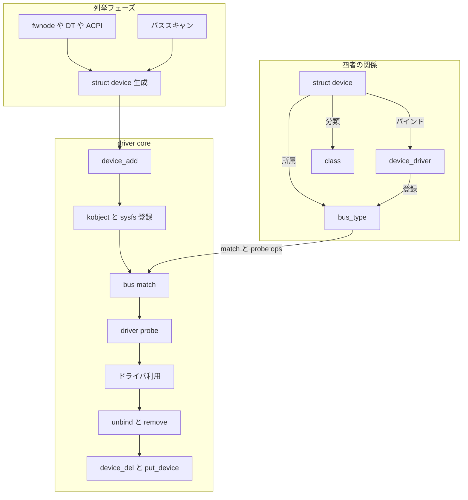

# 第1章 分冊の全体像とデバイスモデルが解く問題

> 本章で読むソース
>
> - [`include/linux/device.h` L601-L692](https://github.com/gregkh/linux/blob/v6.18.38/include/linux/device.h#L601-L692)
> - [`include/linux/device/bus.h` L81-L112](https://github.com/gregkh/linux/blob/v6.18.38/include/linux/device/bus.h#L81-L112)
> - [`include/linux/device/driver.h` L96-L122](https://github.com/gregkh/linux/blob/v6.18.38/include/linux/device/driver.h#L96-L122)
> - [`include/linux/device/class.h` L50-L70](https://github.com/gregkh/linux/blob/v6.18.38/include/linux/device/class.h#L50-L70)
> - [`drivers/base/core.c` L4144-L4157](https://github.com/gregkh/linux/blob/v6.18.38/drivers/base/core.c#L4144-L4157)
> - [`drivers/base/core.c` L3668-L3706](https://github.com/gregkh/linux/blob/v6.18.38/drivers/base/core.c#L3668-L3706)
> - [`drivers/base/bus.c` L952-L953](https://github.com/gregkh/linux/blob/v6.18.38/drivers/base/bus.c#L952-L953)
> - [`drivers/base/bus.c` L553](https://github.com/gregkh/linux/blob/v6.18.38/drivers/base/bus.c#L553)

## この章の狙い

Linux カーネルの**デバイスモデル**が何を統一的に扱うかを押さえ、以降の章で辿る `struct device` と `bus_type` と `device_driver` の関係を地図として固定する。

## 前提

[全体像と横断基盤](../../foundation/README.md) で kobject と sysfs の基本概念を読んでいること。
C での構造体埋め込みと、カーネルがデバイスドライバをモジュールとしてロードできることは知っている。

## デバイスモデルが解く問題

PCI デバイス、platform デバイス、USB 機器、ネットワークインタフェースなど、ハードウェアの接続方法はバラバラである。
各サブシステムが独自の登録表と sysfs レイアウトを持てば、列挙、ドライバのマッチ、probe、電源管理、ホットプラグ、ユーザー空間への通知を毎回再実装することになる。

デバイスモデルは、これらを**共通のデータ構造とコールバック**に落とし込む。
`drivers/base/` 配下の driver core が、デバイスの親子関係、バスへの所属、ドライバとのバインド、class による機能別の見せ方、uevent によるユーザー空間通知を一貫して扱う。

列挙そのものはバスごとのコードが担う。
Device Tree や ACPI から platform デバイスを作る処理は第2部、PCI バススキャンは第5部で読む。
本章では、列挙の結果が driver core に渡ったあとの共通経路を全体像として示す。

## bus_type、device、device_driver、class の四者

### struct device

`struct device` はデバイスモデルの中心である。
実体の大半は各サブシステムの `pci_dev` や `platform_device` などに埋め込まれ、driver core は共通フィールドだけを参照する。

[`include/linux/device.h` L601-L692](https://github.com/gregkh/linux/blob/v6.18.38/include/linux/device.h#L601-L692)

```c
struct device {
	struct kobject kobj;
	struct device		*parent;

	struct device_private	*p;

	const char		*init_name; /* initial name of the device */
	const struct device_type *type;

	const struct bus_type	*bus;	/* type of bus device is on */
	struct device_driver *driver;	/* which driver has allocated this
					   device */
	void		*platform_data;	/* Platform specific data, device
					   core doesn't touch it */
	void		*driver_data;	/* Driver data, set and get with
					   dev_set_drvdata/dev_get_drvdata */
	// ... (中略) ...
	spinlock_t		devres_lock;
	struct list_head	devres_head;

	const struct class	*class;
	const struct attribute_group **groups;	/* optional groups */

	void	(*release)(struct device *dev);
```

`kobj` は sysfs 上の表現と参照カウントの土台である。
`parent` はデバイスモデル上の親デバイスを表す。
`bus` は所属バス、`driver` は現在バインド中のドライバ、`class` は機能別の分類、`devres_head` はドライバが登録したマネージドリソースのリストである。
`p` は driver core 内部の `device_private` へのポインタで、第2章で扱う。

### struct bus_type

`bus_type` はバス種別ごとの**マッチ規則**と**probe/remove** の枠組みを提供する。

[`include/linux/device/bus.h` L81-L112](https://github.com/gregkh/linux/blob/v6.18.38/include/linux/device/bus.h#L81-L112)

```c
struct bus_type {
	const char		*name;
	const char		*dev_name;
	const struct attribute_group **bus_groups;
	const struct attribute_group **dev_groups;
	const struct attribute_group **drv_groups;

	int (*match)(struct device *dev, const struct device_driver *drv);
	int (*uevent)(const struct device *dev, struct kobj_uevent_env *env);
	int (*probe)(struct device *dev);
	void (*sync_state)(struct device *dev);
	void (*remove)(struct device *dev);
	void (*shutdown)(struct device *dev);
	// ... (中略) ...
	const struct dev_pm_ops *pm;

	bool driver_override;
	bool need_parent_lock;
};
```

`match` がデバイスとドライバの対応を決め、`probe` と `remove` がバインドと解除のバス固有部分を担う。
`uevent` は sysfs 経由のホットプラグ通知に使われる（第6章）。

### struct device_driver

`device_driver` はデバイスを制御するドライバの登録単位である。

[`include/linux/device/driver.h` L96-L122](https://github.com/gregkh/linux/blob/v6.18.38/include/linux/device/driver.h#L96-L122)

```c
struct device_driver {
	const char		*name;
	const struct bus_type	*bus;

	struct module		*owner;
	const char		*mod_name;	/* used for built-in modules */

	bool suppress_bind_attrs;	/* disables bind/unbind via sysfs */
	enum probe_type probe_type;

	const struct of_device_id	*of_match_table;
	const struct acpi_device_id	*acpi_match_table;

	int (*probe) (struct device *dev);
	void (*sync_state)(struct device *dev);
	int (*remove) (struct device *dev);
	// ... (中略) ...
	struct driver_private *p;
};
```

ドライバは必ずいずれかの `bus_type` に属する。
Device Tree 用の `of_match_table` や ACPI 用の `acpi_match_table` は、バスの `match` 実装から参照される。

### struct class

`class` は接続方式ではなく**機能**でデバイスをまとめる上位ビューである。
ブロックディスクは SCSI でも NVMe でも、class 上は同じ「ディスク」として扱える。

[`include/linux/device/class.h` L50-L70](https://github.com/gregkh/linux/blob/v6.18.38/include/linux/device/class.h#L50-L70)

```c
struct class {
	const char		*name;

	const struct attribute_group	**class_groups;
	const struct attribute_group	**dev_groups;

	int (*dev_uevent)(const struct device *dev, struct kobj_uevent_env *env);
	char *(*devnode)(const struct device *dev, umode_t *mode);

	void (*class_release)(const struct class *class);
	void (*dev_release)(struct device *dev);
	// ... (中略) ...
	const struct dev_pm_ops *pm;
};
```

デバイスは `bus` と `class` の両方に属しうる。
バスはマッチと probe の文脈、class は devtmpfs ノード生成や共通属性の文脈で効く（第5章）。

## ライフサイクルの全体像

デバイスがシステムで使えるようになるまでの流れは、おおまかに次の段階に分けられる。

1. **列挙**：ファームウェア記述やバススキャンで `struct device` が生成される。
2. **登録**：`device_add` が kobject と sysfs を整え、バスのデバイスリストへ入れる。
3. **マッチ**：バスの `match` とドライバのテーブルで対応するドライバを探す。
4. **probe**：ドライバの `probe` が成功するとデバイスは「バインド済み」になる。
5. **利用**：ドライバがハードウェアを初期化し、I/O や IRQ を有効化する。
6. **unbind/remove**：ドライバ解除や `remove` コールバックでリソースを返す。
7. **削除**：`device_del` と参照カウントの減少で `release` が走り、構造体が解放される。

ホットプラグでは、登録と probe のあいだで uevent がユーザー空間へ飛び、modprobe がドライバモジュールをロードする経路もある。

## sysfs 初期化と device_add の終端

driver core 起動時、`devices_init` がグローバルな sysfs 木の根を作る。

[`drivers/base/core.c` L4144-L4157](https://github.com/gregkh/linux/blob/v6.18.38/drivers/base/core.c#L4144-L4157)

```c
int __init devices_init(void)
{
	devices_kset = kset_create_and_add("devices", &device_uevent_ops, NULL);
	if (!devices_kset)
		return -ENOMEM;
	dev_kobj = kobject_create_and_add("dev", NULL);
	if (!dev_kobj)
		goto dev_kobj_err;
	sysfs_dev_block_kobj = kobject_create_and_add("block", dev_kobj);
	if (!sysfs_dev_block_kobj)
		goto block_kobj_err;
	sysfs_dev_char_kobj = kobject_create_and_add("char", dev_kobj);
	if (!sysfs_dev_char_kobj)
		goto char_kobj_err;
```

`/sys/devices/` は `devices_kset`、`/sys/dev/char` と `/sys/dev/block` は `dev_kobj` 配下である。
各デバイスの `kobj` はこの共通基盤の上にぶら下がる。

`device_add` の終盤では、電源管理用 sysfs と uevent の準備が終わったあと、**バスへの probe** が起動する。

[`drivers/base/core.c` L3668-L3706](https://github.com/gregkh/linux/blob/v6.18.38/drivers/base/core.c#L3668-L3706)

```c
	/* Notify clients of device addition.  This call must come
	 * after dpm_sysfs_add() and before kobject_uevent().
	 */
	bus_notify(dev, BUS_NOTIFY_ADD_DEVICE);
	kobject_uevent(&dev->kobj, KOBJ_ADD);
	// ... (中略) ...
	device_lock(dev);
	dev_set_ready_to_probe(dev);
	device_unlock(dev);

	bus_probe_device(dev);
```

コメントが示すとおり、`bus_probe_device` の前に `dev_set_ready_to_probe` で probe を解禁する。
別スレッドからの早期 bind との競合は `device_lock` とバインド状態の確認で吸収される（第11章）。

## sysfs とユーザー空間からの見え方

ユーザー空間が `/sys/devices/` や `/sys/bus/pci/devices/` を読むとき、見えているのは kobject ツリー上の**投影**である。
デバイスモデルの内部状態（どのドライバにバインドされているか、どのバスに載っているか）が、属性ファイルとシンボリックリンクとして表れる。

kobject の参照カウント、kset、属性の読み書き、kernfs の内部実装は [foundation 分冊の kobject と sysfs](../../foundation/part04-infra/13-kobject-sysfs.md) に委譲する。
本分冊では、`struct device` がいつ属性グループを付け、いつ uevent を発するかに焦点を当てる。

## 本分冊の委譲境界と範囲外

README と同じ方針で、本章時点で押さえておく境界は次のとおりである。

- **kobject と sysfs の内部**：参照カウント実装、kset、 kernfs は foundation 分冊へ委譲する。
- **MSI 割り込みドメイン**：`irq_domain` の階層は [割り込みと時間](../../irq-time/part00-genirq/04-msi-domain.md) へ委譲する。
  本分冊では PCI capability 設定と `pci_alloc_irq_vectors` の PCI 側に留める。
- **電源管理の状態遷移**：suspend と resume の詳細は [電源管理と CPU ライフサイクル](../../power-cpu/README.md) へ委譲する。
  本分冊では `device_add` と `device_del` が PM 対象集合をいつ構築するかを追う。
- **範囲外**：firmware loader、regmap、DMA mapping と IOMMU の内部は扱わない。
  driver core の主要経路が触れる接続点だけ後続章で示す。

## 四者関係とライフサイクルの処理フロー

次の図は、`bus_type` を中心に四者がどう結ばれるかと、列挙から削除までの主経路を示す。



## 高速化と最適化の工夫

バス登録時、driver core は `subsys_private` 内に**そのバス専用のデバイスリストとドライバリスト**を `klist` で持つ。

[`drivers/base/bus.c` L952-L953](https://github.com/gregkh/linux/blob/v6.18.38/drivers/base/bus.c#L952-L953)

```c
	klist_init(&priv->klist_devices, klist_devices_get, klist_devices_put);
	klist_init(&priv->klist_drivers, NULL, NULL);
```

デバイスがバスに追加されると、その `klist_devices` へノードが挿入される。

[`drivers/base/bus.c` L553](https://github.com/gregkh/linux/blob/v6.18.38/drivers/base/bus.c#L553)

```c
	klist_add_tail(&dev->p->knode_bus, &sp->klist_devices);
```

マッチと probe は、このリスト上のドライバとデバイスに対して走る。
全カーネル内の全デバイスと全ドライバを総当たりする必要がなく、走査範囲が**バス単位に限定**される。
PCI ドライバが USB デバイスを誤って候補に含めることもない。

あわせて、共通の kobject と sysfs 基盤を driver core が一度だけ初期化するため、各ドライバは sysfs ディレクトリ実装を自前で持たずに済む。
属性は `bus_groups`、`dev_groups`、`attribute_group` の宣言で足すだけである。

## まとめ

デバイスモデルは、多様なハードウェアを `struct device` と `bus_type` と `device_driver` と `class` の四者で統一表現する。
列挙のあと `device_add` が sysfs と uevent を整え、`bus_probe_device` がマッチと probe を起動する。
sysfs は内部状態の投影であり、kobject 詳細は foundation 分冊に委譲する。
バスごとの `klist` により、マッチ走査はバス内に閉じられる。

## 関連する章

- 次章：[中核データ構造と所有構造](02-core-data-structures-ownership.md)
- 登録の詳細：[device の登録操作と削除規約](../part01-registration/04-device-add-del.md)
- probe の中核：[really_probe とバインドの中核](../part03-probe/11-really-probe.md)
- kobject 基盤：[kobject と sysfs](../../foundation/part04-infra/13-kobject-sysfs.md)
