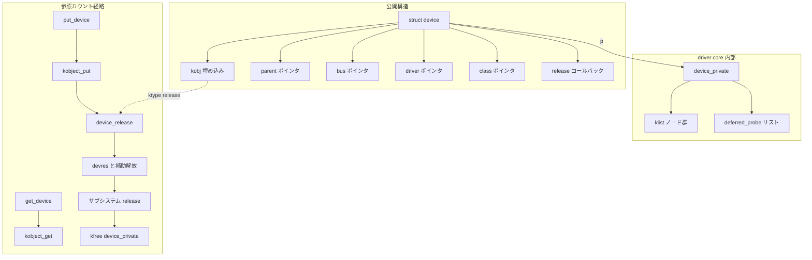

# 第2章 中核データ構造と所有構造

> 本章で読むソース
>
> - [`include/linux/device.h` L601-L689](https://github.com/gregkh/linux/blob/v6.18.38/include/linux/device.h#L601-L689)
> - [`drivers/base/base.h` L42-L60](https://github.com/gregkh/linux/blob/v6.18.38/drivers/base/base.h#L42-L60)
> - [`drivers/base/base.h` L79-L85](https://github.com/gregkh/linux/blob/v6.18.38/drivers/base/base.h#L79-L85)
> - [`drivers/base/base.h` L109-L120](https://github.com/gregkh/linux/blob/v6.18.38/drivers/base/base.h#L109-L120)
> - [`drivers/base/core.c` L3157-L3179](https://github.com/gregkh/linux/blob/v6.18.38/drivers/base/core.c#L3157-L3179)
> - [`drivers/base/core.c` L3800-L3816](https://github.com/gregkh/linux/blob/v6.18.38/drivers/base/core.c#L3800-L3816)
> - [`drivers/base/core.c` L2542-L2571](https://github.com/gregkh/linux/blob/v6.18.38/drivers/base/core.c#L2542-L2571)
> - [`drivers/base/core.c` L2592-L2597](https://github.com/gregkh/linux/blob/v6.18.38/drivers/base/core.c#L2592-L2597)
> - [`drivers/base/bus.c` L855-L869](https://github.com/gregkh/linux/blob/v6.18.38/drivers/base/bus.c#L855-L869)
> - [`include/linux/klist.h` L18-L23](https://github.com/gregkh/linux/blob/v6.18.38/include/linux/klist.h#L18-L23)
> - [`lib/klist.c` L108-L115](https://github.com/gregkh/linux/blob/v6.18.38/lib/klist.c#L108-L115)
> - [`lib/klist.c` L375-L405](https://github.com/gregkh/linux/blob/v6.18.38/lib/klist.c#L375-L405)

## この章の狙い

`struct device` の主要フィールドが何を指すかを整理し、kobject による参照カウントと `release` コールバックによる所有規約を押さえる。
`device_private` など内部構造体が公開構造体から分離されている理由もここで固定する。

## 前提

前章：[分冊の全体像とデバイスモデルが解く問題](01-device-model-overview.md) を読み、四者の関係とライフサイクルの概観を知っていること。
kobject の `kref` による参照カウントの考え方は [foundation 分冊](../../foundation/part04-infra/13-kobject-sysfs.md) で触れている。

## struct device のフィールド整理

`struct device` はサブシステム固有の構造体に埋め込まれることが多いが、driver core が触るフィールドは共通である。

[`include/linux/device.h` L601-L689](https://github.com/gregkh/linux/blob/v6.18.38/include/linux/device.h#L601-L689)

```c
struct device {
	struct kobject kobj;
	struct device		*parent;

	struct device_private	*p;

	const char		*init_name; /* initial name of the device */
	const struct device_type *type;

	const struct bus_type	*bus;	/* type of bus device is on */
	struct device_driver *driver;	/* which driver has allocated this
					   device */
	void		*platform_data;	/* Platform specific data, device
					   core doesn't touch it */
	void		*driver_data;	/* Driver data, set and get with
					   dev_set_drvdata/dev_get_drvdata */
	// ... (中略) ...
	dev_t			devt;	/* dev_t, creates the sysfs "dev" */
	u32			id;	/* device instance */

	spinlock_t		devres_lock;
	struct list_head	devres_head;

	const struct class	*class;
	const struct attribute_group **groups;	/* optional groups */

	void	(*release)(struct device *dev);
	struct iommu_group	*iommu_group;
	struct dev_iommu	*iommu;
```

各フィールドの役割を表にまとめる。

| フィールド | 指すもの |
|---|---|
| `kobj` | sysfs ノードと参照カウントの本体 |
| `parent` | デバイスモデル上の親デバイス（sysfs 物理階層の基礎） |
| `p` | driver core 内部の `device_private` |
| `bus` | 所属する `bus_type` |
| `driver` | 現在バインド中の `device_driver`、未バインドなら NULL |
| `class` | 機能別分類の `class`、無ければ NULL |
| `devres_head` | マネージドリソースのリスト頭 |
| `release` | 参照カウントゼロ時に呼ばれる解放コールバック |

`platform_data` と `driver_data` は driver core が解釈しない不透明ポインタである。
サブシステムとドライバの契約で使う。

## kobject 埋め込みと参照カウント

`struct device` の先頭付近に `struct kobject kobj` が埋め込まれている。
デバイスのライフタイムは、この kobject の参照カウントに委ねられる。

呼び出し側が `struct device` を直接 `kfree` してはならない理由はここにある。
参照を取得するときは `get_device`、放すときは `put_device` を使い、カウントがゼロになったときだけ `device_ktype.release` が走る。

kobject 内部の `kref` 実装や sysfs ディレクトリの作成手順は foundation 分冊に委譲する。
本章では、device 層が kobject API をどう薄くラップしているかに留める。

## 内部構造体の分離

公開ヘッダに載る `bus_type`、`device_driver`、`class` は、実際の klist ノードや kset は**内部構造体**側に置かれる。

### subsys_private

[`drivers/base/base.h` L42-L60](https://github.com/gregkh/linux/blob/v6.18.38/drivers/base/base.h#L42-L60)

```c
struct subsys_private {
	struct kset subsys;
	struct kset *devices_kset;
	struct list_head interfaces;
	struct mutex mutex;

	struct kset *drivers_kset;
	struct klist klist_devices;
	struct klist klist_drivers;
	struct blocking_notifier_head bus_notifier;
	unsigned int drivers_autoprobe:1;
	const struct bus_type *bus;
	struct device *dev_root;

	struct kset glue_dirs;
	const struct class *class;

	struct lock_class_key lock_key;
};
```

`bus_type` または `class` ごとに一つの `subsys_private` が存在し、そのバス上の全デバイスと全ドライバの klist を保持する。

### driver_private

[`drivers/base/base.h` L79-L85](https://github.com/gregkh/linux/blob/v6.18.38/drivers/base/base.h#L79-L85)

```c
struct driver_private {
	struct kobject kobj;
	struct klist klist_devices;
	struct klist_node knode_bus;
	struct module_kobject *mkobj;
	struct device_driver *driver;
};
```

ドライバがバインドしたデバイスは `klist_devices` にぶら下がる。
`knode_bus` はバス側のドライバリストへのリンクである。

### device_private

[`drivers/base/base.h` L109-L120](https://github.com/gregkh/linux/blob/v6.18.38/drivers/base/base.h#L109-L120)

```c
struct device_private {
	struct klist klist_children;
	struct klist_node knode_parent;
	struct klist_node knode_bus;
	struct klist_node knode_driver;
	struct klist_node knode_class;
	struct list_head deferred_probe;
	const struct device_driver *async_driver;
	char *deferred_probe_reason;
	struct device *device;
	u8 dead:1;
};
```

子デバイスリスト、親、バス、ドライバ、class 各 klist へのノード、deferred probe キュー、`dead` フラグはすべてここに集約される。
`drivers/base/base.h` のコメントは、`drivers/base/` 以外からこれらのフィールドを触らせないという**アクセス境界**を示している。

外部のサブシステムが klist ノードや deferred probe 状態に直接依存すると、driver core 内部の表現を変えるたびに波及が広がる。
`device_private` へ閉じ込めることで、リスト実装や deferred probe の不変条件は `drivers/base/` 内だけで更新できる。
これは実行時の高速化ではなく、内部状態のカプセル化による外部結合の低減である。

## device_initialize が整える初期状態

デバイス構造体を確保したあと、サブシステムは `device_initialize` を呼ぶ。
この時点ではまだ sysfs には未登録だが、`kobject_init` により kobject の初期参照が一つ確立され、`get_device` と `put_device` はすでに使える。

[`drivers/base/core.c` L3157-L3179](https://github.com/gregkh/linux/blob/v6.18.38/drivers/base/core.c#L3157-L3179)

```c
void device_initialize(struct device *dev)
{
	dev->kobj.kset = devices_kset;
	kobject_init(&dev->kobj, &device_ktype);
	INIT_LIST_HEAD(&dev->dma_pools);
	mutex_init(&dev->mutex);
	spin_lock_init(&dev->driver_override.lock);
	lockdep_set_novalidate_class(&dev->mutex);
	spin_lock_init(&dev->devres_lock);
	INIT_LIST_HEAD(&dev->devres_head);
	device_pm_init(dev);
	set_dev_node(dev, NUMA_NO_NODE);
	INIT_LIST_HEAD(&dev->links.consumers);
	INIT_LIST_HEAD(&dev->links.suppliers);
	INIT_LIST_HEAD(&dev->links.defer_sync);
	dev->links.status = DL_DEV_NO_DRIVER;
	// ... (中略) ...
	swiotlb_dev_init(dev);
}
```

`kobject_init` で `device_ktype` が結び付き、初期参照カウントが立つ。
`devres_head` と device links 用リストが空になる。
`device_add` の前に `device_private_init` が走り `dev->p` が確保されるのは別経路である（第4章）。

`device_initialize` の kerneldoc も、`device_register` の前半として呼んだあと `get_device` と `put_device` が使えると明記している。

コメントが注意するとおり、`device_initialize` のあと解放するときは `kfree` ではなく `put_device` を使う。

## get_device と put_device

参照の増減は kobject 層へそのまま委譲される。

[`drivers/base/core.c` L3800-L3816](https://github.com/gregkh/linux/blob/v6.18.38/drivers/base/core.c#L3800-L3816)

```c
struct device *get_device(struct device *dev)
{
	return dev ? kobj_to_dev(kobject_get(&dev->kobj)) : NULL;
}
EXPORT_SYMBOL_GPL(get_device);

/**
 * put_device - decrement reference count.
 * @dev: device in question.
 */
void put_device(struct device *dev)
{
	/* might_sleep(); */
	if (dev)
		kobject_put(&dev->kobj);
}
EXPORT_SYMBOL_GPL(put_device);
```

`get_device` は NULL 安全である。
`put_device` は `kobject_put` を呼び、カウントがゼロなら `device_ktype` の `release` コールバックに入る。

正しく `get_device` で取得した参照を保持している間は、最終解放が `put_device` まで遅延される。
すでに最後の参照が落ちたあとの raw ポインタに対して `get_device` を呼んでも安全にはならない。
ポインタの公開元と取得側の同期は別途必要である。

バインド状態の保護や `probe` 中の排他は、`dev->mutex` など参照カウントとは別の同期機構が担う（第11章）。
参照カウントはデバイス構造体の寿命管理であり、すべての並行アクセスを代替するわけではない。

## device_release による最終解放

kobject の参照がゼロになると、`device_release` が呼ばれる。

[`drivers/base/core.c` L2542-L2571](https://github.com/gregkh/linux/blob/v6.18.38/drivers/base/core.c#L2542-L2571)

```c
static void device_release(struct kobject *kobj)
{
	struct device *dev = kobj_to_dev(kobj);
	struct device_private *p = dev->p;

	/*
	 * Some platform devices are driven without driver attached
	 * and managed resources may have been acquired.  Make sure
	 * all resources are released.
	 *
	 * Drivers still can add resources into device after device
	 * is deleted but alive, so release devres here to avoid
	 * possible memory leak.
	 */
	devres_release_all(dev);

	kfree(dev->dma_range_map);
	kfree(dev->driver_override.name);

	if (dev->release)
		dev->release(dev);
	else if (dev->type && dev->type->release)
		dev->type->release(dev);
	else if (dev->class && dev->class->dev_release)
		dev->class->dev_release(dev);
	else
		WARN(1, KERN_ERR "Device '%s' does not have a release() function, it is broken and must be fixed. See Documentation/core-api/kobject.rst.\n",
			dev_name(dev));
	kfree(p);
}
```

順序は次のとおりである。

1. `dev->p` をローカル変数 `p` に退避する（以降 `release` で `dev` が解放されうるため）。
2. 残っている devres と driver core が確保した補助フィールドを解放する。
3. `dev->release`、なければ `dev->type->release`、なければ `class->dev_release` の順で、サブシステムが確保した本体を解放する。
4. 最後に `kfree(p)` で `device_private` を解放する。

`release` コールバックは `struct device` を埋め込んだ本体ごと `kfree` しうる。
そのため 3 のあと `dev` を参照してはならず、先に退避した `p` だけを 4 で片付ける現在の順序になっている。

`struct device` 本体のメモリを誰が `kfree` するかは、サブシステムが登録した `release` に書かれる。
driver core は devres と補助フィールドを片付けたうえで `release` を呼び、最後に `device_private` を解放する。

`device_ktype` はこの `device_release` を登録する。

[`drivers/base/core.c` L2592-L2597](https://github.com/gregkh/linux/blob/v6.18.38/drivers/base/core.c#L2592-L2597)

```c
static const struct kobj_type device_ktype = {
	.release	= device_release,
	.sysfs_ops	= &dev_sysfs_ops,
	.namespace	= device_namespace,
	.get_ownership	= device_get_ownership,
};
```

## 所有と参照の処理フロー

次の図は、埋め込み kobject、外部参照、内部 private の関係と、解放までの経路を示す。



## 高速化と最適化の工夫

`device_private` の klist ノードは、バス登録時に `klist_devices` へ挿入され、マッチ走査の対象集合をバス内に閉じる（第3章）。
走査中にデバイスがリストから外れても安全に済ませるため、`klist` は二層の参照管理を持つ。

[`include/linux/klist.h` L18-L23](https://github.com/gregkh/linux/blob/v6.18.38/include/linux/klist.h#L18-L23)

```c
struct klist {
	spinlock_t		k_lock;
	struct list_head	k_list;
	void			(*get)(struct klist_node *);
	void			(*put)(struct klist_node *);
} __attribute__ ((aligned (sizeof(void *))));
```

バスの `klist_devices` では、`get` に `klist_devices_get`、`put` に `klist_devices_put` が結び付く。
`klist_add_tail` は内部で `klist_node_init` を呼び、`get` コールバックを**一度だけ**実行してリスト所属分の基礎参照を取る。

[`lib/klist.c` L108-L115](https://github.com/gregkh/linux/blob/v6.18.38/lib/klist.c#L108-L115)

```c
static void klist_node_init(struct klist *k, struct klist_node *n)
{
	INIT_LIST_HEAD(&n->n_node);
	kref_init(&n->n_ref);
	knode_set_klist(n, k);
	if (k->get)
		k->get(n);
}
```

[`drivers/base/bus.c` L855-L869](https://github.com/gregkh/linux/blob/v6.18.38/drivers/base/bus.c#L855-L869)

```c
static void klist_devices_get(struct klist_node *n)
{
	struct device_private *dev_prv = to_device_private_bus(n);
	struct device *dev = dev_prv->device;

	get_device(dev);
}

static void klist_devices_put(struct klist_node *n)
{
	struct device_private *dev_prv = to_device_private_bus(n);
	struct device *dev = dev_prv->device;

	put_device(dev);
}
```

第二層はイテレータが `klist_node` 自身の `n_ref` を増減することである。
`klist_next` はリストロックを短く保持し、前ノードの `n_ref` を落とし、次ノードの `n_ref` を増やしてからロックを外す。
ノードの `put` コールバックは、所属分の `n_ref` が最後まで落ちたあとに**一度だけ**呼ばれる。

[`lib/klist.c` L375-L405](https://github.com/gregkh/linux/blob/v6.18.38/lib/klist.c#L375-L405)

```c
struct klist_node *klist_next(struct klist_iter *i)
{
	void (*put)(struct klist_node *) = i->i_klist->put;
	struct klist_node *last = i->i_cur;
	struct klist_node *next;
	unsigned long flags;

	spin_lock_irqsave(&i->i_klist->k_lock, flags);

	if (last) {
		next = to_klist_node(last->n_node.next);
		if (!klist_dec_and_del(last))
			put = NULL;
	} else
		next = to_klist_node(i->i_klist->k_list.next);

	i->i_cur = NULL;
	while (next != to_klist_node(&i->i_klist->k_list)) {
		if (likely(!knode_dead(next))) {
			kref_get(&next->n_ref);
			i->i_cur = next;
			break;
		}
		next = to_klist_node(next->n_node.next);
	}

	spin_unlock_irqrestore(&i->i_klist->k_lock, flags);

	if (put && last)
		put(last);
	return i->i_cur;
}
```

第一層では `get_device` と `put_device` が klist 所属期間から全イテレータ終了まで `struct device` の寿命を保持する。
第二層では各イテレータが `klist_node` の `n_ref` を増減し、現在ノードの削除と競合してもノードを残す。
その結果、走査コールバックを短時間の klist spinlock の外で実行でき、リストの追加や削除と並行したマッチ走査が大域ロックなしで成立する。

## まとめ

`struct device` は kobject 埋め込みで sysfs と参照カウントを共有し、`p` 経由で内部 klist 管理に接続する。
`device_initialize` 後は sysfs 未登録でも kobject の初期参照が立ち、`get_device` と `put_device` が使える。
最終解放は `device_release` が `dev->p` を退避し、devres と補助フィールドを片付けたうえでサブシステムの `release` を呼び、最後に `kfree(p)` する。
`device_add` の成否や `device_del` の手順は第4章の範囲である。

## 関連する章

- 前章：[分冊の全体像とデバイスモデルが解く問題](01-device-model-overview.md)
- 登録操作：[device の登録操作と削除規約](../part01-registration/04-device-add-del.md)
- devres：[devres によるマネージドリソース](../part04-links-devres-unbind/15-devres.md)
- deferred probe：[deferred probe](../part03-probe/12-deferred-probe.md)
- kobject 詳細：[kobject と sysfs](../../foundation/part04-infra/13-kobject-sysfs.md)
