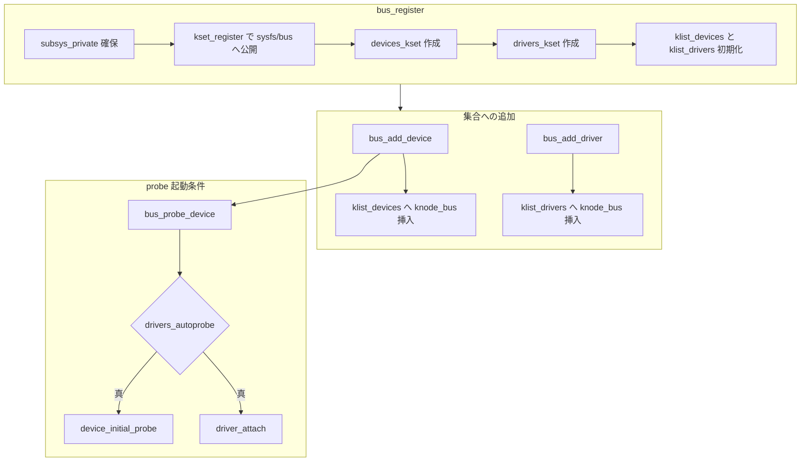

# 第3章 bus_type の登録とバスへの追加

> 本章で読むソース
>
> - [`include/linux/device/bus.h` L81-L93](https://github.com/gregkh/linux/blob/v6.18.38/include/linux/device/bus.h#L81-L93)
> - [`drivers/base/base.h` L42-L60](https://github.com/gregkh/linux/blob/v6.18.38/drivers/base/base.h#L42-L60)
> - [`drivers/base/bus.c` L904-L964](https://github.com/gregkh/linux/blob/v6.18.38/drivers/base/bus.c#L904-L964)
> - [`drivers/base/bus.c` L507-L565](https://github.com/gregkh/linux/blob/v6.18.38/drivers/base/bus.c#L507-L565)
> - [`drivers/base/bus.c` L695-L729](https://github.com/gregkh/linux/blob/v6.18.38/drivers/base/bus.c#L695-L729)
> - [`drivers/base/bus.c` L574-L591](https://github.com/gregkh/linux/blob/v6.18.38/drivers/base/bus.c#L574-L591)
> - [`drivers/base/bus.c` L855-L869](https://github.com/gregkh/linux/blob/v6.18.38/drivers/base/bus.c#L855-L869)

## この章の狙い

`bus_type` がデバイスとドライバの「出会いの場」としてどう登録され、各デバイスとドライバがバス単位の集合と sysfs に載るかを追う。
`bus_probe_device` が probe を起動する条件までを押さえ、マッチ走査の中身は第10章へ委譲する。

## 前提

前章まで：[分冊の全体像](../part00-overview/01-device-model-overview.md)、[中核データ構造と所有構造](../part00-overview/02-core-data-structures-ownership.md) を読み、`subsys_private` と klist の存在を知っていること。

## bus_type が提供するコールバック

`bus_type` はバス種別ごとの**マッチ規則**と**probe/remove** の枠組みを宣言する構造体である。
platform バス、PCI バス、USB バスなどがそれぞれ静的な `bus_type` インスタンスを持ち、`bus_register` で driver core に登録する。

[`include/linux/device/bus.h` L81-L93](https://github.com/gregkh/linux/blob/v6.18.38/include/linux/device/bus.h#L81-L93)

```c
struct bus_type {
	const char		*name;
	const char		*dev_name;
	const struct attribute_group **bus_groups;
	const struct attribute_group **dev_groups;
	const struct attribute_group **drv_groups;

	int (*match)(struct device *dev, const struct device_driver *drv);
	int (*uevent)(const struct device *dev, struct kobj_uevent_env *env);
	int (*probe)(struct device *dev);
	void (*sync_state)(struct device *dev);
	void (*remove)(struct device *dev);
	void (*shutdown)(struct device *dev);
```

`match` がデバイスとドライバの対応可否を返し、`probe` と `remove` がバインドと解除のバス固有部分を担う。
`uevent` は modalias などホットプラグ通知に使われる（第6章）。
本章はこれらの**実装の中身**ではなく、登録と集合への追加、probe 起動の条件に焦点を当てる。

## subsys_private と二つの klist

公開ヘッダの `bus_type` はポインタだけを公開し、実体の kset と klist は `subsys_private` に隠される。

[`drivers/base/base.h` L42-L60](https://github.com/gregkh/linux/blob/v6.18.38/drivers/base/base.h#L42-L60)

```c
struct subsys_private {
	struct kset subsys;
	struct kset *devices_kset;
	struct list_head interfaces;
	struct mutex mutex;

	struct kset *drivers_kset;
	struct klist klist_devices;
	struct klist klist_drivers;
	struct blocking_notifier_head bus_notifier;
	unsigned int drivers_autoprobe:1;
	const struct bus_type *bus;
	struct device *dev_root;

	struct kset glue_dirs;
	const struct class *class;

	struct lock_class_key lock_key;
};
```

`devices_kset` と `drivers_kset` はそれぞれ `/sys/bus/<name>/devices` と `/sys/bus/<name>/drivers` に対応する。
`klist_devices` と `klist_drivers` が、そのバスに載ったデバイスとドライバの走査用リストである。

## bus_register が行うこと

`bus_register` は `subsys_private` を確保し、`/sys/bus` 配下にバス自身を載せたうえで、デバイス用とドライバ用の kset と klist を初期化する。

[`drivers/base/bus.c` L904-L964](https://github.com/gregkh/linux/blob/v6.18.38/drivers/base/bus.c#L904-L964)

```c
int bus_register(const struct bus_type *bus)
{
	int retval;
	struct subsys_private *priv;
	struct kobject *bus_kobj;
	struct lock_class_key *key;

	priv = kzalloc(sizeof(struct subsys_private), GFP_KERNEL);
	if (!priv)
		return -ENOMEM;

	priv->bus = bus;

	BLOCKING_INIT_NOTIFIER_HEAD(&priv->bus_notifier);

	bus_kobj = &priv->subsys.kobj;
	retval = kobject_set_name(bus_kobj, "%s", bus->name);
	if (retval)
		goto out;

	bus_kobj->kset = bus_kset;
	bus_kobj->ktype = &bus_ktype;
	priv->drivers_autoprobe = 1;

	retval = kset_register(&priv->subsys);
	if (retval)
		goto out;

	retval = bus_create_file(bus, &bus_attr_uevent);
	if (retval)
		goto bus_uevent_fail;

	priv->devices_kset = kset_create_and_add("devices", NULL, bus_kobj);
	if (!priv->devices_kset) {
		retval = -ENOMEM;
		goto bus_devices_fail;
	}

	priv->drivers_kset = kset_create_and_add("drivers", NULL, bus_kobj);
	if (!priv->drivers_kset) {
		retval = -ENOMEM;
		goto bus_drivers_fail;
	}

	INIT_LIST_HEAD(&priv->interfaces);
	key = &priv->lock_key;
	lockdep_register_key(key);
	__mutex_init(&priv->mutex, "subsys mutex", key);
	klist_init(&priv->klist_devices, klist_devices_get, klist_devices_put);
	klist_init(&priv->klist_drivers, NULL, NULL);

	retval = add_probe_files(bus);
	if (retval)
		goto bus_probe_files_fail;

	retval = sysfs_create_groups(bus_kobj, bus->bus_groups);
	if (retval)
		goto bus_groups_fail;

	pr_debug("bus: '%s': registered\n", bus->name);
	return 0;
```

注目点は次の三つである。

1. `priv->drivers_autoprobe = 1` で、登録直後から自動 probe が有効になる（後から sysfs で無効化可能）。
2. `devices` と `drivers` の子 kset がバス kobject の下に作られる。
3. `klist_init` で二つの klist が初期化され、デバイス側だけ `klist_devices_get` と `klist_devices_put` が結び付く。

失敗時は `bus_groups_fail` 以降のラベルで kset 登録を逆順に巻き戻す（第4章の `device_add` と同型のパターン）。

## bus_add_device：デバイスをバス集合へ載せる

`device_add` の途中で呼ばれる `bus_add_device` は、デバイスをバスの klist と sysfs に接続する。

[`drivers/base/bus.c` L507-L565](https://github.com/gregkh/linux/blob/v6.18.38/drivers/base/bus.c#L507-L565)

```c
int bus_add_device(struct device *dev)
{
	struct subsys_private *sp;
	int error;

	if (!dev->bus) {
		/*
		 * This is a normal operation for many devices that do not
		 * have a bus assigned to them, just say that all went
		 * well.
		 */
		return 0;
	}

	sp = bus_to_subsys(dev->bus);
	if (!sp) {
		pr_err("%s: cannot add device '%s' to unregistered bus '%s'\n",
		       __func__, dev_name(dev), dev->bus->name);
		return -EINVAL;
	}

	/*
	 * Reference in sp is now incremented and will be dropped when
	 * the device is removed from the bus
	 */

	pr_debug("bus: '%s': add device %s\n", sp->bus->name, dev_name(dev));

	error = device_add_groups(dev, sp->bus->dev_groups);
	if (error)
		goto out_put;

	if (dev->bus->driver_override) {
		error = device_add_group(dev, &driver_override_dev_group);
		if (error)
			goto out_groups;
	}

	error = sysfs_create_link(&sp->devices_kset->kobj, &dev->kobj, dev_name(dev));
	if (error)
		goto out_override;

	error = sysfs_create_link(&dev->kobj, &sp->subsys.kobj, "subsystem");
	if (error)
		goto out_subsys;

	klist_add_tail(&dev->p->knode_bus, &sp->klist_devices);
	return 0;

out_subsys:
	sysfs_remove_link(&sp->devices_kset->kobj, dev_name(dev));
out_override:
	if (dev->bus->driver_override)
		device_remove_group(dev, &driver_override_dev_group);
out_groups:
	device_remove_groups(dev, sp->bus->dev_groups);
out_put:
	subsys_put(sp);
	return error;
}
```

処理の対応は次のとおりである。

| 段階 | 効果 |
|---|---|
| `device_add_groups` | バスが定義したデバイス属性を sysfs に追加 |
| `sysfs_create_link`（バス側） | `/sys/bus/<bus>/devices/<name>` からデバイスへのリンク |
| `sysfs_create_link`（デバイス側） | デバイスの `subsystem` リンク |
| `klist_add_tail` | `klist_devices` への登録 |

`bus_to_subsys` で取った `sp` の参照は、デバイスがバスから外れるまで保持される。
`bus_remove_device` で `subsys_put` される。

## bus_add_driver：ドライバをバス集合へ載せる

ドライバ登録の対称操作が `bus_add_driver` である。
`driver_register` から呼ばれ、ドライバ用 kobject の作成と `klist_drivers` への挿入を行う。

[`drivers/base/bus.c` L695-L729](https://github.com/gregkh/linux/blob/v6.18.38/drivers/base/bus.c#L695-L729)

```c
int bus_add_driver(struct device_driver *drv)
{
	struct subsys_private *sp = bus_to_subsys(drv->bus);
	struct driver_private *priv;
	int error = 0;

	if (!sp)
		return -EINVAL;

	/*
	 * Reference in sp is now incremented and will be dropped when
	 * the driver is removed from the bus
	 */
	pr_debug("bus: '%s': add driver %s\n", sp->bus->name, drv->name);

	priv = kzalloc(sizeof(*priv), GFP_KERNEL);
	if (!priv) {
		error = -ENOMEM;
		goto out_put_bus;
	}
	klist_init(&priv->klist_devices, NULL, NULL);
	priv->driver = drv;
	drv->p = priv;
	priv->kobj.kset = sp->drivers_kset;
	error = kobject_init_and_add(&priv->kobj, &driver_ktype, NULL,
				     "%s", drv->name);
	if (error)
		goto out_unregister;

	klist_add_tail(&priv->knode_bus, &sp->klist_drivers);
	if (sp->drivers_autoprobe) {
		error = driver_attach(drv);
		if (error)
			goto out_del_list;
	}
```

`bus_add_device` がデバイスを `klist_devices` に足すのに対し、こちらは `klist_drivers` に足す。
`drivers_autoprobe` が真なら、登録直後に `driver_attach` が走り、既存デバイスへのマッチ試行が始まる（走査の詳細は第10章）。

成功後は uevent 属性や `drv_groups` の追加が続くが、集合への追加と autoprobe の分岐は上記までで完結する。

## bus_probe_device：probe を起動する条件

デバイス側から見た自動 probe の入口が `bus_probe_device` である。
`device_add` の末尾から呼ばれる。

[`drivers/base/bus.c` L574-L591](https://github.com/gregkh/linux/blob/v6.18.38/drivers/base/bus.c#L574-L591)

```c
void bus_probe_device(struct device *dev)
{
	struct subsys_private *sp = bus_to_subsys(dev->bus);
	struct subsys_interface *sif;

	if (!sp)
		return;

	if (sp->drivers_autoprobe)
		device_initial_probe(dev);

	mutex_lock(&sp->mutex);
	list_for_each_entry(sif, &sp->interfaces, node)
		if (sif->add_dev)
			sif->add_dev(dev, sif);
	mutex_unlock(&sp->mutex);
	subsys_put(sp);
}
```

`drivers_autoprobe` が偽なら `device_initial_probe` は呼ばれない。
バスに `subsys_interface` が登録されていれば、その `add_dev` も続けて呼ばれる。

`device_initial_probe` の内部で `__device_attach` が走り、最終的に `really_probe` に至る（第11章）。
本章は「`drivers_autoprobe` が真のときだけ起動する」という**条件**までを扱う。

## バス登録から probe 起動までの処理フロー



## 高速化と最適化の工夫

マッチの候補は、グローバルな全デバイスと全ドライバではなく、**同一 `bus_type` の klist 内**に限定される。
PCI ドライバが USB デバイスを走査することはない。

`klist_devices` は二層の参照管理で走査中の削除と競合しても安全である。
`bus_add_device` が `klist_add_tail` でノードを挿入するとき、`klist_node_init` 経由で `klist_devices_get` が**一度だけ**呼ばれ、リスト所属分の `get_device` が取られる。

[`drivers/base/bus.c` L855-L869](https://github.com/gregkh/linux/blob/v6.18.38/drivers/base/bus.c#L855-L869)

```c
static void klist_devices_get(struct klist_node *n)
{
	struct device_private *dev_prv = to_device_private_bus(n);
	struct device *dev = dev_prv->device;

	get_device(dev);
}

static void klist_devices_put(struct klist_node *n)
{
	struct device_private *dev_prv = to_device_private_bus(n);
	struct device *dev = dev_prv->device;

	put_device(dev);
}
```

イテレータが増減するのは `klist_node` の `n_ref` であり、反復ごとに `get_device` は呼ばれない。
最後の `n_ref` が落ちたあとに `klist_devices_put` が**一度だけ** `put_device` を呼ぶ。
第一層が `struct device` の寿命を、第二層が走査中ノードの存続を担うため、短時間の klist spinlock の外でマッチ処理を実行でき、バス上の並行な追加、削除、走査を大域ロックなしで成立させる。

## まとめ

`bus_register` が `/sys/bus` への公開と二つの klist を用意する。
`bus_add_device` と `bus_add_driver` がそれぞれデバイスとドライバを集合と sysfs に載せる。
`bus_probe_device` は `drivers_autoprobe` が真のときだけ `device_initial_probe` を起動する。
マッチ走査の中身と二方向 attach は第10章、probe 本体は第11章の範囲である。

## 関連する章

- 前章：[中核データ構造と所有構造](../part00-overview/02-core-data-structures-ownership.md)
- 次章：[device の登録操作と削除規約](04-device-add-del.md)
- マッチ走査：[ドライバ登録と二方向マッチと async probe](../part03-probe/10-driver-match-async-probe.md)
- probe 中核：[really_probe とバインドの中核](../part03-probe/11-really-probe.md)
