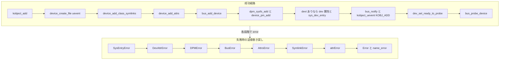

# 第4章 device の登録操作と削除規約

> 本章で読むソース
>
> - [`drivers/base/core.c` L3546-L3572](https://github.com/gregkh/linux/blob/v6.18.38/drivers/base/core.c#L3546-L3572)
> - [`drivers/base/core.c` L3627-L3706](https://github.com/gregkh/linux/blob/v6.18.38/drivers/base/core.c#L3627-L3706)
> - [`drivers/base/core.c` L3736-L3763](https://github.com/gregkh/linux/blob/v6.18.38/drivers/base/core.c#L3736-L3763)
> - [`drivers/base/core.c` L3767-L3789](https://github.com/gregkh/linux/blob/v6.18.38/drivers/base/core.c#L3767-L3789)
> - [`drivers/base/core.c` L3849-L3919](https://github.com/gregkh/linux/blob/v6.18.38/drivers/base/core.c#L3849-L3919)
> - [`drivers/base/core.c` L3933-L3938](https://github.com/gregkh/linux/blob/v6.18.38/drivers/base/core.c#L3933-L3938)

## この章の狙い

`device_add` が sysfs と各サブシステムへ何を登録するかを順に追い、失敗時の逆順巻き戻しと成功後の削除規約を固定する。
`device_register` と `device_del` と `device_unregister` の関係、および `device_add` 成功後と失敗後で使う API の非対称性を明示する。

## 前提

[中核データ構造と所有構造](../part00-overview/02-core-data-structures-ownership.md) で `device_initialize` と参照カウントを読んでいること。
[bus_type の登録とバスへの追加](03-bus-register.md) で `bus_add_device` と `bus_probe_device` の位置づけを知っていること。

## device_add の所有規約

`device_add` の kerneldoc は、成功と失敗で後処理が異なることをはっきり書いている。

[`drivers/base/core.c` L3546-L3572](https://github.com/gregkh/linux/blob/v6.18.38/drivers/base/core.c#L3546-L3572)

```c
/**
 * device_add - add device to device hierarchy.
 * @dev: device.
 *
 * This is part 2 of device_register(), though may be called
 * separately _iff_ device_initialize() has been called separately.
 *
 * This adds @dev to the kobject hierarchy via kobject_add(), adds it
 * to the global and sibling lists for the device, then
 * adds it to the other relevant subsystems of the driver model.
 *
 * Do not call this routine or device_register() more than once for
 * any device structure.  The driver model core is not designed to work
 * with devices that get unregistered and then spring back to life.
 * (Among other things, it's very hard to guarantee that all references
 * to the previous incarnation of @dev have been dropped.)  Allocate
 * and register a fresh new struct device instead.
 *
 * NOTE: _Never_ directly free @dev after calling this function, even
 * if it returned an error! Always use put_device() to give up your
 * reference instead.
 *
 * Rule of thumb is: if device_add() succeeds, you should call
 * device_del() when you want to get rid of it. If device_add() has
 * *not* succeeded, use *only* put_device() to drop the reference
 * count.
 */
```

**非対称規則**を次に整理する。

| `device_add` の結果 | 解体に使う API |
|---|---|
| 成功（戻り値 0） | `device_del` または `device_unregister` |
| 失敗（戻り値 非0） | `put_device` のみ |

成功後に `put_device` だけで済ませたり、失敗後に `device_del` を呼んだりしてはならない。
`device_del` は `device_add` が到達した登録だけを逆順に外す前提で書かれている。

## device_add の登録ステップ

名前と親の準備を終えたあと、`device_add` は次の順で sysfs と各集合を構築する。

[`drivers/base/core.c` L3627-L3706](https://github.com/gregkh/linux/blob/v6.18.38/drivers/base/core.c#L3627-L3706)

```c
	/* first, register with generic layer. */
	/* we require the name to be set before, and pass NULL */
	error = kobject_add(&dev->kobj, dev->kobj.parent, NULL);
	if (error) {
		glue_dir = kobj;
		goto Error;
	}

	/* notify platform of device entry */
	device_platform_notify(dev);

	error = device_create_file(dev, &dev_attr_uevent);
	if (error)
		goto attrError;

	error = device_add_class_symlinks(dev);
	if (error)
		goto SymlinkError;
	error = device_add_attrs(dev);
	if (error)
		goto AttrsError;
	error = bus_add_device(dev);
	if (error)
		goto BusError;
	error = dpm_sysfs_add(dev);
	if (error)
		goto DPMError;
	device_pm_add(dev);

	if (MAJOR(dev->devt)) {
		error = device_create_file(dev, &dev_attr_dev);
		if (error)
			goto DevAttrError;

		error = device_create_sys_dev_entry(dev);
		if (error)
			goto SysEntryError;

		devtmpfs_create_node(dev);
	}

	/* Notify clients of device addition.  This call must come
	 * after dpm_sysfs_add() and before kobject_uevent().
	 */
	bus_notify(dev, BUS_NOTIFY_ADD_DEVICE);
	kobject_uevent(&dev->kobj, KOBJ_ADD);

	// ... (中略) ...

	device_lock(dev);
	dev_set_ready_to_probe(dev);
	device_unlock(dev);

	bus_probe_device(dev);
```

各段階が作るものは次のとおりである。

| 段階 | 作られるもの |
|---|---|
| `kobject_add` | `/sys/devices/...` 上のデバイスディレクトリ |
| `device_create_file`（uevent） | デバイス属性 `uevent` |
| `device_add_class_symlinks` | class 向けシンボリックリンク |
| `device_add_attrs` | デバイス属性グループ |
| `bus_add_device` | バス sysfs リンクと `klist_devices` 登録 |
| `dpm_sysfs_add` / `device_pm_add` | 電源管理 sysfs と PM リスト |
| `devt` あり | `dev` 属性、`/sys/dev` エントリ、devtmpfs ノード |
| `kobject_uevent` | ユーザー空間への KOBJ_ADD 通知 |
| `bus_probe_device` | 条件付きで自動 probe 起動 |

中略部分には fw_devlink の supplier 登録と、class への klist 追加などが入る。
本章は登録の主経路に集中し、device links の詳細は第14章へ委譲する。

## 失敗時の逆順巻き戻し

`device_add` は各 `goto` ラベルが、成功した段階だけを逆順に解体する。

[`drivers/base/core.c` L3736-L3763](https://github.com/gregkh/linux/blob/v6.18.38/drivers/base/core.c#L3736-L3763)

```c
 SysEntryError:
	if (MAJOR(dev->devt))
		device_remove_file(dev, &dev_attr_dev);
 DevAttrError:
	device_pm_remove(dev);
	dpm_sysfs_remove(dev);
 DPMError:
	device_set_driver(dev, NULL);
	bus_remove_device(dev);
 BusError:
	device_remove_attrs(dev);
 AttrsError:
	device_remove_class_symlinks(dev);
 SymlinkError:
	device_remove_file(dev, &dev_attr_uevent);
 attrError:
	device_platform_notify_remove(dev);
	kobject_uevent(&dev->kobj, KOBJ_REMOVE);
	glue_dir = get_glue_dir(dev);
	kobject_del(&dev->kobj);
 Error:
	cleanup_glue_dir(dev, glue_dir);
parent_error:
	put_device(parent);
name_error:
	kfree(dev->p);
	dev->p = NULL;
	goto done;
```

ラベル名は成功経路の逆順に並ぶ。
`BusError` より手前で失敗した場合は `bus_remove_device` まで到達せず、到達済みの sysfs だけが片付く。

この構造の利点は、成功パスと失敗パスで同じ解除コードを二重に書かずに済むことである。
新しい登録段階を足すときは、対応するエラーラベルと解除処理を一箇所追加すればよい。

## device_register：二段構成の合成

多くの呼び出し側は `device_initialize` と `device_add` をまとめた `device_register` を使う。

[`drivers/base/core.c` L3767-L3789](https://github.com/gregkh/linux/blob/v6.18.38/drivers/base/core.c#L3767-L3789)

```c
/**
 * device_register - register a device with the system.
 * @dev: pointer to the device structure
 *
 * This happens in two clean steps - initialize the device
 * and add it to the system. The two steps can be called
 * separately, but this is the easiest and most common.
 * I.e. you should only call the two helpers separately if
 * have a clearly defined need to use and refcount the device
 * before it is added to the hierarchy.
 *
 * For more information, see the kerneldoc for device_initialize()
 * and device_add().
 *
 * NOTE: _Never_ directly free @dev after calling this function, even
 * if it returned an error! Always use put_device() to give up the
 * reference initialized in this function instead.
 */
int device_register(struct device *dev)
{
	device_initialize(dev);
	return device_add(dev);
}
```

二段に分ける理由は、呼び出し側が `device_initialize` のあと `device_add` の前に `parent` や `class`、`devt` などを設定できることにある。
静的に確保した `struct device` にフィールドを埋めてから登録するパターンでよく使われる。

## device_del：登録の逆処理

`device_del` は `device_add` が sysfs と各リストに載せたものを、おおむね逆順で外す。

[`drivers/base/core.c` L3849-L3919](https://github.com/gregkh/linux/blob/v6.18.38/drivers/base/core.c#L3849-L3919)

```c
void device_del(struct device *dev)
{
	struct subsys_private *sp;
	struct device *parent = dev->parent;
	struct kobject *glue_dir = NULL;
	struct class_interface *class_intf;
	unsigned int noio_flag;

	device_lock(dev);
	kill_device(dev);
	device_unlock(dev);

	if (dev->fwnode && dev->fwnode->dev == dev)
		dev->fwnode->dev = NULL;

	/* Notify clients of device removal.  This call must come
	 * before dpm_sysfs_remove().
	 */
	noio_flag = memalloc_noio_save();
	bus_notify(dev, BUS_NOTIFY_DEL_DEVICE);

	dpm_sysfs_remove(dev);
	if (parent)
		klist_del(&dev->p->knode_parent);
	if (MAJOR(dev->devt)) {
		devtmpfs_delete_node(dev);
		device_remove_sys_dev_entry(dev);
		device_remove_file(dev, &dev_attr_dev);
	}

	sp = class_to_subsys(dev->class);
	if (sp) {
		device_remove_class_symlinks(dev);

		mutex_lock(&sp->mutex);
		/* notify any interfaces that the device is now gone */
		list_for_each_entry(class_intf, &sp->interfaces, node)
			if (class_intf->remove_dev)
				class_intf->remove_dev(dev);
		/* remove the device from the class list */
		klist_del(&dev->p->knode_class);
		mutex_unlock(&sp->mutex);
		subsys_put(sp);
	}
	device_remove_file(dev, &dev_attr_uevent);
	device_remove_attrs(dev);
	bus_remove_device(dev);
	device_pm_remove(dev);
	driver_deferred_probe_del(dev);
	device_platform_notify_remove(dev);
	device_links_purge(dev);

	// ... (中略) ...

	devres_release_all(dev);

	bus_notify(dev, BUS_NOTIFY_REMOVED_DEVICE);
	kobject_uevent(&dev->kobj, KOBJ_REMOVE);
	glue_dir = get_glue_dir(dev);
	kobject_del(&dev->kobj);
	cleanup_glue_dir(dev, glue_dir);
	memalloc_noio_restore(noio_flag);
	put_device(parent);
}
```

冒頭の `kill_device` で `dead` フラグが立ち、並行 probe を止める。
`bus_remove_device` は第3章で読んだバス sysfs リンクと `klist_devices` からの削除に対応する。
`kobject_del` で sysfs ノードが消えたあとも、`struct device` のメモリは参照カウントが残る限り生きる。

## device_unregister

ユーザー向けの一括解除 API が `device_unregister` である。

[`drivers/base/core.c` L3933-L3938](https://github.com/gregkh/linux/blob/v6.18.38/drivers/base/core.c#L3933-L3938)

```c
void device_unregister(struct device *dev)
{
	pr_debug("device: '%s': %s\n", dev_name(dev), __func__);
	device_del(dev);
	put_device(dev);
}
```

`device_del` で driver model から外し、`put_device` で呼び出し側が持つ参照を一つ落とす。
最後の参照なら `device_release` が走り、第2章で読んだ `release` コールバック経由で本体が解放される。

## device_add と失敗巻き戻しの処理フロー



## 高速化と最適化の工夫

`device_initialize` と `device_add` を分離した二段構成は、登録前にフィールドを埋められる柔軟性を与える。
一方、失敗処理では goto ラベルの逆順チェーンが、到達済み段階だけを重複なく解体する。

例えば `bus_add_device` が失敗して `BusError` へ飛べば、`device_remove_attrs` から逆順に解体が始まる。
`device_add_attrs` が失敗して `AttrsError` へ進んだ場合は `device_remove_attrs` は実行されず、`device_remove_class_symlinks` から巻き戻す（`device_add_attrs` は失敗返却前に自関数内の部分構築を自分で片付ける）。
登録と解除の対応関係がラベル名で機械的に読み取れるため、部分登録状態のリークを防ぎつつコード量を抑えられる。

## まとめ

`device_add` は kobject、属性、バス、PM、uevent、probe 起動までを順に構築する。
失敗時はエラーラベルで逆順に巻き戻し、成功時は `device_del` で対称に外す。
成功後は `device_del` または `device_unregister`、失敗後は `put_device` のみ、という非対称規約を守る。
`struct device` の所有構造そのものは第2章、probe の中身は第11章の範囲である。

## 関連する章

- 前章：[bus_type の登録とバスへの追加](03-bus-register.md)
- 所有構造：[中核データ構造と所有構造](../part00-overview/02-core-data-structures-ownership.md)
- class と devtmpfs：[class とデバイスの提示、devtmpfs](05-class-devtmpfs.md)
- probe 中核：[really_probe とバインドの中核](../part03-probe/11-really-probe.md)
- 解除経路：[unbind と remove とデバイス削除](../part04-links-devres-unbind/16-unbind-remove-del.md)
