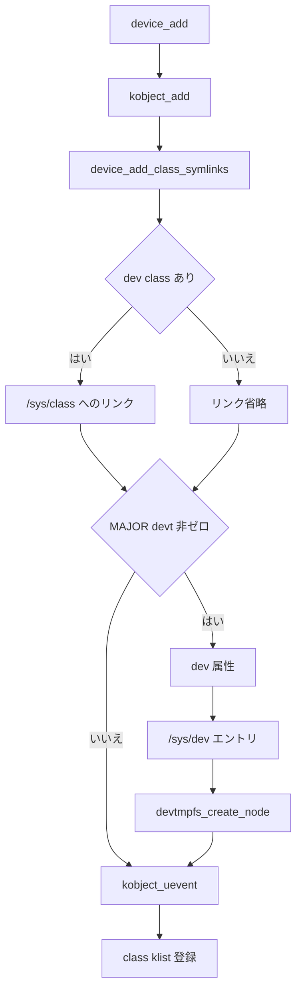

# 第5章 class とデバイスの提示、devtmpfs

> 本章で読むソース
>
> - [`include/linux/device/class.h` L50-L57](https://github.com/gregkh/linux/blob/v6.18.38/include/linux/device/class.h#L50-L57)
> - [`drivers/base/class.c` L178-L230](https://github.com/gregkh/linux/blob/v6.18.38/drivers/base/class.c#L178-L230)
> - [`drivers/base/class.c` L266-L289](https://github.com/gregkh/linux/blob/v6.18.38/drivers/base/class.c#L266-L289)
> - [`drivers/base/core.c` L3421-L3464](https://github.com/gregkh/linux/blob/v6.18.38/drivers/base/core.c#L3421-L3464)
> - [`drivers/base/core.c` L3509-L3521](https://github.com/gregkh/linux/blob/v6.18.38/drivers/base/core.c#L3509-L3521)
> - [`drivers/base/core.c` L3656-L3666](https://github.com/gregkh/linux/blob/v6.18.38/drivers/base/core.c#L3656-L3666)
> - [`drivers/base/core.c` L3720-L3732](https://github.com/gregkh/linux/blob/v6.18.38/drivers/base/core.c#L3720-L3732)
> - [`drivers/base/devtmpfs.c` L129-L154](https://github.com/gregkh/linux/blob/v6.18.38/drivers/base/devtmpfs.c#L129-L154)
> - [`drivers/base/devtmpfs.c` L218-L251](https://github.com/gregkh/linux/blob/v6.18.38/drivers/base/devtmpfs.c#L218-L251)
> - [`drivers/base/devtmpfs.c` L435-L444](https://github.com/gregkh/linux/blob/v6.18.38/drivers/base/devtmpfs.c#L435-L444)

## この章の狙い

**class** が接続方式ではなく機能でデバイスをまとめる上位ビューであることを固定する。
`device_add` が `devt` を持つデバイスに対して sysfs の `dev` 属性、`/sys/dev` エントリ、devtmpfs ノードをどう作るかを追う。
devtmpfs がドライバのバインドを担わずデバイスノード生成だけを行う点も明示する。

## 前提

[中核データ構造と所有構造](../part00-overview/02-core-data-structures-ownership.md) で `struct device` の `class` フィールドを知っていること。
[device の登録操作と削除規約](04-device-add-del.md) で `device_add` の登録ステップを読んでいること。

## class は bus の代替ではない

`struct class` の kerneldoc は、class が低レベルの接続詳細を隠して「何をするデバイスか」でまとめる層であると述べている。
SCSI ディスクも ATA ディスクも、class レベルでは同じディスクとして扱える。

[`include/linux/device/class.h` L50-L57](https://github.com/gregkh/linux/blob/v6.18.38/include/linux/device/class.h#L50-L57)

```c
struct class {
	const char		*name;

	const struct attribute_group	**class_groups;
	const struct attribute_group	**dev_groups;

	int (*dev_uevent)(const struct device *dev, struct kobj_uevent_env *env);
	char *(*devnode)(const struct device *dev, umode_t *mode);
```

**bus** が `match` と `probe` でドライバとの結合を担うのに対し、class は sysfs 上の機能別ビューと `devnode` 命名を提供する。
デバイスは `dev->bus` と `dev->class` を同時に持てるが、マッチと probe の実行主体は bus 側に残る。
「class を付ければドライバが自動で載る」という理解は誤りである。

## class_register と /sys/class

`class_register` は `subsys_private` を確保し、`class_kset` 配下に kset として登録する。
同時に `klist_devices` を初期化し、後から属するデバイスを走査できるようにする。

[`drivers/base/class.c` L178-L230](https://github.com/gregkh/linux/blob/v6.18.38/drivers/base/class.c#L178-L230)

```c
int class_register(const struct class *cls)
{
	struct subsys_private *cp;
	struct lock_class_key *key;
	int error;

	pr_debug("device class '%s': registering\n", cls->name);

	if (cls->ns_type && !cls->namespace) {
		pr_err("%s: class '%s' does not have namespace\n",
		       __func__, cls->name);
		return -EINVAL;
	}
	if (!cls->ns_type && cls->namespace) {
		pr_err("%s: class '%s' does not have ns_type\n",
		       __func__, cls->name);
		return -EINVAL;
	}

	cp = kzalloc(sizeof(*cp), GFP_KERNEL);
	if (!cp)
		return -ENOMEM;
	klist_init(&cp->klist_devices, klist_class_dev_get, klist_class_dev_put);
	INIT_LIST_HEAD(&cp->interfaces);
	kset_init(&cp->glue_dirs);
	key = &cp->lock_key;
	lockdep_register_key(key);
	__mutex_init(&cp->mutex, "subsys mutex", key);
	error = kobject_set_name(&cp->subsys.kobj, "%s", cls->name);
	if (error)
		goto err_out;

	cp->subsys.kobj.kset = class_kset;
	cp->subsys.kobj.ktype = &class_ktype;
	cp->class = cls;

	error = kset_register(&cp->subsys);
	if (error)
		goto err_out;

	error = sysfs_create_groups(&cp->subsys.kobj, cls->class_groups);
	if (error) {
		kobject_del(&cp->subsys.kobj);
		kfree_const(cp->subsys.kobj.name);
		goto err_out;
	}
	return 0;

err_out:
	lockdep_unregister_key(key);
	kfree(cp);
	return error;
}
```

登録に成功すると `/sys/class/<name>/` が現れ、class 固有の属性グループが載る。
`class_unregister` は属性を外して kset を登録解除し、`subsys_put` で `subsys_private` を解放する。

## class_create と動的 class

モジュールやサブシステムが動的に class を作るときは `class_create` を使う。
内部で `kzalloc` した `struct class` を `class_register` に渡し、失敗時は確保メモリを解放する。

[`drivers/base/class.c` L266-L289](https://github.com/gregkh/linux/blob/v6.18.38/drivers/base/class.c#L266-L289)

```c
struct class *class_create(const char *name)
{
	struct class *cls;
	int retval;

	cls = kzalloc(sizeof(*cls), GFP_KERNEL);
	if (!cls) {
		retval = -ENOMEM;
		goto error;
	}

	cls->name = name;
	cls->class_release = class_create_release;

	retval = class_register(cls);
	if (retval)
		goto error;

	return cls;

error:
	kfree(cls);
	return ERR_PTR(retval);
}
```

`class_destroy` は `class_unregister` を呼ぶだけである。
`device_create` で作るデバイスは、この class ポインタを `dev->class` に設定してから `device_add` へ渡す。

## device_add_class_symlinks が張るリンク

`device_add` は class 登録の早い段階で `device_add_class_symlinks` を呼ぶ。
デバイス側から class への `subsystem` リンク、親デバイスへの `device` リンク、class 側からデバイスへの逆リンクを作る。

[`drivers/base/core.c` L3421-L3464](https://github.com/gregkh/linux/blob/v6.18.38/drivers/base/core.c#L3421-L3464)

```c
static int device_add_class_symlinks(struct device *dev)
{
	struct device_node *of_node = dev_of_node(dev);
	struct subsys_private *sp;
	int error;

	if (of_node) {
		error = sysfs_create_link(&dev->kobj, of_node_kobj(of_node), "of_node");
		if (error)
			dev_warn(dev, "Error %d creating of_node link\n",error);
		/* An error here doesn't warrant bringing down the device */
	}

	sp = class_to_subsys(dev->class);
	if (!sp)
		return 0;

	error = sysfs_create_link(&dev->kobj, &sp->subsys.kobj, "subsystem");
	if (error)
		goto out_devnode;

	if (dev->parent && device_is_not_partition(dev)) {
		error = sysfs_create_link(&dev->kobj, &dev->parent->kobj,
					  "device");
		if (error)
			goto out_subsys;
	}

	/* link in the class directory pointing to the device */
	error = sysfs_create_link(&sp->subsys.kobj, &dev->kobj, dev_name(dev));
	if (error)
		goto out_device;
	goto exit;

out_device:
	sysfs_remove_link(&dev->kobj, "device");
out_subsys:
	sysfs_remove_link(&dev->kobj, "subsystem");
out_devnode:
	sysfs_remove_link(&dev->kobj, "of_node");
exit:
	subsys_put(sp);
	return error;
}
```

`dev->class` が NULL のときは即座に 0 を返し、リンクは作られない。
class が設定されていれば、`/sys/class/<name>/<devname>` からデバイスの sysfs ディレクトリへ直接辿れる。

## devt があるときの sysfs と devtmpfs

`MAJOR(dev->devt)` が非ゼロのとき、`device_add` は次の3つを連続して実行する。
`dev` 属性の作成、`/sys/dev` エントリの作成、devtmpfs ノードの作成である。

[`drivers/base/core.c` L3656-L3666](https://github.com/gregkh/linux/blob/v6.18.38/drivers/base/core.c#L3656-L3666)

```c
	if (MAJOR(dev->devt)) {
		error = device_create_file(dev, &dev_attr_dev);
		if (error)
			goto DevAttrError;

		error = device_create_sys_dev_entry(dev);
		if (error)
			goto SysEntryError;

		devtmpfs_create_node(dev);
	}
```

`dev_attr_dev` は `print_dev_t` で `devt` を文字列化して sysfs に出す。
`device_create_sys_dev_entry` はブロックかキャラクタかで `/sys/dev/block` か `/sys/dev/char` を選び、`major:minor` 名のリンクを張る。

[`drivers/base/core.c` L3509-L3521](https://github.com/gregkh/linux/blob/v6.18.38/drivers/base/core.c#L3509-L3521)

```c
static int device_create_sys_dev_entry(struct device *dev)
{
	struct kobject *kobj = device_to_dev_kobj(dev);
	int error = 0;
	char devt_str[15];

	if (kobj) {
		format_dev_t(devt_str, dev->devt);
		error = sysfs_create_link(kobj, &dev->kobj, devt_str);
	}

	return error;
}
```

`/sys/dev/char/8:0` のようなリンクからデバイス sysfs へ逆引きでき、udev は `devt` だけでデバイスを特定できる。

## class への klist 登録

`device_add` の末尾で、class が設定されていれば `klist_devices` にノードを追加する。
登録済みの `class_interface` にも `add_dev` コールバックが届く。

[`drivers/base/core.c` L3720-L3732](https://github.com/gregkh/linux/blob/v6.18.38/drivers/base/core.c#L3720-L3732)

```c
	sp = class_to_subsys(dev->class);
	if (sp) {
		mutex_lock(&sp->mutex);
		/* tie the class to the device */
		klist_add_tail(&dev->p->knode_class, &sp->klist_devices);

		/* notify any interfaces that the device is here */
		list_for_each_entry(class_intf, &sp->interfaces, node)
			if (class_intf->add_dev)
				class_intf->add_dev(dev);
		mutex_unlock(&sp->mutex);
		subsys_put(sp);
	}
```

klist は sysfs リンクとは別経路で、カーネル内の class 単位走査に使われる。

## devtmpfs と kdevtmpfs スレッド

`devtmpfs_create_node` は `device_get_devnode` でノードパスと権限を決め、要求を `kdevtmpfs` スレッドへ渡す。
スレッドが存在しない構成では何もせず 0 を返す。

[`drivers/base/devtmpfs.c` L129-L154](https://github.com/gregkh/linux/blob/v6.18.38/drivers/base/devtmpfs.c#L129-L154)

```c
int devtmpfs_create_node(struct device *dev)
{
	const char *tmp = NULL;
	struct req req;

	if (!thread)
		return 0;

	req.mode = 0;
	req.uid = GLOBAL_ROOT_UID;
	req.gid = GLOBAL_ROOT_GID;
	req.name = device_get_devnode(dev, &req.mode, &req.uid, &req.gid, &tmp);
	if (!req.name)
		return -ENOMEM;

	if (req.mode == 0)
		req.mode = 0600;
	if (is_blockdev(dev))
		req.mode |= S_IFBLK;
	else
		req.mode |= S_IFCHR;

	req.dev = dev;

	return devtmpfs_submit_req(&req, tmp);
}
```

スレッド側の `handle_create` は親ディレクトリが無ければ `create_path` で作り、`vfs_mknod` で `dev->devt` を持つ inode を生成する。
inode の `i_private` にスレッドポインタを置き、カーネル生成ノードであることを印付けする。

[`drivers/base/devtmpfs.c` L218-L251](https://github.com/gregkh/linux/blob/v6.18.38/drivers/base/devtmpfs.c#L218-L251)

```c
static int handle_create(const char *nodename, umode_t mode, kuid_t uid,
			 kgid_t gid, struct device *dev)
{
	struct dentry *dentry;
	struct path path;
	int err;

	dentry = start_creating_path(AT_FDCWD, nodename, &path, 0);
	if (dentry == ERR_PTR(-ENOENT)) {
		create_path(nodename);
		dentry = start_creating_path(AT_FDCWD, nodename, &path, 0);
	}
	if (IS_ERR(dentry))
		return PTR_ERR(dentry);

	err = vfs_mknod(&nop_mnt_idmap, d_inode(path.dentry), dentry, mode,
			dev->devt);
	if (!err) {
		struct iattr newattrs;

		newattrs.ia_mode = mode;
		newattrs.ia_uid = uid;
		newattrs.ia_gid = gid;
		newattrs.ia_valid = ATTR_MODE|ATTR_UID|ATTR_GID;
		inode_lock(d_inode(dentry));
		notify_change(&nop_mnt_idmap, dentry, &newattrs, NULL);
		inode_unlock(d_inode(dentry));

		/* mark as kernel-created inode */
		d_inode(dentry)->i_private = &thread;
	}
	end_creating_path(&path, dentry);
	return err;
}
```

`kdevtmpfs` は `devtmpfsd` カーネルスレッドとして起動し、専用マウント名前空間で devtmpfs をマウントしてから要求処理ループに入る。

[`drivers/base/devtmpfs.c` L435-L444](https://github.com/gregkh/linux/blob/v6.18.38/drivers/base/devtmpfs.c#L435-L444)

```c
static int __ref devtmpfsd(void *p)
{
	int err = devtmpfs_setup(p);

	complete(&setup_done);
	if (err)
		return err;
	devtmpfs_work_loop();
	return 0;
}
```

devtmpfs は VFS 上のノード作成だけを行い、`probe` やドライバのロードは一切呼ばない。
`devtmpfs_submit_req` は要求をキューへ積み completion を待つため、`devtmpfs_create_node` が成功を返したときは kdevtmpfs 側の作成が完了している。
`devt` を持つデバイスについて、devtmpfs が有効で `/dev` にマウントされた構成では、`/dev` 配下にノードを用意する。

## 処理の流れ

`device_add` が class 提示と devtmpfs 生成へ分岐する経路を次に示す。



`kobject_uevent` は第6章で扱う。
本章の問い「ユーザー空間へデバイスをどう提示するか」に対し、class は機能別 sysfs ビュー、devtmpfs は有効かつ `/dev` にマウントされた構成での `/dev` ノード提供という二つの答えを同時に与える。

## 高速化と最適化の工夫

devtmpfs が有効で `/dev` にマウントされる構成では、`kdevtmpfs` 経由で主要デバイスノードを自動生成する。
`devtmpfs_submit_req` が completion を待つため、ノード作成要求の戻り時点で VFS 上の inode が揃っている。
initramfs は udev のルール処理を待たずに `/dev/console` やルートデバイスを開け、ブートのクリティカルパスが短くなる。

class のシンボリックリンクは、既知の class 名とデバイス名から `/sys/class/<機能名>/` 配下へ直接辿れる。
接続トポロジ全体を再帰走査して機能別にデバイスを探す処理を省け、機能名で探索するユーザー空間のコストが下がる。

## まとめ

class は bus と独立した機能別ビューであり、マッチと probe は bus が担う。
`class_register` は `/sys/class` 配下に kset を公開し、`device_add_class_symlinks` が双方向リンクを張る。
`devt` を持つデバイスには `dev` 属性と `/sys/dev` リンクが作られ、devtmpfs が有効で `/dev` にマウントされた構成ではデバイスノードも作られる。
devtmpfs はノード生成専用であり、ドライババインドとは無関係である。

## 関連する章

- 前章：[device の登録操作と削除規約](04-device-add-del.md)
- 次章：[uevent と modalias によるモジュール自動ロード](06-uevent-modalias.md)
- class の `dev_uevent` と MODALIAS 生成は第6章で扱う
- kobject と sysfs の内部配送は [全体像と横断基盤](../../foundation/part04-infra/13-kobject-sysfs.md)
