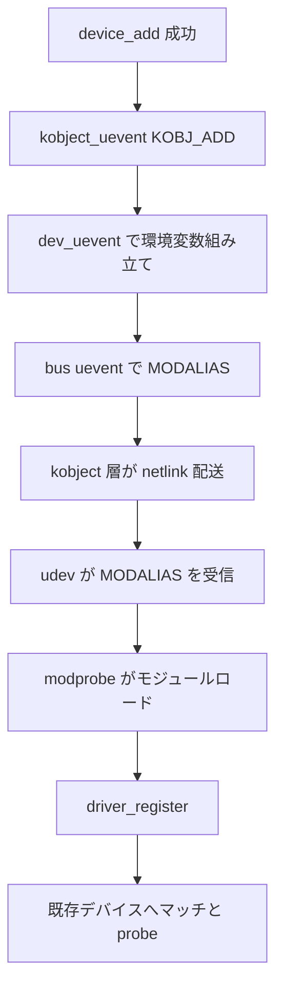

# 第6章 uevent と modalias によるモジュール自動ロード

> 本章で読むソース
>
> - [`drivers/base/core.c` L2600-L2612](https://github.com/gregkh/linux/blob/v6.18.38/drivers/base/core.c#L2600-L2612)
> - [`drivers/base/core.c` L2614-L2623](https://github.com/gregkh/linux/blob/v6.18.38/drivers/base/core.c#L2614-L2623)
> - [`drivers/base/core.c` L2654-L2718](https://github.com/gregkh/linux/blob/v6.18.38/drivers/base/core.c#L2654-L2718)
> - [`drivers/base/core.c` L2720-L2724](https://github.com/gregkh/linux/blob/v6.18.38/drivers/base/core.c#L2720-L2724)
> - [`drivers/base/core.c` L2726-L2767](https://github.com/gregkh/linux/blob/v6.18.38/drivers/base/core.c#L2726-L2767)
> - [`drivers/base/core.c` L2769-L2782](https://github.com/gregkh/linux/blob/v6.18.38/drivers/base/core.c#L2769-L2782)
> - [`drivers/base/platform.c` L1332-L1349](https://github.com/gregkh/linux/blob/v6.18.38/drivers/base/platform.c#L1332-L1349)
> - [`drivers/pci/pci-driver.c` L1566-L1596](https://github.com/gregkh/linux/blob/v6.18.38/drivers/pci/pci-driver.c#L1566-L1596)
> - [`drivers/pci/pci-sysfs.c` L310-L321](https://github.com/gregkh/linux/blob/v6.18.38/drivers/pci/pci-sysfs.c#L310-L321)

## この章の狙い

**uevent** が `kobject_uevent` 経由でユーザー空間へデバイス追加を通知する仕組みを、driver core が環境変数をどう組み立てるかに焦点を当てて追う。
**MODALIAS** がデバイス固有識別子を符号化した文字列であり、modprobe がモジュールを需要駆動でロードする鍵であることを示す。
uevent と MODALIAS が支えるドライバ後着と、登録済みドライバへのデバイス後着という二方向を対比する。

## 前提

[device の登録操作と削除規約](04-device-add-del.md) で `device_add` 末尾の `kobject_uevent` を知っていること。
[bus_type の登録とバスへの追加](03-bus-register.md) で `bus_type.uevent` コールバックの存在を知っていること。
[class とデバイスの提示、devtmpfs](05-class-devtmpfs.md) で `class.dev_uevent` の位置づけを知っていること。
kobject から netlink への配送本体は [全体像と横断基盤](../../foundation/part04-infra/13-kobject-sysfs.md) に委譲する。

## device 側の uevent フック

`devices_kset` は `device_uevent_ops` を通じて、デバイス用 kobject の uevent 生成を driver core に委ねる。
`filter` は bus または class を持つデバイスだけを対象にし、`name` は SUBSYSTEM 文字列の元になる。

[`drivers/base/core.c` L2600-L2612](https://github.com/gregkh/linux/blob/v6.18.38/drivers/base/core.c#L2600-L2612)

```c
static int dev_uevent_filter(const struct kobject *kobj)
{
	const struct kobj_type *ktype = get_ktype(kobj);

	if (ktype == &device_ktype) {
		const struct device *dev = kobj_to_dev(kobj);
		if (dev->bus)
			return 1;
		if (dev->class)
			return 1;
	}
	return 0;
}
```

[`drivers/base/core.c` L2614-L2623](https://github.com/gregkh/linux/blob/v6.18.38/drivers/base/core.c#L2614-L2623)

```c
static const char *dev_uevent_name(const struct kobject *kobj)
{
	const struct device *dev = kobj_to_dev(kobj);

	if (dev->bus)
		return dev->bus->name;
	if (dev->class)
		return dev->class->name;
	return NULL;
}
```

bus も class も無いデバイスは uevent 対象外となる。
SUBSYSTEM は bus 名が優先され、bus が無いときだけ class 名が使われる。

## dev_uevent が組み立てる環境変数

`dev_uevent` は `devt`、デバイスタイプ、バインド済みドライバ名を共通部分として積み、各層のフックへ委譲する。
`DEVPATH` や `ACTION` など kobject 共通の変数は、この関数の外側で付与される。

[`drivers/base/core.c` L2654-L2718](https://github.com/gregkh/linux/blob/v6.18.38/drivers/base/core.c#L2654-L2718)

```c
static int dev_uevent(const struct kobject *kobj, struct kobj_uevent_env *env)
{
	const struct device *dev = kobj_to_dev(kobj);
	int retval = 0;

	/* add device node properties if present */
	if (MAJOR(dev->devt)) {
		const char *tmp;
		const char *name;
		umode_t mode = 0;
		kuid_t uid = GLOBAL_ROOT_UID;
		kgid_t gid = GLOBAL_ROOT_GID;

		add_uevent_var(env, "MAJOR=%u", MAJOR(dev->devt));
		add_uevent_var(env, "MINOR=%u", MINOR(dev->devt));
		name = device_get_devnode(dev, &mode, &uid, &gid, &tmp);
		if (name) {
			add_uevent_var(env, "DEVNAME=%s", name);
			if (mode)
				add_uevent_var(env, "DEVMODE=%#o", mode & 0777);
			if (!uid_eq(uid, GLOBAL_ROOT_UID))
				add_uevent_var(env, "DEVUID=%u", from_kuid(&init_user_ns, uid));
			if (!gid_eq(gid, GLOBAL_ROOT_GID))
				add_uevent_var(env, "DEVGID=%u", from_kgid(&init_user_ns, gid));
			kfree(tmp);
		}
	}

	if (dev->type && dev->type->name)
		add_uevent_var(env, "DEVTYPE=%s", dev->type->name);

	/* Add "DRIVER=%s" variable if the device is bound to a driver */
	dev_driver_uevent(dev, env);

	/* Add common DT information about the device */
	of_device_uevent(dev, env);

	/* have the bus specific function add its stuff */
	if (dev->bus && dev->bus->uevent) {
		retval = dev->bus->uevent(dev, env);
		if (retval)
			pr_debug("device: '%s': %s: bus uevent() returned %d\n",
				 dev_name(dev), __func__, retval);
	}

	/* have the class specific function add its stuff */
	if (dev->class && dev->class->dev_uevent) {
		retval = dev->class->dev_uevent(dev, env);
		if (retval)
			pr_debug("device: '%s': %s: class uevent() "
				 "returned %d\n", dev_name(dev),
				 __func__, retval);
	}

	/* have the device type specific function add its stuff */
	if (dev->type && dev->type->uevent) {
		retval = dev->type->uevent(dev, env);
		if (retval)
			pr_debug("device: '%s': %s: dev_type uevent() "
				 "returned %d\n", dev_name(dev),
				 __func__, retval);
	}

	return retval;
}
```

呼び出し順は bus、class、`device_type` の順である。
**MODALIAS** は driver core が一律に生成する変数ではなく、bus、class、`device_type` などのサブシステム固有フックが必要に応じて追加する（DT では共通の `of_device_uevent` ではなく `of_device_uevent_modalias` が担い、`platform_uevent` から呼ばれる）。

[`drivers/base/core.c` L2720-L2724](https://github.com/gregkh/linux/blob/v6.18.38/drivers/base/core.c#L2720-L2724)

```c
static const struct kset_uevent_ops device_uevent_ops = {
	.filter =	dev_uevent_filter,
	.name =		dev_uevent_name,
	.uevent =	dev_uevent,
};
```

## バス固有の MODALIAS 生成

PCI バスの `pci_uevent` はベンダー、デバイス、サブシステム、クラスコードを文字列化し、`MODALIAS` を一括で付与する。

[`drivers/pci/pci-driver.c` L1566-L1596](https://github.com/gregkh/linux/blob/v6.18.38/drivers/pci/pci-driver.c#L1566-L1596)

```c
static int pci_uevent(const struct device *dev, struct kobj_uevent_env *env)
{
	const struct pci_dev *pdev;

	if (!dev)
		return -ENODEV;

	pdev = to_pci_dev(dev);

	if (add_uevent_var(env, "PCI_CLASS=%04X", pdev->class))
		return -ENOMEM;

	if (add_uevent_var(env, "PCI_ID=%04X:%04X", pdev->vendor, pdev->device))
		return -ENOMEM;

	if (add_uevent_var(env, "PCI_SUBSYS_ID=%04X:%04X", pdev->subsystem_vendor,
			   pdev->subsystem_device))
		return -ENOMEM;

	if (add_uevent_var(env, "PCI_SLOT_NAME=%s", pci_name(pdev)))
		return -ENOMEM;

	if (add_uevent_var(env, "MODALIAS=pci:v%08Xd%08Xsv%08Xsd%08Xbc%02Xsc%02Xi%02X",
			   pdev->vendor, pdev->device,
			   pdev->subsystem_vendor, pdev->subsystem_device,
			   (u8)(pdev->class >> 16), (u8)(pdev->class >> 8),
			   (u8)(pdev->class)))
		return -ENOMEM;

	return 0;
}
```

platform バスは Device Tree や ACPI の modalias を先に試し、無ければ `platform:<name>` 形式で付与する。

[`drivers/base/platform.c` L1332-L1349](https://github.com/gregkh/linux/blob/v6.18.38/drivers/base/platform.c#L1332-L1349)

```c
static int platform_uevent(const struct device *dev, struct kobj_uevent_env *env)
{
	const struct platform_device *pdev = to_platform_device(dev);
	int rc;

	/* Some devices have extra OF data and an OF-style MODALIAS */
	rc = of_device_uevent_modalias(dev, env);
	if (rc != -ENODEV)
		return rc;

	rc = acpi_device_uevent_modalias(dev, env);
	if (rc != -ENODEV)
		return rc;

	add_uevent_var(env, "MODALIAS=%s%s", PLATFORM_MODULE_PREFIX,
			pdev->name);
	return 0;
}
```

識別子の詳細はバス実装へ委譲されるため、driver core は汎用の `dev_uevent` だけを維持できる。

## modalias sysfs 属性

uevent と同じ識別子を、起動初期の coldplug や手動確認用に sysfs でも読めるようにする属性が `modalias` である。
PCI デバイスでは `modalias_show` が uevent と同型の文字列を返す。

[`drivers/pci/pci-sysfs.c` L310-L321](https://github.com/gregkh/linux/blob/v6.18.38/drivers/pci/pci-sysfs.c#L310-L321)

```c
static ssize_t modalias_show(struct device *dev, struct device_attribute *attr,
			     char *buf)
{
	struct pci_dev *pci_dev = to_pci_dev(dev);

	return sysfs_emit(buf, "pci:v%08Xd%08Xsv%08Xsd%08Xbc%02Xsc%02Xi%02X\n",
			  pci_dev->vendor, pci_dev->device,
			  pci_dev->subsystem_vendor, pci_dev->subsystem_device,
			  (u8)(pci_dev->class >> 16), (u8)(pci_dev->class >> 8),
			  (u8)(pci_dev->class));
}
```

`modprobe $(cat .../modalias)` は、uevent を取りこぼした環境で同じモジュールを後からロードするための保険である。

## /sys 上の uevent 属性

各デバイスの `uevent` 属性は、`dev_uevent` が組み立てるデバイス固有キーを読む入口と、合成 uevent を再送する入口の両方を持つ。
read が返すのは MAJOR、MINOR、DEVNAME、DEVTYPE、DRIVER、OF 情報、バス、class、`device_type` の各フックが足したキーであり、`ACTION` や `DEVPATH`、`SUBSYSTEM`、`SEQNUM` は含まれない。

[`drivers/base/core.c` L2726-L2767](https://github.com/gregkh/linux/blob/v6.18.38/drivers/base/core.c#L2726-L2767)

```c
static ssize_t uevent_show(struct device *dev, struct device_attribute *attr,
			   char *buf)
{
	struct kobject *top_kobj;
	struct kset *kset;
	struct kobj_uevent_env *env = NULL;
	int i;
	int len = 0;
	int retval;

	/* search the kset, the device belongs to */
	top_kobj = &dev->kobj;
	while (!top_kobj->kset && top_kobj->parent)
		top_kobj = top_kobj->parent;
	if (!top_kobj->kset)
		goto out;

	kset = top_kobj->kset;
	if (!kset->uevent_ops || !kset->uevent_ops->uevent)
		goto out;

	/* respect filter */
	if (kset->uevent_ops && kset->uevent_ops->filter)
		if (!kset->uevent_ops->filter(&dev->kobj))
			goto out;

	env = kzalloc(sizeof(struct kobj_uevent_env), GFP_KERNEL);
	if (!env)
		return -ENOMEM;

	/* let the kset specific function add its keys */
	retval = kset->uevent_ops->uevent(&dev->kobj, env);
	if (retval)
		goto out;

	/* copy keys to file */
	for (i = 0; i < env->envp_idx; i++)
		len += sysfs_emit_at(buf, len, "%s\n", env->envp[i]);
out:
	kfree(env);
	return len;
}
```

書き込み側は `kobject_synth_uevent` に委譲し、有効な action 名を指定して synthetic uevent を送れる。
未知の action 名は `kobject_action_type` の照合で拒否される。

[`drivers/base/core.c` L2769-L2782](https://github.com/gregkh/linux/blob/v6.18.38/drivers/base/core.c#L2769-L2782)

```c
static ssize_t uevent_store(struct device *dev, struct device_attribute *attr,
			    const char *buf, size_t count)
{
	int rc;

	rc = kobject_synth_uevent(&dev->kobj, buf, count);

	if (rc) {
		dev_err(dev, "uevent: failed to send synthetic uevent: %d\n", rc);
		return rc;
	}

	return count;
}
```

読み取りはデバッグと検証に使われる。
書き込みはカーネルが synthetic uevent を生成する入口であり、ルール再適用や手動ホットプラグ再現はユーザー空間の運用次第である。

## 処理の流れ

デバイス追加からモジュールロード、既存デバイスへのマッチまでを次に示す。



**ドライバ後着**は、先にデバイスが sysfs に現れ、uevent の MODALIAS が modprobe 経由でモジュールをロードさせ、続く `driver_register` → `driver_attach` → `bus_for_each_dev` が既存デバイスへマッチと probe を試す経路である。
**デバイス後着**は、登録済みドライバがある状態で新デバイスが `device_add` され、`bus_probe_device` → `device_initial_probe` がバス上の既存ドライバを走査する経路である。
MODALIAS は前者の需要側トリガであり、後者は `device_add` そのものがトリガになる。

## 高速化と最適化の工夫

MODALIAS によりカーネルは全ドライバを常駐させず、デバイス出現に応じたモジュールだけをロードできる。
メモリ使用量と起動時間の両方が、需要駆動ロードで抑えられる。

識別子生成を `bus_type.uevent` と `class.dev_uevent` に分散させる設計は、driver core の `dev_uevent` を固定サイズのまま保つ。
新しいバスを足すときはバスファイルだけを変更すればよく、core.c への巨大な分岐追加を避けられる。

## まとめ

uevent は `device_uevent_ops` 経由で `dev_uevent` を呼び、共通変数のあと bus、class、`device_type` の順で拡張する。
MODALIAS は各サブシステムのフックが必要に応じて足す識別子文字列であり、udev と modprobe がモジュール自動ロードに使う。
`uevent` 属性の read は `dev_uevent` が組み立てたデバイス固有キーの表示、write は有効な action 名による synthetic uevent 送信である。
MODALIAS 経路がドライバ後着を、`bus_probe_device` 経路がデバイス後着を支え、遅延ロード可能なカーネル構成を成す。

## 関連する章

- 前章：[class とデバイスの提示、devtmpfs](05-class-devtmpfs.md)
- 次章：[デバイスプロパティと fwnode / software node](../part02-enumeration/07-device-property-fwnode.md)
- マッチと probe の中身：[ドライバ登録と二方向マッチと async probe](../part03-probe/10-driver-match-async-probe.md)
- kobject から netlink への配送：[全体像と横断基盤](../../foundation/part04-infra/13-kobject-sysfs.md)
