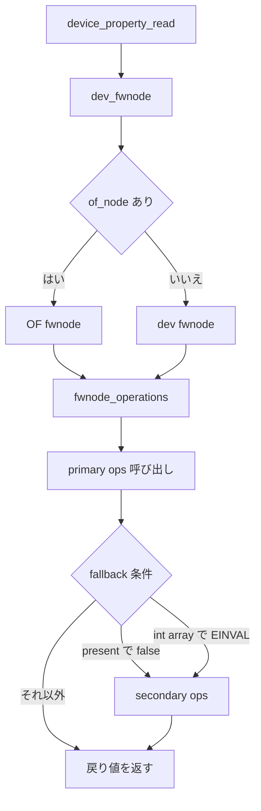

# 第7章 デバイスプロパティと fwnode / software node

> 本章で読むソース
>
> - [`drivers/base/property.c` L21-L25](https://github.com/gregkh/linux/blob/v6.18.38/drivers/base/property.c#L21-L25)
> - [`drivers/base/property.c` L44-L47](https://github.com/gregkh/linux/blob/v6.18.38/drivers/base/property.c#L44-L47)
> - [`drivers/base/property.c` L57-L70](https://github.com/gregkh/linux/blob/v6.18.38/drivers/base/property.c#L57-L70)
> - [`drivers/base/property.c` L188-L192](https://github.com/gregkh/linux/blob/v6.18.38/drivers/base/property.c#L188-L192)
> - [`drivers/base/property.c` L295-L312](https://github.com/gregkh/linux/blob/v6.18.38/drivers/base/property.c#L295-L312)
> - [`include/linux/fwnode.h` L53-L62](https://github.com/gregkh/linux/blob/v6.18.38/include/linux/fwnode.h#L53-L62)
> - [`include/linux/fwnode.h` L140-L156](https://github.com/gregkh/linux/blob/v6.18.38/include/linux/fwnode.h#L140-L156)
> - [`drivers/base/swnode.c` L50-L63](https://github.com/gregkh/linux/blob/v6.18.38/drivers/base/swnode.c#L50-L63)
> - [`drivers/base/swnode.c` L676-L693](https://github.com/gregkh/linux/blob/v6.18.38/drivers/base/swnode.c#L676-L693)
> - [`drivers/base/swnode.c` L899-L910](https://github.com/gregkh/linux/blob/v6.18.38/drivers/base/swnode.c#L899-L910)
> - [`drivers/base/core.c` L5162-L5190](https://github.com/gregkh/linux/blob/v6.18.38/drivers/base/core.c#L5162-L5190)
> - [`drivers/base/core.c` L5202-L5211](https://github.com/gregkh/linux/blob/v6.18.38/drivers/base/core.c#L5202-L5211)
> - [`drivers/base/core.c` L5291-L5295](https://github.com/gregkh/linux/blob/v6.18.38/drivers/base/core.c#L5291-L5295)

## この章の狙い

**device property** が Device Tree、ACPI、software node などのファームウェア記述から、ドライバがハードウェア構成値を取り出す統一 API であることを固定する。
`device_property_*` が `dev_fwnode` と `fwnode_operations` を経て各実装へ落ちる構造を追う。
primary と secondary の fallback 規則、software node の位置づけも本章で押さえる。

## 前提

[中核データ構造と所有構造](../part00-overview/02-core-data-structures-ownership.md) で `struct device` の `of_node` と `fwnode` フィールドを知っていること。
[device の登録操作と削除規約](../part01-registration/04-device-add-del.md) で `device_add` がデバイスを sysfs へ載せる流れを読んでいること。

## dev_fwnode と device_property の委譲

`device_property_*` は入口で `dev_fwnode(dev)` を取り、対応する `fwnode_property_*` へ委譲する。
`__dev_fwnode` は `CONFIG_OF` が有効で `dev->of_node` があればその OF fwnode を優先し、なければ `dev->fwnode` を返す。

[`drivers/base/property.c` L21-L25](https://github.com/gregkh/linux/blob/v6.18.38/drivers/base/property.c#L21-L25)

```c
struct fwnode_handle *__dev_fwnode(struct device *dev)
{
	return IS_ENABLED(CONFIG_OF) && dev->of_node ?
		of_fwnode_handle(dev->of_node) : dev->fwnode;
}
```

`device_property_present` は一行のラッパーである。

[`drivers/base/property.c` L44-L47](https://github.com/gregkh/linux/blob/v6.18.38/drivers/base/property.c#L44-L47)

```c
bool device_property_present(const struct device *dev, const char *propname)
{
	return fwnode_property_present(dev_fwnode(dev), propname);
}
```

整数配列の読み出しも同じ形で `fwnode_property_read_u32_array` へ落ちる。

[`drivers/base/property.c` L188-L192](https://github.com/gregkh/linux/blob/v6.18.38/drivers/base/property.c#L188-L192)

```c
int device_property_read_u32_array(const struct device *dev, const char *propname,
				   u32 *val, size_t nval)
{
	return fwnode_property_read_u32_array(dev_fwnode(dev), propname, val, nval);
}
```

ドライバは DT 専用の `of_property_read_*` と ACPI 専用 API を直接呼ばず、この層を通せる。

## fwnode_handle と fwnode_operations

**fwnode** はファームウェアノードの抽象化である。
DT の `device_node`、ACPI の `acpi_device` fwnode、software node はいずれも `fwnode_operations` を実装する。

[`include/linux/fwnode.h` L53-L62](https://github.com/gregkh/linux/blob/v6.18.38/include/linux/fwnode.h#L53-L62)

```c
struct fwnode_handle {
	struct fwnode_handle *secondary;
	const struct fwnode_operations *ops;

	/* The below is used solely by device links, don't use otherwise */
	struct device *dev;
	struct list_head suppliers;
	struct list_head consumers;
	unsigned long flags;
};
```

`secondary` は primary に無い property を補う fallback 先を指す。
`ops` がプロパティ読み出しや子ノード走査の実装を束ねる。

[`include/linux/fwnode.h` L140-L156](https://github.com/gregkh/linux/blob/v6.18.38/include/linux/fwnode.h#L140-L156)

```c
struct fwnode_operations {
	struct fwnode_handle *(*get)(struct fwnode_handle *fwnode);
	void (*put)(struct fwnode_handle *fwnode);
	bool (*device_is_available)(const struct fwnode_handle *fwnode);
	const void *(*device_get_match_data)(const struct fwnode_handle *fwnode,
					     const struct device *dev);
	bool (*device_dma_supported)(const struct fwnode_handle *fwnode);
	enum dev_dma_attr
	(*device_get_dma_attr)(const struct fwnode_handle *fwnode);
	bool (*property_present)(const struct fwnode_handle *fwnode,
				 const char *propname);
	bool (*property_read_bool)(const struct fwnode_handle *fwnode,
				   const char *propname);
	int (*property_read_int_array)(const struct fwnode_handle *fwnode,
				       const char *propname,
				       unsigned int elem_size, void *val,
				       size_t nval);
```

`fwnode_call_bool_op` と `fwnode_call_int_op` が `ops` の有無を確認してから間接呼び出しする。

## primary と secondary の fallback 規則

fallback は一般的な property マージではない。
primary に無いキーを secondary から補うだけであり、primary の値を上書きしない。

`fwnode_property_present` は primary の `property_present` が false のときだけ secondary を試す。

[`drivers/base/property.c` L57-L70](https://github.com/gregkh/linux/blob/v6.18.38/drivers/base/property.c#L57-L70)

```c
bool fwnode_property_present(const struct fwnode_handle *fwnode,
			     const char *propname)
{
	bool ret;

	if (IS_ERR_OR_NULL(fwnode))
		return false;

	ret = fwnode_call_bool_op(fwnode, property_present, propname);
	if (ret)
		return ret;

	return fwnode_call_bool_op(fwnode->secondary, property_present, propname);
}
```

boolean read も同様に primary が false のとき secondary を試す。
整数配列 read は primary が `-EINVAL` を返したときだけ secondary へ進む。
`-ENODATA`、`-EPROTO`、`-EOVERFLOW` など別のエラーはそのまま返す。

[`drivers/base/property.c` L295-L312](https://github.com/gregkh/linux/blob/v6.18.38/drivers/base/property.c#L295-L312)

```c
static int fwnode_property_read_int_array(const struct fwnode_handle *fwnode,
					  const char *propname,
					  unsigned int elem_size, void *val,
					  size_t nval)
{
	int ret;

	if (IS_ERR_OR_NULL(fwnode))
		return -EINVAL;

	ret = fwnode_call_int_op(fwnode, property_read_int_array, propname,
				 elem_size, val, nval);
	if (ret != -EINVAL)
		return ret;

	return fwnode_call_int_op(fwnode->secondary, property_read_int_array, propname,
				  elem_size, val, nval);
}
```

文字列配列 read も `ret != -EINVAL` のときは secondary を試さない。
ACPI を primary、software node を secondary に置けば、ACPI に無い補助 property だけ software node から読める。

## set_primary_fwnode と set_secondary_fwnode

`set_secondary_fwnode` は secondary 自身の `secondary` を `ERR_PTR(-ENODEV)` にして末尾を表す。
primary があれば `primary->secondary` を更新し、なければ secondary を `dev->fwnode` へ直接置く。

[`drivers/base/core.c` L5202-L5211](https://github.com/gregkh/linux/blob/v6.18.38/drivers/base/core.c#L5202-L5211)

```c
void set_secondary_fwnode(struct device *dev, struct fwnode_handle *fwnode)
{
	if (fwnode)
		fwnode->secondary = ERR_PTR(-ENODEV);

	if (fwnode_is_primary(dev->fwnode))
		dev->fwnode->secondary = fwnode;
	else
		dev->fwnode = fwnode;
}
```

`set_primary_fwnode` は既存 secondary を保存したまま primary を差し替える。
primary を外すときは secondary を `dev->fwnode` へ繰り上げる。
親と primary fwnode を共有する場合は secondary pointer を消さない例外がある。

[`drivers/base/core.c` L5162-L5190](https://github.com/gregkh/linux/blob/v6.18.38/drivers/base/core.c#L5162-L5190)

```c
void set_primary_fwnode(struct device *dev, struct fwnode_handle *fwnode)
{
	struct device *parent = dev->parent;
	struct fwnode_handle *fn = dev->fwnode;

	if (fwnode) {
		if (fwnode_is_primary(fn))
			fn = fn->secondary;

		if (fn) {
			WARN_ON(fwnode->secondary);
			fwnode->secondary = fn;
		}
		dev->fwnode = fwnode;
	} else {
		if (fwnode_is_primary(fn)) {
			dev->fwnode = fn->secondary;

			/* Skip nullifying fn->secondary if the primary is shared */
			if (parent && fn == parent->fwnode)
				return;

			/* Set fn->secondary = NULL, so fn remains the primary fwnode */
			fn->secondary = NULL;
		} else {
			dev->fwnode = NULL;
		}
	}
}
```

`device_set_node` は primary と secondary の調整をせず、`dev->fwnode` と `dev->of_node` を直接設定する単純な helper である。

[`drivers/base/core.c` L5291-L5295](https://github.com/gregkh/linux/blob/v6.18.38/drivers/base/core.c#L5291-L5295)

```c
void device_set_node(struct device *dev, struct fwnode_handle *fwnode)
{
	dev->fwnode = fwnode;
	dev->of_node = to_of_node(fwnode);
}
```

## software node

software node は `software_node_ops` を持つ fwnode 実装である。
`property_entry` 配列と親子階層で、ファームウェアに無い値の補完だけでなく、対応物のない純粋なソフトウェア記述を primary 相当として使える。

[`drivers/base/swnode.c` L50-L63](https://github.com/gregkh/linux/blob/v6.18.38/drivers/base/swnode.c#L50-L63)

```c
bool is_software_node(const struct fwnode_handle *fwnode)
{
	return !IS_ERR_OR_NULL(fwnode) && fwnode->ops == &software_node_ops;
}
EXPORT_SYMBOL_GPL(is_software_node);

#define to_swnode(__fwnode)						\
	({								\
		typeof(__fwnode) __to_swnode_fwnode = __fwnode;		\
									\
		is_software_node(__to_swnode_fwnode) ?			\
			container_of(__to_swnode_fwnode,		\
				     struct swnode, fwnode) : NULL;	\
	})
```

[`drivers/base/swnode.c` L676-L693](https://github.com/gregkh/linux/blob/v6.18.38/drivers/base/swnode.c#L676-L693)

```c
static const struct fwnode_operations software_node_ops = {
	.get = software_node_get,
	.put = software_node_put,
	.property_present = software_node_property_present,
	.property_read_bool = software_node_property_present,
	.property_read_int_array = software_node_read_int_array,
	.property_read_string_array = software_node_read_string_array,
	.get_name = software_node_get_name,
	.get_name_prefix = software_node_get_name_prefix,
	.get_parent = software_node_get_parent,
	.get_next_child_node = software_node_get_next_child,
	.get_named_child_node = software_node_get_named_child_node,
	.get_reference_args = software_node_get_reference_args,
	.graph_get_next_endpoint = software_node_graph_get_next_endpoint,
	.graph_get_remote_endpoint = software_node_graph_get_remote_endpoint,
	.graph_get_port_parent = software_node_graph_get_port_parent,
	.graph_parse_endpoint = software_node_graph_parse_endpoint,
};
```

`software_node_register` は静的ノードを kset に登録する。
親が指定されていれば、登録済みの親 swnode が存在することを確認する。

[`drivers/base/swnode.c` L899-L910](https://github.com/gregkh/linux/blob/v6.18.38/drivers/base/swnode.c#L899-L910)

```c
int software_node_register(const struct software_node *node)
{
	struct swnode *parent = software_node_to_swnode(node->parent);

	if (software_node_to_swnode(node))
		return -EEXIST;

	if (node->parent && !parent)
		return -EINVAL;

	return PTR_ERR_OR_ZERO(swnode_register(node, parent, 0));
}
```

## 処理の流れ

property 読み出しが fwnode 実装へ分岐し、secondary で補完する経路を次に示す。



## 高速化と最適化の工夫

`fwnode_operations` による ops 抽象化は、コード共有と変更容易性の機構である。
ドライバは DT か ACPI かを意識せず `device_property_*` だけで構成値を読める。
各ドライバ内の DT と ACPI 分岐が減り、新しいファームウェア表現を ops 実装として足すだけで既存ドライバを活かせる。

実行時には、primary が成功したときや `-EINVAL` 以外のエラーを返したとき、secondary への間接呼び出しを行わない。
`fwnode_property_read_int_array` は primary の戻り値が `-EINVAL` のときだけ `fwnode->secondary` を試す。
`-ENODATA` や `-EPROTO` など別コードでは secondary を呼ばず、その場で返す。
present と boolean も primary が true のとき secondary を試さない。
fallback 先への余分な問い合わせを省き、hot path で secondary ops のコストを避ける。

## まとめ

`device_property_*` は `dev_fwnode` を経て `fwnode_property_*` に委譲し、`fwnode_operations` が実装差を吸収する。
present と boolean は primary が false のとき secondary を試し、整数配列と文字列配列は primary が `-EINVAL` のときだけ secondary を試す。
`set_primary_fwnode` と `set_secondary_fwnode` が primary と secondary の鎖を組み立て、`device_set_node` は OF ノードを直接結び付ける。
software node は独自の ops と property_entry で、補完用 secondary から純粋な primary 記述まで担える。

## 関連する章

- 前章：[uevent と modalias によるモジュール自動ロード](../part01-registration/06-uevent-modalias.md)
- 次章：[Device Tree からの platform device 列挙](08-device-tree-platform.md)
- DT 側の `of_fwnode_ops` は第8章で扱う
- ACPI 側の fwnode は第9章で扱う
- device links による supplier 依存は [device links と fw_devlink](../part04-links-devres-unbind/14-device-links-fw-devlink.md)
