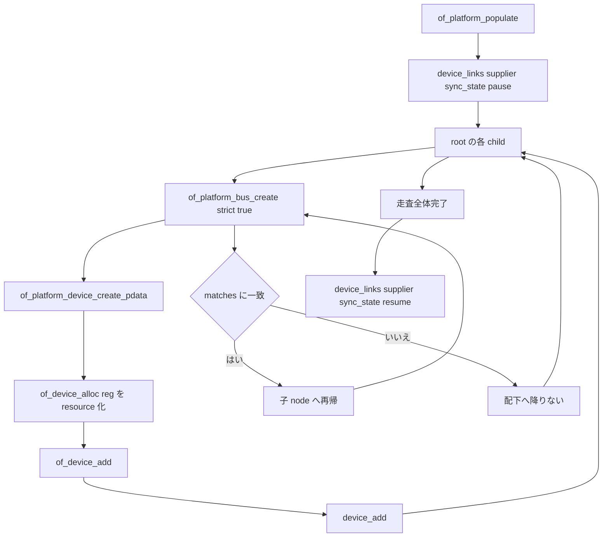

# 第8章 Device Tree からの platform device 列挙

> 本章で読むソース
>
> - [`drivers/of/platform.c` L45-L62](https://github.com/gregkh/linux/blob/v6.18.38/drivers/of/platform.c#L45-L62)
> - [`drivers/of/platform.c` L97-L138](https://github.com/gregkh/linux/blob/v6.18.38/drivers/of/platform.c#L97-L138)
> - [`drivers/of/platform.c` L151-L186](https://github.com/gregkh/linux/blob/v6.18.38/drivers/of/platform.c#L151-L186)
> - [`drivers/of/platform.c` L325-L382](https://github.com/gregkh/linux/blob/v6.18.38/drivers/of/platform.c#L325-L382)
> - [`drivers/of/platform.c` L444-L470](https://github.com/gregkh/linux/blob/v6.18.38/drivers/of/platform.c#L444-L470)
> - [`drivers/of/platform.c` L473-L488](https://github.com/gregkh/linux/blob/v6.18.38/drivers/of/platform.c#L473-L488)
> - [`drivers/of/property.c` L1620-L1644](https://github.com/gregkh/linux/blob/v6.18.38/drivers/of/property.c#L1620-L1644)

## この章の狙い

**Device Tree** がハードウェア構成を記述したツリーであり、列挙時に **platform device** へ変換される入口を追う。
`of_device_alloc` が `reg` を resource 化する範囲、`of_device_add` 経由の登録、`of_platform_populate` の選択的再帰を正確に押さえる。
生成された platform device が第13章の platform バスへ載る接続点も示す。

## 前提

[デバイスプロパティと fwnode / software node](07-device-property-fwnode.md) で `device_set_node` と `of_fwnode_ops` の位置づけを知っていること。
[device の登録操作と削除規約](../part01-registration/04-device-add-del.md) で `device_add` の流れを読んでいること。

## of_device_alloc と resource 組み立て

`of_device_alloc` は `device_node` から `platform_device` を確保する。
数えるのは `of_address_count` による I/O address resource だけである。
各 `reg` を `of_address_to_resource` で `struct resource` へ変換し、`kcalloc` で確保した配列に格納する。

IRQ はこの resource 配列へ事前格納されない。
`platform_get_irq` などが fwnode 経由で必要時に解決する。

[`drivers/of/platform.c` L97-L138](https://github.com/gregkh/linux/blob/v6.18.38/drivers/of/platform.c#L97-L138)

```c
struct platform_device *of_device_alloc(struct device_node *np,
				  const char *bus_id,
				  struct device *parent)
{
	struct platform_device *dev;
	int rc, i, num_reg = 0;
	struct resource *res;

	dev = platform_device_alloc("", PLATFORM_DEVID_NONE);
	if (!dev)
		return NULL;

	/* count the io resources */
	num_reg = of_address_count(np);

	/* Populate the resource table */
	if (num_reg) {
		res = kcalloc(num_reg, sizeof(*res), GFP_KERNEL);
		if (!res) {
			platform_device_put(dev);
			return NULL;
		}

		dev->num_resources = num_reg;
		dev->resource = res;
		for (i = 0; i < num_reg; i++, res++) {
			rc = of_address_to_resource(np, i, res);
			WARN_ON(rc);
		}
	}

	/* setup generic device info */
	device_set_node(&dev->dev, of_fwnode_handle(of_node_get(np)));
	dev->dev.parent = parent ? : &platform_bus;

	if (bus_id)
		dev_set_name(&dev->dev, "%s", bus_id);
	else
		of_device_make_bus_id(&dev->dev);

	return dev;
}
```

`device_set_node` により `dev->fwnode` と `dev->of_node` が同時に結び付く。
`of_node_get` で参照を取り、第7章の `dev_fwnode` が OF fwnode を優先できる。

## of_device_add 経由の登録

`of_platform_device_create_pdata` は `available` と `OF_POPULATED` を確認したあと `of_device_alloc` を呼ぶ。
DMA mask、`platform_bus_type`、`platform_data`、MSI 設定の後、`of_device_add` を呼ぶ。
通常の `platform_device_add` はこの経路では使われない。

[`drivers/of/platform.c` L151-L186](https://github.com/gregkh/linux/blob/v6.18.38/drivers/of/platform.c#L151-L186)

```c
static struct platform_device *of_platform_device_create_pdata(
					struct device_node *np,
					const char *bus_id,
					void *platform_data,
					struct device *parent)
{
	struct platform_device *dev;

	pr_debug("create platform device: %pOF\n", np);

	if (!of_device_is_available(np) ||
	    of_node_test_and_set_flag(np, OF_POPULATED))
		return NULL;

	dev = of_device_alloc(np, bus_id, parent);
	if (!dev)
		goto err_clear_flag;

	dev->dev.coherent_dma_mask = DMA_BIT_MASK(32);
	if (!dev->dev.dma_mask)
		dev->dev.dma_mask = &dev->dev.coherent_dma_mask;
	dev->dev.bus = &platform_bus_type;
	dev->dev.platform_data = platform_data;
	of_msi_configure(&dev->dev, dev->dev.of_node);

	if (of_device_add(dev) != 0) {
		platform_device_put(dev);
		goto err_clear_flag;
	}

	return dev;

err_clear_flag:
	of_node_clear_flag(np, OF_POPULATED);
	return NULL;
}
```

`of_device_add` は `name` と `id` を設定し、NUMA node を割り当ててから `device_add` へ進む。

[`drivers/of/platform.c` L45-L62](https://github.com/gregkh/linux/blob/v6.18.38/drivers/of/platform.c#L45-L62)

```c
int of_device_add(struct platform_device *ofdev)
{
	BUG_ON(ofdev->dev.of_node == NULL);

	/* name and id have to be set so that the platform bus doesn't get
	 * confused on matching */
	ofdev->name = dev_name(&ofdev->dev);
	ofdev->id = PLATFORM_DEVID_NONE;

	/*
	 * If this device has not binding numa node in devicetree, that is
	 * of_node_to_nid returns NUMA_NO_NODE. device_add will assume that this
	 * device is on the same node as the parent.
	 */
	set_dev_node(&ofdev->dev, of_node_to_nid(ofdev->dev.of_node));

	return device_add(&ofdev->dev);
}
```

`device_add` 成功後は第6章の uevent と第10章の `bus_probe_device` へ合流する。

## of_platform_bus_create の再帰条件

`of_platform_bus_create` は対象 node を platform device または AMBA device として作る。
`strict` が真なら `compatible` が無い child は飛ばす。
skip table と `OF_POPULATED_BUS` も検査する。

作った node が `matches` に一致する場合だけ子へ再帰する。
一致しなければ device は作っても配下へ降りない。
`matches` が NULL なら `of_match_node` は一致しないため、root 直下の device は作るが再帰しない。

[`drivers/of/platform.c` L325-L382](https://github.com/gregkh/linux/blob/v6.18.38/drivers/of/platform.c#L325-L382)

```c
static int of_platform_bus_create(struct device_node *bus,
				  const struct of_device_id *matches,
				  const struct of_dev_auxdata *lookup,
				  struct device *parent, bool strict)
{
	const struct of_dev_auxdata *auxdata;
	struct platform_device *dev;
	const char *bus_id = NULL;
	void *platform_data = NULL;
	int rc = 0;

	/* Make sure it has a compatible property */
	if (strict && (!of_property_present(bus, "compatible"))) {
		pr_debug("%s() - skipping %pOF, no compatible prop\n",
			 __func__, bus);
		return 0;
	}

	/* Skip nodes for which we don't want to create devices */
	if (unlikely(of_match_node(of_skipped_node_table, bus))) {
		pr_debug("%s() - skipping %pOF node\n", __func__, bus);
		return 0;
	}

	if (of_node_check_flag(bus, OF_POPULATED_BUS)) {
		pr_debug("%s() - skipping %pOF, already populated\n",
			__func__, bus);
		return 0;
	}

	auxdata = of_dev_lookup(lookup, bus);
	if (auxdata) {
		bus_id = auxdata->name;
		platform_data = auxdata->platform_data;
	}

	if (of_device_is_compatible(bus, "arm,primecell")) {
		/*
		 * Don't return an error here to keep compatibility with older
		 * device tree files.
		 */
		of_amba_device_create(bus, bus_id, platform_data, parent);
		return 0;
	}

	dev = of_platform_device_create_pdata(bus, bus_id, platform_data, parent);
	if (!dev || !of_match_node(matches, bus))
		return 0;

	for_each_child_of_node_scoped(bus, child) {
		pr_debug("   create child: %pOF\n", child);
		rc = of_platform_bus_create(child, matches, lookup, &dev->dev, strict);
		if (rc)
			break;
	}
	of_node_set_flag(bus, OF_POPULATED_BUS);
	return rc;
}
```

`of_platform_default_populate` は `simple-bus` など既定の bus match table を渡す。
バス node を境界にした選択的再帰であり、全 compatible node を無条件に platform 化するわけではない。

[`drivers/of/platform.c` L473-L488](https://github.com/gregkh/linux/blob/v6.18.38/drivers/of/platform.c#L473-L488)

```c
int of_platform_default_populate(struct device_node *root,
				 const struct of_dev_auxdata *lookup,
				 struct device *parent)
{
	static const struct of_device_id match_table[] = {
		{ .compatible = "simple-bus", },
		{ .compatible = "simple-mfd", },
		{ .compatible = "isa", },
#ifdef CONFIG_ARM_AMBA
		{ .compatible = "arm,amba-bus", },
#endif /* CONFIG_ARM_AMBA */
		{} /* Empty terminated list */
	};

	return of_platform_populate(root, match_table, lookup, parent);
}
```

## of_platform_populate の入口

`of_platform_populate` は root 自身を platform device にせず、root の各 child から `of_platform_bus_create` を呼ぶ。
処理全体を `device_links_supplier_sync_state_pause` と `resume` で囲み、列挙途中の早すぎる sync_state を防ぐ（第14章）。

[`drivers/of/platform.c` L444-L470](https://github.com/gregkh/linux/blob/v6.18.38/drivers/of/platform.c#L444-L470)

```c
int of_platform_populate(struct device_node *root,
			const struct of_device_id *matches,
			const struct of_dev_auxdata *lookup,
			struct device *parent)
{
	int rc = 0;

	root = root ? of_node_get(root) : of_find_node_by_path("/");
	if (!root)
		return -EINVAL;

	pr_debug("%s()\n", __func__);
	pr_debug(" starting at: %pOF\n", root);

	device_links_supplier_sync_state_pause();
	for_each_child_of_node_scoped(root, child) {
		rc = of_platform_bus_create(child, matches, lookup, parent, true);
		if (rc)
			break;
	}
	device_links_supplier_sync_state_resume();

	of_node_set_flag(root, OF_POPULATED_BUS);

	of_node_put(root);
	return rc;
}
```

## of_fwnode_ops と第7章への接続

DT ノードは `of_fwnode_ops` で第7章の fwnode 抽象を満たす。
`compatible` は `fwnode_device_is_compatible` 経由で platform_driver のマッチに使われる（第13章）。

[`drivers/of/property.c` L1620-L1644](https://github.com/gregkh/linux/blob/v6.18.38/drivers/of/property.c#L1620-L1644)

```c
const struct fwnode_operations of_fwnode_ops = {
	.get = of_fwnode_get,
	.put = of_fwnode_put,
	.device_is_available = of_fwnode_device_is_available,
	.device_get_match_data = of_fwnode_device_get_match_data,
	.device_dma_supported = of_fwnode_device_dma_supported,
	.device_get_dma_attr = of_fwnode_device_get_dma_attr,
	.property_present = of_fwnode_property_present,
	.property_read_bool = of_fwnode_property_read_bool,
	.property_read_int_array = of_fwnode_property_read_int_array,
	.property_read_string_array = of_fwnode_property_read_string_array,
	.get_name = of_fwnode_get_name,
	.get_name_prefix = of_fwnode_get_name_prefix,
	.get_parent = of_fwnode_get_parent,
	.get_next_child_node = of_fwnode_get_next_child_node,
	.get_named_child_node = of_fwnode_get_named_child_node,
	.get_reference_args = of_fwnode_get_reference_args,
	.graph_get_next_endpoint = of_fwnode_graph_get_next_endpoint,
	.graph_get_remote_endpoint = of_fwnode_graph_get_remote_endpoint,
	.graph_get_port_parent = of_fwnode_graph_get_port_parent,
	.graph_parse_endpoint = of_fwnode_graph_parse_endpoint,
	.iomap = of_fwnode_iomap,
	.irq_get = of_fwnode_irq_get,
	.add_links = of_fwnode_add_links,
};
```

## 処理の流れ

`of_platform_populate` から `device_add` までの経路を次に示す。



## 高速化と最適化の工夫

DT を実行時にツリー走査して device を生成することで、ボード固有の構成をカーネルバイナリの再ビルドなしに DT blob の差し替えだけで変えられる。
`of_device_alloc` は `of_address_count` に合わせて resource 配列を一回の `kcalloc` で確保する。
IRQ を resource 配列に含めないため、未使用の IRQ スロット分のメモリを省ける。

## まとめ

Device Tree の node は `of_device_alloc` で platform device 化され、`reg` だけが resource 配列へ入る。
登録は `of_device_add` 経由で `device_add` へ進み、`platform_device_add` は使われない。
`of_platform_populate` は root の child から走査し、`matches` 一致時だけ子へ再帰する選択的列挙である。
`of_fwnode_ops` により第7章の property API と第13章の platform マッチへ接続する。

## 関連する章

- 前章：[デバイスプロパティと fwnode / software node](07-device-property-fwnode.md)
- 次章：[ACPI デバイス列挙の概観](09-acpi-scan.md)
- platform バスでのマッチと probe：[platform バスによるマッチと probe の実例](../part03-probe/13-platform-bus.md)
- device links の sync_state 制御：[device links と fw_devlink](../part04-links-devres-unbind/14-device-links-fw-devlink.md)
