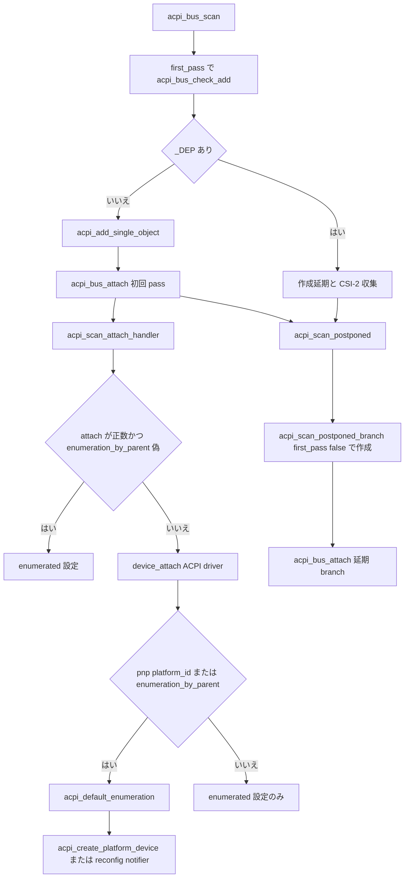

# 第9章 ACPI デバイス列挙の概観

> 本章で読むソース
>
> - [`drivers/acpi/scan.c` L1815-L1841](https://github.com/gregkh/linux/blob/v6.18.38/drivers/acpi/scan.c#L1815-L1841)
> - [`drivers/acpi/scan.c` L736-L800](https://github.com/gregkh/linux/blob/v6.18.38/drivers/acpi/scan.c#L736-L800)
> - [`drivers/acpi/scan.c` L1858-L1862](https://github.com/gregkh/linux/blob/v6.18.38/drivers/acpi/scan.c#L1858-L1862)
> - [`drivers/acpi/scan.c` L2120-L2193](https://github.com/gregkh/linux/blob/v6.18.38/drivers/acpi/scan.c#L2120-L2193)
> - [`drivers/acpi/scan.c` L2207-L2220](https://github.com/gregkh/linux/blob/v6.18.38/drivers/acpi/scan.c#L2207-L2220)
> - [`drivers/acpi/scan.c` L2245-L2272](https://github.com/gregkh/linux/blob/v6.18.38/drivers/acpi/scan.c#L2245-L2272)
> - [`drivers/acpi/scan.c` L2274-L2336](https://github.com/gregkh/linux/blob/v6.18.38/drivers/acpi/scan.c#L2274-L2336)
> - [`drivers/acpi/scan.c` L2526-L2558](https://github.com/gregkh/linux/blob/v6.18.38/drivers/acpi/scan.c#L2526-L2558)
> - [`drivers/acpi/scan.c` L2577-L2608](https://github.com/gregkh/linux/blob/v6.18.38/drivers/acpi/scan.c#L2577-L2608)

## この章の狙い

**ACPI** がファームウェアが提供する名前空間であり、列挙時に `acpi_device` を作り、条件を満たすものだけ別途 platform device も作る骨格を追う。
`acpi_device` と platform device は別の `struct device` である。
「ACPI が直接 platform device に変換される」と一体化して書かない。
本章は列挙の骨格に集中し、個別 ACPI デバイスの網羅は範囲外とする。

## 前提

[デバイスプロパティと fwnode / software node](07-device-property-fwnode.md) で fwnode 抽象を知っていること。
[Device Tree からの platform device 列挙](08-device-tree-platform.md) で DT 列挙との対比材料を読んでいること。

## acpi_device の生成と driver model 登録

`acpi_init_device_object` は `acpi_device` の fwnode を `acpi_device_fwnode_ops` で初期化する。
`dev.bus` を `acpi_bus_type` に設定し、`device_initialize` を呼ぶ。
初期の `device_add` 中は uevent を抑止する。

[`drivers/acpi/scan.c` L1815-L1841](https://github.com/gregkh/linux/blob/v6.18.38/drivers/acpi/scan.c#L1815-L1841)

```c
void acpi_init_device_object(struct acpi_device *device, acpi_handle handle,
			     int type, void (*release)(struct device *))
{
	struct acpi_device *parent = acpi_find_parent_acpi_dev(handle);

	INIT_LIST_HEAD(&device->pnp.ids);
	device->device_type = type;
	device->handle = handle;
	device->dev.parent = parent ? &parent->dev : NULL;
	device->dev.release = release;
	device->dev.bus = &acpi_bus_type;
	device->dev.groups = acpi_groups;
	fwnode_init(&device->fwnode, &acpi_device_fwnode_ops);
	acpi_set_device_status(device, ACPI_STA_DEFAULT);
	acpi_device_get_busid(device);
	acpi_set_pnp_ids(handle, &device->pnp, type);
	acpi_init_properties(device);
	acpi_bus_get_flags(device);
	device->flags.match_driver = false;
	device->flags.initialized = true;
	device->flags.enumeration_by_parent =
		acpi_device_enumeration_by_parent(device);
	acpi_device_clear_enumerated(device);
	device_initialize(&device->dev);
	dev_set_uevent_suppress(&device->dev, true);
	acpi_init_coherency(device);
}
```

`acpi_device_add` は名前と wakeup list を整え、`device_add` し、ACPI 固有 sysfs を追加する。

[`drivers/acpi/scan.c` L736-L800](https://github.com/gregkh/linux/blob/v6.18.38/drivers/acpi/scan.c#L736-L800)

```c
int acpi_device_add(struct acpi_device *device)
{
	struct acpi_device_bus_id *acpi_device_bus_id;
	int result;

	/*
	 * Linkage
	 * -------
	 * Link this device to its parent and siblings.
	 */
	INIT_LIST_HEAD(&device->wakeup_list);
	INIT_LIST_HEAD(&device->physical_node_list);
	INIT_LIST_HEAD(&device->del_list);
	mutex_init(&device->physical_node_lock);

	mutex_lock(&acpi_device_lock);

	acpi_device_bus_id = acpi_device_bus_id_match(acpi_device_hid(device));
	if (acpi_device_bus_id) {
		result = acpi_device_set_name(device, acpi_device_bus_id);
		if (result)
			goto err_unlock;
	} else {
		// ... (中略) ...
	}

	if (device->wakeup.flags.valid)
		list_add_tail(&device->wakeup_list, &acpi_wakeup_device_list);

	acpi_store_pld_crc(device);

	mutex_unlock(&acpi_device_lock);

	result = device_add(&device->dev);
	if (result) {
		dev_err(&device->dev, "Error registering device\n");
		goto err;
	}

	acpi_device_setup_files(device);

	return 0;
```

`acpi_device_add_finalize` で uevent 抑止を解除し、`KOBJ_ADD` を送る。

[`drivers/acpi/scan.c` L1858-L1862](https://github.com/gregkh/linux/blob/v6.18.38/drivers/acpi/scan.c#L1858-L1862)

```c
void acpi_device_add_finalize(struct acpi_device *device)
{
	dev_set_uevent_suppress(&device->dev, false);
	kobject_uevent(&device->dev.kobj, KOBJ_ADD);
}
```

## acpi_bus_check_add と二段階走査

`acpi_bus_scan` は二段階で進む。
最初に `acpi_bus_check_add` を `first_pass=true` で namespace 全体へ適用する。
`_DEP` 依存がある device は作成を延期し、依存と CSI-2 情報を集める。

作成済み ACPI device tree に `acpi_bus_attach` を実行したあと、`acpi_scan_postponed` が依存 branch ごとに `first_pass=false` の walk と attach を行う。
同じ namespace を二回全面走査するのではなく、延期分だけを処理する。

[`drivers/acpi/scan.c` L2120-L2193](https://github.com/gregkh/linux/blob/v6.18.38/drivers/acpi/scan.c#L2120-L2193)

```c
static acpi_status acpi_bus_check_add(acpi_handle handle, bool first_pass,
				      struct acpi_device **adev_p)
{
	struct acpi_device *device = acpi_fetch_acpi_dev(handle);
	acpi_object_type acpi_type;
	int type;

	if (device)
		goto out;

	if (ACPI_FAILURE(acpi_get_type(handle, &acpi_type)))
		return AE_OK;

	switch (acpi_type) {
	case ACPI_TYPE_DEVICE:
		if (acpi_device_should_be_hidden(handle))
			return AE_OK;

		if (first_pass) {
			acpi_mipi_check_crs_csi2(handle);

			/* Bail out if there are dependencies. */
			if (acpi_scan_check_dep(handle) > 0) {
				/*
				 * The entire CSI-2 connection graph needs to be
				 * extracted before any drivers or scan handlers
				 * are bound to struct device objects, so scan
				 * _CRS CSI-2 resource descriptors for all
				 * devices below the current handle.
				 */
				acpi_walk_namespace(ACPI_TYPE_DEVICE, handle,
						    ACPI_UINT32_MAX,
						    acpi_scan_check_crs_csi2_cb,
						    NULL, NULL, NULL);
				return AE_CTRL_DEPTH;
			}
		}

		fallthrough;
	case ACPI_TYPE_ANY:	/* for ACPI_ROOT_OBJECT */
		type = ACPI_BUS_TYPE_DEVICE;
		break;
	// ... (中略) ...
	default:
		return AE_OK;
	}

	/*
	 * If first_pass is true at this point, the device has no dependencies,
	 * or the creation of the device object would have been postponed above.
	 */
	acpi_add_single_object(&device, handle, type, !first_pass);
	if (!device)
		return AE_CTRL_DEPTH;

	acpi_scan_init_hotplug(device);

out:
	if (!*adev_p)
		*adev_p = device;

	return AE_OK;
}
```

[`drivers/acpi/scan.c` L2577-L2608](https://github.com/gregkh/linux/blob/v6.18.38/drivers/acpi/scan.c#L2577-L2608)

```c
int acpi_bus_scan(acpi_handle handle)
{
	struct acpi_device *device = NULL;

	/* Pass 1: Avoid enumerating devices with missing dependencies. */

	if (ACPI_SUCCESS(acpi_bus_check_add(handle, true, &device)))
		acpi_walk_namespace(ACPI_TYPE_ANY, handle, ACPI_UINT32_MAX,
				    acpi_bus_check_add_1, NULL, NULL,
				    (void **)&device);

	if (!device)
		return -ENODEV;

	/*
	 * Set up ACPI _CRS CSI-2 software nodes using information extracted
	 * from the _CRS CSI-2 resource descriptors during the ACPI namespace
	 * walk above and MIPI DisCo for Imaging device properties.
	 */
	acpi_mipi_scan_crs_csi2();
	acpi_mipi_init_crs_csi2_swnodes();

	acpi_bus_attach(device, (void *)true);

	/* Pass 2: Enumerate all of the remaining devices. */

	acpi_scan_postponed();

	acpi_mipi_crs_csi2_cleanup();

	return 0;
}
```

延期 branch の処理は `acpi_scan_postponed` が依存リストを走査し、未作成の consumer ごとに `acpi_scan_postponed_branch` を呼ぶ。

[`drivers/acpi/scan.c` L2526-L2558](https://github.com/gregkh/linux/blob/v6.18.38/drivers/acpi/scan.c#L2526-L2558)

```c
static void acpi_scan_postponed(void)
{
	struct acpi_dep_data *dep, *tmp;

	mutex_lock(&acpi_dep_list_lock);

	list_for_each_entry_safe(dep, tmp, &acpi_dep_list, node) {
		acpi_handle handle = dep->consumer;

		/*
		 * In case there are multiple acpi_dep_list entries with the
		 * same consumer, skip the current entry if the consumer device
		 * object corresponding to it is present already.
		 */
		if (!acpi_fetch_acpi_dev(handle)) {
			/*
			 * Even though the lock is released here, tmp is
			 * guaranteed to be valid, because none of the list
			 * entries following dep is marked as "free when met"
			 * and so they cannot be deleted.
			 */
			mutex_unlock(&acpi_dep_list_lock);

			acpi_scan_postponed_branch(handle);

			mutex_lock(&acpi_dep_list_lock);
		}

		if (dep->met)
			acpi_scan_delete_dep_data(dep);
		else
			dep->free_when_met = true;
	}
```

## scan handler と default enumeration

`acpi_scan_attach_handler` は HID ごとに scan handler を探し、`attach` を呼ぶ。
戻り値が正数なら handler が列挙を完了した意味になる。

[`drivers/acpi/scan.c` L2245-L2272](https://github.com/gregkh/linux/blob/v6.18.38/drivers/acpi/scan.c#L2245-L2272)

```c
static int acpi_scan_attach_handler(struct acpi_device *device)
{
	struct acpi_hardware_id *hwid;
	int ret = 0;

	list_for_each_entry(hwid, &device->pnp.ids, list) {
		const struct acpi_device_id *devid;
		struct acpi_scan_handler *handler;

		handler = acpi_scan_match_handler(hwid->id, &devid);
		if (handler) {
			if (!handler->attach) {
				device->pnp.type.platform_id = 0;
				continue;
			}
			device->handler = handler;
			ret = handler->attach(device, devid);
			if (ret > 0)
				break;

			device->handler = NULL;
			if (ret < 0)
				break;
		}
	}

	return ret;
}
```

default enumeration の分岐は scan handler の有無だけでは決まらない。
`acpi_bus_attach` は status と初期化と既存 handler を確認し、`acpi_scan_attach_handler` を呼ぶ。
handler の `attach` が正数を返し `enumeration_by_parent` が偽なら `enumerated` を設定し、既定列挙をせず次へ進む。
handler が完了しなければ `device_attach` で `acpi_bus_type` 上の通常 ACPI driver を試す。
その後 `pnp.type.platform_id` が真、または `enumeration_by_parent` が真のとき `acpi_default_enumeration` を呼ぶ。

[`drivers/acpi/scan.c` L2274-L2336](https://github.com/gregkh/linux/blob/v6.18.38/drivers/acpi/scan.c#L2274-L2336)

```c
static int acpi_bus_attach(struct acpi_device *device, void *first_pass)
{
	bool skip = !first_pass && device->flags.visited;
	acpi_handle ejd;
	int ret;

	if (skip)
		goto ok;

	if (ACPI_SUCCESS(acpi_bus_get_ejd(device->handle, &ejd)))
		register_dock_dependent_device(device, ejd);

	acpi_bus_get_status(device);
	/* Skip devices that are not ready for enumeration (e.g. not present) */
	if (!acpi_dev_ready_for_enumeration(device)) {
		device->flags.initialized = false;
		acpi_device_clear_enumerated(device);
		device->flags.power_manageable = 0;
		return 0;
	}
	if (device->handler)
		goto ok;

	acpi_ec_register_opregions(device);

	if (!device->flags.initialized) {
		device->flags.power_manageable =
			device->power.states[ACPI_STATE_D0].flags.valid;
		if (acpi_bus_init_power(device))
			device->flags.power_manageable = 0;

		device->flags.initialized = true;
	} else if (device->flags.visited) {
		goto ok;
	}

	ret = acpi_scan_attach_handler(device);
	if (ret < 0)
		return 0;

	device->flags.match_driver = true;
	if (ret > 0 && !device->flags.enumeration_by_parent) {
		acpi_device_set_enumerated(device);
		goto ok;
	}

	ret = device_attach(&device->dev);
	if (ret < 0)
		return 0;

	if (device->pnp.type.platform_id || device->flags.enumeration_by_parent)
		acpi_default_enumeration(device);
	else
		acpi_device_set_enumerated(device);

ok:
	acpi_dev_for_each_child(device, acpi_bus_attach, first_pass);

	if (!skip && device->handler && device->handler->hotplug.notify_online)
		device->handler->hotplug.notify_online(device);

	return 0;
}
```

`acpi_default_enumeration` も常に platform device を作るわけではない。
`enumeration_by_parent` が偽なら `acpi_create_platform_device`、真なら親サブシステム列挙のため reconfiguration notifier を呼ぶ。

[`drivers/acpi/scan.c` L2207-L2220](https://github.com/gregkh/linux/blob/v6.18.38/drivers/acpi/scan.c#L2207-L2220)

```c
static void acpi_default_enumeration(struct acpi_device *device)
{
	/*
	 * Do not enumerate devices with enumeration_by_parent flag set as
	 * they will be enumerated by their respective parents.
	 */
	if (!device->flags.enumeration_by_parent) {
		acpi_create_platform_device(device, NULL);
		acpi_device_set_enumerated(device);
	} else {
		blocking_notifier_call_chain(&acpi_reconfig_chain,
					     ACPI_RECONFIG_DEVICE_ADD, device);
	}
}
```

## Device Tree との対比

DT（第8章）も ACPI も、列挙結果は fwnode を介して同じ driver core の property とマッチ経路へ合流する。
DT は `of_platform_populate` が `device_node` から platform device を作る。
ACPI はまず `acpi_device` を作り、条件を満たしたものだけ platform 経路へ載せる。
どちらも第7章の `device_property_*` と第13章の platform マッチを共有できる。

## 処理の流れ

`acpi_bus_scan` の二段階と attach 分岐を次に示す。



## 高速化と最適化の工夫

scan handler と通常 ACPI driver を先に試し、適切な対象だけを platform 経路へ載せることで、すべてを platform device 化する処理を省ける。
fwnode 抽象への合流により、DT と ACPI が同一の property API を共有し、ドライバ側の実装を一本化できる。
これは列挙コストの削減とコード共有の両面で効く。

## まとめ

ACPI 列挙は `acpi_device` を先に作り、条件付きで platform device を追加する二層構造である。
`acpi_bus_scan` は first_pass で依存を延期し、attach 後に `acpi_scan_postponed` で残りを処理する。
`acpi_bus_attach` は scan handler、ACPI driver attach、default enumeration の順で分岐する。
`acpi_default_enumeration` は `enumeration_by_parent` に応じて platform 化か reconfiguration notifier を選ぶ。

## 関連する章

- 前章：[Device Tree からの platform device 列挙](08-device-tree-platform.md)
- 次章：[ドライバ登録と二方向マッチと async probe](../part03-probe/10-driver-match-async-probe.md)
- fwnode と property API：[デバイスプロパティと fwnode / software node](07-device-property-fwnode.md)
- platform バスでのマッチ：[platform バスによるマッチと probe の実例](../part03-probe/13-platform-bus.md)
