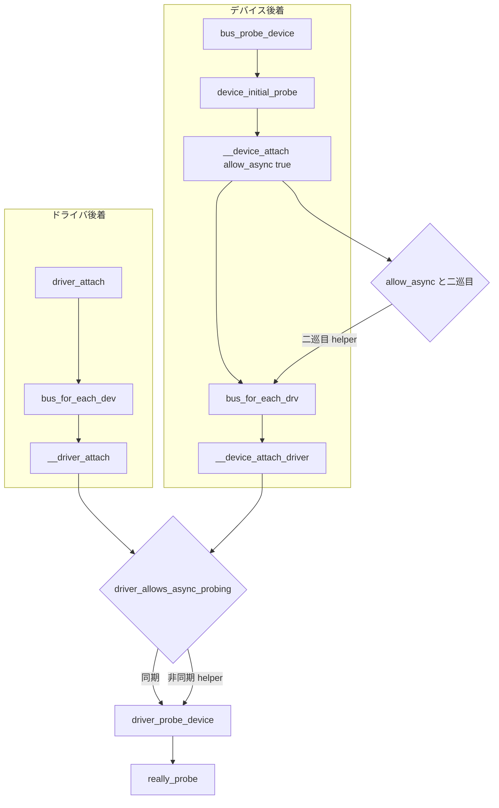

# 第10章 ドライバ登録と二方向マッチと async probe

> 本章で読むソース
>
> - [`drivers/base/base.h` L166-L170](https://github.com/gregkh/linux/blob/v6.18.38/drivers/base/base.h#L166-L170)
> - [`drivers/base/bus.c` L574-L591](https://github.com/gregkh/linux/blob/v6.18.38/drivers/base/bus.c#L574-L591)
> - [`drivers/base/dd.c` L949-L967](https://github.com/gregkh/linux/blob/v6.18.38/drivers/base/dd.c#L949-L967)
> - [`drivers/base/dd.c` L1002-L1043](https://github.com/gregkh/linux/blob/v6.18.38/drivers/base/dd.c#L1002-L1043)
> - [`drivers/base/dd.c` L1081-L1135](https://github.com/gregkh/linux/blob/v6.18.38/drivers/base/dd.c#L1081-L1135)
> - [`drivers/base/dd.c` L1237-L1300](https://github.com/gregkh/linux/blob/v6.18.38/drivers/base/dd.c#L1237-L1300)
> - [`drivers/base/dd.c` L1312-L1316](https://github.com/gregkh/linux/blob/v6.18.38/drivers/base/dd.c#L1312-L1316)
> - [`drivers/base/dd.c` L905-L925](https://github.com/gregkh/linux/blob/v6.18.38/drivers/base/dd.c#L905-L925)

## この章の狙い

probe のトリガが**ドライバ後着**と**デバイス後着**の二方向にあることを対比して固定する。
`driver_match_device` によるマッチ判定、同期と非同期の分岐、共通入口 `driver_probe_device` までを追い、`really_probe` への接続点を示す。
**deferred probe**（依存未充足による再試行）と **async probe**（実行時期の並列化）が別物であることも明示する。

## 前提

[bus_type の登録とバスへの追加](../part01-registration/03-bus-register.md) で `bus_probe_device` と `driver_attach` の位置づけを知っていること。
[中核データ構造と所有構造](../part00-overview/02-core-data-structures-ownership.md) で klist の二層参照管理を読んでいること。

## 二方向の probe トリガ

| 方向 | 起動元 | 走査対象 | コールバック |
|---|---|---|---|
| デバイス後着 | `bus_probe_device` → `device_initial_probe` | 登録済みドライバ | `__device_attach_driver` |
| ドライバ後着 | `driver_register` → `driver_attach` | 登録済みデバイス | `__driver_attach` |

デバイスが後から現れるときは `bus_for_each_drv` でバス上のドライバを試す。
ドライバが後からロードされるときは `bus_for_each_dev` でバス上のデバイスを試す。
どちらもマッチ後は `driver_probe_device` に合流する。

## driver_match_device と bus_type.match

マッチ判定は `bus_type.match` へ委譲される。
platform バスでは DT の compatible や ID テーブル、PCI バスではベンダーとデバイス ID がここで効く。

[`drivers/base/base.h` L166-L170](https://github.com/gregkh/linux/blob/v6.18.38/drivers/base/base.h#L166-L170)

```c
static inline int driver_match_device(const struct device_driver *drv,
				      struct device *dev)
{
	return drv->bus->match ? drv->bus->match(dev, drv) : 1;
}
```

戻り値 0 は不一致、正の値はマッチ、`-EPROBE_DEFER` は依存未充足による遅延である。
`match` が未設定のバスでは常に 1 を返し、ドライバ名など別経路での絞り込みに委ねる。

## デバイス後着の経路

`bus_probe_device` は `drivers_autoprobe` が真のとき `device_initial_probe` を呼ぶ。

[`drivers/base/bus.c` L574-L591](https://github.com/gregkh/linux/blob/v6.18.38/drivers/base/bus.c#L574-L591)

```c
void bus_probe_device(struct device *dev)
{
	struct subsys_private *sp = bus_to_subsys(dev->bus);
	struct subsys_interface *sif;

	if (!sp)
		return;

	if (sp->drivers_autoprobe)
		device_initial_probe(dev);

	mutex_lock(&sp->mutex);
	list_for_each_entry(sif, &sp->interfaces, node)
		if (sif->add_dev)
			sif->add_dev(dev, sif);
	mutex_unlock(&sp->mutex);
	subsys_put(sp);
}
```

`device_initial_probe` は `__device_attach(dev, true)` を呼び、非同期走査を許可する。
ユーザー空間からの手動バインドに使う `device_attach` は `allow_async` に false を渡し、同期のみとする。

`__device_attach` は `bus_for_each_drv` で `__device_attach_driver` を各ドライバに対して呼ぶ。
同期一巡目でバインドできず、かつ非同期ドライバが見つかっていた場合だけ、二巡目を `__device_attach_async_helper` に予約する。

[`drivers/base/dd.c` L1081-L1135](https://github.com/gregkh/linux/blob/v6.18.38/drivers/base/dd.c#L1081-L1135)

```c
static int __device_attach(struct device *dev, bool allow_async)
{
	int ret = 0;
	bool async = false;

	device_lock(dev);
	if (dev->p->dead) {
		goto out_unlock;
	} else if (dev->driver) {
		if (device_is_bound(dev)) {
			ret = 1;
			goto out_unlock;
		}
		ret = device_bind_driver(dev);
		if (ret == 0)
			ret = 1;
		else {
			device_set_driver(dev, NULL);
			ret = 0;
		}
	} else {
		struct device_attach_data data = {
			.dev = dev,
			.check_async = allow_async,
			.want_async = false,
		};

		if (dev->parent)
			pm_runtime_get_sync(dev->parent);

		ret = bus_for_each_drv(dev->bus, NULL, &data,
					__device_attach_driver);
		if (!ret && allow_async && data.have_async) {
			/*
			 * If we could not find appropriate driver
			 * synchronously and we are allowed to do
			 * async probes and there are drivers that
			 * want to probe asynchronously, we'll
			 * try them.
			 */
			dev_dbg(dev, "scheduling asynchronous probe\n");
			get_device(dev);
			async = true;
		} else {
			pm_request_idle(dev);
		}

		if (dev->parent)
			pm_runtime_put(dev->parent);
	}
out_unlock:
	device_unlock(dev);
	if (async)
		async_schedule_dev(__device_attach_async_helper, dev);
	return ret;
}
```

二巡目の helper は個別の `driver` ポインタを保持せず、再度 `bus_for_each_drv` でバス全体を走査する。
`klist_drivers` は get/put コールバックを持たないため、`bus_for_each_drv` が次のドライバへ進むと直前の `driver` ポインタの寿命は保証されないからである。
`klist_devices` は `klist_devices_get` でリスト所属分の `get_device` を取るが、それはイテレーションのたびではなく `klist_add_tail` 時の一度だけである。

## __device_attach_driver のマッチと probe 起動

各ドライバに対してマッチ判定を行い、条件を満たせば `driver_probe_device` を呼ぶ。

[`drivers/base/dd.c` L1002-L1043](https://github.com/gregkh/linux/blob/v6.18.38/drivers/base/dd.c#L1002-L1043)

```c
static int __device_attach_driver(struct device_driver *drv, void *_data)
{
	struct device_attach_data *data = _data;
	struct device *dev = data->dev;
	bool async_allowed;
	int ret;

	ret = driver_match_device(drv, dev);
	if (ret == 0) {
		/* no match */
		return 0;
	} else if (ret == -EPROBE_DEFER) {
		dev_dbg(dev, "Device match requests probe deferral\n");
		dev->can_match = true;
		driver_deferred_probe_add(dev);
		/*
		 * Device can't match with a driver right now, so don't attempt
		 * to match or bind with other drivers on the bus.
		 */
		return ret;
	} else if (ret < 0) {
		dev_dbg(dev, "Bus failed to match device: %d\n", ret);
		return ret;
	} /* ret > 0 means positive match */

	async_allowed = driver_allows_async_probing(drv);

	if (async_allowed)
		data->have_async = true;

	if (data->check_async && async_allowed != data->want_async)
		return 0;

	/*
	 * Ignore errors returned by ->probe so that the next driver can try
	 * its luck.
	 */
	ret = driver_probe_device(drv, dev);
	if (ret < 0)
		return ret;
	return ret == 0;
}
```

`check_async` が真のとき、一巡目は `want_async == false` で同期ドライバだけを試す。
非同期ドライバは `have_async` を立てるだけで、実際の probe は helper の二巡目へ回す。

## ドライバ後着の経路

`driver_attach` は `bus_for_each_dev` で `__driver_attach` を各デバイスに対して呼ぶ。

[`drivers/base/dd.c` L1312-L1316](https://github.com/gregkh/linux/blob/v6.18.38/drivers/base/dd.c#L1312-L1316)

```c
int driver_attach(const struct device_driver *drv)
{
	/* The (void *) will be put back to const * in __driver_attach() */
	return bus_for_each_dev(drv->bus, NULL, (void *)drv, __driver_attach);
}
```

`__driver_attach` はマッチ後、非同期可能なドライバなら `dev->p->async_driver` を設定して helper を予約する。
同期ドライバはその場で `driver_probe_device` を呼ぶ。

[`drivers/base/dd.c` L1237-L1300](https://github.com/gregkh/linux/blob/v6.18.38/drivers/base/dd.c#L1237-L1300)

```c
static int __driver_attach(struct device *dev, void *data)
{
	const struct device_driver *drv = data;
	bool async = false;
	int ret;

	// ... (中略) ...

	ret = driver_match_device(drv, dev);
	if (ret == 0) {
		/* no match */
		return 0;
	} else if (ret == -EPROBE_DEFER) {
		dev_dbg(dev, "Device match requests probe deferral\n");
		dev->can_match = true;
		driver_deferred_probe_add(dev);
		/*
		 * Driver could not match with device, but may match with
		 * another device on the bus.
		 */
		return 0;
	} else if (ret < 0) {
		dev_dbg(dev, "Bus failed to match device: %d\n", ret);
		/*
		 * Driver could not match with device, but may match with
		 * another device on the bus.
		 */
		return 0;
	} /* ret > 0 means positive match */

	if (driver_allows_async_probing(drv)) {
		/*
		 * Instead of probing the device synchronously we will
		 * probe it asynchronously to allow for more parallelism.
		 *
		 * We only take the device lock here in order to guarantee
		 * that the dev->driver and async_driver fields are protected
		 */
		dev_dbg(dev, "probing driver %s asynchronously\n", drv->name);
		device_lock(dev);
		if (!dev->driver && !dev->p->async_driver) {
			get_device(dev);
			dev->p->async_driver = drv;
			async = true;
		}
		device_unlock(dev);
		if (async)
			async_schedule_dev(__driver_attach_async_helper, dev);
		return 0;
	}

	__device_driver_lock(dev, dev->parent);
	driver_probe_device(drv, dev);
	__device_driver_unlock(dev, dev->parent);

	return 0;
}
```

ドライバ後着側は走査対象のデバイスが `klist_devices` に載るため、デバイス参照は klist の get/put で保持される。
非同期 helper では `async_driver` にドライバポインタを一時保存し、デバイス参照を `get_device` で取ってからワーカーへ渡す。

## async probe の許可判定

ドライバ側の非同期許可は `driver_allows_async_probing` が決める。
`probe_type`、カーネルコマンドライン `driver_async_probe=`、モジュール側の非同期指定から判定する。
デバイス属性ではない。

[`drivers/base/dd.c` L949-L967](https://github.com/gregkh/linux/blob/v6.18.38/drivers/base/dd.c#L949-L967)

```c
static bool driver_allows_async_probing(const struct device_driver *drv)
{
	switch (drv->probe_type) {
	case PROBE_PREFER_ASYNCHRONOUS:
		return true;

	case PROBE_FORCE_SYNCHRONOUS:
		return false;

	default:
		if (cmdline_requested_async_probing(drv->name))
			return true;

		if (module_requested_async_probing(drv->owner))
			return true;

		return false;
	}
}
```

デバイス後着側で非同期走査を許すかは `__device_attach` の `allow_async` 引数で決まる。
初回バインドか手動の同期バインドかという呼び出し文脈の違いである。

## driver_probe_device：共通入口

同期経路も非同期 helper も、マッチ後は `driver_probe_device` に合流する。
ここで deferred probe キューへの追加や `really_probe` 呼び出しが行われる（第11章）。

[`drivers/base/dd.c` L905-L925](https://github.com/gregkh/linux/blob/v6.18.38/drivers/base/dd.c#L905-L925)

```c
static int driver_probe_device(const struct device_driver *drv, struct device *dev)
{
	int trigger_count = atomic_read(&deferred_trigger_count);
	int ret;

	atomic_inc(&probe_count);
	ret = __driver_probe_device(drv, dev);
	if (ret == -EPROBE_DEFER || ret == EPROBE_DEFER) {
		driver_deferred_probe_add(dev);

		/*
		 * Did a trigger occur while probing? Need to re-trigger if yes
		 */
		if (trigger_count != atomic_read(&deferred_trigger_count) &&
		    !defer_all_probes)
			driver_deferred_probe_trigger();
	}
	atomic_dec(&probe_count);
	wake_up_all(&probe_waitqueue);
	return ret;
}
```

## deferred probe との違い

**async probe** はマッチ済みドライバの `probe` 実行をワーカースレッドへ逃がし、ブートの並列度を上げる。
**deferred probe** は supplier 未充足などで `-EPROBE_DEFER` が返ったデバイスをキューに載せ、後から再試行する（第12章）。
前者は実行時期の問題、後者は依存関係の問題であり、混同してはならない。

## 処理の流れ

二方向マッチと async 分岐の合流点を次に示す。



## 高速化と最適化の工夫

async probe により、初期化に時間のかかるドライバの probe を並列ワーカーへ逃がせる。
逐次 probe によるブート直列化を避け、起動時間を短縮できる。

並列可否は `driver_allows_async_probing`（ドライバ側）と `allow_async` 引数（呼び出し文脈）の二点で判定する。
klist の二層参照管理により、短時間の spinlock の外でマッチ処理と probe 起動を実行できる。

## まとめ

probe はドライバ後着とデバイス後着の二方向から起動し、いずれも `driver_match_device` でマッチを判定する。
デバイス後着は同期一巡目のあと、必要なら非同期二巡目を helper で再走査する。
ドライバ後着は非同期可能なドライバを `async_driver` 経由で helper へ渡す。
同期も非同期も `driver_probe_device` を経て `really_probe` へ進む。

## 関連する章

- 前章：[ACPI デバイス列挙の概観](../part02-enumeration/09-acpi-scan.md)
- 次章：[really_probe とバインドの中核](11-really-probe.md)
- deferred probe：[deferred probe](12-deferred-probe.md)
- klist の意味論：[中核データ構造と所有構造](../part00-overview/02-core-data-structures-ownership.md)
