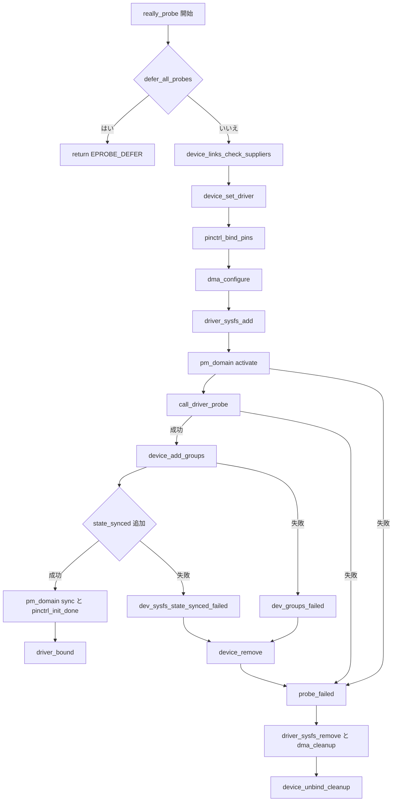

# 第11章 really_probe とバインドの中核

> 本章で読むソース
>
> - [`drivers/base/dd.c` L634-L663](https://github.com/gregkh/linux/blob/v6.18.38/drivers/base/dd.c#L634-L663)
> - [`drivers/base/dd.c` L496-L527](https://github.com/gregkh/linux/blob/v6.18.38/drivers/base/dd.c#L496-L527)
> - [`drivers/base/dd.c` L665-L772](https://github.com/gregkh/linux/blob/v6.18.38/drivers/base/dd.c#L665-L772)
> - [`drivers/base/dd.c` L774-L788](https://github.com/gregkh/linux/blob/v6.18.38/drivers/base/dd.c#L774-L788)
> - [`drivers/base/dd.c` L459-L483](https://github.com/gregkh/linux/blob/v6.18.38/drivers/base/dd.c#L459-L483)
> - [`drivers/base/dd.c` L608-L621](https://github.com/gregkh/linux/blob/v6.18.38/drivers/base/dd.c#L608-L621)

## この章の狙い

`really_probe` がマッチ済みドライバを実際にデバイスへ結び付ける中核処理であることを固定する。
前処理の実順序、`call_driver_probe` の分岐、成功後に `driver_bound` へ至る段階、失敗時の段階的ロールバックを追う。
`dma_configure` と PM domain は接続点として示し、内部詳細は他分冊へ委譲する。

## 前提

[ドライバ登録と二方向マッチと async probe](10-driver-match-async-probe.md) で `driver_probe_device` と `__driver_probe_device` を読んでいること。
[device links と fw_devlink](../part04-links-devres-unbind/14-device-links-fw-devlink.md) の `device_links_check_suppliers` は本章では呼び出し位置だけ扱う。

## really_probe の前処理順序

`__driver_probe_device` が runtime PM の準備のあと `really_probe` を呼ぶ。
`really_probe` 内の前処理は次の順序で進む。

1. `defer_all_probes` の確認
2. `device_links_check_suppliers`（supplier 確認、第14章へ委譲）
3. `devres_head` が空であることの確認
4. `device_set_driver` で候補ドライバを設定
5. `pinctrl_bind_pins`
6. `bus` の `dma_configure`
7. `driver_sysfs_add` で相互 sysfs リンク作成
8. PM domain の `activate`
9. `call_driver_probe`

pinctrl → DMA → sysfs → PM の順であり、sysfs を DMA より前に置かない。

[`drivers/base/dd.c` L665-L772](https://github.com/gregkh/linux/blob/v6.18.38/drivers/base/dd.c#L665-L772)

```c
static int really_probe(struct device *dev, const struct device_driver *drv)
{
	bool test_remove = IS_ENABLED(CONFIG_DEBUG_TEST_DRIVER_REMOVE) &&
			   !drv->suppress_bind_attrs;
	int ret, link_ret;

	if (defer_all_probes) {
		/*
		 * Value of defer_all_probes can be set only by
		 * device_block_probing() which, in turn, will call
		 * wait_for_device_probe() right after that to avoid any races.
		 */
		dev_dbg(dev, "Driver %s force probe deferral\n", drv->name);
		return -EPROBE_DEFER;
	}

	link_ret = device_links_check_suppliers(dev);
	if (link_ret == -EPROBE_DEFER)
		return link_ret;

	dev_dbg(dev, "bus: '%s': %s: probing driver %s with device\n",
		drv->bus->name, __func__, drv->name);
	if (!list_empty(&dev->devres_head)) {
		dev_crit(dev, "Resources present before probing\n");
		ret = -EBUSY;
		goto done;
	}

re_probe:
	device_set_driver(dev, drv);

	/* If using pinctrl, bind pins now before probing */
	ret = pinctrl_bind_pins(dev);
	if (ret)
		goto pinctrl_bind_failed;

	if (dev->bus->dma_configure) {
		ret = dev->bus->dma_configure(dev);
		if (ret)
			goto pinctrl_bind_failed;
	}

	ret = driver_sysfs_add(dev);
	if (ret) {
		dev_err(dev, "%s: driver_sysfs_add failed\n", __func__);
		goto sysfs_failed;
	}

	if (dev->pm_domain && dev->pm_domain->activate) {
		ret = dev->pm_domain->activate(dev);
		if (ret)
			goto probe_failed;
	}

	ret = call_driver_probe(dev, drv);
	if (ret) {
		/*
		 * If fw_devlink_best_effort is active (denoted by -EAGAIN), the
		 * device might actually probe properly once some of its missing
		 * suppliers have probed. So, treat this as if the driver
		 * returned -EPROBE_DEFER.
		 */
		if (link_ret == -EAGAIN)
			ret = -EPROBE_DEFER;

		/*
		 * Return probe errors as positive values so that the callers
		 * can distinguish them from other errors.
		 */
		ret = -ret;
		goto probe_failed;
	}

	ret = device_add_groups(dev, drv->dev_groups);
	if (ret) {
		dev_err(dev, "device_add_groups() failed\n");
		goto dev_groups_failed;
	}

	if (dev_has_sync_state(dev)) {
		ret = device_create_file(dev, &dev_attr_state_synced);
		if (ret) {
			dev_err(dev, "state_synced sysfs add failed\n");
			goto dev_sysfs_state_synced_failed;
		}
	}

	if (test_remove) {
		test_remove = false;

		device_remove(dev);
		driver_sysfs_remove(dev);
		if (dev->bus && dev->bus->dma_cleanup)
			dev->bus->dma_cleanup(dev);
		device_unbind_cleanup(dev);

		goto re_probe;
	}

	pinctrl_init_done(dev);

	if (dev->pm_domain && dev->pm_domain->sync)
		dev->pm_domain->sync(dev);

	driver_bound(dev);
	dev_dbg(dev, "bus: '%s': %s: bound device to driver %s\n",
		drv->bus->name, __func__, drv->name);
	goto done;
```

`call_driver_probe` の直後に `driver_bound` は来ない。
`dev_groups` 追加、`state_synced` 属性、`pinctrl_init_done`、PM domain の `sync` を経てから `driver_bound` が呼ばれる。

## call_driver_probe の分岐

`bus->probe` が存在すればバス側を優先し、無ければ `drv->probe` を呼ぶ。
「`drv->probe` が先で bus にフォールバック」ではない。

[`drivers/base/dd.c` L634-L663](https://github.com/gregkh/linux/blob/v6.18.38/drivers/base/dd.c#L634-L663)

```c
static int call_driver_probe(struct device *dev, const struct device_driver *drv)
{
	int ret = 0;

	if (dev->bus->probe)
		ret = dev->bus->probe(dev);
	else if (drv->probe)
		ret = drv->probe(dev);

	switch (ret) {
	case 0:
		break;
	case -EPROBE_DEFER:
		/* Driver requested deferred probing */
		dev_dbg(dev, "Driver %s requests probe deferral\n", drv->name);
		break;
	case -ENODEV:
	case -ENXIO:
		dev_dbg(dev, "probe with driver %s rejects match %d\n",
			drv->name, ret);
		break;
	default:
		/* driver matched but the probe failed */
		dev_err(dev, "probe with driver %s failed with error %d\n",
			drv->name, ret);
		break;
	}

	return ret;
}
```

`-EPROBE_DEFER`、`ENODEV`、`-ENXIO` は `call_driver_probe` 内で戻り値を分類してデバッグログを出すだけである。
キューへの追加は行わない。
`really_probe` がエラーを正数へ反転して返したあと、上位の `driver_probe_device` が `EPROBE_DEFER` を検出して `driver_deferred_probe_add` を呼ぶ（第10章）。
`ENODEV` と `-ENXIO` も同様に正数化されて返るが、`call_driver_probe` 内の分類自体が別ドライバの試行を決めるわけではない。
attach 側は正数エラーを非成功として扱い、走査を継続する。
その他のエラーは probe 失敗として `dev_err` に残る。

## driver_sysfs_add と driver_bound の役割分担

相互 sysfs リンクは probe **前**の `driver_sysfs_add` で作られる。
`driver_bound` は klist 追加と通知が主目的であり、sysfs リンク作成と混同してはならない。

[`drivers/base/dd.c` L496-L527](https://github.com/gregkh/linux/blob/v6.18.38/drivers/base/dd.c#L496-L527)

```c
static int driver_sysfs_add(struct device *dev)
{
	int ret;

	bus_notify(dev, BUS_NOTIFY_BIND_DRIVER);

	ret = sysfs_create_link(&dev->driver->p->kobj, &dev->kobj,
				kobject_name(&dev->kobj));
	if (ret)
		goto fail;

	ret = sysfs_create_link(&dev->kobj, &dev->driver->p->kobj,
				"driver");
	if (ret)
		goto rm_dev;

	if (!IS_ENABLED(CONFIG_DEV_COREDUMP) || !dev->driver->coredump)
		return 0;

	ret = device_create_file(dev, &dev_attr_coredump);
	if (!ret)
		return 0;

	sysfs_remove_link(&dev->kobj, "driver");

rm_dev:
	sysfs_remove_link(&dev->driver->p->kobj,
			  kobject_name(&dev->kobj));

fail:
	return ret;
}
```

`driver_bound` はドライバの `klist_devices` へノードを追加し、device links の更新、deferred probe キューからの削除、再試行トリガ、`BUS_NOTIFY_BOUND_DRIVER`、`KOBJ_BIND` を行う。

[`drivers/base/dd.c` L459-L483](https://github.com/gregkh/linux/blob/v6.18.38/drivers/base/dd.c#L459-L483)

```c
static void driver_bound(struct device *dev)
{
	if (device_is_bound(dev)) {
		dev_warn(dev, "%s: device already bound\n", __func__);
		return;
	}

	dev_dbg(dev, "driver: '%s': %s: bound to device\n", dev->driver->name,
		__func__);

	klist_add_tail(&dev->p->knode_driver, &dev->driver->p->klist_devices);
	device_links_driver_bound(dev);

	device_pm_check_callbacks(dev);

	/*
	 * Make sure the device is no longer in one of the deferred lists and
	 * kick off retrying all pending devices
	 */
	driver_deferred_probe_del(dev);
	driver_deferred_probe_trigger();

	bus_notify(dev, BUS_NOTIFY_BOUND_DRIVER);
	kobject_uevent(&dev->kobj, KOBJ_BIND);
}
```

## 失敗時の段階的ロールバック

失敗経路は単純な完全逆順ではなく、失敗した段階に応じてラベルへ合流する。
`device_remove` は `dev_groups_failed` と `dev_sysfs_state_synced_failed` の直後、`probe_failed` ラベルの直前に置かれる。

`call_driver_probe` 自体がエラーを返した場合、または PM domain の `activate` が失敗した場合は `goto probe_failed` となり、`device_remove` を飛ばす。
probe callback が成功していないので `bus->remove` や `driver->remove` は呼ばれない。

`call_driver_probe` 成功後に `device_add_groups` または `state_synced` 属性の追加が失敗した場合は、`dev_groups_failed` または `dev_sysfs_state_synced_failed` へ入る。
ここでは `device_remove` が remove callback を実行してから `probe_failed` 以下へ合流する。

`probe_failed` 以降は `driver_sysfs_remove`、`BUS_NOTIFY_DRIVER_NOT_BOUND`、`dma_cleanup`、`device_links_no_driver`、`device_unbind_cleanup` へ進む。

[`drivers/base/dd.c` L774-L788](https://github.com/gregkh/linux/blob/v6.18.38/drivers/base/dd.c#L774-L788)

```c
dev_sysfs_state_synced_failed:
dev_groups_failed:
	device_remove(dev);
probe_failed:
	driver_sysfs_remove(dev);
sysfs_failed:
	bus_notify(dev, BUS_NOTIFY_DRIVER_NOT_BOUND);
	if (dev->bus && dev->bus->dma_cleanup)
		dev->bus->dma_cleanup(dev);
pinctrl_bind_failed:
	device_links_no_driver(dev);
	device_unbind_cleanup(dev);
done:
	return ret;
}
```

`device_unbind_cleanup` は devres、DMA ops と `dma_range_map`、`driver` と `driver_data`、PM domain、runtime PM 状態などを片付ける。

[`drivers/base/dd.c` L608-L621](https://github.com/gregkh/linux/blob/v6.18.38/drivers/base/dd.c#L608-L621)

```c
static void device_unbind_cleanup(struct device *dev)
{
	devres_release_all(dev);
	arch_teardown_dma_ops(dev);
	kfree(dev->dma_range_map);
	dev->dma_range_map = NULL;
	device_set_driver(dev, NULL);
	dev_set_drvdata(dev, NULL);
	dev_pm_domain_detach(dev, dev->power.detach_power_off);
	if (dev->pm_domain && dev->pm_domain->dismiss)
		dev->pm_domain->dismiss(dev);
	pm_runtime_reinit(dev);
	dev_pm_set_driver_flags(dev, 0);
}
```

probe 失敗時のクリーンアップと、正常 unbind 経路（第16章）では呼び出し文脈が異なる。
本章は probe 失敗で部分初期化が残ったときの巻き戻しに焦点を当てる。

## 処理の流れ

`really_probe` の成功経路と失敗ラベル合流を次に示す。



## 高速化と最適化の工夫

失敗段階ごとに共通ラベルへ解放処理を集約することで、部分初期化のリークと重複したエラー処理を減らす。
`pinctrl_bind_failed` と `sysfs_failed` が同じ `device_unbind_cleanup` に合流するなど、到達済み段階だけを片付ける構造である。

probe 失敗と再試行では `dma_configure` や PM domain の設定が再度走りうる。
「一度だけ設定する」とは書けない（PM domain はレギュレータ設定を一般に代替しない）。

## まとめ

`really_probe` は links 確認、pinctrl、DMA、sysfs、PM activate のあと `call_driver_probe` を呼ぶ。
`bus->probe` があればそれを優先し、成功後は dev_groups と PM sync を経て `driver_bound` へ至る。
相互 sysfs リンクは `driver_sysfs_add` で probe 前に作られる。
失敗時は段階に応じてラベル合流する。
probe callback 失敗は `device_remove` を飛ばし、probe 後の属性追加失敗だけ `device_remove` 経由で remove callback を呼ぶ。
`device_unbind_cleanup` が残存状態を片付ける。

## 関連する章

- 前章：[ドライバ登録と二方向マッチと async probe](10-driver-match-async-probe.md)
- 次章：[deferred probe](12-deferred-probe.md)
- device links 詳細：[device links と fw_devlink](../part04-links-devres-unbind/14-device-links-fw-devlink.md)
- devres：[devres によるマネージドリソース](../part04-links-devres-unbind/15-devres.md)
- 正常 unbind：[unbind と remove とデバイス削除](../part04-links-devres-unbind/16-unbind-remove-del.md)
