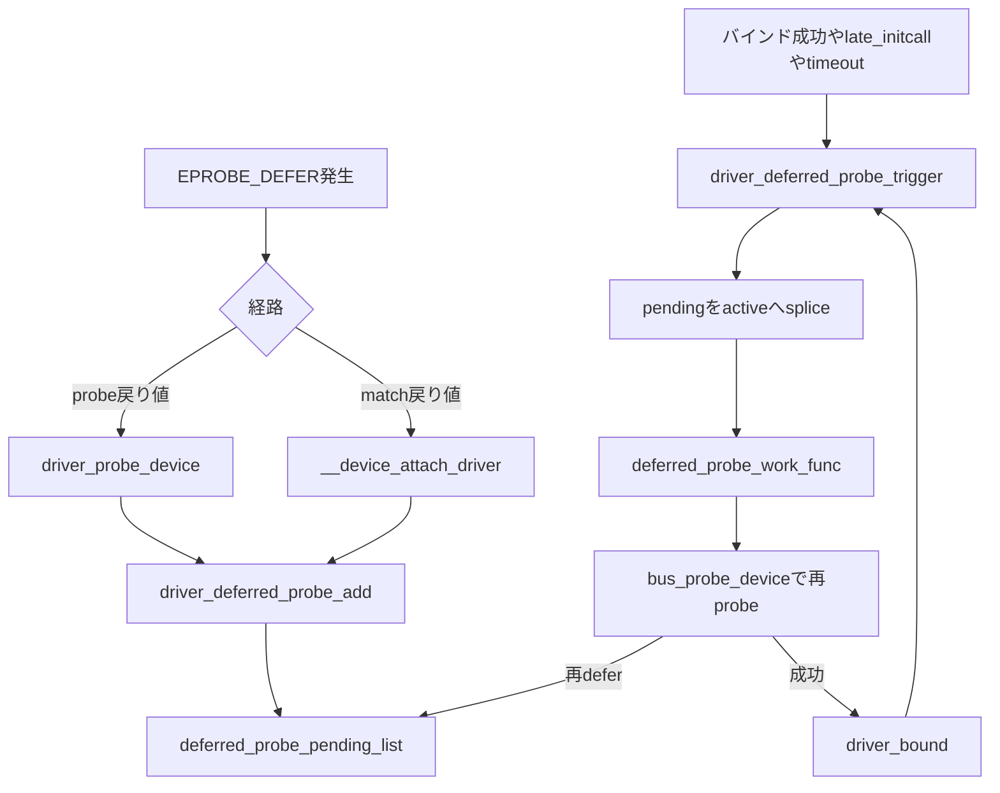

# 第12章 deferred probe

> 本章で読むソース
>
> - [`drivers/base/dd.c` L36-L58](https://github.com/gregkh/linux/blob/v6.18.38/drivers/base/dd.c#L36-L58)
> - [`drivers/base/dd.c` L82-L130](https://github.com/gregkh/linux/blob/v6.18.38/drivers/base/dd.c#L82-L130)
> - [`drivers/base/dd.c` L133-L155](https://github.com/gregkh/linux/blob/v6.18.38/drivers/base/dd.c#L133-L155)
> - [`drivers/base/dd.c` L176-L197](https://github.com/gregkh/linux/blob/v6.18.38/drivers/base/dd.c#L176-L197)
> - [`drivers/base/dd.c` L289-L321](https://github.com/gregkh/linux/blob/v6.18.38/drivers/base/dd.c#L289-L321)
> - [`drivers/base/dd.c` L345-L375](https://github.com/gregkh/linux/blob/v6.18.38/drivers/base/dd.c#L345-L375)
> - [`drivers/base/dd.c` L459-L479](https://github.com/gregkh/linux/blob/v6.18.38/drivers/base/dd.c#L459-L479)
> - [`drivers/base/dd.c` L634-L663](https://github.com/gregkh/linux/blob/v6.18.38/drivers/base/dd.c#L634-L663)
> - [`drivers/base/dd.c` L719-L735](https://github.com/gregkh/linux/blob/v6.18.38/drivers/base/dd.c#L719-L735)
> - [`drivers/base/dd.c` L905-L925](https://github.com/gregkh/linux/blob/v6.18.38/drivers/base/dd.c#L905-L925)
> - [`drivers/base/dd.c` L1002-L1022](https://github.com/gregkh/linux/blob/v6.18.38/drivers/base/dd.c#L1002-L1022)

## この章の狙い

**deferred probe**（遅延 probe）が、probe に必要な依存が未充足のときに probe を後回しにして再試行する仕組みであることを固定する。
pending と active の二リスト、世代カウンタ、タイムアウト、再試行トリガの各機構をソースから追う。
[ドライバ登録と二方向マッチと async probe](10-driver-match-async-probe.md) で述べた **async probe**（実行時期の並列化）とは独立に働くことも明示する。

## 前提

[really_probe とバインドの中核](11-really-probe.md) で `call_driver_probe` と `driver_bound` を読んでいること。
`driver_probe_device` が probe の共通入口であることも第10章で押さえている。

## 二リストと世代カウンタ

deferred probe は `deferred_probe_pending_list` と `deferred_probe_active_list` の二リストで保留デバイスを管理する。
ドライバの `probe` が `-EPROBE_DEFER` を返すとデバイスは pending 末尾へ入る。
バインド成功などのイベントで pending 全体が active 末尾へ splice され、workqueue が active を一件ずつ再 probe する。

[`drivers/base/dd.c` L36-L58](https://github.com/gregkh/linux/blob/v6.18.38/drivers/base/dd.c#L36-L58)

```c
/*
 * Deferred Probe infrastructure.
 *
 * Sometimes driver probe order matters, but the kernel doesn't always have
 * dependency information which means some drivers will get probed before a
 * resource it depends on is available.  For example, an SDHCI driver may
 * first need a GPIO line from an i2c GPIO controller before it can be
 * initialized.  If a required resource is not available yet, a driver can
 * request probing to be deferred by returning -EPROBE_DEFER from its probe hook
 *
 * Deferred probe maintains two lists of devices, a pending list and an active
 * list.  A driver returning -EPROBE_DEFER causes the device to be added to the
 * pending list.  A successful driver probe will trigger moving all devices
 * from the pending to the active list so that the workqueue will eventually
 * retry them.
 *
 * The deferred_probe_mutex must be held any time the deferred_probe_*_list
 * of the (struct device*)->p->deferred_probe pointers are manipulated
 */
static DEFINE_MUTEX(deferred_probe_mutex);
static LIST_HEAD(deferred_probe_pending_list);
static LIST_HEAD(deferred_probe_active_list);
static atomic_t deferred_trigger_count = ATOMIC_INIT(0);
static bool initcalls_done;
```

`deferred_trigger_count` は trigger 発生の世代を数える。
`driver_probe_device` は probe 前後でこの値を比較し、probe 中に依存先のバインド成功が起きた場合に再度 trigger する。

## pending への追加条件

`driver_deferred_probe_add` は `dev->can_match` が偽なら何もしない。
同じ `device_private` の `deferred_probe` ノードが空のときだけ pending 末尾へ追加する。
バインド成功時は `driver_deferred_probe_del` でリストから外す。

[`drivers/base/dd.c` L133-L155](https://github.com/gregkh/linux/blob/v6.18.38/drivers/base/dd.c#L133-L155)

```c
void driver_deferred_probe_add(struct device *dev)
{
	if (!dev->can_match)
		return;

	mutex_lock(&deferred_probe_mutex);
	if (list_empty(&dev->p->deferred_probe)) {
		dev_dbg(dev, "Added to deferred list\n");
		list_add_tail(&dev->p->deferred_probe, &deferred_probe_pending_list);
	}
	mutex_unlock(&deferred_probe_mutex);
}

void driver_deferred_probe_del(struct device *dev)
{
	mutex_lock(&deferred_probe_mutex);
	if (!list_empty(&dev->p->deferred_probe)) {
		dev_dbg(dev, "Removed from deferred list\n");
		list_del_init(&dev->p->deferred_probe);
		__device_set_deferred_probe_reason(dev, NULL);
	}
	mutex_unlock(&deferred_probe_mutex);
}
```

## EPROBE_DEFER が pending へ至る経路

経路は大きく二つある。

1. **probe 戻り値経路**：`call_driver_probe` が `-EPROBE_DEFER` をそのまま返し、`really_probe` が正数へ反転して返す。
   `driver_probe_device` が `EPROBE_DEFER` または `-EPROBE_DEFER` を検出して `driver_deferred_probe_add` を呼ぶ。
2. **match 戻り値経路**：`bus_type.match` が `-EPROBE_DEFER` を返したとき、`__device_attach_driver` または `__driver_attach` が直接 `driver_deferred_probe_add` を呼ぶ。

`call_driver_probe` は戻り値を分類してログを出す。

[`drivers/base/dd.c` L634-L663](https://github.com/gregkh/linux/blob/v6.18.38/drivers/base/dd.c#L634-L663)

```c
static int call_driver_probe(struct device *dev, const struct device_driver *drv)
{
	int ret = 0;

	if (dev->bus->probe)
		ret = dev->bus->probe(dev);
	else if (drv->probe)
		ret = drv->probe(dev);

	switch (ret) {
	case 0:
		break;
	case -EPROBE_DEFER:
		/* Driver requested deferred probing */
		dev_dbg(dev, "Driver %s requests probe deferral\n", drv->name);
		break;
	case -ENODEV:
	case -ENXIO:
		dev_dbg(dev, "probe with driver %s rejects match %d\n",
			drv->name, ret);
		break;
	default:
		/* driver matched but the probe failed */
		dev_err(dev, "probe with driver %s failed with error %d\n",
			drv->name, ret);
		break;
	}

	return ret;
}
```

`really_probe` は probe 失敗時に符号を反転して正数で返す。
`link_ret == -EAGAIN` のときは `-EPROBE_DEFER` と同等に扱う。

[`drivers/base/dd.c` L719-L735](https://github.com/gregkh/linux/blob/v6.18.38/drivers/base/dd.c#L719-L735)

```c
	ret = call_driver_probe(dev, drv);
	if (ret) {
		/*
		 * If fw_devlink_best_effort is active (denoted by -EAGAIN), the
		 * device might actually probe properly once some of its missing
		 * suppliers have probed. So, treat this as if the driver
		 * returned -EPROBE_DEFER.
		 */
		if (link_ret == -EAGAIN)
			ret = -EPROBE_DEFER;

		/*
		 * Return probe errors as positive values so that the callers
		 * can distinguish them from other errors.
		 */
		ret = -ret;
		goto probe_failed;
	}
```

match 関数が `-EPROBE_DEFER` を返す別経路は次のとおりである。

[`drivers/base/dd.c` L1002-L1022](https://github.com/gregkh/linux/blob/v6.18.38/drivers/base/dd.c#L1002-L1022)

```c
static int __device_attach_driver(struct device_driver *drv, void *_data)
{
	struct device_attach_data *data = _data;
	struct device *dev = data->dev;
	bool async_allowed;
	int ret;

	ret = driver_match_device(drv, dev);
	if (ret == 0) {
		/* no match */
		return 0;
	} else if (ret == -EPROBE_DEFER) {
		dev_dbg(dev, "Device match requests probe deferral\n");
		dev->can_match = true;
		driver_deferred_probe_add(dev);
		/*
		 * Device can't match with a driver right now, so don't attempt
		 * to match or bind with other drivers on the bus.
		 */
		return ret;
```

`__driver_attach` 側も match が `-EPROBE_DEFER` のとき同様に `driver_deferred_probe_add` を呼ぶが、他ドライバへの走査は続ける。

## driver_probe_device と世代カウンタ

`driver_probe_device` は probe 前に `deferred_trigger_count` を読み、`-EPROBE_DEFER` 処理後に値が変わっていれば再度 trigger する。
これは依存先のバインド成功と依存元の defer が同時進行したとき、成功イベントを取りこぼさないための補正である。

[`drivers/base/dd.c` L905-L925](https://github.com/gregkh/linux/blob/v6.18.38/drivers/base/dd.c#L905-L925)

```c
static int driver_probe_device(const struct device_driver *drv, struct device *dev)
{
	int trigger_count = atomic_read(&deferred_trigger_count);
	int ret;

	atomic_inc(&probe_count);
	ret = __driver_probe_device(drv, dev);
	if (ret == -EPROBE_DEFER || ret == EPROBE_DEFER) {
		driver_deferred_probe_add(dev);

		/*
		 * Did a trigger occur while probing? Need to re-trigger if yes
		 */
		if (trigger_count != atomic_read(&deferred_trigger_count) &&
		    !defer_all_probes)
			driver_deferred_probe_trigger();
	}
	atomic_dec(&probe_count);
	wake_up_all(&probe_waitqueue);
	return ret;
}
```

## trigger と workqueue による再試行

`driver_deferred_probe_trigger` は pending 全体を active 末尾へ splice し、`system_unbound_wq` に work を予約する。
`driver_deferred_probe_enable` が偽の間は何もしない。

[`drivers/base/dd.c` L176-L197](https://github.com/gregkh/linux/blob/v6.18.38/drivers/base/dd.c#L176-L197)

```c
void driver_deferred_probe_trigger(void)
{
	if (!driver_deferred_probe_enable)
		return;

	/*
	 * A successful probe means that all the devices in the pending list
	 * should be triggered to be reprobed.  Move all the deferred devices
	 * into the active list so they can be retried by the workqueue
	 */
	mutex_lock(&deferred_probe_mutex);
	atomic_inc(&deferred_trigger_count);
	list_splice_tail_init(&deferred_probe_pending_list,
			      &deferred_probe_active_list);
	mutex_unlock(&deferred_probe_mutex);

	/*
	 * Kick the re-probe thread.  It may already be scheduled, but it is
	 * safe to kick it again.
	 */
	queue_work(system_unbound_wq, &deferred_probe_work);
}
```

再試行トリガの主な発生源は次のとおりである。

| 契機 | 呼び出し元 |
|---|---|
| バインド成功 | `driver_bound` |
| 新ドライバ登録後のバインド成功 | `driver_register` → `bus_add_driver` → `driver_attach` → `driver_bound` |
| late initcall | `deferred_probe_initcall` |
| probing 再開 | `device_unblock_probing` |
| タイムアウト work | `deferred_probe_timeout_work_func` |

`driver_register` 自身は `deferred_probe_extend_timeout` を呼ぶが、trigger は直接呼ばない。
バインド成功時の `driver_bound` が trigger を担う。

[`drivers/base/dd.c` L459-L479](https://github.com/gregkh/linux/blob/v6.18.38/drivers/base/dd.c#L459-L479)

```c
static void driver_bound(struct device *dev)
{
	if (device_is_bound(dev)) {
		dev_warn(dev, "%s: device already bound\n", __func__);
		return;
	}

	dev_dbg(dev, "driver: '%s': %s: bound to device\n", dev->driver->name,
		__func__);

	klist_add_tail(&dev->p->knode_driver, &dev->driver->p->klist_devices);
	device_links_driver_bound(dev);

	device_pm_check_callbacks(dev);

	/*
	 * Make sure the device is no longer in one of the deferred lists and
	 * kick off retrying all pending devices
	 */
	driver_deferred_probe_del(dev);
	driver_deferred_probe_trigger();

	bus_notify(dev, BUS_NOTIFY_BOUND_DRIVER);
	kobject_uevent(&dev->kobj, KOBJ_BIND);
}
```

## deferred_probe_work_func の動作

`deferred_probe_work_func` は active から一件ずつ外し、参照を保持してから mutex を解放する。
mutex 外で `device_pm_move_to_tail` と `bus_probe_device` を実行するのは、probe 経路が deferred リストを再操作するためである。
再試行で再び `-EPROBE_DEFER` になれば、そのデバイスは pending へ戻り、現在の active 一巡とは分離される。

[`drivers/base/dd.c` L82-L130](https://github.com/gregkh/linux/blob/v6.18.38/drivers/base/dd.c#L82-L130)

```c
static void deferred_probe_work_func(struct work_struct *work)
{
	struct device *dev;
	struct device_private *private;
	/*
	 * This block processes every device in the deferred 'active' list.
	 * Each device is removed from the active list and passed to
	 * bus_probe_device() to re-attempt the probe.  The loop continues
	 * until every device in the active list is removed and retried.
	 *
	 * Note: Once the device is removed from the list and the mutex is
	 * released, it is possible for the device get freed by another thread
	 * and cause a illegal pointer dereference.  This code uses
	 * get/put_device() to ensure the device structure cannot disappear
	 * from under our feet.
	 */
	mutex_lock(&deferred_probe_mutex);
	while (!list_empty(&deferred_probe_active_list)) {
		private = list_first_entry(&deferred_probe_active_list,
					typeof(*dev->p), deferred_probe);
		dev = private->device;
		list_del_init(&private->deferred_probe);

		get_device(dev);

		__device_set_deferred_probe_reason(dev, NULL);

		/*
		 * Drop the mutex while probing each device; the probe path may
		 * manipulate the deferred list
		 */
		mutex_unlock(&deferred_probe_mutex);

		/*
		 * Force the device to the end of the dpm_list since
		 * the PM code assumes that the order we add things to
		 * the list is a good order for suspend but deferred
		 * probe makes that very unsafe.
		 */
		device_pm_move_to_tail(dev);

		dev_dbg(dev, "Retrying from deferred list\n");
		bus_probe_device(dev);
		mutex_lock(&deferred_probe_mutex);

		put_device(dev);
	}
	mutex_unlock(&deferred_probe_mutex);
}
```

## タイムアウトと initcall

`deferred_probe_initcall` は `late_initcall` として deferred 処理を有効化し、二度 trigger して work を flush する。
`CONFIG_MODULES` 有効時は既定10秒の delayed work を予約する。
新ドライバ登録は `deferred_probe_extend_timeout` を呼ぶが、延長されるのは delayed work が予約済みで `cancel_delayed_work` が真を返す場合だけである。
late initcall より前でまだ予約されていないときや、すでに満了したときは、新しい timeout を始めない。

[`drivers/base/dd.c` L345-L375](https://github.com/gregkh/linux/blob/v6.18.38/drivers/base/dd.c#L345-L375)

```c
static int deferred_probe_initcall(void)
{
	debugfs_create_file("devices_deferred", 0444, NULL, NULL,
			    &deferred_devs_fops);

	driver_deferred_probe_enable = true;
	driver_deferred_probe_trigger();
	/* Sort as many dependencies as possible before exiting initcalls */
	flush_work(&deferred_probe_work);
	initcalls_done = true;

	if (!IS_ENABLED(CONFIG_MODULES))
		fw_devlink_drivers_done();

	/*
	 * Trigger deferred probe again, this time we won't defer anything
	 * that is optional
	 */
	driver_deferred_probe_trigger();
	flush_work(&deferred_probe_work);

	if (driver_deferred_probe_timeout > 0) {
		schedule_delayed_work(&deferred_probe_timeout_work,
			driver_deferred_probe_timeout * HZ);
	}

	if (!IS_ENABLED(CONFIG_MODULES))
		fw_devlink_probing_done();

	return 0;
}
late_initcall(deferred_probe_initcall);
```

タイムアウト work は `fw_devlink_drivers_done` を呼び、`driver_deferred_probe_timeout` をゼロにして再試行し、残存デバイスを警告して `fw_devlink_probing_done` を呼ぶ。

[`drivers/base/dd.c` L289-L321](https://github.com/gregkh/linux/blob/v6.18.38/drivers/base/dd.c#L289-L321)

```c
int driver_deferred_probe_check_state(struct device *dev)
{
	if (!IS_ENABLED(CONFIG_MODULES) && initcalls_done) {
		dev_warn(dev, "ignoring dependency for device, assuming no driver\n");
		return -ENODEV;
	}

	if (!driver_deferred_probe_timeout && initcalls_done) {
		dev_warn(dev, "deferred probe timeout, ignoring dependency\n");
		return -ETIMEDOUT;
	}

	return -EPROBE_DEFER;
}
EXPORT_SYMBOL_GPL(driver_deferred_probe_check_state);

static void deferred_probe_timeout_work_func(struct work_struct *work)
{
	struct device_private *p;

	fw_devlink_drivers_done();

	driver_deferred_probe_timeout = 0;
	driver_deferred_probe_trigger();
	flush_work(&deferred_probe_work);

	mutex_lock(&deferred_probe_mutex);
	list_for_each_entry(p, &deferred_probe_pending_list, deferred_probe)
		dev_warn(p->device, "deferred probe pending: %s", p->deferred_probe_reason ?: "(reason unknown)\n");
	mutex_unlock(&deferred_probe_mutex);

	fw_devlink_probing_done();
}
```

`driver_deferred_probe_check_state` は全 deferred probe に強制されるわけではない。
ドライバやサブシステムが `-EPROBE_DEFER` の代わりに呼ぶ選択 API である。
モジュール無効かつ initcall 完了後は `-ENODEV`、モジュール有効で initcall 完了後かつ timeout 値ゼロなら `-ETIMEDOUT`、それ以外は `-EPROBE_DEFER` を返す。

## async probe との違い

async probe はマッチ後の probe 実行を workqueue へ逃がして起動時の並列度を上げる機構である。
deferred probe は依存未充足による再試行であり、両者は独立に働く。
同一デバイスで async 走査と defer が同時に起きうるが、defer は pending 管理と trigger イベントで収束を図る。

## 処理の流れ



## 高速化と最適化の工夫

依存の準備完了をポーリングせず、バインド成功イベントを契機に pending 集合だけをイベント駆動で再試行する。
登録順序がばらばらなデバイス群でも、固定の初期化順序を事前に決めなくてよい。
pending と active の二リストは、同一 work 一巡のなかで失敗デバイスを無限に再試行しない。
世代カウンタは probe 中の成功イベント取りこぼしを補正する。
この二段構えで、trigger のない状態での無用な即時再試行を抑えつつ、probe 中の trigger 取りこぼしを防ぐ。
依存が永久に満たされない場合や循環依存まで収束させる保証はない。

## まとめ

deferred probe は `-EPROBE_DEFER` を契機にデバイスを pending へ入れ、バインド成功などで active へ移して再 probe する。
`driver_probe_device` と match 経路の二つから `driver_deferred_probe_add` が呼ばれる。
二リストと世代カウンタは、trigger のない状態での無用な即時再試行を抑え、trigger の取りこぼしを防ぐ。
async probe とは目的が異なり、併用されうる。

## 関連する章

- [ドライバ登録と二方向マッチと async probe](10-driver-match-async-probe.md)
- [really_probe とバインドの中核](11-really-probe.md)
- [platform バスによるマッチと probe の実例](13-platform-bus.md)
- [device links と fw_devlink](../part04-links-devres-unbind/14-device-links-fw-devlink.md)
